### Advanced

#### About Advanced


---
publish: true
aliases:
  - Advanced/Advanced
---

# About Advanced

<span class="related-pages">#index-pages</span>

This section provides some more advanced material - content which is typically too specialised for other parts of the documentation.

## Advanced section contents

- [[Daily Agenda]]
  - Some tips on templating to set up daily agenda pages
- [[Styling]]
  - Use CSS to style your Tasks query results
- [[Urgency]]
  - Calculate an urgency score, based on your task data
- [[Notifications]]
  - About the Reminders plugin, in conjunction with Tasks
- [[Tasks Api]]
  - Integrate Tasks in to other Plugins, scripts or dynamic code blocks.

## Related pages

See also [[About Other Plugins]] for some information about plugins that may be useful with Tasks.


#### Daily Agenda


---
publish: true
---

# Daily Agenda

<span class="related-pages">#plugin/calendar [[plugin/periodic-notes]]</span>

Using the default `Daily-notes` plugin, **templates** with syntax like
`{{date+14d:YYYY-MM-DD}}` won't load dates properly. Nevertheless, **Liam Cain**,
author of both the [Calendar Plugin](https://github.com/liamcain/obsidian-calendar-plugin)
and [Periodic Notes Plugin](https://github.com/liamcain/obsidian-periodic-notes), has
written code to create new daily notes (using both plugins) using the `date+Xd` format.
Therefore, if you want to use this format instead of the standard `Daily-notes` syntax,
make sure new notes are created via one of these two plugins, and not `Daily-notes`.

- **Calendar Plugin**: Just tap the day on the Calendar UI and a new daily note will be created
- **Periodic Notes Plugin**: Install, migrate from `Daily-notes` if needed, and tap the new `Open Today` ribbon on the left-side dock. Below is an example if today was August 14, 2021.

|                 | Daily Notes                      | Calendar                         | Periodic Notes                   |
| --------------- | -------------------------------- | -------------------------------- | -------------------------------- |
| template syntax | `due on {{date+14d:YYYY-MM-DD}}` | `due on {{date+14d:YYYY-MM-DD}}` | `due on {{date+14d:YYYY-MM-DD}}` |
| output          | `due on {{date+14d:YYYY-MM-DD}}` | `due on 2021-08-28`              | `due on 2021-08-28`              |

If you want to use the default `Daily-notes` plugin, the workaround is replacing unsupported syntax with [[Custom Filters|custom filtering]] expression.
For example, `due before {{date+14d:YYYY-MM-DD}}` can be replaced with

```markdown
filter by function task.due.moment?.isBefore(moment("{{date:YYYY-MM-DD}}").add(14, 'days'), 'day') || false
```

## Example Daily Agenda **template**

    ## Tasks
    ### Overdue
    ```tasks
    not done
    due before {{date:YYYY-MM-DD}}
    ```

    ### Due today
    ```tasks
    not done
    due on {{date:YYYY-MM-DD}}
    ```

    ### Due in the next two weeks
    ```tasks
    not done
    due after {{date:YYYY-MM-DD}}
    due before {{date+14d:YYYY-MM-DD}}
    ```

    ### No due date
    ```tasks
    not done
    no due date
    ```

    ### Done today
    ```tasks
    done on {{date:YYYY-MM-DD}}
    ```


## Custom Statuses

Task statuses are represented by a few data attributes, all set on the `task-list-item` `LI` element:

- `data-task` contains the *status symbol*, e.g. "" for a regular TODO, "x" for a regular DONE, or any other symbols that you use.
- `data-task-status-type` contains the *status type*, e.g. "TODO", "DONE", "IN_PROGRESS".
- `data-task-status-name` contains the *status name*, e.g. "Todo", "Done", "In Progress".

These attributes can be used to style tasks according to their status, with the status type being the preferred selector in most cases.

## Limitations of styling

- The CSS classes and data attributes described here are **not available for markdown in Source and Live Preview modes**.
- Specifically, the CSS classes described here are applied to:
  - Reading mode,
  - Tasks query blocks in Reading and Live Preview modes.
- Styles **cannot access any automatic scheduled date** that is created if the [[Use Filename as Default Date]]  option is enabled.
  - We are tracking this in [issue #1947](https://github.com/obsidian-tasks-group/obsidian-tasks/issues/1947).

## More Classes

The following additional components have the following classes:

| Class                          | Usage                                                                                                           |
| ------------------------------ | --------------------------------------------------------------------------------------------------------------- |
| plugin-tasks-query-explanation | This is applied to the PRE showing the query's explanation when the `explain` instruction is used.              |
| tasks-backlink                 | This is applied to the SPAN that wraps the [[Backlinks\|backlink]] if displayed on the task.                    |
| tasks-edit                     | This is applied to the SPAN that wraps the edit button/icon shown next to the task that opens the task edit UI. |
| tasks-postpone                 | This is applied to the SPAN that wraps the postpone button/icon shown after the edit button/icon                |
| tasks-urgency                  | This is applied to the SPAN that wraps the urgency score if displayed on the task.                              |
| tasks-group-heading            | This is applied to H4, H5 and H6 group headings                                                                 |

> [!released]
>
> - `tasks-group-heading` was introduced in Tasks 1.6.0.
> - `plugin-tasks-query-explanation` was introduced in Tasks 1.19.0.
> - `tasks-postpone` was added in Tasks 5.3.0.
> - Styling of the Edit and Postpone buttons was changed in Tasks 6.0.0: see [[How to style buttons]].

# Urgency

## Introduction

By default, Tasks [[Sorting|sorts]] query results by decreasing urgency.
Tasks tries to calculate urgency based on what you should likely work on next.

The urgency score isn't perfect, of course, as many more factors may influence the order on which you want to work on tasks.
Urgency can only consider the parameters it knows: [[Dates|dates]] and [[Priority|priorities]].
It is likely that the task you want to work on next is one of the tasks at the top of the list.

The idea of Tasks' urgency is based on [Taskwarrior's](https://taskwarrior.org/) concept of [urgency](https://taskwarrior.org/docs/urgency.html).

## How Urgency is Calculated

Urgency is a numeric score that Tasks calculates for each task.
Tasks simply sums up urgency scores of different aspects of a task:

1. Due date
1. Priority
1. Scheduled date
1. Start date

As you can tell from the table below, **due dates have the strongest influence on urgency.**

Note that any invalid date values, referring to non-existent dates, are ignored.

The scores are as follows:

<!-- placeholder to force blank line before included text --><!-- include: DocsSamplesForUrgency.test.UrgencyTable_urgency-html-table.approved.md -->

<table>
<thead>
  <tr>
    <th colspan="2">Property</th>
    <th>Score</th>
  </tr>
</thead>
<tbody>
  <tr>
    <td rowspan="25">Due</td>
    <td>due more than 7 days ago</td>
    <td><code>12.00000</code></td>
  </tr>
  <tr>
    <td>due 7 days ago</td>
    <td><code>12.00000</code></td>
  </tr>
  <tr>
    <td>due 6 days ago</td>
    <td><code>11.54286</code></td>
  </tr>
  <tr>
    <td>due 5 days ago</td>
    <td><code>11.08571</code></td>
  </tr>
  <tr>
    <td>due 4 days ago</td>
    <td><code>10.62857</code></td>
  </tr>
  <tr>
    <td>due 3 days ago</td>
    <td><code>10.17143</code></td>
  </tr>
  <tr>
    <td>due 2 days ago</td>
    <td><code>9.71429</code></td>
  </tr>
  <tr>
    <td>due 1 day ago</td>
    <td><code>9.25714</code></td>
  </tr>
  <tr>
    <td>Today</td>
    <td><code>8.80000</code></td>
  </tr>
  <tr>
    <td>1 day until due</td>
    <td><code>8.34286</code></td>
  </tr>
  <tr>
    <td>2 days until due</td>
    <td><code>7.88571</code></td>
  </tr>
  <tr>
    <td>3 days until due</td>
    <td><code>7.42857</code></td>
  </tr>
  <tr>
    <td>4 days until due</td>
    <td><code>6.97143</code></td>
  </tr>
  <tr>
    <td>5 days until due</td>
    <td><code>6.51429</code></td>
  </tr>
  <tr>
    <td>6 days until due</td>
    <td><code>6.05714</code></td>
  </tr>
  <tr>
    <td>7 days until due</td>
    <td><code>5.60000</code></td>
  </tr>
  <tr>
    <td>8 days until due</td>
    <td><code>5.14286</code></td>
  </tr>
  <tr>
    <td>9 days until due</td>
    <td><code>4.68571</code></td>
  </tr>
  <tr>
    <td>10 days until due</td>
    <td><code>4.22857</code></td>
  </tr>
  <tr>
    <td>11 days until due</td>
    <td><code>3.77143</code></td>
  </tr>
  <tr>
    <td>12 days until due</td>
    <td><code>3.31429</code></td>
  </tr>
  <tr>
    <td>13 days until due</td>
    <td><code>2.85714</code></td>
  </tr>
  <tr>
    <td>14 days until due</td>
    <td><code>2.40000</code></td>
  </tr>
  <tr>
    <td>More than 14 days until due</td>
    <td><code>2.40000</code></td>
  </tr>
  <tr>
    <td>None</td>
    <td><code>0.00000</code></td>
  </tr>
  <tr>
    <td rowspan="6">Priority</td>
    <td>Highest</td>
    <td><code>9.0</code></td>
  </tr>
  <tr>
    <td>High</td>
    <td><code>6.0</code></td>
  </tr>
  <tr>
    <td>Medium</td>
    <td><code>3.9</code></td>
  </tr>
  <tr>
    <td>None</td>
    <td><code>1.95</code></td>
  </tr>
  <tr>
    <td>Low</td>
    <td><code>0.0</code></td>
  </tr>
  <tr>
    <td>Lowest</td>
    <td><code>-1.8</code></td>
  </tr>
  <tr>
    <td rowspan="3">Scheduled</td>
    <td>Today or earlier</td>
    <td><code>5.0</code></td>
  </tr>
  <tr>
    <td>Tomorrow or later</td>
    <td><code>0.0</code></td>
  </tr>
  <tr>
    <td>None</td>
    <td><code>0.0</code></td>
  </tr>
  <tr>
    <td rowspan="3">Start</td>
    <td>Today or earlier</td>
    <td><code>0.0</code></td>
  </tr>
  <tr>
    <td>Tomorrow or later</td>
    <td><code>-3.0</code></td>
  </tr>
  <tr>
    <td>None</td>
    <td><code>0.0</code></td>
  </tr>
</tbody>
</table>

<!-- placeholder to force blank line after included text --><!-- endInclude -->

## Examples

```markdown
A task that is due today, has a "medium" priority, is not scheduled, and has no start date:
urgency = 8.8 + 3.9 + 0.0 + 0.0 = 12.7

A task that has no due date, a "high" priority, is scheduled for yesterday, and started yesterday:
urgency = 0.0 + 6.0 + 5.0 + 0.0 = 11.0

A task that has no due date, a "high" priority, is scheduled for tomorrow, and starts tomorrow:
urgency = 0.0 + 6.0 + 0.0 - 3.0 = 3.0
```

## How to Display the Urgency Score

You can display the calculated Urgency score in your task list using the `show urgency` option.

### What keywords may I type to make auto-suggest write the emoji for me?

Here is the complete set of all available text that is added to the auto-suggest menu, with dates that would be generated when used on 11th July 2022.

As you type, the options are filtered. For example, if you haven't yet added any dates to the task, typing `du` would then offer:

- `📅 due date`
- `⏳ scheduled date`

Similarly, you can type some fraction of the word `start` (of whatever length is needed by the 'Minimum match length' setting) and you will get a suggestion to turn it into the emoji. Pressing `<enter>` then immediately adds the start emoji: 🛫.

| Searchable Text | Text that is added |
| ----- | ----- |
| ⏎ | &lt;new line> |
| 📅 due date | 📅  |
| 🛫 start date | 🛫  |
| ⏳ scheduled date | ⏳  |
| ⏫ high priority | ⏫  |
| 🔼 medium priority | 🔼  |
| 🔽 low priority | 🔽  |
| 🔺 highest priority | 🔺  |
| ⏬ lowest priority | ⏬  |
| 🔁 recurring (repeat) | 🔁  |
| ➕ created today (2022-07-11) | ➕ 2022-07-11  |
| 🆔 id | 🆔  |
| ⛔ depends on id | ⛔  |
| 🏁 on completion | 🏁  |
| every | 🔁 every  |
| every day | 🔁 every day  |
| every week | 🔁 every week  |
| every month | 🔁 every month  |
| every month on the | 🔁 every month on the  |
| every year | 🔁 every year  |
| every week on Sunday | 🔁 every week on Sunday  |
| every week on Monday | 🔁 every week on Monday  |
| every week on Tuesday | 🔁 every week on Tuesday  |
| every week on Wednesday | 🔁 every week on Wednesday  |
| every week on Thursday | 🔁 every week on Thursday  |
| every week on Friday | 🔁 every week on Friday  |
| every week on Saturday | 🔁 every week on Saturday  |
| today (2022-07-11) | 📅 2022-07-11  |
| tomorrow (2022-07-12) | 📅 2022-07-12  |
| Sunday (2022-07-17) | 📅 2022-07-17  |
| Monday (2022-07-18) | 📅 2022-07-18  |
| Tuesday (2022-07-12) | 📅 2022-07-12  |
| Wednesday (2022-07-13) | 📅 2022-07-13  |
| Thursday (2022-07-14) | 📅 2022-07-14  |
| Friday (2022-07-15) | 📅 2022-07-15  |
| Saturday (2022-07-16) | 📅 2022-07-16  |
| next week (2022-07-18) | 📅 2022-07-18  |
| next month (2022-08-11) | 📅 2022-08-11  |
| next year (2023-07-11) | 📅 2023-07-11  |
| today (2022-07-11) | ⏳ 2022-07-11  |
| tomorrow (2022-07-12) | ⏳ 2022-07-12  |
| Sunday (2022-07-17) | ⏳ 2022-07-17  |
| Monday (2022-07-18) | ⏳ 2022-07-18  |
| Tuesday (2022-07-12) | ⏳ 2022-07-12  |
| Wednesday (2022-07-13) | ⏳ 2022-07-13  |
| Thursday (2022-07-14) | ⏳ 2022-07-14  |
| Friday (2022-07-15) | ⏳ 2022-07-15  |
| Saturday (2022-07-16) | ⏳ 2022-07-16  |
| next week (2022-07-18) | ⏳ 2022-07-18  |
| next month (2022-08-11) | ⏳ 2022-08-11  |
| next year (2023-07-11) | ⏳ 2023-07-11  |
| today (2022-07-11) | 🛫 2022-07-11  |
| tomorrow (2022-07-12) | 🛫 2022-07-12  |
| Sunday (2022-07-17) | 🛫 2022-07-17  |
| Monday (2022-07-18) | 🛫 2022-07-18  |
| Tuesday (2022-07-12) | 🛫 2022-07-12  |
| Wednesday (2022-07-13) | 🛫 2022-07-13  |
| Thursday (2022-07-14) | 🛫 2022-07-14  |
| Friday (2022-07-15) | 🛫 2022-07-15  |
| Saturday (2022-07-16) | 🛫 2022-07-16  |
| next week (2022-07-18) | 🛫 2022-07-18  |
| next month (2022-08-11) | 🛫 2022-08-11  |
| next year (2023-07-11) | 🛫 2023-07-11  |
| delete | 🏁 delete  |
| keep | 🏁 keep  |
| generate unique id | 🆔 ******  |

### Dates

Here you can optionally give the task
[[Dates#Due date|due]],
[[Dates#Scheduled date|scheduled]] and
[[Dates#Start date|start]] dates.

You can also add or edit
[[Dates#Created date|created]],
[[Dates#Done date|done]] and
[[Dates#Cancelled date|cancelled]] dates.

There is a lot of flexibility here. For example:

- You can type in exact dates, such as `2022-11-28`.
- You can also enter parts of dates, such as `6 oct`.
- You can enter relative dates, such as `today` or `tomorrow` or `Saturday`.
#### Date abbreviations

The modal also has a few abbreviations of its own, to speed up entering of common values in the date fields.

Type in the abbreviation and then a space character, and the whole word will be entered for you.

Supported abbreviations:

| Abbreviation | Expanded Text |
| ------------ | ------------- |
| `td`         | `today`       |
| `tm`         | `tomorrow`    |
| `yd`         | `yesterday`   |
| `tw`         | `this week`   |
| `nw`         | `next week`   |
| `weekend`    | `sat`         |
| `we`         | `sat`         |

### Dependencies


Use the "Dependencies" area of the modal to specify relationships between tasks, to define the order in which you want to work on a set of tasks.

#### Before this

Use the "Before this" region to find and link to any tasks that **must be finished before the task being edited can be started**.

This is marked **1** and **2** in the image above.

#### After this

Use the "After this" region to find and link to any tasks that **can only be started after the task being edited is finished**.

This is areas **3** and **4** in the image above.

#### Searching for tasks

Understanding the search query:

- In either "Before this" or "After this", start typing any text from the description of a required task.
- Currently only task descriptions are searched, and not file paths.
- You can type bits of words, in any order, and capitalisation does not matter.
- For example, you could quickly find `Invite the guests` with `inv gu`, or `gu inv`.

Understanding the matches:

- As you type, Tasks will show you up to 20 closest matching tasks.
- Other tasks in the same file as the task being edited are listed first.
- Then matching tasks elsewhere in the vault are shown, followed by their path.
- If any text is too long to fit, it is truncated with `...` and you can hover over the name to see the full text.


<span class="caption">Searching for a task, to set up a dependency</span>


### Status


Use the Status dropdown to change the Status Symbol for the task.


For more information, including adding your own customised statuses, see [[Statuses]].

#### Automatic setting of dates upon status change

> [!released]
> Introduced in Tasks 6.1.0.

When you change the Status Symbol for a Task, the [[Dates#Date-tracking settings|Date-tracking settings]] are used to determine whether to update any date fields:

- **If** the status is changed **to** a [[Status Types#DONE|DONE status type]] **from** any other status type,
  - **and** the "Set done date on every completed task" option is enabled,
  - **then** the **Done date** is changed to today's date.
- **If** the status is changed **to** a [[Status Types#CANCELLED|CANCELLED status type]] **from** any other status type,
  - **and** the "Set cancelled date on every completed task" option is enabled,
  - **then** the **Cancelled date** is changed to today's date.

#### Overriding dates on status change

When Tasks has automatically set a Created, Done or Cancelled date to today, you are free to edit the value.

For example, perhaps you actually completed a task yesterday and forget to mark it as complete. Now you can complete it in the modal, and set the Done date to yesterday, before clicking Apply.


# Editing Dates

<span class="related-pages">#feature/dates</span>

## Summary

Tasks supports a range of date properties for managing your tasks: see [[Dates]].

This page describes ways to add, edit and remove date values on tasks.

There is a [[#Date-picker on task dates]] and a [[#Context menu on task dates]], or you can use various [[#other date-editing options]].

## Date-picker on task dates

> [!released]
> Introduced in Tasks 7.14.0.

**Left-click on any task date field** in **Reading mode** and **Tasks query search results** to use a date-picker and calendar to edit or remove a date.


<span class="caption">Hover over a date in Read mode or Tasks query search results</span>


<span class="caption">In the date-picker, you can easily select a new date, or clear the current one</span>

| Where                         | Viewing Mode | Works? |
| ----------------------------- | ------------ | ------ |
| Task lines in markdown files  | Source mode  | ❌     |
| Task lines in markdown files  | Live Preview | ❌     |
| Task lines in markdown files  | Reading mode | ✅     |
| In Tasks query search results | Live Preview | ✅     |
| In Tasks query search results | Reading mode | ✅     |

On iPhone, and probably iPad too, this date-picker hard-codes the start of the week to Monday, instead of respecting the user's settings. We are tracking this in [issue #3239](https://github.com/obsidian-tasks-group/obsidian-tasks/issues/3239).

## Context menu on task dates

> [!released]
> Introduced in Tasks 7.10.0.

**Right-click on any task date field** in **Reading mode** and **Tasks query search results** to:

- postpone Start, Scheduled and Due dates
- advance Created, Cancelled and Done dates


<span class="caption">Hover over a date in Read mode or Tasks query search results</span>


<span class="caption">Chose an option from the context menu</span>

| Where                         | Viewing Mode | Works? |
| ----------------------------- | ------------ | ------ |
| Task lines in markdown files  | Source mode  | ❌     |
| Task lines in markdown files  | Live Preview | ❌     |
| Task lines in markdown files  | Reading mode | ✅     |
| In Tasks query search results | Live Preview | ✅     |
| In Tasks query search results | Reading mode | ✅     |

## Other date-editing options

In **Editing mode** (both Source mode and Live Preview) the options are:

- Type the dates yourself.
- Use [[Auto-Suggest]] to add emojis and a range of convenient dates.
- Using the `Create or edit Task` command to access the [[Create or edit Task]] modal/dialog.

In **Reading mode** and **Tasks query search results** the options are:

- Click or right-click ⏩ to use the [[Postponing|Postpone]] button.
- Click the Pencil icon  (📝) to use the [[Create or edit Task]] modal/dialog.


#### Postponing


---
publish: true
---

# Postponing

<span class="related-pages">#feature/dates</span>

## Introduction

> [!Tip]
> Do you ever find that your Task list is full of overdue tasks that you scheduled with the best of intentions?
>
> - And now you want to postpone many of them, so you can focus on the immediate priorities?
> - Or perhaps you want to remove the date instead?
>
> Then the ⏩ Postpone button is for you!

The ⏩ button in Tasks Search results allows you to quickly postpone (or "snooze") a task until tomorrow or later.

> [!released]
>
> - Postpone was introduced in Tasks 5.3.0.
> - The ability to remove the existing date was introduced in Tasks 7.3.0.

### Click and Context Menu

The ⏩ button provides two choices:

1. **Click the button** to advance the date to the **earlier** of:
    - tomorrow
    - the day after its current date
    
    <span class="caption">**Tooltip** on the Postpone button shows **tomorrow's date**, for dates **before or on today**.</span>
    
    <span class="caption">**Tooltip** on the Postpone button shows '**postpone by day**', for **future dates**.</span>

2. **Right-click** or **press-and-hold** the button to select from a context menu with:
    - future dates in the next 6 days
    - more future dates, further ahead
    - an option to remove the date instead:
    
    <span class="caption">**Context menu** on the Postpone button shows options for dates **before or on today**</span>
    
    <span class="caption">**Context menu** on the Postpone button shows options for **future dates**.</span>

### Which date field is edited?

The postpone option looks at the first of these Task fields, and will edit the first of:

1. **Due** date, if present.
1. **Scheduled** date
    - if no Due date is present.
1. **Start** date
    - If no Due or Scheduled date is present.

### When is the postpone button shown?

- Tasks with none of Due, Scheduled and Start currently don't show the Postpone button.
- Tasks with any invalid dates at all (including Created and Done dates) also don't show the Postpone button.
- You can use the `hide postpone button` [[Layout]] instruction to hide the Postpone button from your Task query results.

### Availability

This facility is currently only available in Tasks query search results.

| Where                                   | Viewing Mode | Works? |
| --------------------------------------- | ------------ | ------ |
| Task lines in markdown files            | Source mode  | ❌     |
| Task lines in markdown files            | Live Preview | ❌     |
| Task lines in markdown files            | Reading mode | ❌     |
| Edit task modal                         | All modes    | ❌     |
| ⏩ button in Tasks query search results | Live Preview | ✅     |
| ⏩ button in Tasks query search results | Reading mode | ✅     |

## Current Limitations

### Why is Postpone not shown on a particular task?

One of these reasons:

- The task status type [[Status Types|status type]] is `DONE`, `CANCELLED` or `NON_TASK`.
- The task does has no [[Dates#Due date|due]], [[Dates#Scheduled date|scheduled]] or [[Dates#Start date|start]] date.
- The task has at least one date field with an invalid date value.
- The `hide postpone button` instruction was used.

### Can I use Postpone to add a date to an undated task?

Currently, no.


#### Toggling and Editing Statuses


---
publish: true
---

# Toggling and Changing Task Statuses

<span class="related-pages">#feature/statuses</span>

## Summary

This page describes ways to mark a task line as `TODO` or `DONE`, or any other [[Statuses]] and [[Custom Statuses]] your vault may be configured to use.

You can [[#Toggling Tasks with mouse|left-click]] or [[#'Change task status' context menu|right-click]] on task checkboxes.

Other options are a [[#'Tasks Toggle task done' command|command]] and a [[#Edit task modal|modal]].

> [!tip] What is "toggling"?
> The simplest meaning of 'toggling' is converting a task between these two states:
>
> 1. `- [ ] ...` - meaning `to do`.
> 2. `- [x] ...` - meaning `done`.

## Toggling Tasks with mouse

The most common way to change a task status is to **single-click on its checkbox**.

| Where                         | Viewing Mode | Works? |
| ----------------------------- | ------------ | ------ |
| Task lines in markdown files  | Source mode  | ❌     |
| Task lines in markdown files  | Live Preview | ✅     |
| Task lines in markdown files  | Reading mode | ✅     |
| In Tasks query search results | Live Preview | ✅     |
| In Tasks query search results | Reading mode | ✅     |

## 'Change task status' context menu

**Right-click** or **press-and-hold** on **a task's checkbox** to bring up a menu to allow any known status to be applied to the task.

This works in both **Reading mode** and in **Tasks Query results**.


<span class="caption">Sample 'Change task status' context menu, in a vault with various [[Custom Statuses]] added.</span>

> [!tip]
> The 'Change task status' context menu does correctly add Done dates, and create new instances of recurring tasks, when appropriate.

The statuses are obtained from the vault's [[Status Settings]].

- [[Core Statuses]] are shown first,
- then any [[Custom Statuses]].

Changing from one `DONE` status to another:

- retains any original Done date.
- does not create a new recurrence of recurring tasks.

| Where                         | Viewing Mode | Works? |
| ----------------------------- | ------------ | ------ |
| Task lines in markdown files  | Source mode  | ❌     |
| Task lines in markdown files  | Live Preview | ❌     |
| Task lines in markdown files  | Reading mode | ✅     |
| In Tasks query search results | Live Preview | ✅     |
| In Tasks query search results | Reading mode | ✅     |

> [!released]
> The 'Change task status' context menu was introduced in Tasks 5.3.0.

## 'Tasks: Toggle task done' command

There is also a command 'Tasks: Toggle task done'.

Obsidian allows you to assign a [hotkey](https://help.obsidian.md/Customization/Custom+hotkeys) to commands, for ease of use.

| Where                         | Viewing Mode | Works? |
| ----------------------------- | ------------ | ------ |
| Task lines in markdown files  | Source mode  | ✅     |
| Task lines in markdown files  | Live Preview | ✅     |
| Task lines in markdown files  | Reading mode | ❌     |
| In Tasks query search results | Live Preview | ❌     |
| In Tasks query search results | Reading mode | ❌     |

Since Tasks 7.2.0, this command can also be triggered programmatically via the [[Tasks Api#`executeToggleTaskDoneCommand (line string, path string) => string;`|Tasks API]].

## Edit task modal

The [[Create or edit Task]] modal also allows editing of task statuses.


### Getting Started

#### About Getting Started


---
publish: true
---

# About Getting Started

<span class="related-pages">#index-pages</span>

## Basics

- [[Installation]]
- [[Getting Started]]
  - Descriptive overview of setting up your tasks.
  - Also has a long list of known limitations.
- [[Global Filter]]
  - **Optionally** set a global filter so Tasks only matches specific checklist items.
  - See also [[Global Query]], which is much more powerful, once you know how searching works.
- [[Settings]]
  - A convenient list of all the Tasks plugin options.

## Adding data to your tasks

- [[Dates]]
  - Record when you need to work on your tasks.
  - Track the history of your tasks.
- [[Priority]]
  - Indicate the importance of your tasks.
- [[Recurring Tasks]]
  - Use recurring tasks to easily track actions you must do regularly.
- [[On Completion]]
  - Specify an automatic action to perform on a task when it is completed.
- [[Statuses]]
  - Also known as Custom Checkboxes.
  - In vanilla Obsidian tasks are either 'TODO' or 'DONE'.
  - Statuses allow you to track `IN_PROGRESS`, `CANCELLED` and `NON_TASK` actions too.
- [[Use Filename as Default Date]]
  - Automatically set a scheduled date for tasks based on the name of their files.
- [[Tags]]
  - Why and how to use tags to manage your tasks.

## More specialised facilities

- [[Task Dependencies]]
  - Define the order in which you want to work on a set of tasks.
  - Then adjust your searches, perhaps to see tasks that are [[Filters#Blocking Tasks|blocking others]], or hide ones that are [[Filters#Blocked Tasks|blocked]] and cannot yet be done.
- [[Obsidian Properties]]
  - Learn how to use data in Obsidian [Properties](https://help.obsidian.md/Editing+and+formatting/Properties) in your queries, for example to only search tasks in Kanban plugin files.

## Easy editing of tasks

See [[About Editing]].


#### Dates


---
publish: true
---

# Dates

<span class="related-pages">#feature/dates</span>

## When to work on a task

This section explains the different types of date that you can add to task lines, in order to tell Tasks when you wish/need to do the work.

You don't have to use all available dates.
Maybe due dates are sufficient for you.
Don't over-engineer your task management.

> [!info]
> Instead of adding an emoji and a date manually, you can use the `Tasks: Create or edit` command when creating or editing a task.
When you use the command, you can also set dates like "Monday", "tomorrow", or "next week" and Tasks will automatically save the date in the correct format.
You can find out more in [[Create or edit Task|‘Create or edit Task’ Modal]].

> [!info]
> If you prefer to type, it is now very easy to add emojis and other information for your tasks using [[Auto-Suggest|Intelligent Auto-Suggest]].

<!-- NEW_TASK_FIELD_EDIT_REQUIRED -->

---

### Due date

Tasks can have dates by when they must be done: due dates.

In order to specify the due date of a task, you must append the "due date signifier 📅" followed by the date it is due to the end of the task.
The date must be in the format `YYYY-MM-DD`, meaning `Year-Month-Day` with leading zeros.

For example: `📅 2021-04-09` means the task is due on the 9th of April, 2021.

```markdown
- [ ] take out the trash 📅 2021-04-09
```

Related instructions for use in Tasks query blocks:

- [[Filters#Due Date]]
- [[Sorting#Due Date]]
- [[Grouping#Due Date]]
- Accessible as [[Task Properties#Values for Dates in Tasks|task property]] `task.due`

---

### Scheduled date

Tasks can have dates on which you plan to work on them: scheduled dates.
Scheduled dates are different from due dates as you can schedule to finish a task before it is due.

Scheduled dates use an hourglass emoji: ⏳.

```markdown
- [ ] take out the trash ⏳ 2021-04-09
```

See [[Use Filename as Default Date]] for how to optionally make Tasks use any dates in file names as the scheduled date for all undated tasks in that file.

> [!released]
'Use Filename as Default Date' was introduced in Tasks 1.18.0.

Related instructions for use in Tasks query blocks:

- [[Filters#Scheduled Date]]
- [[Sorting#Scheduled Date]]
- [[Grouping#Scheduled Date]]
- Accessible as [[Task Properties#Values for Dates in Tasks|task property]] `task.scheduled`

---

### Start date

It can happen that you cannot work on a task before a certain date.
Or you want to hide a task until a certain date.
In that case you can use start dates.

Start dates use a departing airplane emoji: 🛫

```markdown
- [ ] take out the trash 🛫 2021-04-09
```

When [[Filters#Start Date|filtering]] queries by start date,
the result will include tasks without a start date.
This way, you can use the start date as a filter to filter out any tasks that you cannot yet work on.

Such filter could be:

````markdown
```tasks
starts before tomorrow
```
````

Related instructions for use in Tasks query blocks:

- [[Filters#Start Date]]
- [[Sorting#Start Date]]
- [[Grouping#Start Date]]
- Accessible as [[Task Properties#Values for Dates in Tasks|task property]] `task.start`

## Track task histories

This section explains the types of dates that Tasks can add for you automatically.

### Date-tracking settings

The date types in this section are optional.


Image of the default settings for tracking task histories.

### Created date

> [!released]
Created date was introduced in Tasks 2.0.0.

If you enable 'Set created date on every added task' in settings (and restart Obsidian), the Tasks plugin will help you track when your tasks were created.

See the [[#Date-tracking settings|screenshot]] above.

Created dates use a heavy plus emoji: ➕.

```markdown
- [ ] take out the trash ➕ 2021-04-09
```

Related instructions for use in Tasks query blocks:

- [[Filters#Created Date]]
- [[Sorting#Created Date]]
- [[Grouping#Created Date]]
- Accessible as [[Task Properties#Values for Dates in Tasks|task property]] `task.created`

#### Adding Created date to tasks

The following Tasks facilities add created dates to tasks...

... automatically, if created date is enabled:

- [[Create or edit Task|‘Create or edit Task’ Modal]], when it creates a brand new task
- When you complete a [[Recurring Tasks|recurring task]], the new task's created date will show the date it was added.

... upon request, and always enabled:

- Via the `➕ created today` option in [[Auto-Suggest]].
  - Note that this is a long way down the list of suggestions, so you may need to start typing a couple of characters from `created` or `today` to see it.

### Done date

Unless you disable 'Set done date on every completed task' in settings (and restart Obsidian), the Tasks plugin will help you track when your tasks were completed.

See the [[#Date-tracking settings|screenshot]] above.

Done dates use a white check-mark emoji: ✅.

```markdown
- [x] take out the trash ✅ 2021-04-09
```

Related instructions for use in Tasks query blocks:

- [[Filters#Done Date]]
- [[Sorting#Done Date]]
- [[Grouping#Done Date]]
- Accessible as [[Task Properties#Values for Dates in Tasks|task property]] `task.done`

### Cancelled date

> [!released]
> Cancelled date was introduced in Tasks 5.5.0.

Unless you disable 'Set cancelled date on every cancelled task' in settings (and restart Obsidian), the Tasks plugin will help you track when your tasks were cancelled.

See the [[#Date-tracking settings|screenshot]] above.

Cancelled dates use a red cross-mark emoji: ❌.

```markdown
- [-] take out the trash ❌ 2021-04-09
```

Related instructions for use in Tasks query blocks:

- [[Filters#Cancelled Date]]
- [[Sorting#Cancelled Date]]
- [[Grouping#Cancelled Date]]
- Accessible as [[Task Properties#Values for Dates in Tasks|task property]] `task.cancelled`

## Finding mistakes in dates on task lines

Tasks does not automatically report any problem tasks that have invalid dates, such as on the 32nd day of a month. These task will silently not be found by date-based searches.

However, it is possible to search for any tasks with invalid dates in your vault: see
[[Filters#Finding Tasks with Invalid Dates|Finding Tasks with Invalid Dates]].

> [!warning]
The date values on task lines must be calendar or absolute dates, referring to a specific year, month and day. Text such as `📅 today` is not understood by the Tasks plugin, and will not be found in searches.

## Limitations of task date support

### Date format is not configurable

- The date format on task lines is not yet configurable.
- The only format recognised is `YYYY-MM-DD`, for example `2024-09-17`.
- It is not possible to customise the format of date values on task lines.
- It is also not possible to format dates as links, such as `[[2024-09-17]]`.
- We are tracking this in [discussion #69](https://github.com/obsidian-tasks-group/obsidian-tasks/discussions/69).

### Dates cannot include times

- It is not yet possible to include times on task lines to indicate when they *should* be acted on.
- Nor is it possible to record the time when tasks were created, completed or cancelled.
- We are tracking this in discussions [#607](https://github.com/obsidian-tasks-group/obsidian-tasks/discussions/607) and [#668](https://github.com/obsidian-tasks-group/obsidian-tasks/discussions/668).

### Time-tracking, productivity tracking, pomodoros, notifications and similar out-of-scope

- The following are out-of-scope for the Tasks plugin: time-tracking, productivity tracking, pomodoros, notifications and similar.
- We recorded this in [discussion #2721](https://github.com/obsidian-tasks-group/obsidian-tasks/discussions/2721).


#### Getting Started


---
publish: true
---

# Getting Started

## Finding tasks in your vault

Tasks tracks your checklist items from your vault.
The simplest way to create a new task is to create a new checklist item.
The markdown syntax for checklist items is a list item that starts with spaced brackets:

```text
- [ ] take out the trash
```

Now Tasks tracks that you need to take out the trash!

> [!Info]
> You can write tasks using any of the following list styles:
>
> ```text
> - [ ] task starting with a hyphen
>
> * [ ] task starting with an asterisk
>
> + [ ] task starting with a plus sign
>
> 1. [ ] a task in a numbered list
> ```

> [!released]
> Support for tasks with `+` was introduced in Tasks 4.5.0.

To list all open tasks in a markdown file, simply add a [[About Queries|query]] as a tasks code block like so:

````markdown
    ```tasks
    not done
    ```
````

## Adding data to your tasks (optionally)

Now you have a list of all open tasks! This is enough to get started with tasks.
You can _optionally_ start using one or more of the other features that Tasks offers.
Like, for example, [[Priority|priorities]] or [[Dates#Start date|dates]].

This Tasks User Guide almost entirely uses Emoji to add data to your tasks.

However, if you prefer to use text instead of Emoji, see [[About Task Formats]] for other options.

## Easy editing of tasks

A more convenient way to create a task is by using the `Tasks: Create or edit` command from the command palette.
You can also bind a hotkey to the command.
The command will parse what's on the current line in your editor and pre-populate a modal.
In the modal, you can change the task's description, its due date, and a recurrence rule to have a repeating task.

You can find out more in [[Create or edit Task|‘Create or edit Task’ Modal]].

See other pages in 'Getting Started' for more details on due dates and recurrence, and many other features.

You cannot toggle a task (un)done in the modal.
For that, do one of the following.

## Completing tasks

There are two ways to mark a task done:

1. In preview mode, click the checkbox at the beginning of the task to toggle the status between "todo" and "done".
2. In edit mode, use the command `Tasks: Toggle Done`.
    - The command will only be available if the cursor is on a line with a checklist item.
    - You can map the command to a hotkey in order to quickly toggle statuses in the editor view (I recommend to replace the original "Toggle checklist status" with it).
    - If the checklist item is not a task (e.g. due to a global filter), the command will toggle it like a regular checklist item.

A "done" task will have the date it was done appended to the end of its line.
For example: `✅ 2021-04-09` means the task was done on the 9th of April, 2021.

## Limitations and warnings

### Restart after updating Tasks plugin

> [!warning]
> Whenever Tasks behaves in an unexpected way, **please try restarting Obsidian**.

### Multi-line checklist items

> [!warning]
> Tasks only supports **single-line checklist items**.

The task list rendered through this plugin **and** the checklist items
from which the task list is built render only the first line of the item.
Text after the first line in a multi-line checklist item is
ignored (but is unaffected in the stored `.md` file).

This works:

```markdown
-   [ ] This is a task
    -   This is a sub-item
    -   Another sub-item
    -   [ ] And a sub task
        -   Even more details
```

The following _does not work:_

```markdown
-   [ ] This task starts on this line
        and then its description continues on the next line
```

We are tracking this in [issue #2061](https://github.com/obsidian-tasks-group/obsidian-tasks/issues/2061).

### Tasks in Numbered lists

Tasks can read tasks that are in **numbered lists**.

> [!released]
Reading tasks inside numbered lists was introduced in Tasks 1.20.0.

For example:

```markdown
1. [ ] Do first step
2. [ ] Do next step
3. [ ] Do following step
```

Editing and toggling tasks in numbered lists works fine: the original number is preserved.

> [!warning]
> However, when these tasks are displayed in tasks blocks they are displayed as ordinary bullet list items.

This is because they will usually be displayed in a completely different order than in the original list, often mixed in with tasks from bullet lists. The original numbers in this case just don't make sense.

### Tasks in Blockquotes and Callouts

<!-- force a blank line --><!-- include: snippet-callout-titles-bug.md -->

> [!Warning] Warning: Obsidian bug in versions 1.6.0 to 1.6.3 has caused some tasks not to be found
> See [[Missing tasks in callouts with some Obsidian 1.6.x versions]] for how to ==make Obsidian 1.6.5 fix its metadata cache==, in case it was broken by earlier 1.6.x versions.

<!-- force a blank line --><!-- endInclude -->
Tasks can read tasks that are inside [blockquotes](https://www.markdownguide.org/basic-syntax/#blockquotes-1) or [Obsidian's built-in callouts](https://help.obsidian.md/How+to/Use+callouts).

> [!released]
Reading tasks inside callouts and blockquotes was introduced in Tasks 1.11.1

> [!warning]
> However, under the following very specific circumstance, Tasks cannot add or remove completion dates or make the next copy of a recurring task:
 >
 > - Obsidian is in **Live Preview** editor mode (pencil icon in lower right corner),
 > - AND the task's markdown is in a **callout**,
 > - AND the user **clicked on the task's checkbox** to complete or re-open the task.

If you toggle a task's status in this situation, you will see a warning. Use the command `Tasks: Toggle Done`, or switch to Reading View (book icon in lower right corner) to click the checkbox.

Completing a task by clicking its checkbox from a `tasks` query block _will_ work in any editor mode, even if the query is inside a callout.

We are tracking this in [issue #1768](https://github.com/obsidian-tasks-group/obsidian-tasks/issues/1768).

> [!warning]
> When tasks are in callouts, any preceding heading in the callout is not read by Tasks, so `group by heading` uses the previous heading outside the callout - or `(No Heading)` if none.

We are tracking this in [issue #1989](https://github.com/obsidian-tasks-group/obsidian-tasks/issues/1989).

### Tasks in Canvas

> [!warning]
> Tasks cannot read tasks that are in **Obsidian Canvas cards**.

We are tracking this in [issue #2100](https://github.com/obsidian-tasks-group/obsidian-tasks/issues/2100).

### Tasks in Code Blocks

> [!warning]
> Tasks cannot read tasks that are **inside code blocks**, such as the ones used by the **Admonitions plugin**. Use Obsidian's built-in callouts instead.

### Tasks in Comments

Obsidian supports two styles of **comments**:

- `<!-- I am text in a comment -->`
- `%% I am text in a comment %%`

> [!warning]
> By design, Tasks does **not** read any tasks that are inside these comments, because Obsidian does not read them.

### Tasks with Footnotes

> [!warning]
> Tasks can only render **inline footnotes**. Regular footnotes are not supported.

```markdown
-   [ ] This is a task^[with a working inline footnote]
-   [ ] This footnote _will not work_[^notworking]
```

See also [[About Queries#Footnotes are not displayed in query results]].

### Tasks with Blockquotes

> [!warning]
> Tasks' support for **blockquotes inside tasks** is limited. It renders correctly, but since Tasks only supports a single line, the meta-data of the task will be inside the blockquote.

### Rendering tasks in 'loose' lists

> [!warning]
> Tasks won't render **spaces around list items** if you have a list with empty lines (typically known as ['loose' lists](https://spec.commonmark.org/0.30/#loose)).

```markdown
-   [ ] First task before the empty line

-   [ ] Another task. The empty line above will _not_ result in the tasks being more spaced out.
```

### Order of metadata/emojis

> [!warning]
> Tasks reads task lines **backwards from the end of the line**, looking for metadata emojis with values, tags and block links. As soon as it finds a value that it does not recognise, it stops reading.

This means that you can only put **block links** (`^link-name`) and **tags** after metadata such as dates, priorities, recurrence rules. Anything else will break the parsing of dates, priorities and recurrence rules.

```markdown
-   [ ] Task with priority placed before tag _priority will be recognized_ 🔼 [[tag]]
-   [ ] Task with date placed before tag _date will be recognized_ 📅 2021-04-09 [[tag]]
-   [ ] Task with date placed before other text _date will be not recognized_ 📅 2021-04-09 other text
-   [ ] Task with block link _works_ 📅 2021-04-09 ^e5bebf
```

We are tracking this in [issue #1505](https://github.com/obsidian-tasks-group/obsidian-tasks/issues/1505).

If you are concerned that some values in a task are not being parsed as you intended, perhaps because a task is not being found by Tasks searches, you can:

- view an individual task in the [[Create or edit Task|‘Create or edit Task’ Modal]]
- search for all possible problems: see [[Find tasks with invalid data#Finding unread emojis|Finding unread emojis]].

If there are any **Tasks emojis visible in the Description field**, close the modal and delete or move to the left any unrecognised text.


<br>The `Tasks: Create or edit` modal showing a due date that was not parsed, due to trailing `other text`.

### Supported file names

> [!warning]
> Tasks only supports checklist items in markdown files with the file extension `.md`.


#### Global Filter


---
publish: true
---

# Global Filter

> [!tip]
> Since Tasks 3.5.0, a new [[Global Query]] facility has been added, which offers a lot more flexibility than the Global Filter.

## Optional Global Filter

You can set a global filter in the settings so that Tasks only matches specific checklist items.
For example, you could set it to `#task` to only track checklist items as task if they include the string `#task`.
It doesn't have to be a tag. It can be any string.
Leave it empty to regard all checklist items as tasks.

Example with global filter `#task`:

```markdown
- [ ] [[task]] take out the trash
```

If you don't have a global filter set, all regular checklist items will be considered a task:

```markdown
- [ ] take out the trash
```

> [!warning]
> If you use a tag such as `#task` as the global filter, you cannot add sub-tags to that tag.

## Settings for the Global Filter

The following settings in the Tasks Options pane control the vault's global filter.

Note you must restart Tasks after changing any settings here.


<span class="caption">Image of the settings options for the global filter, showing the default settings</span>


<span class="caption">Image showing the additional 'Remove global filter from description' setting that is shown when there is a global filter</span>


#### Installation


---
publish: true
aliases:
  - Installation/Installation
  - Installation
---

# Installation

Follow the steps below to install Tasks.

1. Search for "[Tasks](https://obsidian.md/plugins?id=obsidian-tasks-plugin)" in Obsidian's community plugins browser
2. Enable the plugin in your Obsidian settings (find "Tasks" under "Community plugins").
3. Check the settings. It makes sense to set the global filter early on (if you want one).
4. Replace the "Toggle Checkbox Status" hotkey with "Tasks: Toggle Done".
    - I recommend you remove the original toggle checkbox hotkey and set the "Tasks" toggle to `Ctrl + Enter` (or `Cmd + Enter` on a mac).
5. Optional: bind a hotkey to the command `Tasks: Create or edit` to have quick access to the Tasks modal.


#### Obsidian Properties


---
publish: true
---

# Obsidian Properties

> [!released]
> Use of Obsidian Properties was introduced in Tasks 7.7.0.

## What are Obsidian Properties?

Obsidian offers a facility called [Properties](https://help.obsidian.md/Editing+and+formatting/Properties).

Properties allow you to organize information about a note. Properties contain structured data such as text, links, dates, checkboxes, and numbers.

This is an example property section, and it *must* appear on the very first line of the markdown file:

```yaml
---
name: value
---
```

In the Tasks documentation, we refer to these as Obsidian Properties, to distinguish them from Task and Query properties.

Background reading on Obsidian Properties:

- [An Introduction to Obsidian Properties - Obsidian Rocks](https://obsidian.rocks/an-introduction-to-obsidian-properties/)
- [Obsidian "properties" to help sort your stuff - Mickey Mellen](https://www.mickmel.com/obsidian-properties-to-help-sort-your-stuff/)

## Why use Obsidian Properties in Tasks queries?

Only if it will save you time!

Many, if not most, Tasks searches do not need to use Obsidian Properties.

But you might want to put a piece of information in to a file's Obsidian Properties, rather than putting it on every task in the file.

For example, if you associate a tag with a project, you might want to put that tag in one place at the top of the file, instead of having to remember to add it on every single task line in the file.

## How does Tasks treat Obsidian Properties?

You might want to start with the [[#Obsidian Properties Query Examples|examples below]] for an idea of *what* Tasks can do with Obsidian Properties.

This section describes the *how*...

- Frontmatter property values can be used in  the following instructions:
  - `filter by function`
  - `sort by function`
  - `group by function`
- `task.file.hasProperty('property name')` returns `true` if:
  - The task is in a file that has a property called `property name`
  - And that property has a non-empty value.
- `task.file.property('property name')` returns:
  - The property's value
  - Or `null` if:
    - the property has no value,
    - or the task's file does not contain that property.
- Property names are case-insensitive:
  - `property name` will find `Property Name`, for example.
- Tags in Frontmatter can be accessed with `task.file.property('tags')`
  - `TAG` and `TAGS` are standardised to `tags`.
  - The `#` prefix is added to all tag values returned by this function.
- Aliases in Frontmatter are not yet standardised.
  - If your vault contains a mixture of `alias`, `ALIAS` and `ALIASES`,  your queries will need to be coded to handle both spellings, for now.
- Tasks reads both YAML and [JSON](https://help.obsidian.md/Editing+and+formatting/Properties#JSON+Properties) formats.

## Obsidian Properties Query Examples

### Tags

#### Show tasks from files with a specific tag in frontmatter

```javascript
filter by function task.file.property('tags').includes('#sample-tag')
```

Note that this is an exact tag search. It will not match `#sample-tag/some-sub-tag`.

#### Do not show any tasks from files with a specific tag in frontmatter

```javascript
filter by function ! task.file.property('tags').includes('#notasks')
```

If you wanted to adopt such a convention throughout all your Tasks queries, you could add the above to your [[Global Query]].

### Kanban plugin

You can control how Tasks should treat tasks in [[Kanban Plugin]] files.

#### Only show tasks in Kanban plugin files

```javascript
filter by function task.file.hasProperty('kanban-plugin')
```

#### Don't show tasks in Kanban plugin files

```javascript
filter by function ! task.file.hasProperty('kanban-plugin')
```

### Tracking projects

#### Use a `project` property

Suppose you have multiple files associated with a project, spread throughout your vault, and they all have a `project` property like this:

```yaml
---
project: Project 1
---
```

This search will find all tasks in those files:

```javascript
filter by function task.file.property('project') === 'Project 1'
```

#### Use `#project/...` tag values

Some people prefer to use properties tags to identify projects. One advantage of tags is it is easy to add multiple values.

```yaml
---
tags:
  - project/project-1
---
```

This exact-match search will find all tasks in such files:

```javascript
filter by function task.file.property('tags').includes('#project/project-1')
```

If you wanted to use a sub-string search to find all tasks in files with any properties tag beginning `#project/` you could use [optional chaining (?.)](https://developer.mozilla.org/en-US/docs/Web/JavaScript/Reference/Operators/Optional_chaining) and the [nullish coalescing operator (??)](https://developer.mozilla.org/en-US/docs/Web/JavaScript/Reference/Operators/Nullish_coalescing) like this:

```javascript
filter by function task.file.property('tags')?.join(',').includes('#project/') ?? false
```

Or you could use [template literals (Template strings)](https://developer.mozilla.org/en-US/docs/Web/JavaScript/Reference/Template_literals) like this:

```javascript
filter by function `${task.file.property('tags')}`.includes('#project/')
```

### Using date values

Obsidian supports [Date](https://help.obsidian.md/Editing+and+formatting/Properties#^date-time) and [Date & time](https://help.obsidian.md/Editing+and+formatting/Properties#^date-time) property values.

It stores them in the format shown in these examples:

```yaml
---
date: 2020-08-21
time: 2020-08-21T10:30:00
---
```

Currently, Tasks does nothing special with these, seeing them as string values.

#### Grouping by raw date values

A `creation date` property might be used like this, to group tasks by the date their file was created, according to the stored property values:

```javascript
group by function task.file.property('creation date') ?? 'no creation date'
```

#### Formatting date values using Moment.js

If you want to do date calculations on `Date` or `Date & time` values, you can use `window.moment(value)` to create a [Moment.js](https://momentjs.com) object.

For example:

```javascript
group by function \
    const value = task.file.property('creation date'); \
    return value ? window.moment(value).format('YYYY MMMM') : 'no date'
```

## How does Tasks interpret Obsidian Properties?

Consider a file with the following example properties (or "Frontmatter"):

<!-- TODO this was copied from docs_sample_for_task_properties_reference.md - embed the content automatically in future... -->

```yaml
---
sample_checkbox_property: true
sample_date_property: 2024-07-21
sample_date_and_time_property: 2024-07-21T12:37:00
sample_list_property:
  - Sample
  - List
  - Value
sample_number_property: 246
sample_text_property: Sample Text Value
sample_text_multiline_property: |
  Sample
  Text
  Value
sample_link_property: "[[yaml_all_property_types_populated]]"
sample_link_list_property:
  - "[[yaml_all_property_types_populated]]"
  - "[[yaml_all_property_types_empty]]"
aliases:
  - YAML All Property Types Populated
tags:
  - tag-from-file-properties
creation date: 2024-05-25T15:17:00
project: Secret Project
---
```

The following table shows how most of those properties are interpreted in Tasks queries:

<!-- placeholder to force blank line before included text --><!-- include: TaskProperties.test.task_frontmatter_properties.approved.md -->

| Field | Type 1 | Example 1 |
| ----- | ----- | ----- |
| `task.file.hasProperty('creation date')` | `boolean` | `true` |
| `task.file.property('creation date')` | `string` | `'2024-05-25T15:17:00'` |
| `task.file.property('sample_checkbox_property')` | `boolean` | `true` |
| `task.file.property('sample_date_property')` | `string` | `'2024-07-21'` |
| `task.file.property('sample_date_and_time_property')` | `string` | `'2024-07-21T12:37:00'` |
| `task.file.property('sample_list_property')` | `string[]` | `['Sample', 'List', 'Value']` |
| `task.file.property('sample_number_property')` | `number` | `246` |
| `task.file.property('sample_text_property')` | `string` | `'Sample Text Value'` |
| `task.file.property('sample_text_multiline_property')` | `string` | `'Sample\nText\nValue\n'` |
| `task.file.property('sample_link_property')` | `string` | `'[[yaml_all_property_types_populated]]'` |
| `task.file.property('sample_link_list_property')` | `string[]` | `['[[yaml_all_property_types_populated]]', '[[yaml_all_property_types_empty]]']` |
| `task.file.property('tags')` | `string[]` | `['#tag-from-file-properties']` |

<!-- placeholder to force blank line after included text --><!-- endInclude -->

> [!tip]
> `query.file.hasProperty()` and `query.file.property()` are also available, and naturally behave the same.

## Using Query Properties in Searches

> [!released]
> Use of Obsidian properties in placeholders was introduced in Tasks 7.15.0.

- It is now possible to use properties in the query file:
  - `query.file.hasProperty()` works.
  - `query.file.property()` works.

Imagine this text at the top of **the note containing the query**:

```yaml
---
search-text: exercise
workdate: 2024-04-01
groupby: group by happens
---
```

It can be used in queries in several ways:

1. A search term from frontmatter embedded via placeholder:

    ```javascript
    description includes {{query.file.property('search-text')}}
    due on or before {{query.file.property('workdate')}}
    ```

    > [!warning]
    > You must make sure that the property values are set in the query file. Otherwise the text `null` is inserted, which is unlikely to be what you want.

2. An entire instruction controlled by front-matter value, embedded with a [[Placeholders|placeholder]]:

    ```javascript
    {{query.file.property('groupby') ?? ''}}
    ```

    The `?? ''` text ensures that if the property is not set, the instruction is ignored, instead of `null` being inserted.

> [!tip]
> See also [[Query File Defaults]] for built-in properties automatically supported by Tasks searches.

> [!warning] Using properties with no value
> Currently when a property in a placeholder is *not* set:
>
> - in text instructions, the string used is currently `null`, which is not likely to be the intent
> - in numeric instructions, the value used is `null` which gives an error


#### On Completion


---
publish: true
---

# On Completion

> [!tip]
> If you have ever wished that Tasks would automatically *do something* with the tasks that you complete (*especially* likely if you use [[Recurring Tasks|recurring tasks]], which tend to accumulate within the note that holds them), then the **"On Completion"** feature could be the answer!

> [!released]
> Introduced in Tasks 7.8.0.

## Introduction

Obsidian Tasks can automatically perform an action upon a task when it is marked 'done'.

This feature is enabled by adding (*after* the description within a task) a field consisting of:

- the *checkered flag* 🏁 emoji ***signifier***, followed by
- a string identifying the desired ***action*** to take when the item is completed.

> [!info]
> If you are using [[Dataview Format]] for Tasks,  instead of the 🏁 emoji the desired ***action*** would follow the double colons in `[onCompletion:: ]`.)

## Supported actions

At present, these "On Completion" ***actions*** are supported:

| Action     | Behaviour                                                                         |
| ---------- | --------------------------------------------------------------------------------- |
| **Keep**   | Nothing will be done with the just-completed task.  (This is the default action.) |
| **Delete** | Removes the completed instance of the task.                                       |

> [!tip]
> Several additional ***actions*** are being considered for future implementation, namely moving a just-completed task to:
>
> - a separate "completed tasks archive" note,
>   - see [issue #2855](https://github.com/obsidian-tasks-group/obsidian-tasks/issues/2855)
> - a "completed tasks list" within the original host note,
>   - see [issue #2856](https://github.com/obsidian-tasks-group/obsidian-tasks/issues/2856)
> - the end of the list.
>   - see [discussion #2426](https://github.com/obsidian-tasks-group/obsidian-tasks/discussions/2426).

## Worked examples

### Demos

> [!info]
> In order to keep it simple, the following assumes that **Tasks** is configured so as not to use a [[Global Filter]] nor  add a [[Dates#Done date]] when you complete a task.

> [!example] Imagine that your vault consists of a single note file `My Project.md`, with these contents:
>
> ```text
> # My Project Tasks
> - [ ] Leave me alone
> - [ ] Leave me alone too! 🏁 keep
> - [ ] Delete me upon completion 🏁 delete
> - [ ] Delete my completed instance, leave my next instance 📅 2021-05-20 🔁 every day when done 🏁 delete
> ```

> [!success] Using the plugin's default settings, after *using Tasks* to mark each task as "done", your `My Project` note file will contain:
>
> ```text
> # My Project Tasks
> - [x] Leave me alone
> - [x] Leave me alone too! 🏁 keep
> - [ ] Delete my completed instance, leave my next instance 📅 2021-05-21 🔁 every day when done 🏁 delete
> ```

> [!note] Note that
>
> - The task assigned the `keep` action is treated the same as one that has no onCompletion field at all, and
> - The next instance of the recurring task has replaced the original, completed instance.

### Do not break your nested tasks

> [!warning] ***Never, ever*** put `🏁 delete` on a task that has [nested tasks or list items](https://help.obsidian.md/Editing+and+formatting/Basic+formatting+syntax#Nesting+lists), also known as child items, or sub-items.
>
> Don't do this:
>
> ```text
> - [ ] Delete me upon completion 🏁 delete
>     - [ ] I am a nested task
>     - I am a nested list item.
> ```
>
> When that first task is completed, the text will become:
>
> ```text
>     - [ ] I am a nested task
>     - I am a nested list item.
> ```
>
> Those two lines are now indented, which means they now form a code block, not a list!
>
> | Before: 2 tasks and a list item | After: No tasks, just a code block |
> | ------------------------------- | ---------------------------------- |
> | ![[on-completion-before.png]]   | ![[on-completion-after.png]]       |
>
> Tasks does not yet issue any warnings if this happens.

## Assigning and changing a given task's "On Completion" action

The "On Completion" signifier and desired **Action** identifier can be added with [[Auto-Suggest]], to save typing them manually.

We will also eventually enable the [[Create or edit Task|'Create or Edit Task' modal dialog]] to edit the "On Completion" **Action**. We are tracking this in [issue #3222](https://github.com/obsidian-tasks-group/obsidian-tasks/issues/3222).


#### Priority


---
publish: true
---

# Priority

## Priorities and Order

Tasks can have a priority.
In order to specify the priority of a task, you can append one of the "priority signifiers", shown here in decreasing order of priority:

1. 🔺 for highest priority
2. ⏫ for high priority
3. 🔼 for medium priority
4. use no signifier to indicate no priority
5. 🔽 for low priority
6. ⏬️ for lowest priority

If a task has no priority at all, it is considered between low and medium priority.
This means that the priority of 🔽 low tasks is considered lower than the priority of tasks without any specific priority.
The idea is that you can easily filter out unimportant tasks without needing to assign a priority to all relevant tasks.

```markdown
- [ ] take out the trash 🔼
```

> [!released]
> Priorities 'lowest' and 'highest' were introduced in Tasks 3.9.0.

## Easy adding of Priorities

Instead of adding the emoji manually, you can:

- Use the `Tasks: Create or edit` command when creating or editing a task.
  You will be able to select the priority from the options in the [[Create or edit Task|‘Create or edit Task’ Modal]].
- Using [[Auto-Suggest|Intelligent Auto-Suggest]],
  start typing the first few characters of `high`, `medium` or `low`, and press `<return>` to accept the suggested signifier.

## Related Tasks Block Instructions

The following instructions use the priority signifiers in tasks.

- `priority is (above, below)? (lowest, low, none, medium, high, highest)`
  - [[Filters#Priority|Documentation]]
- `sort by priority`
  - [[Sorting#Priority|Documentation]]
- `group by priority`
  - [[Grouping#Priority|Documentation]]
- `hide priority`
  - [[Layout|Documentation]]

- Accessible as [[Task Properties#Values for Other Task Properties|task properties]]:
  - `task.priorityNumber`
  - `task.priorityName`
  - `task.priorityNameGroupText`


#### Recurring Tasks


---
publish: true
---

# Recurring Tasks (Repetition)

## Usage

Tasks can be recurring.
In order to specify a recurrence rule of a task, you must append the "recurrence signifier 🔁" followed by the recurrence rule.
For example: `🔁 every weekday` means the task will repeat every week on Monday through Friday.
Every recurrence rule has to start with the word `every`.

When you toggle the status of a recurring task to anything but "todo" (i.e. "done"), the original task that you wanted to toggle will be marked as done and get the done date appended to it, like any other task.

In addition, _a new task will be put one line above the original task_ by default.

See [[#Order of the new task]] below, for how to change this behaviour and make the new task appear _on the line below the original task_.

The new task will have updated dates based off the original task.

> [!tip]
> If you only want the latest occurrence, and don't care to see the clutter of all the earlier tasks, check out the new [[On Completion]] facility, added in Tasks 7.8.0.

### Basic Example

Take as an example the following task:

```markdown
- [ ] take out the trash 🔁 every Sunday 📅 2021-04-25
```

If you mark the above task "done", the file will now look like this:

```markdown
- [ ] take out the trash 🔁 every Sunday 📅 2021-05-02
- [x] take out the trash 🔁 every Sunday 📅 2021-04-25 ✅ 2021-04-24
```

The next Sunday after 25 April 2021 is on 2 May.

Alternatively, if you have enabled addition of [[Dates#Created date|created dates]], the file will instead now look like this, showing the date that the new task was created:

```markdown
- [ ] take out the trash 🔁 every Sunday ➕ 2023-03-10 📅 2021-05-02
- [x] take out the trash 🔁 every Sunday 📅 2021-04-25 ✅ 2023-03-10
```

### Order of the new task

Use this setting to control where the recurring task is inserted. The default is to put the new task before the original one.


> [!released]
> Control of the location (or order) of the new task was introduced in Tasks 3.8.0

### Recurring Tasks with Custom Statuses

> [!Warning]
> If you use [[Custom Statuses]], please see [[Recurring Tasks and Custom Statuses]] for important information about how these two facilities interact.

## Repeating a Task Based on the Original Due Date or the Completion Date

When you create a recurring task, you can decide whether the next occurrence should be based on the original dates or the date when you completed the task.
The default behavior results in newly created tasks having dates relative to the original task rather than "today".

For example, given that today is the 13. February 2022 and you just completed the lower task:

```markdown
- [ ] sweep the floors 🔁 every week ⏳ 2021-02-13
- [x] sweep the floors 🔁 every week ⏳ 2021-02-06 ✅ 2022-02-13
```

Regardless of you having missed the original scheduled date by a week,
the newly created task is still scheduled just one week after the original scheduled date: the same day you completed the original task.

If you want to have tasks be scheduled relative to the "done" date rather than the original dates,
then you will need to add `when done` to the end of the recurrence rule.
Below is the same example as above, but this time the new task is scheduled based on the current date when you completed the task:

```markdown
- [ ] sweep the floors 🔁 every week when done ⏳ 2022-02-20
- [x] sweep the floors 🔁 every week when done ⏳ 2021-02-06 ✅ 2022-02-13
```

Now the newly created task is scheduled 1 week after the task was completed rather than 1 week after it was originally scheduled.

## How the New Date is Calculated: Repeating Monthly

Because calendar months differ in length, there are some pitfalls in monthly recurrence rules.

Below are some representative examples to demonstrate the differences in behavior, to help you choose which approach to use.

Note that there are several more month-based options in the [[#Examples]] section below.

### every month on the last: reliable and safe

Suppose we want a sequence of tasks to be due on the last day of each month.

The safest way to achieve that goal is to use `every month on the last`. This is specific about which day of the month to use, and so Tasks (or rather, the [rrule](https://github.com/jakubroztocil/rrule) library), calculates the new due date as intended.

Consider this task:

```markdown
- [ ] do stuff 🔁 every month on the last 📅 2022-01-31
```

When completing it several times, we would see that each new task is due on the last day of the next month:

```markdown
- [ ] do stuff 🔁 every month on the last 📅 2022-06-30
- [x] do stuff 🔁 every month on the last 📅 2022-05-31 ✅ 2022-05-31
- [x] do stuff 🔁 every month on the last 📅 2022-04-30 ✅ 2022-04-30
- [x] do stuff 🔁 every month on the last 📅 2022-03-31 ✅ 2022-03-31
- [x] do stuff 🔁 every month on the last 📅 2022-02-28 ✅ 2022-02-28
- [x] do stuff 🔁 every month on the last 📅 2022-01-31 ✅ 2022-01-31
```

### every month: if next calculated date does not exist, move new due date earlier

Suppose we start with this task:

```markdown
- [ ] do stuff 🔁 every month 📅 2021-10-31
```

Here, the recurrence rule `every month` has no opinion on the date, and so Tasks looks at the due date of the task being completed to calculate the next due date.

When completing it several times, we would see this:

```markdown
- [ ] do stuff 🔁 every month 📅 2022-03-28
- [x] do stuff 🔁 every month 📅 2022-02-28 ✅ 2022-02-28
- [x] do stuff 🔁 every month 📅 2022-01-30 ✅ 2022-01-30
- [x] do stuff 🔁 every month 📅 2021-12-30 ✅ 2021-12-30
- [x] do stuff 🔁 every month 📅 2021-11-30 ✅ 2021-11-30
- [x] do stuff 🔁 every month 📅 2021-10-31 ✅ 2021-10-31
```

Note how because `2021-11-31` does not exist, the due date is moved earlier, to `2021-11-30`.
From then on, the due date will be based on the 30th day of the month, unless changed manually.
Once February is reached, from then on, the due date will be based on the 28th day of the month.

This moving to earlier dates instead of skipping to the following month is especially important for recurrence patterns such as `every month when done`, which would otherwise sometimes skip occurrences when completing monthly tasks at the end of months with 31 days.

### every month on the 31st: skips months with fewer than 31 days

**Beware**: This is probably not the option you are looking for. If using it, be sure that you understand how it skips over months with fewer than 31 days.

Suppose we start with this task:

```markdown
- [ ] do stuff 🔁 every month on the 31st 📅 2022-01-31
```

Here, the user has specifically requested that the task happens on the 31st of the month.

In this case, if the new due date falls on a month with fewer than 31 days,  [rrule](https://github.com/jakubroztocil/rrule) skips forward to the next month until a valid date is found.

So, when completing the above task several times, we would see this, which skips over February, April and June:

```markdown
- [ ] do stuff 🔁 every month on the 31st 📅 2022-08-31
- [x] do stuff 🔁 every month on the 31st 📅 2022-07-31 ✅ 2022-07-31
- [x] do stuff 🔁 every month on the 31st 📅 2022-05-31 ✅ 2022-05-31
- [x] do stuff 🔁 every month on the 31st 📅 2022-03-31 ✅ 2022-03-31
- [x] do stuff 🔁 every month on the 31st 📅 2022-01-31 ✅ 2022-01-31
```

This is intentional. As well as matching what the user requested, it matches the [specification](https://datatracker.ietf.org/doc/html/rfc5545#section-3.3.10) of the [iCalendar RFC](https://tools.ietf.org/html/rfc5545) which the [rrule](https://github.com/jakubroztocil/rrule) library implements:

> Recurrence rules may generate recurrence instances with an invalid
 date (e.g., February 30) or nonexistent local time (e.g., 1:30 AM
 on a day when the local time is moved forward by an hour at 1:00
 AM).  Such recurrence instances MUST be ignored and MUST NOT be
 counted as part of the recurrence set.

## Priority of Dates

A task can have [[Dates|various dates]].
When a task has multiple dates, one of them is selected as reference date based on the following priorities:

1. Due date
2. Scheduled date
3. Start date

If more dates than the reference date exist on the original recurring task, the next occurrence will have the same dates.
All dates of the next occurring task will have the relative distance to the reference date that they had on the original task.

For example: A task has a due date and a scheduled date.
The scheduled date is set 2 days before the due date.
The task is set to repeat every two weeks.

```markdown
-   [ ] Mow the lawn 🔁 every 2 weeks ⏳ 2021-10-28 📅 2021-10-30
```

The new task will have the due date advanced by two weeks and a scheduled date that is two days before the due date, like on the original task.

```markdown
-   [ ] Mow the lawn 🔁 every 2 weeks ⏳ 2021-11-11 📅 2021-11-13
```

## Examples

Examples of possible recurrence rules (mix and match as desired; these should be considered inspirational):

- `🔁 every 3 days`
- `🔁 every 10 days when done`
- `🔁 every weekday` (meaning every Mon - Fri)
- `🔁 every week on Sunday`
- `🔁 every week on Tuesday, Friday` (meaning every Tuesday and Friday)
- `🔁 every 2 weeks`
- `🔁 every 3 weeks on Friday`
- `🔁 every 2 months`
- `🔁 every month on the 1st`
- `🔁 every month on the last`
- `🔁 every month on the last Friday`
- `🔁 every month on the 2nd last Friday`
- `🔁 every 6 months on the 2nd Wednesday`
- `🔁 every January on the 15th`
- `🔁 every February on the last`
- `🔁 every April and December on the 1st and 24th` (meaning every April 1st, April 24th, December 1st and December 24th)
- `🔁 every year`

## Limitations of Recurring Tasks

### Recurring tasks must have at least one date

> [!important]
> To be useful in date-based searches, a recurring task must have at least one of Due, Scheduled or Start dates. The so-called Reference date and the Recurrence rule must appear after the task's description.

Since Tasks 5.0.0, this is enforced by the [[Create or edit Task]] modal:


_Above: The 'Create or edit Task', with an error message saying a date must be set on a recurring task._

> [!info] Detail
> Technically, you _can_ add a recurrence rule to a task without any dates, and there is nothing stopping anyone editing a task like to give it a recurrence rule but no date.
>
> However, it is not clear that the behaviour is useful, and based on Tasks support requests, it has been seen to confuse a number of users who misunderstand the expected search results.
>
> Here is a recurring task without any dates, that has been completed twice:
>
> ```text
> - [x] Do stuff 🔁 every day ✅ 2023-02-11
> - [x] Do stuff 🔁 every day ✅ 2023-02-13
> - [ ] Do stuff 🔁 every day
> ```
>
> These tasks are not searchable by the usual Due, Schedule, Starts or Happens date searches: we believe the majority of Tasks users find their tasks by searching for dates.

### Tasks in Daily Notes should not be recurring

> [!Important]
> Do not use `recurring` on tasks in daily notes, as it would create repeated copies of the task in _each_ daily note.

This is less a limitation of Tasks and more pattern occasionally asked about by users.

When entering repeating tasks into daily notes, the template will create the tasks for each appropriate date. In such cases, these tasks should not be set as recurring.

Repeating tasks can be managed effectively in the following ways:

- **Either** included in a daily note via a template and set as non-recurring (as each daily note will have its own copy of the task)
- **Or** placed in a file other than the daily note and set as recurring.

### Next recurrence has any dependency fields removed

Some users have reported what appears at first glance to be a bug, that when a recurring task is completed, the next instance has any [[Task Dependencies#`id`|id]] and [[Task Dependencies#`dependsOn`|dependsOn]] fields removed.

This is intentional, but has confused some users, so we explain the reason here.

#### Recurrence removing `id`

When initially testing the [[Task Dependencies]] facility, we found that tasks that were 'blocked by' a recurring task were blocked forever, due to creating a new task with a duplicate `id` that is not `DONE`.

We quickly realised that in order for the dependencies mechanism to work, and not create duplicate `id` values, we needed to remove both `id` and `dependsOn`.

#### Recurrence removing `dependsOn`

One way to explain the removal of `dependsOn` in next recurrence is this scenario:

> [!Example]
> Suppose that every Monday you have to go and buy bread. One day you need to go to the bank to get cash first, so you add a dependency, which will naturally apply to just that one week's task.

### Next recurrence is on non-existent date

> [!important]
> There are edge cases for tasks that recur monthly or yearly.
For example, a task may be due `2022-01-31` and recur `every 3 months`.
The next recurrence date of `2022-04-31` does not exist.

In that case, Tasks moves the next occurrence **backwards** to the next valid date.
In this case, that would be `2022-04-30`.

From then on, the due date will be based on the 30th day of the month, unless changed manually.
So the next occurrence would happen on `2022-07-30`, even though July has 31 days.

> [!important]
> With edge cases for tasks that recur monthly or yearly, **if the rule states the actual date of the next recurrence, Tasks will honour that instruction, skipping recurrence dates that do not exist**.

For example, a task may be due `2022-01-31` and recur `every month on the 31st`.
The next recurrence date of `2022-02-31` does not exist.

In that case, Tasks moves the next occurrence **forwards** to the next valid date,
skipping over recurrences with invalid dates.
In this case, that would be `2022-03-31`.

### In Reading mode, no feedback if rule is invalid

In the editor there is no direct feedback to whether your recurrence rule is valid.
You can validate that tasks understands your rule by using the `Tasks: Create or edit` command when creating or editing a task.

### No way to recur for x times

You can _not_ use rules where recurrence happens a certain number of times (`for x times`). Tasks doesn't link the tasks and does not know how often it occurred.

### No way to recur until a specific date

You can _not_ use rules where recurrence ends on a specific date (`until "date"`). There is a bug in [`rrule`](https://github.com/jakubroztocil/rrule) where `until "date"` rules are not converted to the correct text. As a consequence, every subsequent task's "until" date will be one day earlier than the one before. We are tracking this in [issue #1818](https://github.com/obsidian-tasks-group/obsidian-tasks/issues/1818).

### Recurrence rule lost if highest priority date is invalid

> [!important]
> If the highest priority date in a task does not exist (for example, due date is February 30th), when the task is completed the recurrence rule will disappear, and no new task will be created.

For example, consider the following task:

```text
- [ ] Do stuff 🔁 every year 🛫 2024-02-27 ⏳ 2024-02-28 📅 2024-02-30
```

Its highest priority date is the Due date - see [[Recurring Tasks#Priority of Dates|Priority of Dates]] -  which is invalid:  `2024-02-30`.

When this task is completed, the result will be:

```text
- [x] [[task]] Do stuff 🛫 2024-02-27 ⏳ 2024-02-28 📅 Invalid date ✅ 2023-10-21
```

Note that:

- The recurrence rule has disappeared.
- No new task has been created.

This is detectable prior to completing the task by viewing the task in Reading Mode:

- the recurrence rule will be hidden,
- and the date will be displayed as 'Invalid date'.

## Technical Details

Tasks uses the [rrule](https://github.com/jakubroztocil/rrule) library to calculate the next date when completing a recurring task.


#### Settings


---
publish: true
---

# Settings

## Restart after changing settings

Regrettably, many of the settings for customising Tasks require one of the following to be done, for the new options to take effect:

- Obsidian to be restarted,
- or the vault to be closed and re-opened.

The Tasks Settings pane warns of this:


## Available settings

As the number of options in Tasks has grown, we have documented each setting in the page for the relevant topic.

For convenience, here is a list of all those documentation pages (in the order the options appear in the Tasks Settings pane):

- [[About Task Formats#Selecting the task format|Task Formats]]
- [[Global Filter#Settings for the Global Filter|Global Filter]]
- [[Global Query#Settings|Global Query]]
- [[Status Settings#Overview|Status Settings]]
- [[Dates#Date-tracking settings|Dates]]
- [[Use Filename as Default Date#Settings|Use Filename as Default Date]]
- [[Recurring Tasks#Order of the new task|Recurring Tasks]]
- [[Auto-Suggest#Settings|Auto-Suggest]]
- [[Create or edit Task#Turning off keyboard shortcuts|Create or edit Task modal]]


#### Statuses

#### Statuses


---
publish: true
---

# Statuses

<span class="related-pages">#feature/statuses</span>

## Introduction

> [!released]
Custom Statuses were introduced in Tasks 1.23.0.

This page provides an overview of using Tasks with **Custom Statuses**, which some people refer to as Custom Checkboxes or Alternative/Alternate Checkboxes.

Here's the kind of thing that you can do:

 

### Related pages

Once you're comfortable with the background information in this page, further information is available in the following related pages.

- [[Style custom statuses|How to style custom statuses]].
- [[Set up custom statuses|How to set up your custom statuses]].
- [[About Status Collections]].
- [[Check your Statuses]].

## Do I need to set up statuses?

If you are happy with all your tasks beginning with `[ ]` and `[x]`, then **no**, you can just ignore Tasks' Statuses facility.

## About Statuses

### What IS a Status?

Every task in the Tasks plugin now has a Status.

Status is just Tasks' name for:

1. the character (`symbol`) between the `[` and `]` in a task line
2. AND some options that you can customise, to tell tasks how to treat all your tasks with that character.

Some obsidian users call them other names, like 'Alternative Checkboxes', but that is more about how they are displayed, rather than about the actual *behaviour* of tasks with particular statuses.

### What's IN a Status?

These are the options that you can modify, for each status:


Here is some more detail.

- **Status Symbol**
  - the single character in the `[]` at the start of the task.
  - this character will control what how tasks are rendered by your Theme or CSS Snippet.
- **Status Name**
  - a name for the status.
  - this is flexible: for custom statuses, you can use any name you wish.
  - is searchable with `status.name`, for example `status.name includes My custom in-progress status`.
- **Next Status Symbol**
  - the status symbol to use when the task is toggled.
- **Status Type**
  - one of `TODO`, `IN_PROGRESS`, `DONE`, `CANCELLED`, `NON_TASK`.
  - Tasks needs to know the type of each status, so that it knows how to treat them when searching, and what to do when tasks with the status are toggled.
  - types are searchable with `status.type`, for example `status.type is IN_PROGRESS`.
  - Also available:
    - `sort by status.type`
    - `group by status.type`
  - For more information, see [[Status Types]]

### Unknown Statuses

What happens if Tasks reads a line with a status symbol that it does not know about?

All such tasks are given a status called `Unknown`, with these properties:

| Property           | Value                                                               |
| ------------------ | ------------------------------------------------------------------- |
| Status Symbol      | The unrecognised character between the `[` and `]` in the task line |
| Status Name        | **Unknown**                                                         |
| Next Status Symbol | `x`                                                                 |
| Status Type        | `TODO`                                                              |

### Done date, Recurrence and Statuses

It is the Task Status Type changing **to** `DONE` that controls when:

- tasks **gain** their Done dates (if Done dates are enabled in settings),
- new copies of recurring tasks are created.

It is the Task Status Type changing **from** `DONE` that controls when:

- tasks **lose** their Done dates (if Done dates are enabled in settings).

See [[Recurring Tasks and Custom Statuses]] for a more thorough explanation of the above.

## What can Statuses do?

Now we have seen what is in a Status, what can we do with them?

We can use them to control what Tasks does when a task's checkbox is clicked, or toggled.

The [[Example Statuses]] page has a variety of examples, for inspiration.

## More about Statuses

### Core Statuses

Core statuses represent conventional markdown tasks:

```text
- [ ] I am a task that is not yet done
- [x] I am a task that has been done
```

They don't require any custom CSS styling or theming on order to display correctly in Tasks blocks or Live Preview.

Before Tasks 1.23.0, these were the only statuses that Tasks knew about.

See [[Core Statuses]] to find out more.

### Custom Statuses

Custom statuses represent any non-standard markdown tasks.

Here are some tasks with example custom statuses, that is, with non-standard characters between the `[` and `]`:

```text
- [X] Checked
- [-] A dropped/cancelled task
- [?] A question
- [/] A Half Done/In-progress task
```

They **require custom CSS styling or theming** on order to display correctly in Tasks blocks or Live Preview.

### What's the Big Deal?

People have been using themes and CSS snippets to style custom checkboxes in Obsidian all along.

What Tasks' custom statuses allow you to do is to **also customise the behaviour of your tasks**.

### Setting up Custom Statuses

<!-- force a blank line --><!-- include: snippet-statuses-overview.md -->

> [!info]
> Broad steps to understand and set up Statuses (or "Alternate Checkboxes"):
>
> - Understand what Statuses are:
>   - [[Statuses]]
>   - [[Custom Statuses]]
> - Choose your status styling scheme: this will determine the names and symbols for your custom statuses:
>   - Some common ones are shown in [[About Status Collections]]
> - Set up your status styling scheme
>   - [[Style custom statuses|How to style custom statuses]].
> - Configure Tasks to use your custom statuses
>   - [[Set up custom statuses|How to set up your custom statuses]]
>   - [[Check your Statuses]]
> - Optionally, update your tasks searches to take advantage of the new flexibility
>   - [[Filters#Filters for Task Statuses|Filters for Task Statuses]]

<!-- force a blank line --><!-- endInclude -->

## Using Statuses

### Editing your tasks

The [[Create or edit Task#Status|‘Create or edit Task’ Modal]] allows you to change the status of a task.

### Related commands

> [!info]
There are not yet any new commands for applying custom statuses.
We are tracking this in [issue #1486](https://github.com/obsidian-tasks-group/obsidian-tasks/issues/1486) .

### Related searches

- `done` - matches tasks with status types `DONE`, `CANCELLED` and `NON_TASK`
- `not done` - matches tasks with status types `TODO` and `IN_PROGRESS`
- **Status Name**
  - `status.name` text search
  - `sort by status.name`
  - `group by status.name`
- **Status Type**
  - `status.type` text search
  - `sort by status.type`
  - `group by status.type`

For details, see [[Filters#Filters for Task Statuses|Filters for Task Statuses]]

> [!info]
We envisage adding `status.symbol`. We are tracking this in [issue #1630](https://github.com/obsidian-tasks-group/obsidian-tasks/issues/1630).

## Credit: Sytone and the 'Tasks SQL Powered' plugin

This plugin's implementation of reading, searching and editing custom statuses was entirely made possible by the work of [Sytone](https://github.com/sytone) and his fork of Tasks called ['Tasks SQL Powered'](https://github.com/sytone/obsidian-tasks-x). [^task-x-version]

Where code in Tasks has been copied from 'Tasks SQL Powered', Sytone has been specifically credited as a co-author, that is, joint author, and these commits can be seen on the GitHub site: [Commits "Co-Authored-By: Sytone"](https://github.com/search?q=repo%3Aobsidian-tasks-group%2Fobsidian-tasks+%22Co-Authored-By%3A+Sytone%22&type=commits&s=committer-date&o=desc).

Subsequently, the custom statuses implementation in Tasks has diverged from the 'Tasks SQL Powered' significantly. However, none of the new features and fixes would have been possible without Sytone's foundation work, for which we are very grateful.

[^task-x-version]: 'Tasks SQL Powered' as of [revision 2c0b659](https://github.com/sytone/obsidian-tasks-x/tree/2c0b659457cc80806ff18585c955496c76861b87) on 2 August 2022


##### About Statuses


---
publish: true
---

# About Statuses

<span class="related-pages">#index-pages [[feature/statuses]]</span>

This section provides more detail to flesh out the introductory material in [[Statuses]].

## Types of Status

- [[Core Statuses]]
- [[Custom Statuses]]
- [[Status Types]]

## Setting up your Statuses

- [[Status Settings]]
- [[Editing a Status]]
- [[Check your Statuses]]

## Statuses in Use

- [[Recurring Tasks and Custom Statuses]]

## Ideas - what you can do with Statuses

- [[Example Statuses]]


##### Check your Statuses


---
publish: true
---

# Check your Statuses

<span class="related-pages">#feature/statuses</span>

> [!released]
> Introduced in Tasks 5.1.0.

## Overview

At any time you can **validate** and **visualise** your custom statuses, using the **'Review and check your Statuses' button** in Tasks' [[Status Settings]].

## The output file

- A Markdown report is written to the root of the vault.
- Example file name:
  - `Tasks Plugin - Review and check your Statuses 2023-11-08 21-30-15`
- By adding the date and time to the end of the file name, you can create a series of reports, and review the differences.
- You can of course delete the files at any time.

## Content of the report

The sections are:

- **About this file**
  - An introduction.
- **Status Settings**
  - A table of the statuses in your settings.
  - Here you can find advice on any potential issues in your status settings.
- **Loaded Settings**
  - This has a **Mermaid diagram** showing transitions between your statuses.
  - View the report in Live Preview or Reading Mode, to see the diagram.

## Example statuses report

Here is an example report, that is generated from the problem statuses shown in [[Recurring Tasks and Custom Statuses#When DONE is not followed by TODO or IN_PROGRESS|When DONE is not followed by TODO or IN_PROGRESS]]:

<br>
*Example statuses report*


##### Core Statuses


---
publish: true
---

# Core Statuses

<span class="related-pages">#feature/statuses</span>

## Overview

Core statuses represent conventional markdown tasks:

```text
- [ ] I am a task that is not yet done
- [x] I am a task that has been done
```

They don't require any custom CSS styling or theming on order to display correctly in Tasks blocks or Live Preview.

## Core Statuses in Settings

This is what the Core Statuses look like initially in Tasks' settings:


Note that `Todo` is followed by `Done`, in order to preserve compatibility with earlier Tasks releases.

> [!info]
You can edit the 'Todo' core status to make its Next Status Symbol be `/` and enable `Todo` -> `In Progress` -> `Done`, if you prefer.

> [!Tip]
> Use the "Review and check your Statuses" button at any time to [[Check your Statuses]] and to visualise them.

## Editing core statuses

The only restriction on editing core statuses is that you cannot change their Status Symbols.

You are free to rename them, change their next character, and even change their Status Type, should you wish.

## Details

And this is how you can use them:

<!-- placeholder to force blank line before included text --><!-- include: DocsSamplesForStatuses.test.DefaultStatuses_core-statuses.approved.md -->

| Status Symbol | Next Status Symbol | Status Name<br>`status.name includes...`<br>`sort by status.name`<br>`group by status.name` | Status Type<br>`status.type is...`<br>`sort by status.type`<br>`group by status.type` | Needs Custom Styling |
| ----- | ----- | ----- | ----- | ----- |
| `space` | `x` | Todo | `TODO` | No |
| `x` | `space` | Done | `DONE` | No |

<!-- placeholder to force blank line after included text --><!-- endInclude -->


##### Custom Statuses


---
publish: true
---

# Custom Statuses

<span class="related-pages">#feature/statuses</span>

## Introduction

> [!released]
Custom Statuses were introduced in Tasks 1.23.0.

Custom statuses represent any non-standard markdown tasks.

Here are some tasks with example custom statuses, that is, with non-standard characters between the `[` and `]`:

```text
- [X] Checked
- [-] A dropped/cancelled task
- [?] A question
- [/] A Half Done/In-progress task
```

They **require custom CSS styling or theming** in order to display correctly in Tasks blocks or Live Preview.

Here's the kind of thing that you can do with custom statuses and styling:

 

## What's the Big Deal?

People have been using themes and CSS snippets to style custom checkboxes in Obsidian all along.

What Tasks' custom statuses allow you to do is to **also customise the behaviour of your tasks**.

## Default custom statuses

This is what the Custom Statuses look like initially in Tasks' settings, showing the two custom statuses that Tasks provides by default:


And this is how you can use them:

<!-- placeholder to force blank line before included text --><!-- include: DocsSamplesForStatuses.test.DefaultStatuses_custom-statuses.approved.md -->

| Status Symbol | Next Status Symbol | Status Name<br>`status.name includes...`<br>`sort by status.name`<br>`group by status.name` | Status Type<br>`status.type is...`<br>`sort by status.type`<br>`group by status.type` | Needs Custom Styling |
| ----- | ----- | ----- | ----- | ----- |
| `/` | `x` | In Progress | `IN_PROGRESS` | Yes |
| `-` | `space` | Cancelled | `CANCELLED` | Yes |

<!-- placeholder to force blank line after included text --><!-- endInclude -->

## Setting up your custom statuses

<!-- force a blank line --><!-- include: snippet-statuses-overview.md -->

> [!info]
> Broad steps to understand and set up Statuses (or "Alternate Checkboxes"):
>
> - Understand what Statuses are:
>   - [[Statuses]]
>   - [[Custom Statuses]]
> - Choose your status styling scheme: this will determine the names and symbols for your custom statuses:
>   - Some common ones are shown in [[About Status Collections]]
> - Set up your status styling scheme
>   - [[Style custom statuses|How to style custom statuses]].
> - Configure Tasks to use your custom statuses
>   - [[Set up custom statuses|How to set up your custom statuses]]
>   - [[Check your Statuses]]
> - Optionally, update your tasks searches to take advantage of the new flexibility
>   - [[Filters#Filters for Task Statuses|Filters for Task Statuses]]

<!-- force a blank line --><!-- endInclude -->

### First choose your styling scheme

You can use any snippet or theme you wish. If you are already using a snippet or theme that supports "custom checkboxes", you should stick with that.

If, however, you are using the default theme, or a theme that doesn't know style "custom checkboxes", you will need to pick one.

[[About Status Collections]] has a list of the ones that Tasks already has one-click support for, to help you choose.

### Install your styling scheme

For example, you could follow [[Style custom statuses|How to style custom statuses]].

### Editing custom statuses

Your choice of styling facility will determine which letters and characters you wish to use in your custom statuses.

Now you can follow [[Set up custom statuses|How to set up your custom statuses]].

Or you can read about [[Status Settings]], and see how to [[Editing a Status|edit a Status]].

> [!warning]
Remember to set up your chosen CSS Snippet or Theme before setting up the custom statuses.


##### Editing a Status


---
publish: true
---

# Editing a Status

<span class="related-pages">#feature/statuses</span>

## Overview

This page describes features of the modal used for editing a Status.

You open the modal by clicking Pencil icon to the right of any of your statuses, in the Tasks Settings:

<br>
*Above: Sample empty status row in Settings, with Pencil icon at the right.*

<!--
<br>
-->

## Editing the Status

When you edit a new task status, the modal looks like this:


Notice the red colouring, to indicate values which are not yet valid.

If you aren't sure why something is invalid, click on the Checkmark button and an explanatory notice will pop up for a few seconds. Or see [[#Validation]] below.

## Saving the Status

Once you have added or edited the desired information, and none of the fields are red, you can click on the Checkmark to save the Status.


## Validation

Red warnings will be shown if any of the following checks are not satisfied:

- The two Symbol values must be a single character.
- The Name cannot be empty.

## Limitations and Issues

- Currently hitting Return to save changes and close the modal only works if you Tab through all the values until the Checkmark button has focus.


##### Example Statuses


---
publish: true
---

# Example Statuses

<span class="related-pages">#feature/statuses</span>

## Overview

Once we know what [[Statuses]] are, what can we do with them?

Here are some example scenarios, for inspiration.

## Todo -> In Progress -> Done

You can tweak Tasks' `Todo` status so that it toggles to 'In Progress', which then toggles to 'Done'.

This might be useful if you have a few slightly more time-consuming tasks to keep an eye on. Perhaps you would like to prioritise finishing things that are in progress before starting something new?

<!-- include: DocsSamplesForStatuses.test.DefaultStatuses_todo-in_progress-done.approved.mermaid.md -->

<!-- endInclude -->

<!-- placeholder to force blank line before included text --><!-- include: DocsSamplesForStatuses.test.DefaultStatuses_todo-in_progress-done.approved.md -->

| Status Symbol | Next Status Symbol | Status Name | Status Type | Needs Custom Styling |
| ----- | ----- | ----- | ----- | ----- |
| `space` | `/` | Todo | `TODO` | No |
| `/` | `x` | In Progress | `IN_PROGRESS` | Yes |
| `x` | `space` | Done | `DONE` | No |

<!-- placeholder to force blank line after included text --><!-- endInclude -->

## Separate cycle for Important tasks

Sometimes I have a few really important tasks that I wish to stand out from the crowd, and several Themes make `!` tasks stand out visually, so I find this works really well.

By using non-standard symbols for the `IN_PROGRESS` and `DONE` statuses, if I decide to later re-open one of these completed tasks, it automatically goes on to `!` again.

<!-- include: DocsSamplesForStatuses.test.DefaultStatuses_important-cycle.approved.mermaid.md -->

<!-- endInclude -->

<!-- placeholder to force blank line before included text --><!-- include: DocsSamplesForStatuses.test.DefaultStatuses_important-cycle.approved.md -->

| Status Symbol | Next Status Symbol | Status Name | Status Type | Needs Custom Styling |
| ----- | ----- | ----- | ----- | ----- |
| `!` | `D` | Important | `TODO` | Yes |
| `D` | `X` | Doing - Important | `IN_PROGRESS` | Yes |
| `X` | `!` | Done - Important | `DONE` | Yes |

<!-- placeholder to force blank line after included text --><!-- endInclude -->

## Pro and Con checkboxes - which toggle to each other

If I'm brain-storming ideas for things I am stuck on, writing a list of Pros and Cons sometimes helps.

Happily, some themes use `P` and `C` for these. Others use `p` and `c`.

Either way, I can make them toggle to each other, and by giving them the type `NON_TASK`, I can exclude them from my Tasks searches, as I don't see them as actionable.

<!-- include: DocsSamplesForStatuses.test.DefaultStatuses_pro-con-cycle.approved.mermaid.md -->

<!-- endInclude -->

<!-- placeholder to force blank line before included text --><!-- include: DocsSamplesForStatuses.test.DefaultStatuses_pro-con-cycle.approved.md -->

| Status Symbol | Next Status Symbol | Status Name | Status Type | Needs Custom Styling |
| ----- | ----- | ----- | ----- | ----- |
| `P` | `C` | Pro | `NON_TASK` | Yes |
| `C` | `P` | Con | `NON_TASK` | Yes |

<!-- placeholder to force blank line after included text --><!-- endInclude -->

## Ignoring clicks and toggles

Suppose you have some statuses which are purely for display purposes: they will definitely never be used for actionable tasks, and if you click on one by mistake, you do not want it to toggle or get a Done date.

There is a nice property that statuses with the same Status Symbol and Next Status Symbol - and a type other than `DONE` - do nothing when they are toggled.

Here are some statuses from the ITS Theme where this behaviour might be useful.

<!-- include: DocsSamplesForStatuses.test.DefaultStatuses_toggle-does-nothing.approved.mermaid.md -->

<!-- endInclude -->

<!-- placeholder to force blank line before included text --><!-- include: DocsSamplesForStatuses.test.DefaultStatuses_toggle-does-nothing.approved.md -->

| Status Symbol | Next Status Symbol | Status Name | Status Type | Needs Custom Styling |
| ----- | ----- | ----- | ----- | ----- |
| `b` | `b` | Bookmark | `NON_TASK` | Yes |
| `E` | `E` | Example | `NON_TASK` | Yes |
| `I` | `I` | Information | `NON_TASK` | Yes |
| `P` | `P` | Paraphrase | `NON_TASK` | Yes |
| `Q` | `Q` | Quote | `NON_TASK` | Yes |

<!-- placeholder to force blank line after included text --><!-- endInclude -->


##### Recurring Tasks and Custom Statuses


---
publish: true
---

# Recurring Tasks and Custom Statuses

<span class="related-pages">#feature/statuses</span>

> [!Note]
> This page assumes basic familiarity with [[Recurring Tasks]].
>
> Also, for examples in this page we adjusted the Tasks settings so that [[Recurring Tasks#Order of the new task|new task recurrences are added *below* the previous one.]]

## Determining the next status

When you click on the checkbox of a task, the Tasks plugin applies the following logic: ^[Except when the task status has type `NON_TASK`. See [[#When the current status type is NON_TASK]] for an example.]

1. When a task line checkbox is clicked, the next status symbol is looked up in the user's Task plugin's [[Status Settings]].
2. If the next status symbol is of type `DONE`:
    - A [[Dates#Done date|Done date]] is added (if enabled in user settings).
    - If the task line has a Recurrence rule, a new task is created, with the next status symbol after the `DONE` symbol.
    - If that next status is neither `TODO` nor `IN_PROGRESS`, a different status is chosen. See [[#When DONE is not followed by TODO or IN_PROGRESS]] below.

> [!Important]
> Every time Tasks detects you clicked on a task checkbox, the plugin reads the current status symbol - inside the `[` and `]` - and looks it up in your Tasks status settings, to determine what the next status symbol will be.

## Worked example, with recurring task

### Starting point

Suppose that we have adjusted the default Tasks settings slightly, to give us the **following Tasks status settings**:

<!-- include: DocsSamplesForStatuses.test.DefaultStatuses_todo-in_progress-done.approved.detailed.mermaid.md -->

<!-- endInclude -->

And we have selected the Tasks setting to put [[Recurring Tasks#Order of the new task|the new recurrence below the initial one]].

Now imagine we have the **following task line**:

```text
- [ ] Do something 🔁 every day 📅 2023-10-15
```

- It is a recurring task.
- It recurs every day.
- And it is due on `2023-10-15` (today).

### First click - advances to IN_PROGRESS

The **first time we click on the task's checkbox** or run Tasks' **Toggle task done** command, the line becomes:

```text
- [/] Do something 🔁 every day 📅 2023-10-15
```

- Notice that `[ ]` has become `[/]` ...
  - ... because the next status symbol after `space` is `/`.
- From the settings, we see the status type is now `IN_PROGRESS`.

### Second click - advances to DONE and recurs

The **next time we click on the task's checkbox** or run Tasks' **Toggle task done** command we toggle the task, the line becomes **two lines**:

```text
- [x] Do something 🔁 every day 📅 2023-10-15 ✅ 2023-10-15
- [ ] Do something 🔁 every day 📅 2023-10-16
```

Let's look at that in more detail.

### Breaking down the result

Let's look at the **first of those two lines:**

```text
- [x] Do something 🔁 every day 📅 2023-10-15 ✅ 2023-10-15
```

- Notice that `[/]` has become `[x]` ...
  - ... because the next status symbol after `/` is `x`.
- From the settings, we see the status type is now `DONE`.
- So a [[Dates#Done date|Done date]] is added (if enabled in user settings).

Let's look at the **second of those two lines**:

```text
- [ ] Do something 🔁 every day 📅 2023-10-16
```

- This new task line was created because:
  - the original task had a Recurrence rule,
  - and its status type had advanced to `DONE`.
- Notice that in the new task line, the status is `[ ]` ...
  - ... because the next status symbol after `x` is ``.
- And the Due date has advanced a day.

## When DONE is not followed by TODO or IN_PROGRESS

In the following example, `DONE` is followed by `CANCELLED`.

```mermaid
flowchart LR

classDef TODO        stroke:#f33,stroke-width:3px;
classDef DONE        stroke:#0c0,stroke-width:3px;
classDef IN_PROGRESS stroke:#fa0,stroke-width:3px;
classDef CANCELLED   stroke:#ddd,stroke-width:3px;
classDef NON_TASK    stroke:#99e,stroke-width:3px;

1["'Todo'<br>[ ] -> [/]<br>(TODO)"]:::TODO
2["'Done'<br>[x] -> [-]<br>(DONE)"]:::DONE
3["'In Progress'<br>[/] -> [x]<br>(IN_PROGRESS)"]:::IN_PROGRESS
4["'Cancelled'<br>[-] -> [ ]<br>(CANCELLED)"]:::CANCELLED
1 --> 3
2 --> 4
2-. "🔁" .-> 1
3 --> 2
4 --> 1

linkStyle default stroke:gray
```

<!-- include: DocsSamplesForStatuses.test.DefaultStatuses_done-toggles-to-cancelled.approved.detailed.mermaid.md -->

<!-- endInclude -->

> [!important] Status type for next recurrence: always `TODO` or `IN_PROGRESS`
> When toggling a recurring task creates the next recurrence, it only makes sense for the new task to be `TODO` or `IN_PROGRESS`, so that the new task is found by `not done` searches.)
>
> The dashed arrow with "recurring" emoji in the above diagram indicates that Tasks will skip the `Cancelled` status for new recurrences, and jump to `Todo`.

This means that even though the new recurrence of any completed recurring tasks looks like it will always be `CANCELLED`, tasks will look at the other statuses in the loop and:

1. It will follow the arrows, and select the first `TODO` status it finds.
2. If there wasn't a `TODO` found, it will follow the arrows again, and select the first `IN_PROGRESS` status it finds.
3. If that fails too, it will just select the status symbol `space` .

> [!example]
> For example, when the following task is toggled, in a vault with the status settings in the diagram above:
>
> ```text
> - [/] Do something 🔁 every day 📅 2024-10-16
> ```
>
> ... it will become ...
>
> ```text
> - [x] Do something 🔁 every day 📅 2024-10-16 ✅ 2023-10-16
> - [ ] Do something 🔁 every day 📅 2024-10-17
> ```
>
> Note that the new task has `TODO` status, so it will show up in standard Tasks searches.

> [!released]
> This improved selection of status for new recurrences was introduced in Tasks 5.4.0.

## When the current status type is NON_TASK

[[Status Types#NON_TASK|NON_TASK]] is a special status type to use for checklists that do not represent tasks.

<!-- include: DocsSamplesForStatuses.test.DefaultStatuses_pro-con-cycle.approved.detailed.mermaid.md -->

<!-- endInclude -->

With the above custom statuses in Tasks settings, clicking on task lines with checkboxes `[P]` and `[C]` will:

- never add a Done date
- never create a new instance, even if the task line has a recurrence rule.


##### Status Settings


---
publish: true
---

# Status Settings

<span class="related-pages">#feature/statuses</span>

## Overview

This is what you see in the Tasks settings when you first look at the Task Statuses section:

<br>
*Initial Task Statuses Settings*

There are two sections:

1. **Core Statuses**
    - These are statuses that are built in to Tasks, and cannot be deleted.
    - They are the two task types that are built in to Obsidian and Tasks natively: `[ ]` and `[x]`.
    - Their status symbols cannot be changed.
    - All their other properties can be edited.
2. **Custom Statuses**
    - These statuses are what many themes call 'custom checkboxes'.
    - You will need to choose and install a Theme or CSS Snippet that supports 'custom checkboxes'
    - Tasks automatically adds `[/]` and `[-]`
    - And this is where you can add your own custom statuses.

We also see that each status consists of:

- **Status Symbol** (for example, `x` and  `-`)
- **Status Name** (for example, 'In Progress')
- **Next Status Symbol** (for example, `x` and `space`)
- **Status Type** (one of `TODO`, `DONE`, `IN_PROGRESS` or `CANCELLED`)

## Add New Task Status

This adds a new, empty row to the Custom Statuses section.

<br>
*An empty Status, which can be edited and deleted*

You can then click its Pencil icon and fill in the details for your new Status.

## Bulk-adding Statuses

### Minimal Theme

This button populates the Custom Statuses list with all the statuses supported by the Minimal Theme.

You may wish to delete the default custom statuses first, so that you only see the Minimal statuses.

<br>
*The first few statuses supported by Minimal*

The [[Minimal Theme]] page shows the full list statuses that will be added, and what they look like in that theme.

### ITS Theme & SlRvb Checkboxes

This button populates the Custom Statuses list with all the statuses supported by the ITS Theme, and also the identical SlRvb's Alternate Checkboxes.

<br>
*The first few statuses supported by ITS Theme and SlRvb's Alternate Checkboxes*

You can see screenshots, and the statuses that will be added:

- [[SlRvb's Alternate Checkboxes|SlRvb’s Alternate Checkboxes]]
- [[ITS Theme]]

### Other supported themes

Tasks knows about a growing list of custom checkboxes in Themes and CSS Snippets.

You can find a full list, with screenshots and complete details of the supported checkboxes, in [[About Status Collections]].

### Add All Unknown Status Types

This searches all the tasks in your vault for any with status symbols that are not already in Tasks settings.
It then creates a new custom status for each unknown status symbol.

The new statuses are sorted by their symbols.
This can be a convenient way to populate the Custom Statuses settings.

For example, in a vault that has already used a few custom statuses, we might see:

<br>
*Example result from adding all Unknown statuses*

## Reset Custom Status Types to Defaults

This resets the entire Custom Statuses section back to its default list.

This allows you to try out each of the buttons above, and if you don't like them, you can quickly undo their changes.

## Limitations and Issues

- Any statuses in the settings with the same symbol as any earlier statuses will be ignored.
  - There is no visual feedback in the settings pane if there are any duplicates
  - You have to confirm the actually loaded statuses by running the 'Create or edit task' command and looking at the Status drop-down.
- The Core and Custom Status sections in the settings are collapsible, but they keep expanding.
  - The mechanism to remember which sections were collapsed is not yet working.
- Usability wise, it would be good if the 'Add New Task Status' button opened the modal to immediately edit the new status.
- Ideally, the lists of statuses, with their delete and edit buttons, would be a table instead, with the ability to edit the properties directly in the table, instead of having to open up a modal.

> [!Tip]
> Use [[Check your Statuses]] to easily find any issues with your Custom Statuses.


##### Status Types


---
publish: true
aliases:
  - Status Type
---

# Status Types

<span class="related-pages">#feature/statuses</span>

## Overview

With the new ability to create a variety of [[Custom Statuses]], Tasks needs to know enough about each status that it can decide:

- how to treat tasks when searching,
- and what to do when tasks with the status are toggled, both for adding or removing Done dates, and for creating new task recurrences.

This was solved by the introduction of 'Status Types', which are simply a set of 5 possible types of status:

- `TODO`
- `IN_PROGRESS`
- `DONE`
- `CANCELLED`
- `NON_TASK`

## The Types

### TODO

Self explanatory, we hope: this can be thought of as 'things not yet started'.

### IN_PROGRESS

Use of this is totally optional. You may find it useful to be able to prioritise completing tasks which have already been started.

### DONE

The `DONE` type is used to determine:

- whether to add or remove the Done date when toggling a task.
- whether to create new instances of recurring tasks, when they are done.

The page [[Recurring Tasks and Custom Statuses]] has several worked examples to explain the above points fully.

### CANCELLED

This is typically used for tasks that you originally thought needed to be done, but have since discovered are not needed for some reason.

Previously, the only option in Tasks for these was to mark them as DONE, but this was misleading. It could also have added a Done date to them, which was even more misleading.

### NON_TASK

Custom checkbox styles are often used for non-task concepts, such as 'Pro' and 'Con' lists.

You may wish to assign this type to some of your statuses, to allow you to write filters to exclude them from your task searches.

When you click on checkboxes for `NON_TASK` statuses, the task line will:

- never acquire a Done date
- never create a new instance, even if the task line has a [[Recurring Tasks|recurrence rule]].

## Status Types-related instructions

- Status types are searchable with `status.type`, for example `status.type is IN_PROGRESS`.
  - You can have any number of statuses with the same status type, and then search them conveniently with `status.type`
- Also available:
  - `sort by status.type`
  - `group by status.type`

The `status.type` filter uses a new pattern in the Tasks code which some refer to as '[write Help messages rather than Error messages](https://twitter.com/travis_simon/status/1069074730211135488)'.

If Tasks does not understand a `status.type` instruction, it reports this kind of message:

```text
Tasks query: Invalid status.type instruction: 'status.type in progress'.
    Allowed options: 'is' and 'is not' (without quotes).
    Allowed values:  TODO DONE IN_PROGRESS CANCELLED NON_TASK
                     Note: values are case-insensitive,
                           so 'in_progress' works too, for example.
    Example:         status.type is not NON_TASK
```

### Status Types in Tasks filters

With all this extra flexibility with Status Types, what effect do they have in Tasks searches.

For example, how are they used by the old `done` and `not done` filters?

If you are interested in detail, this table demonstrates the behaviour of each of the status types in Tasks.
Each column shows a representative example task with the given status type.

The tasks shown are purely examples for context. The `~` column is just an arbitrary example to show `NON_TASK`'s behaviour'. You can assign each of these types to any of your custom statuses.

<!-- placeholder to force blank line before included text --><!-- include: DocsSamplesForStatuses.test.Status_Transitions_status-types.approved.md -->

| Operation and status.type | TODO | IN_PROGRESS | DONE | CANCELLED | NON_TASK |
| ----- | ----- | ----- | ----- | ----- | ----- |
| Example Task | `- [ ] demo` | `- [/] demo` | `- [x] demo` | `- [-] demo` | `- [~] demo` |
| Matches `not done` | YES | YES | no | no | no |
| Matches `done` | no | no | YES | YES | YES |
| Matches `status.type is TODO` | YES | no | no | no | no |
| Matches `status.type is IN_PROGRESS` | no | YES | no | no | no |
| Matches `status.type is DONE` | no | no | YES | no | no |
| Matches `status.type is CANCELLED` | no | no | no | YES | no |
| Matches `status.type is NON_TASK` | no | no | no | no | YES |
| Matches `status.name includes todo` | YES | no | no | no | no |
| Matches `status.name includes in progress` | no | YES | no | no | no |
| Matches `status.name includes done` | no | no | YES | no | no |
| Matches `status.name includes cancelled` | no | no | no | YES | no |
| Name for `group by status` | Todo | Todo | Done | Done | Done |
| Name for `group by status.type` | %%2%%TODO | %%1%%IN_PROGRESS | %%3%%DONE | %%4%%CANCELLED | %%5%%NON_TASK |
| Name for `group by status.name` | Todo | In Progress | Done | Cancelled | My custom status |

<!-- placeholder to force blank line after included text --><!-- endInclude -->


#### Tags


---
publish: true
---

# Tags

## What are tags?

The Obsidian [Tags documentation](https://help.obsidian.md/Editing+and+formatting/Tags) says:

> [!Quote]
> Tags are keywords or topics that help you quickly find the notes you want.<br>
> To create a tag, enter a hashtag symbol (#) in the editor, followed by a keyword. For example, `#meeting`.

## Why use tags?

Selection of tags is of course a personal decision.

But here are some examples of tags that might be useful in conjunction with Tasks:

- For [Getting Things Done/GTD](https://en.wikipedia.org/wiki/Getting_Things_Done) concepts, such as context:
  - `#context/work`, `#context/home/ground-floor`
- Things to do at the start and end of the day
  - `#when/morning`, `#when/evening`
- Categorisation:
  - `#🏢/companyA`

## Tasks and your task lines

### The simple case

If you keep your tags to a hashtag symbol (`#`) followed by any of the following characters, you can ignore the detail in the [[#Recognising Tags]] section below.

- Alphabetical letters
- Underscore (`_`)
- Hyphen (`-`)
- Forward slash (`/`)

### Recognising Tags

There are some important differences in how Obsidian and Tasks recognise tags.

> [!Info]
> We are tracking these differences in [issue #929](https://github.com/obsidian-tasks-group/obsidian-tasks/issues/929).<br>
> It is currently undecided whether tag recognition in Tasks will ever be modified to be more consistent with Obsidian.

| Situation                                  | Obsidian                                                                                                                                                                                                                                                                                                                                                                              | Tasks plugin                                                                                                                |
|--------------------------------------------| ------------------------------------------------------------------------------------------------------------------------------------------------------------------------------------------------------------------------------------------------------------------------------------------------------------------------------------------------------------------------------------- | --------------------------------------------------------------------------------------------------------------------------- |
| Characters allowed in tags                 | <p>See Obsidian's [Tag format](https://help.obsidian.md/Editing+and+formatting/Tags#Tag+format)</p><ul><li>Alphabetical letters</li><li>Numbers</li><li>Underscore (`_`)</li><li>Hyphen (`-`)</li><li>Forward slash (`/`) for [Nested tags](https://help.obsidian.md/Editing+and+formatting/Tags#Nested+tags)</li></ul><p>Tags must contain at least one non-numerical character.</p> | <p>Any characters **except** the following</p><ul><li><tt>space</tt></li><li><tt>!@#$%^&*(),.?":{}\|&lt;&gt;</tt></li></ul> |
| Number-only tags                           | Tags must contain at least one non-numerical character.<br>So `#1234` is **not** recognised a tag.                                                                                                                                                                                                                                                                                    | No restriction on all-digit tags.<br>So `#1234` **is** recognised as a tag.                                                 |
| Tags that look like floating-point numbers | Tags must contain at least one non-numerical character.<br>So `#12.34` is **not** recognised a tag.                                                                                                                                                                                                                                                                                   | No restriction on all-digit tags, but `.` is not allowed in tags.<br>So `#12.34` is treated as a tag `#12`.                 |
| Tag-like text in `%%` comments             | Ignored                                                                                                                                                                                                                                                                                                                                                                               | Recognised                                                                                                                  |
| Tag-like text in `<!-- .... -->`  comments | Ignored                                                                                                                                                                                                                                                                                                                                                                               | Recognised                                                                                                                  |

### Using tags in YAML, Frontmatter or file Properties

Obsidian allows [properties](https://help.obsidian.md/Editing+and+formatting/Properties) to be added at the start of notes.

These properties are also referred to as Frontmatter or YAML.

Here is an example, using tags:

```text
---
tags:
 - 🏷/some_tag
 - 🏢/companyA
---
```

Since Tasks 7.7.0, Tasks **does** now read this data.

You can learn more in:

- [[Obsidian Properties]], and the examples in that file
- [Find tasks in notes with particular tag](https://github.com/obsidian-tasks-group/obsidian-tasks/blob/main/resources/sample_vaults/Tasks-Demo/How%20To/Find%20tasks%20in%20notes%20with%20particular%20tag.md).

### Order of tags in task lines

- Tags can go in any place in any order on the task.
  - They can be mixed among your signifiers (due, priority etc).
  - See [[Auto-Suggest#What do I need to know about the order of items in a task?|What do I need to know about the order of items in a task?]]
- However, when lines are edited by Tasks (for example, via the [[Create or edit Task|‘Create or edit Task’ Modal]], or when a task is completed), the tags may get moved.

## Limitations

- The Description field in the [[Create or edit Task|‘Create or edit Task’ Modal]] does not give any help completing tags as you type them.
  - We are tracking this in [discussion #229](https://github.com/obsidian-tasks-group/obsidian-tasks/discussions/229).
- If you use a tag for the global filter, do not include it in your searches.
- Tasks does not read tags (or any other information) from file Frontmatter/YAML/Properties: tag values are only read from task lines
  - We are tracking this in [discussion #232](https://github.com/obsidian-tasks-group/obsidian-tasks/discussions/232).
  - See [[Tags#Using tags in YAML, Frontmatter or file Properties]] above for a dataview-assisted workaround.

## Tags and the Global Filter

> [!Warning]
> If the [[Global Filter]] is enabled, and is a tag, **do not use that global filter tag in your Tasks searches**.
> Global filter tags are removed when reading task lines, so you will not get the results you might expect.

## Related Tasks Block Instructions

The following instructions use any tags on task lines.

- `no tags`
- `has tags`
- `tags (include|do not include) <tag>` _or_
- `tag (includes|does not include) <tag>`
- `tags (regex matches|regex does not match) /<JavaScript-style Regex>/` _or_
- `tag (regex matches|regex does not match) /<JavaScript-style Regex>/`
  - [[Filters#Tags|Documentation]]
- `sort by tag`
- `sort by tag 2`
  - [[Sorting#Tags|Documentation]]
- `group by tags`
  - [[Grouping#Tags|Documentation]]
- `hide tags`
  - [[Layout|Documentation]]
- Accessible as `task.tags` in custom filters and groups
  - [[Task Properties#Values for Other Task Properties|Documentation]]


#### Task Dependencies


---
publish: true
---

# Task Dependencies

## Introduction

> [!released]
> Task Dependencies were introduced in Tasks 6.1.0.

At a high level, task dependencies define the order in which you want to work on a set of tasks.
This can be useful for mapping out projects, where one part needs to be completed before the other.
By specifying these dependencies, Obsidian Tasks can streamline your workflow by displaying only the tasks that are actionable at any given moment.

> [!NOTE]
> The Tasks plugin exclusively allows for 'Finish to start (FS)' dependencies, meaning Task A needs to be finished before you start on Task B. You can learn more about this concept [on Wikipedia](https://en.wikipedia.org/wiki/Dependency_(project_management)).

> [!Tip]
> This page explains the dependencies facility and how to use it.
>
> For an explanation of how to add and edit dependencies between tasks, see [[Create or edit Task#Dependencies]].

## Sample dependency

Here is an example dependency, to tell Tasks that ==the second task cannot be started until the first task is completed==:

### Tasks Emoji format sample

- The first task has an **`id`** field with the value `abcdef`.
- The second task has a **`dependsOn`** which is the same value `abcdef`, and is a reference or pointer to the first task.

```mermaid
flowchart BT

classDef TASK        stroke-width:3px,font-family:monospace;

2["\- [ ] do this first 🆔 abcdef"]:::TASK
1["\- [ ] do this after first ⛔ abcdef"]:::TASK
1-- depends on --> 2

linkStyle default stroke:gray
```



### Dataview format sample

In Dataview format, the above would be written as:


## Defining dependencies

### `id`

Task `id` values consistent of **one or more of the following allowed characters**:

- `abcdefghijklmnopqrstuvwxyz`
- `ABCDEFGHIJKLMNOPQRSTUVWXYZ`
- `0123456789`
- underscore (`_`)
- hyphen (`-`)

The following are examples of valid `id` values:

- `1`
- `2`
- `hftw84745`
- `task_1`
- `do-me-first`

Task `id` values are intended to be **unique across the whole vault**, each different `id` being only used on one task. However, there is no checking for this.

%%
#### Duplicate `id` values

This section commented out for now, because although the search handles tasks with duplicate `id` well, the Edit Task modal does not make clear when a task depends on the same `id` multiple times.

Task `id` values are *intended* to be unique across the whole vault.

However, a task that depends on an `id` that occurs multiple times in your vault will depend on *all* those other tasks. You can use this to your advantage, if you want to quickly make one task depend on a long list of other tasks.
%%

### `dependsOn`

Task `dependsOn` values consist of:

- one or more `id` values of other tasks
- separated by commas (`,`) with optional spaces allowed.

The following are valid `dependsOn` values:

- `1`
- `dcf64c,0h17ye`
- `dcf64c, 0h17ye`

## Editing dependencies

Below is a worked example, walking through adding one dependency.

For more detailed explanations of how to add and edit dependencies between tasks, see [[Create or edit Task#Dependencies]] and [[Auto-Suggest#Details]].

### Worked example

To illustrate the concept of task dependencies, let's consider a scenario where we are outlining the tasks required to develop an application. Two tasks are identified:

```text
- [ ] Build a first draft
- [ ] Test with users
```

In this scenario, testing with users can only occur after the initial draft is completed. To establish this relationship, you can create a dependency between the two tasks using either of the following methods.

#### Option 1: Use the Edit Task Modal

Using the [[Create or edit Task]] modal, you can:

1. **Either:**
    - open the **'Build a first draft'** task in the Edit Task Modal
    - and specify **'Test with users'** in **After this**.
1. **Or:**
    - open the **'Test with users'** task in the Edit Task Modal
    - and add **'Build a first draft'** in **Before this**.


<span class="caption">Making the **'Test with users'** task depend on the **'Build a first draft'** task.</span>

#### Option 2: Use the Auto-Suggest feature

Using the [[Auto-Suggest]] feature, when in **Source mode** or **Live Preview** you can add the dependency without leaving the editor:

> [!Tip]
> This is an optional first step, if you want to control the `id` used:
>
> 1. Click at the end of the `Build a first draft`.
> 1. Start typing `id` and select `🆔 id`.
> 1. There are then two options:
>     - You can select `generate unique id` to generate an ID automatically.
>     - Or you can specify your own.

To create the dependency:

1. Click at the end of the `Test with users` line.
1. Start typing `id` or `dep`, and select `⛔ depends on id`.
1. Start typing the task on which it should depend (`Build a first draft`)
1. Click on the `Build a first draft` task, to add the dependency.
1. Press the enter key. If no ID has been entered, an ID is generated for the task.

> [!info]
> When selecting `⛔ depends on id`:
>
> - To depend on multiple tasks, type a comma after the last id in an existing `depends on` value, and select another task.
> - It only searches/shows descriptions of not-done tasks.
> - It initially filters to show tasks in the same file ('closer' to the Task), but if you type more text, it will search all non-done tasks in the vault.
> - Do not create Circular Dependencies between tasks.

#### The Result

By implementing any of these methods, the task list is updated to reflect the dependency relationship:

```text
- [ ] Build a first draft 🆔 4ijuhy
- [ ] Test with users ⛔ 4ijuhy
```

Then, if the query `is not blocked` is used

    ```tasks
    is not blocked
    ```

We only see 'Build a first draft'

```text
- [ ] Build a first draft 🆔 4ijuhy
```

Until this task is marked as complete, at which time Obsidian Tasks sees that 'Test with users' is no longer blocked, and displays it as well

```text
- [x] Build a first draft 🆔 4ijuhy
- [ ] Test with users ⛔ 4ijuhyz
```

## Search concepts

`id` and `dependsOn` indicate dependency ordering relationships between tasks, that is, an order in which tasks should be done.

When using those dependencies in searches, we define two more relationships: `blocking` and `blocked`.

### Blocking tasks

> [!Summary]
> Tasks are `blocking` when:
>
> 1. they are not yet done
> 2. and there is at least one other task **directly depending on them**, that is also not yet done.
>
> You might wish to work on blocking tasks first, in order to un-block later tasks.

A task is `blocking` if:

- It is `TODO` or `IN_PROGRESS`.
- And any of the tasks that **directly depend on it** are also `TODO` or `IN_PROGRESS`.

Note that:

- Only direct dependencies are considered.
- Tasks with status type `DONE`, `CANCELLED` or `NON_TASK` are never treated as `blocking`.

Search for `blocking` tasks with:

````text
```tasks
is blocking
```
````

### Blocked tasks

> [!Summary]
> Tasks are `blocked` when:
>
> 1. they are not yet done
> 2. and there is at least one other task **they directly depend on**, that is also not yet done.
>
> They cannot yet be worked on.

A task is `blocked` if:

- It is `TODO` or `IN_PROGRESS`.
- And any of the tasks **it directly depends on** are also `TODO` or `IN_PROGRESS`.

Note that:

- Only direct dependencies are considered.
- Tasks with status type `DONE`, `CANCELLED` or `NON_TASK` are never treated as `blocked`.

Search for `blocked` tasks with:

````text
```tasks
is blocked
```
````

### Non-blocked tasks

To find tasks which are **not** `blocked` and *can* be acted on, use:

````text
```tasks
not done
is not blocked
```
````

### Demonstration of blocking and blocked

> [!Example] Blocking occurs
> If *both* ends of a `dependsOn` link are `TODO` or `IN_PROGRESS`, blocking occurs:
>
> ```mermaid
> flowchart BT
>
> classDef TASK        stroke-width:3px,font-family:monospace;
>
> 2["\- [ ] this is blocking  🆔 abcdef"]:::TASK
> 1["\- [ ] this is blocked&nbsp ⛔ abcdef"]:::TASK
> 1-- depends on --> 2
>
> linkStyle default stroke:gray
> ```

> [!Example] No blocking
> If *either* end of  `dependsOn` link is `DONE`, `CANCELLED` or `NON_TASK`, no blocking occurs:
>
> ```mermaid
> flowchart BT
>
> classDef TASK        stroke-width:3px,font-family:monospace;
>
> 4["\- [ ] not blocking  🆔 abcdef"]:::TASK
> 3["\- [x] not blocked&nbsp ⛔ abcdef"]:::TASK
> 3-- depends on --> 4
>
> linkStyle default stroke:gray
> ```

> [!Example] A mixture
> A task is only un-blocked when *all* of the tasks it `dependsOn` have been `DONE` or `CANCELLED` (or marked as `NON_TASK`):
>
> ```mermaid
> flowchart BT
>
> classDef TASK        stroke-width:3px,font-family:monospace;
>
> 5["\- [x] not blocking  🆔 abcdef"]:::TASK
> 4["\- [ ] blocking 🆔 ghijkl"]:::TASK
> 3["\- [ ] blocked ⛔ abcdef,ghijkl"]:::TASK
> 3-- depends on --> 5
> 3-- depends on --> 4
>
> linkStyle default stroke:gray
> ```

## Using Dependencies in Tasks Searches

### Filters

The built-in filters relating to task dependencies are:

```text
is blocking
is not blocking
is blocked
is not blocked

has id
no id
id (includes|does not include) <string>
id (regex matches|regex does not match) /<JavaScript-style Regex>/

has depends on
no depends on
```

See details in [[Filters#Filters for Task Dependencies|Filters for Task Dependencies]].

### Sorting

The only built-in sort instruction relating to task dependencies is:

```text
sort by id
```

See [[Sorting#Sort by Task Dependencies|Sort by Task Dependencies]].

### Grouping

The only built-in group instruction relating to task dependencies is:

```text
group by id
```

See [[Grouping#Group by Task Dependencies|Group by Task Dependencies]].

### Task Properties

See [[Task Properties#Values for Task Dependencies|Task property values for Task Dependencies]].

## Known Limitations

Adding dependencies:

- Using the edit task modal, adding lots of dependencies in one step (perhaps 4 or more) can cause an error and some broken dependencies. We are tracking this in [issue #3252](https://github.com/obsidian-tasks-group/obsidian-tasks/issues/3252).

Visualising dependencies:

- It's not yet possible to directly navigate from a task to the tasks it depends on.
- Outside of the edit task modal, it is not possible to see the descriptions of the blocking tasks.
- It is not yet possible to visualise the relationships in any kind of graphical view.

Searching and dependencies:

- The [[Urgency]] score does not account for task dependencies. We are tracking this in [issue #2655](https://github.com/obsidian-tasks-group/obsidian-tasks/issues/2655).

Dependencies and recurring tasks:

- When [[recurring tasks]] are completed, the next recurrence will intentionally have any `id` and `dependsOn` values removed.
  - See [[Recurring Tasks#Next recurrence has any dependency fields removed|Next recurrence has any dependency fields removed]]


#### Use Filename as Default Date


---
publish: true
---

# Use Filename as Default Date

## Automatic scheduled date

> [!released]
>
> - Introduced in Tasks 1.18.0.
> - Support for filenames exactly matching a custom format added in 7.6.0.

You can automatically set a scheduled date for tasks based on the name of their files. This feature can be enabled in the
settings, via the option `Use filename as Scheduled date for undated tasks`. Changing this requires a restart of Obsidian.

This allows you, for instance, to make all the tasks in your daily notes be considered as scheduled. You can then
query them using the `scheduled` and `happens` [[Filters|filters]].

Example query :

````text
```tasks
scheduled before today
group by scheduled
not done
```
````

> [!info] Seeing implied dates
>
> - The task is not visually modified in any Obsidian views: the scheduled date is only implied, and not displayed.
> - It will however appear in the [[Create or edit Task|edit dialog]].
> - It can also be examined by using the `group by scheduled` instruction in a tasks block.

## Rules

For the scheduled date to be automatically set from the file name, the following rules apply :

- the setting 'Use filename as Scheduled date for undated tasks' must be enabled, and Obsidian restarted,
- the task must have no existing scheduled date, due date or start date,
- one of these must be true:
  1. either the file name must **contain** a date in the format `YYYY-MM-DD` or `YYYYMMDD`,
  2. or the file name must **exactly equal** an additional date format which has been added using the [[Use Filename as Default Date#Additional date format|additional date format setting]]),
- the file must be in one of the configured folders or its sub-folders if [[#Folders setting|that setting is enabled]].

Examples of file names that contain the built-in date formats:

```text
daily/2022-10-12 Wednesday.md
meetings/rd. 2022-09-07.md
20220612 - random thoughts.md
```

## Settings

The following image shows the settings relating to this feature:


<span class="caption">Use filename as Scheduled date for undated tasks settings</span>

### Additional date format
> [!released]
> Introduced in tasks 7.6.0.

By default, only the date formats `YYYY-MM-DD` and `YYYYMMDD` will be matched.

This setting allows you to specify an additional date format to be matched for this feature.

> [!warning]
> Note that unlike the `YYYY-MM-DD` and `YYYYMMDD` date formats, this setting does not support prefixes or suffixes in file names at this time. The custom additional date format must be an exact match to the file.
>
> So if the additional format is `MMM D YYYY`:
>
> - A file `Jan 4 2024.md` would be detected as the date `2024-01-04`.
> - A file `Notes from Jan 4 2024.md` wouldn't be recognised as having a date.

See the [syntax reference](https://momentjs.com/docs/#/displaying/format/) for supported date formats.

> [!example] Example 1
> If you have a daily note in `daily/Jun 20 2024`, then you could use the date format `MMMM Do YYYY` to automatically set tasks within that file as scheduled on that date.

> [!example] Example 2
> If your Daily Notes core plugin settings specifies a Date format with folders:
>
> ```text
> YYYY/MM/dddd, MMMM Do YYYY
> ```
>
> Then you would want to put this text in as the additional filename date format:
>
> ```text
> dddd, MMMM Do YYYY
> ```

> [!example] Example 3 - Weekly notes
> If you use Weekly notes, you can specify the format of the weekly note name, and then Tasks will select the first day of the week as the default scheduled date. For example, if using typical weekly note names like `2024-W49`:
>
> ```text
> YYYY-[W]ww
> ```

### Folders setting

If the `Folders with default Scheduled dates` field is left empty in the settings dialog, default dates are applied to un-dated tasks all the
files in the vault.

A comma-separated list of folders can be entered to limit the scope. Default dates will then only be applied to undated tasks in all files in the specified folders and their subfolders.

Examples:

| Folders setting   | Matching files                                                                          | Not matching                               |
| ----------------- | --------------------------------------------------------------------------------------- | ------------------------------------------ |
| (empty)           | `20221022.md`<br/>`daily/20221012.md`                                                   |                                            |
| `daily`           | `daily/2022-10-12.md`<br/>`daily/notes/2022-10-12.md`                                   | `20221022.md`<br/>`meetings/2022-10-12.md` |
| `daily,prj/daily` | `daily/2022-10-12.md`<br/>`prj/daily/2022-10-12.md`<br/>`prj/daily/notes/2022-06-12.md` | `20221022.md`<br/>`meetings/2022-10-12.md` |

> [!warning]
> Folders with a comma (`,`) in their name are not supported.

## Limitations

### Apply setting to selected folders

Folders with a comma (`,`) in their name are not supported.

### Exact matching for additional date format

Unlike the `YYYY-MM-DD` and `YYYYMMDD` date formats, if an additional custom date format is provided, it will not support prefixes or suffixes and will only match files following the exact format provided.


### How To

#### About How Tos


---
publish: true
aliases:
  - How To/How Tos
---

# About How Tos

<span class="related-pages">#index-pages</span>

These How-to guides take you through the steps required to solve real-world problems with Tasks.

## Statuses

- [[Set up custom statuses]]
- [[Style custom statuses]]

## Searching for Tasks

- [[Find tasks for coming 7 days]]
- [[Find tasks with invalid data]]
- [[How to get tasks in current file]]

## Viewing Tasks

- [[How to style backlinks]]
- [[How to style buttons]]
- [[Show tasks in a calendar]]

## Advanced Techniques

- [[Make a query user interface]]


#### Find tasks for coming 7 days


---
publish: true
---

# Find all tasks for the coming 7 days

## Motivation

I would like to create a list of tasks that will be due in the coming 7 days.

How can I write this without using a hard-coded (fixed) date?

## tl;dr

Use `due before in 7 days`.

## The hard-coded way

This page was written on 8th September 2022, that is 2022-09-08, and the following search gave the desired results, using a fixed date:

    ```tasks
    not done
    due before 2022-09-15
    ```

## Setting up data to test the rules

Just as when writing software, when writing a new search rule it's worth generating good test data to satisfy yourself you really are getting the tasks you want.

In this case, as of `2022-09-08`, we want tasks up to and including `2022-09-15`, but no further. So here is a good continuous range of due dates, for testing our new search on that date:

```text
Example tasks, to test the filter:

- [ ] 0 days 📅 2022-09-08
- [ ] 1 days 📅 2022-09-09
- [ ] 2 days 📅 2022-09-10
- [ ] 3 days 📅 2022-09-11
- [ ] 4 days 📅 2022-09-12
- [ ] 5 days 📅 2022-09-13
- [ ] 6 days 📅 2022-09-14
- [ ] 7 days 📅 2022-09-15
- [ ] 8 days 📅 2022-09-16
- [ ] 9 days 📅 2022-09-17
```

With the above search, these tasks give this result:

```text
0 days 📅 2022-09-08
1 days 📅 2022-09-09
2 days 📅 2022-09-10
3 days 📅 2022-09-11
4 days 📅 2022-09-12
5 days 📅 2022-09-13
6 days 📅 2022-09-14
7 tasks
```

## The general way

The way to select dates before a specific future date is `before in ...`. So for our current search, we would use `due before in 7 days`:

    ```tasks
    not done
    due before in 7 days
    ```

With the above date, that search gives the desired result:

```text
0 days 📅 2022-09-08
1 days 📅 2022-09-09
2 days 📅 2022-09-10
3 days 📅 2022-09-11
4 days 📅 2022-09-12
5 days 📅 2022-09-13
6 days 📅 2022-09-14
7 tasks
```

## More Information

Relevant documentation sections:

- Some examples are written in the [[Filters#Searching for dates|Dates section of the Filters docs]].
- And perhaps more useful are the date-based examples in the [[Examples|Queries Examples page]].


#### Find tasks with invalid data


---
publish: true
---

# Find tasks with potentially invalid data

## Motivation

For performance reasons, Tasks is stricter in reading data from markdown lines that some users expect.

As a precaution, it can be useful to check the data in your vault periodically, to see if there are any tasks with seemingly valid data that is not found by Tasks.

## Find tasks with potentially missed emoji signifiers

### Example emoji problem

In the following task, there is unrecognised text after the due and done dates.

```text
 - [x] check 📅 2022-12-29 ✅ 2023-01-09 > appointment 19.1.
```

Tasks sees as an un-dated task with the text description:

`check 📅 2022-12-29 ✅ 2023-01-09 > appointment 19.1.`

### Finding unread emojis

The following tasks block lists any tasks that have emoji in the description, which usually means data that has not been interpreted by Tasks. This is typically because there is some text other than emoji signifiers and tags at the end of the line.

<!-- include: ValidateTasks.test.validate-tasks_find-unread-emojis.approved.text -->
````text
```tasks
# These instructions need to be all on one line:
(description includes 🔺) OR (description includes ⏫) OR (description includes 🔼) OR (description includes 🔽) OR (description includes ⏬) OR (description includes 🛫) OR (description includes ➕) OR (description includes ⏳) OR (description includes 📅) OR (description includes ✅) OR (description includes ❌) OR (description includes 🔁) OR (description includes 🏁) OR (description includes ⛔) OR (description includes 🆔)

# Optionally, uncomment this line and exclude your templates location
# path does not include _templates

group by path
```
````
<!-- endInclude -->

The errors can be fixed by editing the Task and moving any text that appears after the unparsed values to earlier in the line.

## Find tasks with invalid dates

### Example date problem

This task has an illegal due date:

```text
- [ ] Do stuff 📅  2023-12-32
```

### Finding problem dates

The following tasks block lists any tasks with invalid dates, meaning data that has potentially not been interpreted by Tasks.

<!-- include: ValidateTasks.test.validate-tasks_find_problem_dates.approved.text -->
````text
```tasks
# These instructions need to be all on one line:
(cancelled date is invalid) OR (created date is invalid) OR (done date is invalid) OR (due date is invalid) OR (scheduled date is invalid) OR (start date is invalid)

# Optionally, uncomment this line and exclude your templates location
# path does not include _templates

group by path
```
````
<!-- endInclude -->

Errors with invalid dates are not easily fixed using the [[Create or edit Task|‘Create or edit Task’ Modal]], as it shows any invalid dates with placeholder text, instead of showing the original values.

So to fix any found tasks, use the [[Backlinks|backlink]] to navigate to the original line and fix the error there.

## Invalid recurrence rules

The following finds tasks that are likely to have invalid recurrence rules, as they are seen as not recurring, despite having the 🔁 emoji.

````text
```tasks
is not recurring
filter by function task.originalMarkdown.includes('🔁')
```
````

## More Information

Relevant documentation sections:

- [[Getting Started#Limitations and warnings|Limitations and warnings parsing tasks]]
- [[Filters#Finding Tasks with Invalid Dates|Finding Tasks with Invalid Dates]].


#### How to get tasks in current file


---
publish: true
---

# How to get all tasks in the current file

<span class="related-pages">#feature/scripting [[plugin/dataview]]</span>

## Motivation and assumptions

When working on a note with lots of tasks, it can be useful to see a list of all the remaining tasks in the file,
for example to make sure no task gets accidentally missed.

This page documents ways of setting this up.

## Using pure Tasks blocks - with placeholders

> [!released]
> Placeholders were introduced in Tasks 4.7.0.

We want to search for tasks in the file with the same `path` that the query is in.

Tasks now provides an automated way to include the location of the `tasks` block in a query.

We can use the `path` instruction with the placeholder text `{{query.file.path}}` which will be replaced with the path of the file containing the current query, like this:

    ## Summary of Tasks within this note

    ```tasks
    not done
    path includes {{query.file.path}}
    ```

The following placeholders are available:

```text
{{query.file.path}}
{{query.file.pathWithoutExtension}}
{{query.file.root}}
{{query.file.folder}}
{{query.file.filename}}
{{query.file.filenameWithoutExtension}}
```

They can be used with any text filter, not just `path`, `file`, `folder`, `filename`. For example, they might be useful with `description` and `heading` filters.

For more information, see:

- [[Placeholders]]
- [[Query Properties]]

## Using Dataview to generate Tasks blocks - the old way

<!-- Move this to a separate note - but retain the original heading - and link to it from here... -->

Assumptions:

- We assume that you know how to install and enable the [Dataview](https://github.com/blacksmithgu/obsidian-dataview) plugin.

There is a nice property that the [Dataview](https://github.com/blacksmithgu/obsidian-dataview) plugin can write out code blocks that are then processed by other plugins.

This means that we can use Dataview to generate a standard Tasks code block, so that features like recurrence all work fine,
and we make Dataview fill in the file name for us automatically.

### Sample code - and how to use it

1. Ensure that Dataview is installed in your Obsidian vault, and is enabled.
1. Copy the entire following sample code block to your clipboard.
1. Open an obsidian note that has some incomplete tasks.
1. Paste the text in to Obsidian **without formatting** (`Shift+Ctrl+V` or `Shift+Command+V`).
1. Switch to either Live Preview or Reading modes, to see the remaining tasks.

Sample code block:

    ## Summary of Tasks within this note

    ```dataviewjs
    const query = `
    not done
    path includes ${dv.current().file.path}
    # you can add any number of extra Tasks instructions, for example:
    group by heading
    `;

    dv.paragraph('```tasks\n' + query + '\n```');
    ```

### Using the example

- There are a lot of punctuation and special characters in that code, which are easy to get wrong if you re-type the code.
- Therefore, we strongly recommend that you copy-and-paste-without-formatting the code sample in to your note, and then modify the query instructions to suit your needs.

### How the code works

- The sample code block above  is a `dataviewjs` code block, which generates a Tasks code block!
- By putting a backtick character (``` ` ```) at both ends of the `query` value, we can create a multi-line string, and we can embed values inside that string using `${...}`.
  - To find out more about this JavaScript technique, see [Template literals (Template strings)](https://developer.mozilla.org/en-US/docs/Web/JavaScript/Reference/Template_literals).
- The Dataview magic bit is the use of `dv.current().file.path`, which gives the path of the file containing code block.
- The line `dv.paragraph('```tasks\n' + query + '\n```');`:
  - turns our query in to a tasks block, by adding the first and last lines (each with 3 backticks)
  - and then writes out the full tasks block as a paragraph.
- When viewed in either Live Preview or Reading mode, Tasks just works!

### Viewing the generated tasks instructions

Changing the last line to create a `text` block instead of a `tasks` one will show the raw tasks instructions generated, which can be useful if you want to see what Dataview has generated:

    dv.paragraph('```text\n' + query + '\n```');

### Putting it in to a callout, for prettier output

If you would like a more pleasing appearance for your Tasks results, you can put them in a [callout](https://help.obsidian.md/How+to/Use+callouts). In the example below, the results are displayed in a callout of type `todo`:

    ## Summary of Tasks within this note

    ```dataviewjs
    function callout(text, type) {
        const allText = `> [!${type}]\n` + text;
        const lines = allText.split('\n');
        return lines.join('\n> ') + '\n'
    }

    const query = `
    not done
    path includes ${dv.current().file.path}
    # you can add any number of extra Tasks instructions, for example:
    group by heading
    `;

    dv.paragraph(callout('```tasks\n' + query + '\n```', 'todo'));
    ```

## Related pages

- [[3 Archive/Hiperaktywny Mike/Produkty/Ebooki/AI Craftsman/Asystenci/Second Brain/Zalaczniki/Dataview]]


#### How to style backlinks


---
publish: true
---

# How to style backlinks

<span class="related-pages">#css [[feature/backlinks]] </span>

## Motivation and assumptions

In Tasks results, by default each task is displayed with its filename,
and the name of the previous heading, for example `(ACME > Steps to world domination)`.
This is called a **[[Backlinks|Backlink]]**.

If you don't like how backlinks look, this guide shows how you can modify their appearance.

We assume that you know how to [use CSS snippets in Obsidian](https://help.obsidian.md/How+to/Add+custom+styles#Use+Themes+and+or+CSS+snippets).

## Default backlink style

Here is an example task block that does not hide any components of the output: sometimes you want to see all the information in each task.

    ```tasks
    not done
    description includes trash
    ```

This screenshot shows what this might look like, with some sample data:


Notice that the backlinks (the blue file and heading names) can quite dominate the results, visually.

## Built-in options

We could use `hide backlink`, but then we would lose the ability to navigate to the source file.

We could also use `short mode`, which would replace the backlink text with an icon, but this would hide all the other properties of the task, such as due date and recurrence.

## Using CSS to de-emphasize the backlinks

We can de-emphasize the text in the backlinks, with [this CSS snippet](https://github.com/obsidian-tasks-group/obsidian-tasks/blob/main/resources/sample_vaults/Tasks-Demo/.obsidian/snippets/tasks-plugin-backlinks-small-grey.css):

<!-- snippet: resources/sample_vaults/Tasks-Demo/.obsidian/snippets/tasks-plugin-backlinks-small-grey.css -->
```css
/* By David Phillips (autonia) https://github.com/autonia
   From https://github.com/obsidian-tasks-group/obsidian-tasks/discussions/622#discussioncomment-2649299
*/
.tasks-backlink {
    font-size: 0.7em;
    opacity: 0.6;
    filter: grayscale(60%);
}
```
<!-- endSnippet -->

Which gives us this result:


## Using CSS to replace the backlinks with icons

Or we can replace the backlink text with an icon, with [this CSS snippet](https://github.com/obsidian-tasks-group/obsidian-tasks/blob/main/resources/sample_vaults/Tasks-Demo/.obsidian/snippets/tasks-plugin-backlinks-icon.css):

<!-- snippet: resources/sample_vaults/Tasks-Demo/.obsidian/snippets/tasks-plugin-backlinks-icon.css -->
```css
/* By Anna Kornfeld Simpson (@AnnaKornfeldSimpson) https://github.com/AnnaKornfeldSimpson
   From https://github.com/obsidian-tasks-group/obsidian-tasks/discussions/834#discussioncomment-3028600

   Then converted to embed the icon inside this .css file, to remove the need
   for an internet connection, as follows:
   1. Link icon downloaded from https://twemoji.twitter.com
      https://github.com/twitter/twemoji/blob/master/assets/svg/1f517.svg
      licensed under the CC-BY 4.0
   2. SVG encoded for embedding here with https://yoksel.github.io/url-encoder/

Tasks 3.0.0 compatibility note.

    Prior to Tasks 3.0.0, the first CSS line below was the following, with a '>'
    separator.

li.plugin-tasks-list-item > span.tasks-backlink > a {
*/
li.plugin-tasks-list-item span.tasks-backlink > a {
    content: url("data:image/svg+xml,%3Csvg xmlns='http://www.w3.org/2000/svg' viewBox='0 0 36 36'%3E%3Cpath fill='%238899A6' d='M15 9l6-6s6-6 12 0 0 12 0 12l-8 8s-6 6-12 0c-1.125-1.125-1.822-2.62-1.822-2.62l3.353-3.348S14.396 18.396 16 20c0 0 3 3 6 0l8-8s3-3 0-6-6 0-6 0l-3.729 3.729s-1.854-1.521-5.646-.354L15 9z'/%3E%3Cpath fill='%238899A6' d='M20.845 27l-6 6s-6 6-12 0 0-12 0-12l8-8s6-6 12 0c1.125 1.125 1.822 2.62 1.822 2.62l-3.354 3.349s.135-1.365-1.469-2.969c0 0-3-3-6 0l-8 8s-3 3 0 6 6 0 6 0l3.729-3.729s1.854 1.521 5.646.354l-.374.375z'/%3E%3C/svg%3E");
    height: .9em;
}
```
<!-- endSnippet -->

Which gives us this result:


#### How to style buttons


---
publish: true
---

# How to style task buttons

<span class="related-pages">#css</span>

## Motivation and assumptions

In Tasks results, by default each task is displayed with two buttons &ndash;
one to [[Create or edit Task|edit]] the task, and one to [[Postponing|postpone]] the task, using corresponding icons.
In the current version of Tasks they look they this:


At least they look like this on Windows 11 -
icons may appear slightly different on different platforms.

If you don't like how these icons look, this guide shows how you can modify their appearance.

We assume that you know how to [use CSS snippets in Obsidian](https://help.obsidian.md/How+to/Add+custom+styles#Use+Themes+and+or+CSS+snippets).

## Monochrome buttons

As you see, the default buttons are colorful which some people may find distracting. If you prefer monochrome buttons, you can simply convert the buttons to grayscale via [this CSS snippet](https://github.com/obsidian-tasks-group/obsidian-tasks/blob/main/resources/sample_vaults/Tasks-Demo/.obsidian/snippets/tasks-buttons-gray.css):

<!-- snippet: resources/sample_vaults/Tasks-Demo/.obsidian/snippets/tasks-buttons-gray.css -->
```css
.tasks-edit, .tasks-postpone {
    filter: grayscale(100%);
}
```
<!-- endSnippet -->

This gives us this result:


Or you can use alternative characters instead, which are monochromatic by default, like in [this CSS snippet](https://github.com/obsidian-tasks-group/obsidian-tasks/blob/main/resources/sample_vaults/Tasks-Demo/.obsidian/snippets/tasks-buttons-alt.css):

<!-- snippet: resources/sample_vaults/Tasks-Demo/.obsidian/snippets/tasks-buttons-alt.css -->
```css
.tasks-edit::after {
    content: '\1f589';
}

.tasks-postpone::after {
    content: '\2bee';
}
```
<!-- endSnippet -->

This would look like so:


Note that the unicode characters used here are from Unicode version 7 and 8 and
may not yet be supported on all platforms. If you want to support more platforms,
you should choose characters from Unicode 6 that are more widely available.

## More style, please

If you want to make the buttons look more like real buttons and give them some color, this is also possible, like in [this CSS snippet](https://github.com/obsidian-tasks-group/obsidian-tasks/blob/main/resources/sample_vaults/Tasks-Demo/.obsidian/snippets/tasks-buttons-stylish.css):

<!-- snippet: resources/sample_vaults/Tasks-Demo/.obsidian/snippets/tasks-buttons-stylish.css -->
```css
.tasks-edit::after {
    content: '\1f58b';
}

.tasks-postpone::after {
    content: '\1f4a4';
}

.tasks-edit, .tasks-postpone {
    background: linear-gradient(to bottom, [[ffda89]], [[ffa07a]]);
    padding: 2px 5px;
    border-radius: var(--radius-s);
    box-shadow: 2px 2px 4px rgba(0, 0, 0, 0.3);
}
```
<!-- endSnippet -->

This example snippet result in the follow style:


## Back to the roots

This section shows how to recreate the pre-Tasks 6.0.0 appearance of the Edit button.

You can also use your own graphics instead of existing unicode characters, like in [this example CSS snippet](https://github.com/obsidian-tasks-group/obsidian-tasks/blob/main/resources/sample_vaults/Tasks-Demo/.obsidian/snippets/tasks-buttons-svg.css):

<!-- snippet: resources/sample_vaults/Tasks-Demo/.obsidian/snippets/tasks-buttons-svg.css -->
```css
.tasks-edit, .tasks-postpone {
    background-color: var(--text-faint);
    -webkit-mask-size: contain;
    margin-left: .66em;
    display: inline-block;
}

.tasks-edit {
    -webkit-mask-image: url("data:image/svg+xml,%3Csvg%20xmlns%3D%22http%3A%2F%2Fwww.w3.org%2F2000%2Fsvg%22%20xmlns%3Axlink%3D%22http%3A%2F%2Fwww.w3.org%2F1999%2Fxlink%22%20aria-hidden%3D%22true%22%20focusable%3D%22false%22%20width%3D%221em%22%20height%3D%221em%22%20style%3D%22-ms-transform%3A%20rotate(360deg)%3B%20-webkit-transform%3A%20rotate(360deg)%3B%20transform%3A%20rotate(360deg)%3B%22%20preserveAspectRatio%3D%22xMidYMid%20meet%22%20viewBox%3D%220%200%201536%201536%22%3E%3Cpath%20d%3D%22M363%201408l91-91l-235-235l-91%2091v107h128v128h107zm523-928q0-22-22-22q-10%200-17%207l-542%20542q-7%207-7%2017q0%2022%2022%2022q10%200%2017-7l542-542q7-7%207-17zm-54-192l416%20416l-832%20832H0v-416zm683%2096q0%2053-37%2090l-166%20166l-416-416l166-165q36-38%2090-38q53%200%2091%2038l235%20234q37%2039%2037%2091z%22%20fill%3D%22%23626262%22%2F%3E%3C%2Fsvg%3E");
}

.tasks-postpone {
    -webkit-mask-image: url("data:image/svg+xml,%3Csvg%20xmlns%3D%22http%3A%2F%2Fwww.w3.org%2F2000%2Fsvg%22%20xmlns%3Axlink%3D%22http%3A%2F%2Fwww.w3.org%2F1999%2Fxlink%22%20aria-hidden%3D%22true%22%20focusable%3D%22false%22%20width%3D%221em%22%20height%3D%221em%22%20style%3D%22-ms-transform%3A%20rotate%28360deg%29%3B%20-webkit-transform%3A%20rotate%28360deg%29%3B%20transform%3A%20rotate%28360deg%29%3B%22%20preserveAspectRatio%3D%22xMidYMid%20meet%22%20viewBox%3D%220%200%201536%201536%22%3E%3Cpath%20d%3D%22M45%20-115q-19%20-19%20-32%20-13t-13%2032v1472q0%2026%2013%2032t32%20-13l710%20-710q9%20-9%2013%20-19v710q0%2026%2013%2032t32%20-13l710%20-710q9%20-9%2013%20-19v678q0%2026%2019%2045t45%2019h128q26%200%2045%20-19t19%20-45v-1408q0%20-26%20-19%20-45t-45%20-19h-128q-26%200%20-45%2019t-19%2045v678q-4%20-10%20-13%20-19l-710%20-710%20q-19%20-19%20-32%20-13t-13%2032v710q-4%20-10%20-13%20-19z%22%20fill%3D%22%23626262%22%2F%3E%3C%2Fsvg%3E");

}

.tasks-edit==after, .tasks-postpone==after {
    content: none;
}
```
<!-- endSnippet -->

The CSS snippet above shows the buttons with a similar look as in earlier versions of Tasks:


When using graphics, it is also guaranteed that the icons look the same on all platforms.

## Text-based buttons

And finally, if you prefer simple text-based buttons which would look more like links, then [this CSS snippet](https://github.com/obsidian-tasks-group/obsidian-tasks/blob/main/resources/sample_vaults/Tasks-Demo/.obsidian/snippets/tasks-buttons-text.css) shows how to do it:

<!-- snippet: resources/sample_vaults/Tasks-Demo/.obsidian/snippets/tasks-buttons-text.css -->
```css
.tasks-edit, .tasks-postpone {
    font-size: var(--font-ui-smaller);
    font-variant: small-caps;
    font-weight: bold;
    margin-left: 1em;
}

.tasks-edit::after {
    content: '[edit]';
}

.tasks-postpone::after {
    content: '[move]';
}
```
<!-- endSnippet -->

The CSS snippet above results in the following style:


## Related pages

For details on styling tasks with CSS, see [[Styling]].


#### Make a query user interface


---
publish: true
---

# How to make a query user interface

<span class="related-pages">#plugin/meta-bind</span>

## Meta Bind Tasks User Interface to Query File Defaults

> [!released]
> Query File Defaults were introduced in Tasks 7.15.0.

The [[Meta Bind Plugin]] allows Obsidian users to make their notes interactive with inline input fields, metadata displays, and buttons.

We can combine:

1. The Tasks plugin's [[Query File Defaults]] facility, based on specific properties named `TQ_*`,
2. The Meta Bind plugin's ability to create widgets to modify note properties.

... to create a User Interface to easily adjust your Tasks searches, that can:

- show and hide each of the task properties,
- enable or disable other search features, such as nested tasks, short mode, backlink and buttons,
- and allow arbitrary extra instructions to be added:


<span class="caption">Meta Bind widgets to edit Query File Defaults</span>

## How to set it up

Follow these steps, which assume you have already [turned off Obsidian's Restricted mode](https://help.obsidian.md/Extending+Obsidian/Plugin+security):

1. Install and enable the [Meta Bind](https://obsidian.md/plugins?search=Meta%20Bind) plugin.
2. Copy the Markdown code-block below.
3. Paste the Markdown in to a note in Obsidian that has one or more Tasks searches.
4. Switch to Live Preview or Reading modes, to see the widgets.
5. After experimenting, delete any labels and widgets that you do not need.

<!-- snippet: DocsSamplesForDefaults.test.DocsSamplesForDefaults_meta-bind-widgets-snippet.approved.md -->
```md
short mode: `INPUT[toggle:TQ_short_mode]`
tree: `INPUT[toggle:TQ_show_tree]`
tags: `INPUT[toggle:TQ_show_tags]`
id: `INPUT[toggle:TQ_show_id]` depends on: `INPUT[toggle:TQ_show_depends_on]`
priority: `INPUT[toggle:TQ_show_priority]`
recurrence rule: `INPUT[toggle:TQ_show_recurrence_rule]` on completion: `INPUT[toggle:TQ_show_on_completion]`
start date: `INPUT[toggle:TQ_show_start_date]` scheduled date: `INPUT[toggle:TQ_show_scheduled_date]` due date: `INPUT[toggle:TQ_show_due_date]`
created date: `INPUT[toggle:TQ_show_created_date]` cancelled date: `INPUT[toggle:TQ_show_cancelled_date]` done date: `INPUT[toggle:TQ_show_done_date]`
urgency: `INPUT[toggle:TQ_show_urgency]`
backlink: `INPUT[toggle:TQ_show_backlink]`
edit button: `INPUT[toggle:TQ_show_edit_button]` postpone button: `INPUT[toggle:TQ_show_postpone_button]`
task count: `INPUT[toggle:TQ_show_task_count]`
extra instructions: `INPUT[textArea:TQ_extra_instructions]`
explain: `INPUT[toggle:TQ_explain]`
```
<!-- endSnippet -->

## Why provide this?

Some might say that this mechanism is perhaps a little awkward, and wouldn't it be good for Tasks to provide its own user interface?

We agree, and we are tracking this in [issue #2579](https://github.com/obsidian-tasks-group/obsidian-tasks/issues/2579).

However, the development process went something like this:

1. Teach Tasks to use [[Obsidian Properties#Using Query Properties in Searches|query properties in searches]].
2. Discover that generating Tasks instructions from simple `true`/`false` properties required some really rather complex JavaScript code inside user queries, which was:
    - horrible for us to document,
    - horrible for users to have to copy and understand, cluttering up their searches.
3. Implement the [[Query File Defaults]] mechanism.
4. Discover that using Obsidian's [Properties view](https://help.obsidian.md/Plugins/Properties+view) core plugin was *sort-of-OK*, but:
    - it was a little tedious opening and closing that side-panel,
    - it does not do a very good job editing multi-line strings, which are useful with `TQ_extra_instructions`.
5. Experiment with [[Meta Bind Plugin]] and decide this use of it is a relatively easy and big step forward, until such time as Obsidian has its own user interface!


#### Set up custom statuses


---
publish: true
---

# Set up custom statuses

<span class="related-pages">#feature/statuses</span>

## Motivation

This page shows you how to customise the statuses used in your Tasks vault, once you have decided which letters and symbols inside `[` and `]` you wish to use, and what they should be called.

### Core (Built-in) statuses

As installed, the Tasks plugin supports just two statuses for your tasks:

```text
- [ ] I am a TODO task that is not yet done
- [x] I am a DONE task that has been done
```

- Clicking on a TODO task converts it to DONE
- Clicking on a DONE task converts it to TODO

### Custom statuses

Many users would like to represent other statuses, such as Cancelled, Delegated, Blocked and many more.

> [!released]
Custom statuses were introduced in Tasks 1.23.0.

Tasks now allows you to add custom statuses to your settings, to give you powerful control over what happens next when you click on the task's checkbox.

## Task Statuses Settings

This is what you see in the Tasks settings when you first look at the Task Statuses section:


You can read about it in [[Status Settings]].

## Example: Add a set of high priority statuses

### Goal

Suppose that you wanted to create a set of 3 statuses that cycle between each other, perhaps to make important tasks stand-out from everything else:

<!-- placeholder to force blank line before included text --><!-- include: DocsSamplesForStatuses.test.DefaultStatuses_important-cycle.approved.md -->

| Status Symbol | Next Status Symbol | Status Name | Status Type | Needs Custom Styling |
| ----- | ----- | ----- | ----- | ----- |
| `!` | `D` | Important | `TODO` | Yes |
| `D` | `X` | Doing - Important | `IN_PROGRESS` | Yes |
| `X` | `!` | Done - Important | `DONE` | Yes |

<!-- placeholder to force blank line after included text --><!-- endInclude -->

### The Steps

1. Open the Tasks settings pane
1. Scroll down and click on 'Add New Task Status'
    - This will create a new, empty status:
    - 
1. Click on the pencil icon
    - This will open the [[Editing a Status|status edit modal]].
    - Notice the red colouring, to indicate values which are not yet valid.
    - If you aren't sure why something is invalid, click on the Checkmark button and an explanatory notice will pop up for a few seconds.
    - 
1. Enter the desired values (see the table in Goal above):
    - 
1. Click on the Checkmark button to save the new status, and view the result:
    - 
1. Repeat for the other two statuses in Goal above and you should see a clear reflection of the flow of your new statuses
    - `[!]` -> `[D]` -> `[X]` -> `[!]`:
    - 

> [!info]
> The status changes are applied to newly edited tasks and subsequently opened notes immediately.
>
> Whilst experimenting and setting up your statuses, you do not need to restart Obsidian, unless you want to make Tasks re-read all the tasks in your vault, for example so that searches are aware of the changed statuses.
>
> Once you are happy with your statuses, we recommend restarting Obsidian, to ensure that all tasks and query results use the correct settings.

> [!warning]
Tasks currently allows creation of more than one status with the same symbol. It silently ignores any duplicate symbols: only the first will be used. If in doubt, examine the available statuses in the status dropdown in the [[Create or edit Task|‘Create or edit Task’ Modal]].

### Test the new statuses

Now you can create use the [[Create or edit Task|‘Create or edit Task’ Modal]] to create a new task and set its status:


Create an important task:

```text
- [!] [[task]] Do important stuff
```

Switch to Reading mode.
Then click the checkbox for the above task.
It becomes:

```text
- [D] [[task]] Do important stuff
```

Repeat - note the capital `X`:

```text
- [X] [[task]] Do important stuff ✅ 2023-01-09
```

Repeat again:

```text
- [!] [[task]] Do important stuff
```

## Adding more statuses

[[Status Settings#Bulk-adding Statuses|Bulk-adding Statuses]] shows various ways of quickly adding large numbers of statuses in single steps.

## Related pages

<!-- force a blank line --><!-- include: snippet-statuses-overview.md -->

> [!info]
> Broad steps to understand and set up Statuses (or "Alternate Checkboxes"):
>
> - Understand what Statuses are:
>   - [[Statuses]]
>   - [[Custom Statuses]]
> - Choose your status styling scheme: this will determine the names and symbols for your custom statuses:
>   - Some common ones are shown in [[About Status Collections]]
> - Set up your status styling scheme
>   - [[Style custom statuses|How to style custom statuses]].
> - Configure Tasks to use your custom statuses
>   - [[Set up custom statuses|How to set up your custom statuses]]
>   - [[Check your Statuses]]
> - Optionally, update your tasks searches to take advantage of the new flexibility
>   - [[Filters#Filters for Task Statuses|Filters for Task Statuses]]

<!-- force a blank line --><!-- endInclude -->


#### Show tasks in a calendar


---
publish: true
---

# How to show tasks in a calendar

<span class="related-pages">#plugin/dataview</span>

## No Calendar view in Tasks Plugin

The Tasks plugin can group tasks by their due dates, and the other kinds of dates.

However, this just produces a flat list, and it can be hard to glance at the results and quickly plan your day or week or month.

Several users have requested a calendar view in Tasks. This does not exist.

## Obsidian-Tasks-Calendar - a dataview-based solution

However, GitHub user [702573N](https://github.com/702573N) has provided an amazing calendar view, written using the dataview plugin. It recognises Tasks' emojis, so provides a great way to review your schedule.

The code and detailed setup instructions are at [Obsidian-Tasks-Calendar](https://github.com/702573N/Obsidian-Tasks-Calendar).


#### Style custom statuses


---
publish: true
---

# Style custom statuses

<span class="related-pages">#css [[feature/statuses]]</span>

## Summary

If you plan to use [[Custom Statuses]] in Tasks, you will need to install and enable **one of** the following, in order for your tasks to look good:

- A custom CSS Snippet
- A Theme

We recommend selecting a snippet rather than a theme.

This is because if you choose custom checkboxes from a theme, you are tied that theme permanently.

However, most snippets can be applied to any theme, giving you much more flexibility.

Different CSS Snippets and Themes use different letters and symbols inside `[[Set up custom statuses|` and `]`, so it's more efficient to select your styling first, and then [set up your custom statuses]] for the symbol character your chosen styling supports.

This pages walks through downloading and using a CSS snippet to make them look good.

## Assumptions

We assume that you know how to [use CSS snippets in Obsidian](https://help.obsidian.md/How+to/Add+custom+styles#Use+Themes+and+or+CSS+snippets).

## Default appearance

Suppose we had these three tasks with custom statuses:

```text
- [!] [[task]] Do important stuff
- [D] [[task]] Do important stuff
- [X] [[task]] Do important stuff ✅ 2023-01-09
```

Tasks doesn't know the meaning of any custom statuses. This means that by default, these tasks would be displayed like this:


- We intended the first two tasks to be 'not done', but they have a checkmark.
- All three tasks look like they are done, because none of them has a space in the `[]`.
- Only the one with `[X]` has a line through it. Tasks only treats lines with `[x]` or `[X]` as completed.

## Picking a custom style: SlrVb's Alternate-Checkboxes

There are many community Snippets and Themes available to customise the appearance of checkboxes in Obsidian, and different people have different preferences.

Tasks allows (and requires) you to choose your own styling option. We have a list of common ones in [[About Status Collections]]

For this example, we will choose to style our tasks with [[Custom Statuses|SlRvb's Alternate Checkboxes]].

## Installing SlrVb's Alternate-Checkboxes

[Download the snippet](https://github.com/SlRvb/Obsidian--ITS-Theme/blob/main/Guide/Alternate-Checkboxes.md), add it to your vault's snippet folder, and enable the snippet.

The above 3  task lines now look like this:


## Customising the custom style: Style Settings plugin

We also have the option to install the [Style Settings](https://github.com/mgmeyers/obsidian-style-settings) plugin and customise the appearance of SlrVb's Alternate Checkboxes.

- Use this link to [install the Style Settings plugin in your vault](obsidian://show-plugin?id=obsidian-style-settings)
- Enable the plugin

Now we can go to the Style Settings plugin's options:


Expand the 'SlRvb's Checkboxes' section and turn on these options:


Now the above three tasks look more colourful, and tasks with `[x]` and `[X]` are crossed out, indicating they are completed:


## Related pages

<!-- force a blank line --><!-- include: snippet-statuses-overview.md -->

> [!info]
> Broad steps to understand and set up Statuses (or "Alternate Checkboxes"):
>
> - Understand what Statuses are:
>   - [[Statuses]]
>   - [[Custom Statuses]]
> - Choose your status styling scheme: this will determine the names and symbols for your custom statuses:
>   - Some common ones are shown in [[About Status Collections]]
> - Set up your status styling scheme
>   - [[Style custom statuses|How to style custom statuses]].
> - Configure Tasks to use your custom statuses
>   - [[Set up custom statuses|How to set up your custom statuses]]
>   - [[Check your Statuses]]
> - Optionally, update your tasks searches to take advantage of the new flexibility
>   - [[Filters#Filters for Task Statuses|Filters for Task Statuses]]

<!-- force a blank line --><!-- endInclude -->


### images

### Introduction


---
publish: true
---

# Introduction

## Navigation around this site

These are the main pages and sections, that connect to all the pages here:

> [!Info] Navigation
> ### Basics
>
> - [[About Getting Started|Getting Started ...]]
>   - [[About Statuses|Statuses ...]]
> - [[About Editing|Editing...]]
> - [[About Queries|Queries ...]]
> - [[Quick Reference]]
>
> ### Advanced and Detail
>
> - [[About Scripting|Scripting ...]]
> - [[About Advanced|Advanced ...]]
> - [[About Other Plugins|Other Plugins ...]]
> - [[About Reference|Reference ...]]
>   - [[About Status Collections|Status Collections ...]]
>   - [[About Task Formats|Task Formats ...]]
>
> ### Help
>
> - [[About How Tos|How Tos ...]]
> - [[About Support and Help|Support and Help ...]]
> - [[Changelog|Changelog...]]

## Task management for the Obsidian knowledge base

Track tasks across your entire [Obsidian](https://obsidian.md/) vault.
Query them and mark them as done wherever you want.
Supports due dates, recurring tasks (repetition), done dates, sub-set of checklist items, and filtering.

You can toggle the task status in any view or query and it will update the source file.

## Screenshots

- _All screenshots assume the global filter `#task` which is not set by default (see also "Getting Started")._
- _The theme is default Obsidian theme._


The `ACME` note has some tasks.


The `Important Project` note also has some tasks.


The `Tasks` note gathers all tasks from the vault and displays them using queries.


The `Tasks: Create or edit` command helps you when editing a task.


### Other Plugins

#### About Other Plugins


---
publish: true
aliases:
  - Other Plugins/Other Plugins
---

# About Other Plugins

<span class="related-pages">#index-pages</span>

## In this section

- [[3 Archive/Hiperaktywny Mike/Produkty/Ebooki/AI Craftsman/Asystenci/Second Brain/Zalaczniki/Dataview]]
- [[Kanban Plugin]]
- [[Meta Bind Plugin]]
  - Easily modify the [[layout]] of your Tasks searches, without having to edit instructions.
- [[QuickAdd]]
  - Using the Quickadd plugin to help create tasks

## Working with Other Obsidian Plugins

Note: Some information about working with other Obsidian plugins is currently under the Advanced section.

- [[Notifications|Reminders]]
- [[Daily Agenda|Templates with Calendar or Periodic Notes]]

Future documentation about working with other plugins will be added to this section and the table of contents below.


#### Dataview


---
publish: true
---

# Combining Dataview and Tasks

<span class="related-pages">#plugin/dataview [[task-format/dataview]] </span>

## Tasks and dataview

> [!released]
> Parsing of dataview format was introduced in Tasks 3.3.0.

Tasks now has partial support for reading data in [[Dataview Format]].

## Increasing Dataview compatibility with Tasks

The [Dataview](https://github.com/blacksmithgu/obsidian-dataview) plugin provides many data analysis features for Obsidian vaults, including queries about tasks.
This section only describes settings to maximize compatibility between Dataview and Tasks; for all other information on Dataview, including Dataview's names for the task emoji fields,
please see its [documentation](https://blacksmithgu.github.io/obsidian-dataview/data-annotation/#tasks).

> As of Dataview 0.5.43, all Tasks emoji fields **except recurrence** can be queried through Dataview or dataviewjs. Information is in Dataview's [Metadata on Tasks and Lists](https://blacksmithgu.github.io/obsidian-dataview/annotation/metadata-tasks/) page .

### Automatic Task Completion

> [!released]
Introduced in Dataview 0.5.42

If you use the "Set Done Date on every completed task" option in Tasks, you can configure Dataview so that clicking a task's checkbox from a Dataview query result will add or remove the `✅ YYYY-MM-DD` completion date just like clicking the checkbox in a Task query result or using the command `Tasks: Toggle Done`.

0. Make sure Dataview is up to date by checking for updates in "Settings" -> "Community Plugins" -> "Check for Updates".
1. In "Settings" -> "Dataview", scroll down to and enable the "Automatic Task Completion" setting.
2. Just below the "Automatic Task Completion" setting, enable the "Use Emoji Shortcut for Completion" setting.
3. Close and then reopen Obsidian.


_Note: This is the Dataview settings page, not the Tasks settings page._

---

> [!warning]
> Dataview does not understand recurring tasks. Checking off a recurring task from a Dataview TASK query will add a done date but will not generate a new instance of that recurring task.
To get the correct behavior for recurring tasks from Dataview TASK query results, click the text of the task (not the checkbox) to go to the file where the task is written,
and then use the "Tasks: Toggle Done" command or click the checkbox from there.

## Related pages

- [[How to get tasks in current file|How to get all tasks in the current file]] - an example of using the Dataview plugin to generate Tasks code blocks, to do things that Tasks alone cannot do.


#### Kanban Plugin


---
publish: true
---

# Kanban Plugin

<span class="related-pages">#plugin/kanban</span>

## Introduction

The [Kanban](https://github.com/mgmeyers/obsidian-kanban) plugin shows markdown-backed Kanban boards in Obsidian.

## Searching tasks in Kanban plugin boards

You can control how Tasks should treat tasks in Kanban Plugin files.

See [[Obsidian Properties#Kanban plugin]].

## Kanban plugin's Tasks integration

The [2.0.43 - Kanban v2 Public Release](https://github.com/mgmeyers/obsidian-kanban/releases/tag/2.0.43) added several integrations with the Tasks plugin.

Its release notes say:

> [!quote]
>
> - Kanban now integrates with the Tasks plugin
>   - The Tasks autosuggest will display in Kanban cards
>     - Dates and other Task data can be displayed in the card footer
>     - Checking a card’s checkbox—which can be enabled in the plugin/board settings—or a subtask will create new cards/tasks when a recurrence rule is present.
>     - Cards can be sorted by dates created by the Tasks plugin.


#### Meta Bind Plugin


---
publish: true
---

# Meta Bind Plugin

<span class="related-pages">#plugin/meta-bind</span>

## Introduction

The [Meta Bind](https://github.com/mProjectsCode/obsidian-meta-bind-plugin) allows Obsidian users to make their notes interactive with inline input fields, metadata displays, and buttons.

It can even be used to create [[Make a query user interface|simple user interface to customise Tasks queries]].


#### QuickAdd


---
publish: true
aliases:
  - Advanced/Quickadd
---

# QuickAdd

<span class="related-pages">#plugin/quickadd</span>

## Launching the Edit task modal via QuickAdd

This section shows how to use QuickAdd with the [[Create or edit Task]] modal to automatically add tasks to a specific file.

For this you need to enter the following code as the Capture format:

````markdown
```js quickadd
return await this.app.plugins.plugins['obsidian-tasks-plugin'].apiV1.createTaskLineModal();
```
````

Or if you would like a newline character to be added after your new task line, use this as the Capture format instead:

````markdown
```js quickadd
return await this.app.plugins.plugins['obsidian-tasks-plugin'].apiV1.createTaskLineModal() + '\n';
```
````

For details refer to [QuickAdd - Inline scripts](https://quickadd.obsidian.guide/docs/InlineScripts).

### Create the QuickAdd Capture

Use these steps to make the following options appear (tested in QuickAdd 0.12.0):


1. Open the QuickAdd options.
2. Type the name `Add task` in the `Name` box.
3. Click on the `Template` button and select `Capture`.
4. Click `Add Choice`.

### Configure the QuickAdd Capture


1. In the new row that was added, click on the cog (⚙) icon.
2. Now fill in the values below. (See above for the code to enter in to the `Capture format` box.)

Screenshot of QuickAdd capture settings (example)


## Creating your own shortcut to build a task

The [QuickAdd](https://github.com/chhoumann/quickadd) plugin can help when creating tasks.
Additional to the official command to create a task, you can set up a QuickAdd command with a custom capture format.

For example:

```markdown
[[task]] {{VALUE:task name}} ⏰ {{VDATE:reminder date and time,YYYY-MM-DD HH:mm}} {{VALUE:⏫,🔼,🔽, }} 🔁 {{VALUE:recurrence}} 🛫 {{VDATE:start date,YYYY-MM-DD}} ⏳ {{VDATE:scheduled date,YYYY-MM-DD}} 📅 {{VDATE:due date,YYYY-MM-DD}}
```

You can remove/leave some fields to make different types of tasks. And each one can have its own command.

### Some Examples

Task with due date only:

`#task {{VALUE:task name}} 📅 {{VDATE:due date,YYYY-MM-DD}}`

<video controls width="100%">
    <source src="https://user-images.githubusercontent.com/38974541/143467768-cf183171-296c-4229-81ca-a8f820b7a66e.mov" />
</video>

---

Task with priority and reminder date and due date:

`#task {{VALUE:task name}} ⏰ {{VDATE:reminder date and time,YYYY-MM-DD HH:mm}} {{VALUE:🔺,⏫,🔼,🔽,⏬️, }} 📅 {{VDATE:due date,YYYY-MM-DD}}`

<video controls width="100%">
    <source src="https://user-images.githubusercontent.com/38974541/143468599-ae598f7d-cc84-4fc9-8293-eae72cf81f8a.mov" />
</video>

---

Task with recurrence and scheduled date and start date:

`#task {{VALUE:task name}} 🔁 {{VALUE:recurrence}} 🛫 {{VDATE:start date,YYYY-MM-DD}} ⏳ {{VDATE:scheduled date,YYYY-MM-DD}}`

<video controls width="100%">
    <source src="https://user-images.githubusercontent.com/38974541/143468440-c83b5f91-c923-4f30-9c52-7c69e64978c9.mov" />
</video>

## How to add QuickAdd command

1. Install [nldates](https://github.com/argenos/nldates-obsidian) and [QuickAdd](https://github.com/chhoumann/quickadd)
2. Choose the `capture` choice, then make it visible on the command palette by clicking on the flash emoji
3. Enable the `save as task` option, then enable the `capture format` option and paste your custom format
4. Assign a Hotkey to your new command through the standard Settings -> Hotkeys interface (your new command will appear as `QuickAdd: "name you gave your capture"`)

## Tip for repeated dates (to reduce friction)

If you notice that you are adding the same date multiple times, say for example the due date and the [[Advanced/Notifications|reminder date]] are the same.
Then you can give them the same name, this way you'll write the date only once and QuickAdd will insert it in multiple places.

Here is the format for the current example:

```markdown
[[task]] {{VALUE:task name}} ⏰ {{VDATE:same date,YYYY-MM-DD}} {{VDATE:time,HH:mm}} 📅 {{VDATE:same date,YYYY-MM-DD}}
```


### Queries

#### About Queries


---
publish: true
aliases:
  - Queries/Queries
---

# About Queries

<span class="related-pages">#index-pages</span>

## The Simplest Query

You can list tasks from your entire vault by querying them using a `tasks` code block. You can edit the tasks from the query results by clicking on the little pencil icon next to them.
Tasks are by default sorted by status, due date, and then path. You can change the sorting (see query options below).

The simplest way to query tasks is this:

    ```tasks
    ```

In Live Preview and Reading modes, this will list *all* tasks from your vault, regardless of their properties like status.

This is probably not what you want.
Therefore, Tasks allows you to set query options to filter the tasks that you want to show.

For instance, you can show only the tasks (from anywhere in the vault) that are due today:

    ## Due today
    ```tasks
    due today
    not done
    ```

You can create as many task queries as you like, and you can also wrap them into [callouts](https://help.obsidian.md/Editing+and+formatting/Callouts) if you want to style them differently:

    > [!check] Due today
    > ```tasks
    > due today
    > not done
    > ```

In the following sections we will explain all the various options that are available for querying tasks.

## Tasks Query options

### Searching tasks - Basics

- [[Filters]]
  - Control which tasks are shown in Tasks Queries.
- [[Explaining Queries]]
  - Get Tasks to show how your query is interpreted, so you can check your instructions.
- [[Comments]]
  - Write notes to your future self, explaining your Queries.
- [[Examples]]
  - A selection of some of the more commonly used search instructions.

### Searching tasks - Re-using instructions

- [[Global Query]]
  - Set a global query in the settings that Tasks will add to the start of all the Queries in your vault.
- [[Query File Defaults]]
  - Set properties in note frontmatter, to instruct tasks to add instructions to all the Queries in that file.

> [!tip] The Query is assembled like this:
>
> 1. Get the **Global Query**, from settings.
>     - This will be discarded if `ignore global query` is present in any of the following locations.
> 2. Append the **Query File Defaults**, based on the Query file's properties.
> 3. Append the **Query Source**, from the `tasks` block.
>
> Later [[Layout]] instructions will override earlier ones.

### Searching tasks - Advanced

- [[Combining Filters]]
  - How to use `AND`, `OR` and `NOT`.
  - Warning: Make sure you understand where to place brackets in these instructions!
- [[Regular Expressions]]
  - A complex but powerful alternative to simple text searches.
- [[Line Continuations]]
  - Break long instructions up across multiple lines for readability.

### Viewing the results

- [[Backlinks]]
  - Navigate from tasks in Queries back to the source Markdown line.

### Controlling the display

- [[Limiting]]
  - Control the maximum number of tasks displayed in a Query's results, and in each group of tasks.
- [[Sorting]]
  - Define the sort order.
- [[Grouping]]
  - Define headings to group tasks.
- [[Layout]]
  - Hide and show individual elements of the Query results.

## Query Tips

### Capitals in Query Instructions - Case Insensitivity

> [!released]
> The ability to use capital letters in query instructions was introduced in Tasks 5.2.0.

Almost all Tasks query instructions are now case-INsensitive: they can now be typed with capital letters. This is especially helpful when typing them on mobile phones, and for emphasising important words.

For example, the following instructions are identical:

- `due before tomorrow`
- `Due before tomorrow`
- `due BEFORE Tomorrow`

The only exceptions to this flexibility are:

- When [[Combining Filters]], the boolean operators such as `AND`, `OR` and `NOT` must still be capitalised.
- In [[Regular Expressions]], the search pattern and flags are still case-sensitive.
- The code in expressions in [[Custom Filters]], [[Custom Sorting]] and [[Custom Grouping]] remain case-sensitive.

### Why is my query not working?

If a query gives unexpected results, see [[Explaining Queries]] and add the `explain` instruction.

## Limitations of Queries

### Tasks are not indented in query results

By default, the result list will list tasks unindented.

> [!tip]
> Use the `show tree` instruction to indent tasks and list items in query results. See [[Layout#Hide and Show Tree|Hide and Show Tree]].
>
> 
<span class="caption">Sample search results with 'show tree' instruction</span>

You can see related feature requests in:

- ["scope: sub-tasks and super-tasks" Issues](https://github.com/obsidian-tasks-group/obsidian-tasks/issues?q=is%3Aopen%20label%3A%22scope%3A%20sub-tasks%20and%20super-tasks%22%20is%3Aissue%20)
- ["scope: sub-tasks and super-tasks" Discussions](https://github.com/obsidian-tasks-group/obsidian-tasks/discussions/categories/ideas-any-new-feature-requests-go-in-issues-please?discussions_q=is%3Aopen+label%3A%22scope%3A+sub-tasks+and+super-tasks%22+category%3A%22Ideas%3A+Any+New+Feature+Requests+go+in+Issues+please%22+sort%3Atop)

### Footnotes are not displayed in query results

> [!warning]
> The result list will not contain any footnotes of the original task.
> The footnotes will *not* be carried over to documents with ```tasks blocks. We are tracking this in [issue #2571](https://github.com/obsidian-tasks-group/obsidian-tasks/issues/2571).

See also [[Getting Started#Tasks with Footnotes]].


#### Backlinks


---
publish: true
alias:
- Backlink
- Getting Started/Backlinks
---

# Backlinks

<span class="related-pages">#feature/backlinks</span>

## What are backlinks?

In Tasks search results, by default each task is displayed with its filename,
and the name of the previous heading, for example `(ACME > Steps to world domination)`.
This is called a **backlink**.

This screenshot shows what this might look like, with some sample data:


If the filename and previous heading are identical, or if there is no previous heading, only the filename is shown.

## Using backlinks for navigation

You can click on a backlink to navigate directly to the task's source line.

> [!Tip]
> This honours the standard Obsidian keyboard modifiers used when clicking on internal links, to control how the note is opened (Navigate, New Tab, New Tab Group, New Window).
>
> See the table in the Tabs section of the [Obsidian 1.0.0 release notes](https://obsidian.md/changelog/2022-10-13-desktop-v1.0.0/).

> [!released]
> Navigating directly to the task line was introduced in Tasks 3.4.0.

## Support

We use the label `scope: backlinks` to track feedback on backlinks:

- [Open Backlink-related Issues](https://github.com/obsidian-tasks-group/obsidian-tasks/issues?q=is%3Aopen+is%3Aissue+label%3A%22scope%3A+backlinks%22)
- [Open Backlink-related Discussions](https://github.com/obsidian-tasks-group/obsidian-tasks/discussions?discussions_q=is%3Aopen+label%3A%22scope%3A+backlinks%22+sort%3Atop)


#### Combining Filters


---
publish: true
---

# Combining Filters

## Summary

> [!released]
>
> - Introduced in Tasks 1.9.0.
> - Major improvements in Tasks 7.0.0: for details, see [[#Appendix Changes to Boolean filters in Tasks 7.0.0]].

The [[Filters|individual filters]] provided by Tasks can be combined together in powerful ways, by:

1. wrapping each of them in delimiters such as `(` and `)`,
2. then joining them with boolean operators such as `AND`, `OR` and `NOT`.

For example:

````text
```tasks
not done
(due after yesterday) AND (due before in two weeks)
[tags include [[inbox]]] OR [path includes Inbox] OR [heading includes Inbox]
```
````

Each of the 3 lines in the above tasks block represents an individual filter, and only tasks which match _all_ 3 of the filter lines
will be displayed.

## Syntax

One or more filters can be combined together in a line, via boolean operators, to create a new, powerful, flexible filter.

Here's a diagram of the components of a simple Boolean instruction:

```text
+--------------------------+       +--------------------------+
|   ( tag includes [[XX]] )   |  OR   |   ( tag includes [[YY]] )   |
+--------------------------+       +--------------------------+
    ^                  ^               ^                  ^
    |                  |               |                  |
    +- delimiters: () -+               +- delimiters: () -+
      for left sub-expression             for right sub-expression
              |                                  |
              +--------- Operator: OR -----------+
                   Connects both sub-expressions
```

The following rules apply:

- Each individual filter must be surrounded by a pair of **delimiter characters**:
  - The most commonly used delimiters in this guide are `(` and `)`.
  - The complete list of available delimiters is:
    - `(....)`
    - `[....]`
    - `{....}`
    - `"...."`
  - The types of delimiter cannot be mixed within a Boolean instruction: you must pick an appropriate delimiter for the filters on the line.
- **Operators** supported are: `AND`, `OR`, `NOT`, `AND NOT`, `OR NOT` and `XOR`.
  - The operators are case-sensitive: they must be capitalised.
  - See [[#Boolean Operators]] below.
- You can use more delimiters to nest further filters together.
- A **trailing backslash** (`\`) may be used to break a long filter over several lines, as described in [[Line Continuations]].
- There is no practical limit to the number of filters combined on each line, nor the level of nesting of parentheses.

Recommendations:

- When combining more than two filters, use `(` and `)` (or any other delimiter pair) liberally to ensure you get the intended logic. See [[#Execution Priority]] below.
- See [[#Troubleshooting Boolean Filters]] for help selecting delimiters, especially if using `filter by function`.

Technically speaking, lines continue to have an implicit `AND` relation (thus the full retention of backwards compatibility), but a line can now have multiple filters composed with `AND`, `OR`, `NOT`, `AND NOT`, `OR NOT` and `XOR` with parentheses.

### Execution Priority

Operators are evaluated in this order:

1. `NOT`
2. `XOR`
3. `AND`
4. `OR`

So these two filters are exactly equivalent - note the extra brackets in the second one:

````text
(tag includes [[XX]]) OR (tag includes [[YY]]) AND (tag includes [[ZZ]])
````

````text
(tag includes [[XX]]) OR ( (tag includes [[YY]]) AND (tag includes [[ZZ]]) )
````

And these two are also exactly equivalent:

````text
(tag includes [[XX]]) AND (tag includes [[YY]]) OR (tag includes [[ZZ]])
````

````text
( (tag includes [[XX]]) AND (tag includes [[YY]]) ) OR (tag includes [[ZZ]])
````

When building a complex combination of filters, it is safest to use `(` and `)` liberally, so you can be confident you get your intended behaviour.

## Boolean Operators

The following boolean operators are supported.

### AND

> Require **every** filter to match

When you combine filters together with `AND`, only tasks that match _every_ filter will be shown.

For example, this will show tasks containing the word `some` that have a start date:

````text
(has start date) AND (description includes some)
````

Tasks requires every filter line to be matched, so the above example is equivalent to this:

````text
has start date
description includes some
````

`AND` becomes particularly valuable when used in conjunction with `OR` and `NOT`.

**Beware**: In conversation, a request such as:

> show me tasks in files with `inbox` in the path _and_ tasks with tag `#inbox`

... generally means show tasks where _either_ condition is met, and so must be represented in boolean logic with `OR`.

### OR

> Require **any** filter to match

When you combine filters together with `OR`, tasks which match _at least one_ of the filters will be shown.

For example, to show tasks in files with `inbox` in their path and also those where the tag `#inbox` is on the task line:

````text
```tasks
not done
(path includes inbox) OR (description includes [[inbox]])
```
````

### NOT

> Require the filter **not** to be matched

For a trivial example, these two are equivalent:

````text
path does not include inbox
````

````text
NOT (path includes inbox)
````

---

`NOT` is more useful for negating more complex expressions.

For a more realistic example, the opposite of this:

````text
(path includes x) OR (description includes [[x]])
````

... can be expressed without any checking of new logic like this:

```text
NOT ( (path includes x) OR (description includes [[x]]) )
```

The other way of expressing it requires more care and thought:

````text
(path does not include x) AND (description does not include [[x]])
````

### AND NOT

> Require the first filter to match, and also the second one to not match

For example:

````text
(has start date) AND NOT (description includes some)
````

### OR NOT

> Require either the first filter to match, or the second one to not match.

For example:

````text
(has start date) OR NOT (description includes special)
````

### XOR

> Require **only one** of two filters to match

`XOR`, or `exclusive or` shows tasks which match _only one_ of the conditions provided.

For example, to show tasks:

- either in files with `inbox` in their path
- or where the tag `#inbox` is on the task line
- but not both:

````text
```tasks
not done
(path includes inbox) XOR (description includes [[inbox]])
```
````

It will not show tasks with both `inbox` in the path and the tag `#inbox` in the task line.

> [!warning]
> Do not combine more than two filters together with `XOR`, intending to request only one of them to be true.
It will not give the result you expect.

`(filter a) XOR (filter b) XOR (filter c)` matches tasks that match only one
of the filters, **and also tasks that match all three of the filters**.

## Delimiters

The following delimiter characters are available:

- `(....)`
- `[....]`
- `{....}`
- `"...."`

> [!Important]
> Each Boolean instruction line must use only one delimiter type.

This is valid:

```text
(not done) AND (is recurring)
```

This is not valid:

```text
(not done) AND {is recurring}
```

## Troubleshooting Boolean Filters

This section shows the typical solutions to a few error messages that may occur when using Boolean Filters.

### Error: malformed boolean query -- Invalid token

#### Cause: Text filter sub-expression ends with closing delimiter

The full error message is:

`malformed boolean query -- Invalid token (check the documentation for guidelines)`

> [!error] Broken query
> `(description includes (maybe)) OR (description includes (perhaps))`

How to fix the query:

> [!Info] Use a different delimiter
> `[description includes (maybe)] OR [description includes (perhaps)]`

This is why Tasks offers a choice of [[#Delimiters|delimiters]] around sub-expressions.

#### Spotting malformed boolean query problems - with built-in filters

Here is the bulk of the error text for the above broken query:

```text
Tasks query: Could not interpret the following instruction as a Boolean combination:
    (description includes (maybe)) OR (description includes (perhaps))

The error message is:
    malformed boolean query -- Invalid token (check the documentation for guidelines)

The instruction was converted to the following simplified line:
    (f1)) OR (f2))

Where the sub-expressions in the simplified line are:
    'f1': 'description includes (maybe'
        => OK
    'f2': 'description includes (perhaps'
        => OK
```

> [!tip] Points to note in the above output:
>
> 1. The mismatched brackets in the simplified line: `(f1)) OR (f2))`
> 2. The missing closing `)` in the sub-expressions:
>     - `'f1': 'description includes (maybe'`
>     - `'f2': 'description includes (perhaps'`

#### Cause: 'filter by function' sub-expression ends with closing delimiter

> [!error] Broken query
>
> ```text
> (filter by function task.tags.join(',').toUpperCase().includes('#XX')) AND \
> (filter by function task.tags.join(',').toUpperCase().includes('#YY')) AND \
> (filter by function task.tags.join(',').toUpperCase().includes('#ZZ'))
> ```

We have several options:

> [!info] Option 1: use a different delimiter
>
> ```text
> [filter by function task.tags.join(',').toUpperCase().includes('#XX')] AND \
> [filter by function task.tags.join(',').toUpperCase().includes('#YY')] AND \
> [filter by function task.tags.join(',').toUpperCase().includes('#ZZ')]
> ```

We can choose any one of the available [[#Delimiters|delimiter sets]], so long as we use the same delimiters for all sub-expressions on the line.

Above, we adjusted the query to use `[....]` instead of `(....)`, as we know that none of our sub-expressions ends with a `]`.

> [!info] Option 2: add semicolons to filter by function
>
> ```text
> (filter by function task.tags.join(',').toUpperCase().includes('#XX'); ) AND \
> (filter by function task.tags.join(',').toUpperCase().includes('#YY'); ) AND \
> (filter by function task.tags.join(',').toUpperCase().includes('#ZZ'); )
> ```

Above, we added a semicolon (`;`) at the end of each sub-expression, to put non-space character between the `)` in the `filter by function` expression and the closing Boolean delimter `)`.

> [!info] Option 3: port the Boolean logic to JavaScript
>
> ```text
> filter by function \
>     task.tags.join(',').toUpperCase().includes('#XX') && \
>     task.tags.join(',').toUpperCase().includes('#YY') && \
>     task.tags.join(',').toUpperCase().includes('#ZZ')
> ```

Above, we migrated the Boolean operators to JavaScript ones instead.

| Task Operator | JavaScript operator |
| ------------- | ------------------- |
| `AND`         | `&&`                |
| `OR`          | <code>\|\|</code>   |
| `NOT`         | `!`                 |

#### Spotting malformed boolean query problems - with 'filter by function'

Here is the bulk of the error text for the above broken query:

```text
Tasks query: Could not interpret the following instruction as a Boolean combination:
    (filter by function task.tags.join(',').toUpperCase().includes('#XX')) AND (filter by function task.tags.join(',').toUpperCase().includes('#YY')) AND (filter by function task.tags.join(',').toUpperCase().includes('#ZZ'))

The error message is:
    malformed boolean query -- Invalid token (check the documentation for guidelines)

The instruction was converted to the following simplified line:
    (f1)) AND (f2)) AND (f3))

Where the sub-expressions in the simplified line are:
    'f1': 'filter by function task.tags.join(',').toUpperCase().includes('#XX''
        => ERROR:
           Error: Failed parsing expression "task.tags.join(',').toUpperCase().includes('#XX'".
           The error message was:
           "SyntaxError: missing ) after argument list"
    'f2': 'filter by function task.tags.join(',').toUpperCase().includes('#YY''
        => ERROR:
           Error: Failed parsing expression "task.tags.join(',').toUpperCase().includes('#YY'".
           The error message was:
           "SyntaxError: missing ) after argument list"
    'f3': 'filter by function task.tags.join(',').toUpperCase().includes('#ZZ''
        => ERROR:
           Error: Failed parsing expression "task.tags.join(',').toUpperCase().includes('#ZZ'".
           The error message was:
           "SyntaxError: missing ) after argument list"
```

> [!tip] Points to note in the above output:
>
> 1. The mismatched brackets in the simplified line: `(f1)) AND (f2)) AND (f3))`
> 2. The missing closing `)` in the sub-expressions:
>     - `'f1': 'filter by function task.tags.join(',').toUpperCase().includes('#XX''`
>     - `'f2': 'filter by function task.tags.join(',').toUpperCase().includes('#YY''`
>     - `'f3': 'filter by function task.tags.join(',').toUpperCase().includes('#ZZ''`
> 3. The error messages, including:
>     - `"SyntaxError: missing ) after argument list"`

### Error: All filters in a Boolean instruction must be inside one of these pairs of delimiter characters

The full message is:

`All filters in a Boolean instruction must be inside one of these pairs of delimiter characters: (...) or [...] or {...} or "...". Combinations of those delimiters are no longer supported.`

#### Cause: Mismatched delimiter types

> [!error] Broken query
> `"not done" AND (is recurring)`

How to fix the query:

> [!Info] Fix: Make the delimiters consistent
> `(not done) AND (is recurring)`

The full output includes:

```text
Tasks query: Could not interpret the following instruction as a Boolean combination:
    "not done" AND (is recurring)

The error message is:
    All filters in a Boolean instruction must be inside one of these pairs of delimiter characters: (...) or [...] or {...} or "...". Combinations of those delimiters are no longer supported.
Problem line: ""not done" AND (is recurring)"
```

## Examples

### Managing tasks via file path and tag

I have tasks for People in our weekly meeting notes and then I might reference a tag using their name in other notes:

````text
```tasks
not done
(path includes Peter) OR (tags includes [[Peter]])
```
````

### Finding tasks that are waiting

I want to find tasks that are waiting for something else. But 'waiting' can be spelled in several different ways:

````text
```tasks
not done
(description includes waiting) OR \
  (description includes waits) OR \
  (description includes wartet)
```
````

### Daily notes tasks, for days other than today

I want to see tasks from anywhere in my vault with the tag `#DailyNote` or tasks in my daily notes folder, but NOT tasks in today's daily note.

````text
```tasks
not done
(tags include [[DailyNote]]) OR \
( (path includes daily/Notes/Folder/) AND \
  (path does not include 2022-07-11) \
)
```
````

See [[Daily Agenda]] for how to use templates
to embed dates in to daily notes.

### Combined GTD Contexts

Suppose you use "Getting Things Done"-style `#context` tags to say where a task can be done, so that when you are in a particular location, you can
find all the things you could choose to do.

And suppose that several of these locations are close by each other, so when you are in one place, you can easily do things in any of the other places.

#### In One of Several Locations

You could select any of the nearby locations with:

````text
# Show all tasks I CAN do in this area:
(tags include [[context/loc1]]) OR \
  (tags include [[context/loc2]]) OR \
  (tags include [[context/loc3]])
````

#### In None of Several Locations

Now suppose you would like to review all the other tasks, that you cannot do in the location, for some reason.

An easy way to review all the _other_ tasks not possible in this area would be to use `NOT( )` around the original query:

````text
# Show all tasks I CANNOT do in this area - EASY WAY:
NOT ( \
  (tags include [[context/loc1]]) OR \
  (tags include [[context/loc2]]) OR \
  (tags include [[context/loc3]]) \
)
````

The nice thing about the above `NOT` use is that if a new context gets added to the group in the future, it can be added to both task blocks via a simple find-and-replace.

The above is much easier to maintain than the other option of:

- Changing all the `includes` to `does not include`
- Changing all the `OR` to `AND`

````text
# Show all tasks I CANNOT do in this area - HARDER WAY
(tags do not include [[context/loc1]]) AND \
  (tags do not include [[context/loc2]]) AND \
  (tags do not include [[context/loc3]])
````

## Appendix: Changes to Boolean filters in Tasks 7.0.0

Tasks 7.0.0 involved a tremendous amount of work behind the scenes to improve the behaviour and usability of Boolean filters.

This section describes the changes, for completeness.

### Mixing of delimiter types is no longer allowed

> [!Danger] Breaking change
> This (undocumented) mixing of delimiter types used to be a valid query, prior to Tasks 7.0.0:
>
> ```text
> (not done) AND "is recurring"
> ```

It is no longer valid, as mixing of [[#Delimiters|delimiter types]] in a Boolean instruction is no longer allowed.

It may be fixed by changing it to use consistent delimiters, for example with one of these:

```text
(not done) AND (is recurring)
"not done" AND "is recurring"
```

### Sub-expressions can now contain parentheses and double-quotes

Sub-expressions can now contain parentheses - `(` and `)` and double-quotes - `"`.

See [[#Troubleshooting Boolean Filters]] for how to deal with sub-expressions that end with the closing delimiter character.

### More options for delimiting sub-expressions

The following delimiter characters are available:

- `(....)`
- `[....]`
- `{....}`
- `"...."`

See [[#Delimiters]] above.

### Spaces around Operators are now optional

Spaces around Operators are now optional.

For example, before Tasks 7.0.0 the following was invalid, as there were no spaces `AND`.

`(path includes a)AND(path includes b)`

Tasks now adds the missing spaces behind the scenes, so the above is now equivalent to:

`(path includes a) AND (path includes b)`

### Much better assistance with errors

A lot of effort went in to giving useful information if a Boolean instruction is invalid.

Before:

```text
Tasks query: malformed boolean query -- Invalid token (check the documentation for guidelines)
Problem line: "(description includes (maybe)) OR (description includes (perhaps))"
```

After:

```text
Tasks query: Could not interpret the following instruction as a Boolean combination:
    (description includes (maybe)) OR (description includes (perhaps))

The error message is:
    malformed boolean query -- Invalid token (check the documentation for guidelines)

The instruction was converted to the following simplified line:
    (f1)) OR (f2))

Where the sub-expressions in the simplified line are:
    'f1': 'description includes (maybe'
        => OK
    'f2': 'description includes (perhaps'
        => OK

For help, see:
    https://publish.obsidian.md/tasks/Queries/Combining+Filters

Problem line: "(description includes (maybe)) OR (description includes (perhaps))"
```


#### Comments


---
publish: true
---

# Comments

All query lines beginning with a `#` character are treated as
comments, and will be ignored.

Example:

    ```tasks
    not done
    # Uncomment the following line to enable short mode:
    # short mode
    ```

## Inline comments

> [!released]
> Inline comments were introduced in Tasks 4.7.0.

[Mustache.js](https://www.npmjs.com/package/mustache) comments can also be used within a
line:

    ```tasks
    not done
    short mode {{! This comment will be ignored }}
    ```

Such comments will be removed when Tasks processes [[Placeholders]] in the query.

Any text between the `{{!` and `}}` of a line will be ignored. Multiline comments are
not supported (except perhaps in combination with [[Line Continuations|line continuations]]).


#### Examples


---
publish: true
---

# Examples

All open tasks that are due today:

    ```tasks
    not done
    due today
    ```

---

All open tasks that are due within the next two weeks, but are not overdue (due today or later):

    ```tasks
    not done
    due AFTER yesterday
    due BEFORE in two weeks
    ```

Most query instructions can include [[About Queries#Capitals in Query Instructions - Case Insensitivity|capital letters]], which are used here for emphasis.

---

All open tasks that are due within the next two weeks, and either have the `#inbox` tag, or are in an Inbox note:

    ```tasks
    not done
    (due after yesterday) AND (due before in two weeks)
    (tags include [[inbox]]) OR (path includes Inbox)
    ```

(The `AND` and `OR` must be in capitals.)

---

All open tasks due during the next calendar month but not scheduled:

    ```tasks
    not done
    due next month
    no scheduled date
    ```

---

All done tasks that are anywhere in the vault under a `tasks` heading (e.g. `## Tasks`):

    ```tasks
    done
    heading includes tasks
    ```

---

All tasks done this calendar month but that were due or scheduled on the month before:

    ```tasks
    (due last month) OR (scheduled last month)
    done this month
    ```

---

Show all tasks that aren't done, are due on the 9th of April 2021, and where the path includes `GitHub`:

    ```tasks
    not done
    due on 2021-04-09
    path includes GitHub
    ```

---

Show all open tasks that are due in a two week range inclusively, hide the due date and edit button:

    ```tasks
    not done
    due 2021-05-01 2021-05-14
    hide due date
    hide edit button
    ```

---

Show all tasks that were done before the 1st of December 2020:

    ```tasks
    done before 2020-12-01
    ```

---

Show all tasks scheduled for this quarter and that have a tag:

    ```tasks
    scheduled this quarter
    has tags
    ```

---

Show one task that is due on the 5th of May and includes `#prio1` in its description:

    ```tasks
    not done
    due on 2021-05-05
    description includes [[prio1]]
    limit to 1 tasks
    ```

---

All open tasks that are due today or earlier, sorted by due date, then grouped together by the folder containing the task:

    ```tasks
    not done
    due before tomorrow
    sort by due
    group by folder
    ```

---

All open tasks that begin with a time stamp in `HH:mm` format, followed by any white space character:

    ```tasks
    not done
    description regex matches /^[012][0-9]:[0-5][0-9]\s/
    ```


#### Explaining Queries


---
publish: true
---

# Explaining Queries

## Overview: the 'explain' instruction

> [!released]
Introduced in Tasks 1.19.0.

The `explain` instruction adds some extra output at the start of the search results, when tasks blocks are viewed in Live Preview and Reading modes.

This has a number of benefits:

- It is easy to understand date-based-filters:
  - Any dates in filters are expanded, to show the actual dates used in the search.
- Boolean query logic is clearer.
  - Combinations of queries (via `AND`, `OR`, `NOT` etc)  can be seen more clearly.
- If there is a [[Global Filter|global filter]] enabled, it is included in the explanation.
  - This often explains why tasks are missing from results.
- If there is a [[Global Query|global query]] enabled, it too is included in the explanation.
- Any [[query file defaults]]-generated instructions are listed (since Tasks 7.15.0).
- Any [[Grouping|'group by']] instructions are listed (since Tasks 5.4.0).
- Any [[Sorting|'sort by']] instructions are listed (since Tasks 5.4.0).

## Examples

### Dates in filters are expanded

For example, when the following text is placed in a tasks query block:

<!-- snippet: DocsSamplesForExplain.test.explain_expands_dates.approved.query.text -->
```text
starts after 2 years ago
scheduled after 1 week ago
due before tomorrow
explain
```
<!-- endSnippet -->

the results begin with the following, on `2022-10-21`:

<!-- snippet: DocsSamplesForExplain.test.explain_expands_dates.approved.explanation.text -->
```text
Explanation of this Tasks code block query:

  starts after 2 years ago =>
    start date is after 2020-10-21 (Wednesday 21st October 2020) OR no start date

  scheduled after 1 week ago =>
    scheduled date is after 2022-10-14 (Friday 14th October 2022)

  due before tomorrow =>
    due date is before 2022-10-22 (Saturday 22nd October 2022)
```
<!-- endSnippet -->

Note how it shows the dates being searched for very clearly, including the day of the week.

It also shows that `starts` searches also match tasks with not start date.

### Regular Expressions are explained

> [!released]
> Introduced in Tasks 4.3.0.

For example, when the following [[Regular Expressions|regular expression]] is placed in a tasks query block:

<!-- snippet: DocsSamplesForExplain.test.explain_regular_expression.approved.query.text -->
```text
explain
path regex matches /^Root/Sub-Folder/Sample File\.md/i
```
<!-- endSnippet -->

the results begin with the following:

<!-- snippet: DocsSamplesForExplain.test.explain_regular_expression.approved.explanation.text -->
```text
Explanation of this Tasks code block query:

  path regex matches /^Root/Sub-Folder/Sample File\.md/i =>
    using regex:     '^Root\/Sub-Folder\/Sample File\.md' with flag 'i'
```
<!-- endSnippet -->

### Boolean combinations are displayed

For example, when the following text is placed in a tasks query block:

<!-- snippet: DocsSamplesForExplain.test.explain_boolean_combinations.approved.query.text -->
```text
explain
not done
(due before tomorrow) AND (is recurring)
```
<!-- endSnippet -->

the results begin with the following, on `2022-10-21`:

<!-- snippet: DocsSamplesForExplain.test.explain_boolean_combinations.approved.explanation.text -->
```text
Explanation of this Tasks code block query:

  not done

  (due before tomorrow) AND (is recurring) =>
    AND (All of):
      due before tomorrow =>
        due date is before 2022-10-22 (Saturday 22nd October 2022)
      is recurring
```
<!-- endSnippet -->

### More complex combinations are displayed

With complex Boolean combinations of filters, it is easy to get parentheses in the wrong place, even when using [[Line Continuations]] to improve readability.

With `explain`, the interpreted logic is easily visible.

For example, when the following text is placed in a tasks query block:

<!-- snippet: DocsSamplesForExplain.test.explain_nested_boolean_combinations.approved.query.text -->
```text
explain
(                                                                                       \
    (description includes 1) AND (description includes 2) AND (description includes 3)  \
) OR (                                                                                  \
    (description includes 5) AND (description includes 6) AND (description includes 7)  \
)                                                                                       \
AND NOT (description includes 7)
```
<!-- endSnippet -->

the results begin with the following, on `2022-10-21`:

<!-- snippet: DocsSamplesForExplain.test.explain_nested_boolean_combinations.approved.explanation.text -->
```text
Explanation of this Tasks code block query:

  (                                                                                       \
      (description includes 1) AND (description includes 2) AND (description includes 3)  \
  ) OR (                                                                                  \
      (description includes 5) AND (description includes 6) AND (description includes 7)  \
  )                                                                                       \
  AND NOT (description includes 7)
   =>
  ( (description includes 1) AND (description includes 2) AND (description includes 3) ) OR ( (description includes 5) AND (description includes 6) AND (description includes 7) ) AND NOT (description includes 7) =>
    OR (At least one of):
      AND (All of):
        description includes 1
        description includes 2
        description includes 3
      AND (All of):
        AND (All of):
          description includes 5
          description includes 6
          description includes 7
        NOT:
          description includes 7
```
<!-- endSnippet -->

## Advanced Examples

### Global Query is displayed

> [!released]
The Global Query setting was added in Tasks 3.5.0.

For example, with this [[Global Query|global query]]:

<!-- snippet: DocsSamplesForExplain.test.explain_example_global_query.approved.query.text -->
```text
limit 50
heading includes tasks
```
<!-- endSnippet -->

and when the following text is placed in a tasks query block:

<!-- snippet: DocsSamplesForExplain.test.explain_explains_task_block_with_global_query_active.approved.query.text -->
```text
not done
due next week
explain
```
<!-- endSnippet -->

the results begin with the following, on `2022-10-21`:

<!-- snippet: DocsSamplesForExplain.test.explain_explains_task_block_with_global_query_active.approved.explanation.text -->
```text
Explanation of the global query:

  heading includes tasks

  At most 50 tasks.

Explanation of this Tasks code block query:

  not done

  due next week =>
    due date is between:
      2022-10-24 (Monday 24th October 2022) and
      2022-10-30 (Sunday 30th October 2022) inclusive
```
<!-- endSnippet -->

### Query File Defaults are displayed

> [!released]
> The [[Query File Defaults]] facility was introduced in Tasks 7.15.0.

> [!info]- What are Query File Defaults?
> You can use [[Query File Defaults]] facility to modify Tasks searches, by adding certain pre-defined property value's the query file's frontmatter.
>
> For example, setting `TQ_short_mode` to `true` makes Tasks insert the following line at the start of the query:
>
> ```text
> short mode
> ```

Consider this Markdown note:

<!-- placeholder to force blank line before included text --><!-- include: DocsSamplesForExplain.test.explain_query_file_defaults_file_content.approved.md -->

````text
---
TQ_extra_instructions: |-
  folder includes {{query.file.folder}}
  not done
TQ_short_mode: true
TQ_show_tree: true
---

```tasks
explain
```
````

<!-- placeholder to force blank line after included text --><!-- endInclude -->

The Tasks results begin would the following:

<!-- snippet: DocsSamplesForExplain.test.explain_query_file_defaults_explanation.approved.explanation.text -->
```text
Explanation of the Query File Defaults (from properties/frontmatter in the query's file):

  folder includes {{query.file.folder}} =>
  folder includes Test Data/

  not done

  short mode

  show tree

Explanation of this Tasks code block query:

  No filters supplied. All tasks will match the query.
```
<!-- endSnippet -->

### Placeholder values are expanded

> [!released]
> Placeholders were introduced in Tasks 4.7.0.

For example, when the following query with [[Query Properties]] in [[Placeholders|placeholders]] is placed in a tasks query block in the file `some/sample/file path.md`:

<!-- snippet: DocsSamplesForExplain.test.explain_placeholders.approved.query.text -->
```text
explain
path includes {{query.file.path}}
path includes {{query.file.pathWithoutExtension}}
root includes {{query.file.root}}
folder includes {{query.file.folder}}
filename includes {{query.file.filename}}
filename includes {{query.file.filenameWithoutExtension}}

description includes Some Cryptic String {{! Inline comments are removed before search }}
```
<!-- endSnippet -->

the results begin with the following:

<!-- snippet: DocsSamplesForExplain.test.explain_placeholders.approved.explanation.text -->
```text
Explanation of this Tasks code block query:

  path includes {{query.file.path}} =>
  path includes some/sample/file path.md

  path includes {{query.file.pathWithoutExtension}} =>
  path includes some/sample/file path

  root includes {{query.file.root}} =>
  root includes some/

  folder includes {{query.file.folder}} =>
  folder includes some/sample/

  filename includes {{query.file.filename}} =>
  filename includes file path.md

  filename includes {{query.file.filenameWithoutExtension}} =>
  filename includes file path

  description includes Some Cryptic String {{! Inline comments are removed before search }} =>
  description includes Some Cryptic String
```
<!-- endSnippet -->

## Styling explain results

### Default style

For readability, explanations are shown in a fixed-width font (a `PRE` block), and if the text is too wide for the screen a horizontal scrollbar is shown. Otherwise, testing showed that the explanations would be unusable on small-screen devices.

### Customizing the results

Using a [CSS snippet in Obsidian](https://help.obsidian.md/How+to/Add+custom+styles#Use+Themes+and+or+CSS+snippets), we can change the appearance of the explanation block.

For example, [this CSS snippet](https://github.com/obsidian-tasks-group/obsidian-tasks/blob/main/resources/sample_vaults/Tasks-Demo/.obsidian/snippets/tasks-plugin-explain-text-blue.css) `tasks-plugin-explain-text-blue.css` makes the explanation block text blue:

<!-- snippet: resources/sample_vaults/Tasks-Demo/.obsidian/snippets/tasks-plugin-explain-text-blue.css -->
```css
/* Make the Tasks plugin's 'explain' output stand out in blue */
.plugin-tasks-query-explanation {
    color: var(--color-blue);
}
```
<!-- endSnippet -->


#### Filters


---
publish: true
---

# Filters

<span class="related-pages">#feature/filters</span>

<!-- NEW_QUERY_INSTRUCTION_EDIT_REQUIRED -->

## Contents

This page is long. Here are some links to the main sections:

- [[#Custom Filters]]
- [[#Searching for dates]]
- [[#Text filters]]
- [[#Matching multiple filters]]
- [[#Filters for Task Statuses]]
- [[#Filters for Task Dependencies]]
- [[#Filters for Dates in Tasks]]
- [[#Filters for Other Task Properties]]
- [[#Filters for File Properties]]
- [[#Appendix: Tasks 2.0.0 improvements to date filters]]

## Custom Filters

> [!released]
> `filter by function` was introduced in Tasks 4.2.0.

Tasks provides many built-in filtering options, but sometimes they don't quite do what is wanted by all users.

Now Tasks has a powerful mechanism for you to create your own **custom filters**, offering incredible flexibility.

There are many examples of the custom filtering instruction `filter by function` in the documentation below, with explanations, for when the instructions built in to Tasks do not satisfy your preferences.

You can find out more about this very powerful facility in [[Custom Filters]].

## Searching for dates

Tasks allows a lot of flexibility in the dates inside query blocks.

There are basically two broad types of date search:

- [[#Searching particular dates]]
- [[#Searching date ranges]]

### Searching particular dates

This section describes searches that use single dates, for example:

    ```tasks
    starts before 2023-04-20
    due on or before today
    ```

See also [[#Searching date ranges]].

#### Date search options

There are several options available when searching with a particular date:

- `on <date>` or `<date>`
  - will match the date.
  - `on` is the default for date searches and may be omitted.
- `before <date>`
  - will match all dates before the date.
- `after <date>`
  - will match all dates after the date.
- `on or before <date>`
  - will match the date and all earlier dates.
- `on or after <date>`
  - will match the date and all later dates.

This table may help visualise these options:

| option         | all earlier dates | `search date` | all later dates |
|----------------| ----------------- | ------------ | --------------- |
| `before`       | matches           |              |                 |
| `on or before` | matches           | matches      |                 |
| `on`           |                   | matches      |                 |
| `on or after`  |                   | matches      | matches         |
| `after`        |                   |              | matches         |

> [!released]
> `on or before` and `on or after` were introduced in Tasks 4.6.0.

#### Absolute dates

`<date>` filters can be given with 'absolute' dates, whose preferred format is `YYYY-MM-DD`.

Absolute dates specify a **particular date in a calendar**. They represent the same day, regardless of today's date.

Examples:

- `2021-05-25`
- `25th May 2023`
  - The [chrono](https://github.com/wanasit/chrono) library reads dates very flexibly, so you can use free text for absolute dates in your filters.
  - The `YYYY-MM-DD` format is somewhat safer, though, as there is no chance of ambiguity in reading your text.

#### Relative dates

`<date>` filters can be given with `relative` dates.

Relative dates are **calculated from today's date**.

When the day changes, relative dates like `due today` are re-evaluated so that the list stays up-to-date (so long as your computer was not hibernating at midnight - see [#1289](https://github.com/obsidian-tasks-group/obsidian-tasks/issues/1289)).

Examples for inspiration:

- `yesterday`
- `today`
- `tomorrow`
- `next monday`
- `last friday`
- `14 days ago`
- `in two weeks`
- `14 October` (the current year will be used)
- `May` (1st May in the current year will be used)

Note that if it is Wednesday and you write `tuesday`, Tasks assumes you mean "yesterday", as that is the closest Tuesday.
Use `next tuesday` instead if you mean "next tuesday".

### Searching date ranges

> [!released]
Date range searches were introduced in Tasks 2.0.0.

Tasks allows date searches to specify a pair of dates, `<date range>`.

This section describes date range searches, for example:

    ```tasks
    due 2023-11-25 2023-11-30
    happens this week
    ```

See also [[#Searching particular dates]].

#### Date range options

There are several options available when searching with date ranges:

- `in <date range>` or `<date range>`
  - will match the **start** date, the **end** date and all dates in between.
  - `in` is the default for date range searches and may be omitted.
- `before <date range>`
  - will match all dates before the **start** date.
- `after <date range>`
  - will match all dates after the **end** date.
- `in or before <date range>`
  - will match the **end** date and all earlier dates.
- `in or after <date range>`
  - will match the **start** date and all later dates.

This table may help visualise these options:

| option         | all earlier dates | `start date` | all dates<br>inside the range | `end date` | all later dates |
| -------------- | ----------------- | ------------ | -------------------------------- | ---------- | --------------- |
| `before`       | matches           |              |                                  |            |                 |
| `in or before` | matches           | matches      | matches                          | matches    |                 |
| `in`           |                   | matches      | matches                          | matches    |                 |
| `in or after`  |                   | matches      | matches                          | matches    | matches         |
| `after`        |                   |              |                                  |            | matches         |

> [!released]
> `in or before` and `in or after` were introduced in Tasks 4.6.0.

#### Absolute date ranges

`<date range>` may be specified as 2 valid dates in `YYYY-MM-DD` format.

Notes:

- `in` and `on` may be omitted.
- If one of the `YYYY-MM-DD` dates is invalid, then it is ignored and the filter will behave as `<date>` not `<date range>`.
- Date range cannot be specified by 2 relative dates eg `next monday three weeks`.
- It is technically possible to specify absolute dates in words, such as `25th May 2023`.
  - However, we do not recommend using words for specifying the two dates in ranges.
  - This is because we have found that using two adjacent non-numeric dates can lead to ambiguity and unintended results when the [chrono](https://github.com/wanasit/chrono) library parses the dates in your `<date range>` filter.

Example absolute date ranges:

- `2022-01-01 2023-02-01`

> [!warning]
Prior to Tasks 2.0.0, the second date in absolute date ranges was ignored.
See the tables in the [[Filters#Appendix: Tasks 2.0.0 improvements to date filters|Appendix below]] to understand the changes in results, and whether you need to update any of your searches.

#### Relative date ranges

Tasks supports a very specific set of relative `<date range>` values: `last|this|next week|month|quarter|year`. The pipe (`|`) character means 'or'.

Tasks will process these ranges, based on today's date, and convert them to absolute date ranges (`YYYY-MM-DD YYYY-MM-DD`) internally.

Dates on either end are included, that is, it is an inclusive search.

Notes:

- Currently all weeks are defined as [ISO 8601](https://en.wikipedia.org/wiki/ISO_week_date) weeks **starting on Monday** and **ending on Sunday**.
  - We will provide more flexibility in a future release.
  - We are tracking this in [issue #1751](https://github.com/obsidian-tasks-group/obsidian-tasks/issues/1751)
- Relative date ranges support only the exact keywords specified above.
  - So, for example, `previous half of year` and `next semester` are not supported.

Example relative date ranges:

- `in this week` (from this week's Monday to Sunday inclusive)
- `after this month`
- `next quarter`
- `on or before next year`

> [!warning]
Prior to Tasks 2.0.0, the interpretation of relative date ranges was confusing, and not what most users naturally expected.
See the tables in the [[Filters#Appendix: Tasks 2.0.0 improvements to date filters|Appendix below]] to understand the changes in results, and whether you need to update any of your searches.

#### Numbered date ranges

There is also the ability to use numbered date ranges that are independent of the current date. These numbered date range types are supported:

- Week
  - Format: `YYYY-Www` (`ww` is the week number, always in 2 digits)
  - Example: `2022-W14`
- Month
  - Format: `YYYY-mm` (`mm` is the month number, always in 2 digits)
  - Example: `2023-10`
- Quarter
  - Format: `YYYY-Qq` (`q` is the quarter number, always 1 digit)
  - Example: `2021-Q4`
- Year
  - Format: `YYYY`
  - Example: `2023`

> [!released]
> Numbered date ranges were introduced in Tasks 3.1.0.

## Text filters

Filters that search for text strings have two flavours.

In the following examples, we describe the `heading` filter, but these comments apply to all the text filters.

1. `heading (includes|does not include) <search text>`
    - It matches all tasks in a section whose heading contains the string `<search text>`  at least once.
        - That is, it is a sub-string search.
        - So `heading includes Day Planner` will match tasks in sections `## Monday Day Planner` and `## Day Planner for typical day`.
    - It ignores capitalization. Searches are case-insensitive.
        - So `heading includes Day Planner` will match tasks in sections `## Day Planner` and `## DAY PLANNER`.
    - Any quote characters (`'` and `"`) are included in the search text.
        - So `heading includes "Day Planner"` will match a section`## "Day Planner"`.
        - But will not match tasks with headings like `## Day Planner`.
1. `heading (regex matches|regex does not match) /<JavaScript-style Regex>/`
    - Does regular expression match (case-sensitive by default).
    - Regular expression (or ‘regex’) searching is a powerful but advanced feature.
    - It requires thorough knowledge in order to use successfully, and not miss intended search results.
    - It is easy to write a regular expression that looks correct, but which has a special character with a non-obvious meaning.
    - Essential reading: [[Regular Expressions|Regular Expression Searches]].

## Matching multiple filters

> [!released]
Boolean combinations were introduced in Tasks 1.9.0

Each line of a query has to match in order for a task to be listed.
In other words, lines are considered to have an 'AND' operator between them.
Within each line, you can use the boolean operators `NOT`, `AND`, `OR`, `AND NOT`, `OR NOT` and `XOR`, as long as individual filters are wrapped in parentheses:

    ```tasks
    (no due date) OR (due after 2021-04-04)
    path includes GitHub
    ```

    ```tasks
    due after 2021-04-04
    (path includes GitHub) AND NOT (tags include [[todo]])
    ```

For full details of combining filters with boolean operators, see [[Combining Filters]].

## Filters for Task Statuses

### Status

- `done` - matches tasks with status types `DONE`, `CANCELLED` and `NON_TASK`
- `not done` - matches tasks with status types `TODO` and `IN_PROGRESS`

> [!info]
> Prior to Tasks 1.23.0, there was no concept of task status type, and so only the status symbol was used:
>
> - a task with `[ ]` used to count as `not done`
> - any other character than space used to count as `done`
>
> The new behaviour is more flexible and was required to introduce support for in-progress and cancelled tasks. If the original behaviour is preferred, you can change the status types of every symbol except `space` to `DONE`. See [[Set up custom statuses|How to set up your custom statuses]].

Since Tasks 4.2.0, **[[Custom Filters|custom filtering]] by status** is now possible, using `task.isDone`.

<!-- placeholder to force blank line before included text --><!-- include: CustomFilteringExamples.test.other_properties_task.isDone_docs.approved.md -->

```javascript
filter by function task.isDone
```

- Same as the `done` filter, but might be useful in conjunction with other expressions on the same line.

```javascript
filter by function ! task.isDone
```

- Same as the `not done` filter, but might be useful in conjunction with other expressions on the same line.

<!-- placeholder to force blank line after included text --><!-- endInclude -->

> [!NOTE]
> `task.status.type` (see [[#Status Type]]) gives more precision in custom filters than `task.isDone`.

### Status Name

- This searches the names given to your custom statuses.
- For example, perhaps you might have named `[!]` as `Important`, and so this field would search the text `Important` for all tasks with that status symbol.
- `status.name (includes|does not include) <string>`
  - Matches case-insensitive (disregards capitalization).
- `status.name (regex matches|regex does not match) /<JavaScript-style Regex>/`
  - Does regular expression match (case-sensitive by default).
  - Essential reading: [[Regular Expressions|Regular Expression Searches]].

> [!released]
`status.name` text searching was introduced in Tasks 1.23.0.

For more information, including adding your own customised statuses, see [[Statuses]].

Since Tasks 4.2.0, **[[Custom Filters|custom filtering]] by status names** is now possible, using `task.status.name`.

<!-- placeholder to force blank line before included text --><!-- include: CustomFilteringExamples.test.statuses_task.status.name_docs.approved.md -->

```javascript
filter by function task.status.name === 'Unknown'
```

- Find all tasks with custom statuses not yet added to the Tasks settings.

<!-- placeholder to force blank line after included text --><!-- endInclude -->

### Status Type

- `status.type (is|is not) (TODO|DONE|IN_PROGRESS|CANCELLED|NON_TASK)`
  - The values `TODO` etc are case-insensitive: you can use `in_progress`, for example
- This searches the types you have given to your custom statuses.
- This search is efficient if you wish to find all tasks that are `IN_PROGRESS`, and you have set up your statuses to have `[/]`, `[d]` and perhaps several others all treated as `IN_PROGRESS`.
- To search for multiple possible status types:
  - To exclude multiple values, you can use multiple `status.type is not` lines.
  - To allow multiple values, use a boolean combination, for example: `( status.type is TODO ) OR ( status.type is IN_PROGRESS )`.
  - Or see the 'custom filtering' examples below.

> [!released]
`status.type` text searching was introduced in Tasks 1.23.0.

For more information, including adding your own customised statuses, see [[Statuses]].

Since Tasks 4.2.0, **[[Custom Filters|custom filtering]] by status type** is now possible, using `task.status.type`.

<!-- placeholder to force blank line before included text --><!-- include: CustomFilteringExamples.test.statuses_task.status.type_docs.approved.md -->

```javascript
filter by function task.status.type === 'NON_TASK'
```

- Find tasks of type `NON_TASK`.

```javascript
filter by function 'TODO,IN_PROGRESS'.includes(task.status.type)
```

- Find tasks that are either type `TODO` or type `IN_PROGRESS`.
- This can be more convenient than doing Boolean `OR` searches.

```javascript
filter by function ! 'NON_TASK,CANCELLED'.includes(task.status.type)
```

- Find tasks that are not type `NON_TASK` and not type `CANCELLED`.

<!-- placeholder to force blank line after included text --><!-- endInclude -->

### Status Symbol

There is no built-in instruction to filter by status symbols.

Since Tasks 4.2.0, **[[Custom Filters|custom filtering]] by status symbol** is now possible, using `task.status.symbol`.

<!-- placeholder to force blank line before included text --><!-- include: CustomFilteringExamples.test.statuses_task.status.symbol_docs.approved.md -->

```javascript
filter by function task.status.symbol === '-'
```

- Find tasks with a checkbox `[-]`, which is conventionally used to mean "cancelled".

```javascript
filter by function task.status.symbol !== ' '
```

- Find tasks with anything but the space character as their status symbol, that is, without the checkbox `[ ]`.

```javascript
filter by function \
    const symbol = task.status.symbol; \
    return symbol === 'P' || symbol === 'C' || symbol === 'Q' || symbol === 'A';
```

- Note that because we use a variable to avoid repetition, we need to add `return`
- Find tasks with status symbol `P`, `C`, `Q` or `A`.
- This can get quite verbose, the more symbols you want to search for.

```javascript
filter by function 'PCQA'.includes(task.status.symbol)
```

- Find tasks with status symbol `P`, `C`, `Q` or `A`.
- This is a convenient shortcut over a longer statement testing each allowed value independently.

```javascript
filter by function !' -x/'.includes(task.status.symbol)
```

- Find tasks with any status symbol not supported by Tasks in the default settings.

<!-- placeholder to force blank line after included text --><!-- endInclude -->

### Next Status Symbol

There is no built-in instruction to filter by next status symbols.

Since Tasks 4.2.0, **[[Custom Filters|custom filtering]] by next status symbol** is now possible, using `task.status.nextSymbol`.

<!-- placeholder to force blank line before included text --><!-- include: CustomFilteringExamples.test.statuses_task.status.nextSymbol_docs.approved.md -->

```javascript
filter by function task.status.symbol === task.status.nextSymbol
```

- Find tasks that toggle to themselves, because the next symbol is the same as the current symbol.

<!-- placeholder to force blank line after included text --><!-- endInclude -->

### Status Examples

Find any tasks that have status symbols you have not yet added to your Tasks settings:

    ```tasks
    status.name includes unknown
    group by path
    ```

## Filters for Task Dependencies

At a high level, task dependencies define the order in which you want to work on a set of tasks. You can read more about them in [[Task Dependencies]].

> [!released]
> Task Dependencies were introduced in Tasks 6.1.0.

### Blocking Tasks

- `is blocking`
  - This shows tasks that you probably want to do first, as they are preventing other tasks from being done.
- `is not blocking`
  - This shows tasks that are not preventing others from being done, so perhaps may be considered as lower priority.
  - This would typically be used with `not done`.

A task is treated as `blocking` if:

- it has an `id` value,
- at least one other task in the vault has that `id` value in its `dependsOn` list,
- both tasks have status type `TODO` or `IN_PROGRESS`.

For example:

```text
- [ ] I am blocking 🆔 12345
- [ ] I am not blocking ⛔ 12345
```

Note also:

- Only direct dependencies are considered.
- Tasks with status type `DONE`, `CANCELLED` or `NON_TASK` are never treated as `blocking`.

For more information, see [[Task Dependencies]].

> [!released]
>
> - `is blocking` and `is not blocking` were introduced in Tasks 6.1.0.

### Blocked Tasks

- `is blocked`
  - This shows tasks you cannot currently do, as they are waiting for another task to be completed.
- `is not blocked`
  - This shows tasks that are not waiting for any other tasks to be completed.
  - This would typically be used with `not done`.

A task is treated as `blocked` if:

- it has one or more `dependsOn` values,
- its `dependsOn` list includes the id any tasks in the vault,
- both tasks have status type `TODO` or `IN_PROGRESS`.

For example:

```text
- [ ] I am not blocked 🆔 12345
- [ ] I am blocked ⛔ 12345
```

Note also:

- Only direct dependencies are considered.
- Tasks with status type `DONE`, `CANCELLED` or `NON_TASK` are never treated as `blocked`.

For more information, see [[Task Dependencies]].

> [!released]
>
> - `is blocked` and `is not blocked` were introduced in Tasks 6.1.0.

### Id

The `id` field adds an identifier to a task, so that other tasks may be marked as `dependsOn` that task.

- `has id`
- `no id`
- `id (includes|does not include) <string>`
  - Matches case-insensitive (disregards capitalization).
- `id (regex matches|regex does not match) /<JavaScript-style Regex>/`
  - Does regular expression match (case-sensitive by default).
  - Essential reading: [[Regular Expressions|Regular Expression Searches]].

For more information, see [[Task Dependencies]].

> [!released]
>
> - Task Id was introduced in Tasks 6.1.0.

Since Tasks 6.1.0, **[[Custom Filters|custom filtering]] by Id** is now possible, using `task.id`.

### Depends On

The `dependsOn` field allows a task to be marked as depending on the `id` of one or more other tasks. Multiple `id` values are separated by commas (`,`) with no spaces.

- `has depends on`
- `no depends on`

For more information, see [[Task Dependencies]].

> [!released]
>
> - Task Depends On was introduced in Tasks 6.1.0.

Since Tasks 6.1.0, **[[Custom Filters|custom filtering]] by Depends On** is now possible, using `task.dependsOn`.

## Filters for Dates in Tasks

### Due Date

- `no due date`
- `has due date`
- `due (on|before|after|on or before|on or after) <date>`
- `due (in|before|after|in or before|in or after) <date range>`
  - `YYYY-MM-DD YYYY-MM-DD`
  - `(last|this|next) (week|month|quarter|year)`
  - `(YYYY-Www|YYYY-mm|YYYY-Qq|YYYY)`
- `due date is invalid`

For more information, see [[Dates#Due date|Due date]].

> [!released]
>
> - `has due date` was introduced in Tasks 1.6.0.
> - `due date is invalid` was introduced in Tasks 1.16.0.
> - `due (before|after|in) <date range>` searches were introduced in Tasks 2.0.0.
> - `due (before|after|in) (YYYY-Www|YYYY-mm|YYYY-Qq|YYYY)` searches were introduced in Tasks 3.1.0.
> - `due (on or before|on or after) <date>` and `due (in or before|in or after) <date range>` searches were introduced in Tasks 4.6.0

Since Tasks 4.2.0, **[[Custom Filters|custom filtering]] by due date** is now possible, using `task.due`.

These examples all use  `task.due` property, which is a `TasksDate` object. See [[Task Properties#Values in TasksDate Properties|Values in TasksDate Properties]] to explore its capabilities.

Some of these examples use the [moment.js format characters](https://momentjs.com/docs/#/displaying/format/).

<!-- placeholder to force blank line before included text --><!-- include: CustomFilteringExamples.test.dates_task.due_docs.approved.md -->

```javascript
filter by function task.due.format('dddd') === 'Tuesday'
```

- Find tasks due on Tuesdays, that is, any Tuesday.
- On non-English systems, you may need to supply the day of the week in the local language.

<!-- placeholder to force blank line after included text --><!-- endInclude -->

For users who are comfortable with JavaScript, these more complicated examples may also be of interest:

<!-- placeholder to force blank line before included text --><!-- include: CustomFilteringExamples.test.dates_task.due.advanced_docs.approved.md -->

```javascript
filter by function \
    const date = task.due.moment; \
    return date ? !date.isValid() : false;
```

- Like `due date is invalid`.
- It matches tasks that have a due date and the due date is invalid, such as `2022-13-32`

```javascript
filter by function task.due.moment?.isSameOrBefore(moment(), 'day') || false
```

- Find all tasks due today or earlier.
- `moment()` returns the current date and time, which we need to convert to the start of the day.
- As the second parameter determines the precision, and not just a single value to check, using 'day' will check for year, month and day.
- See the documentation of [isSameOrBefore](https://momentjscom.readthedocs.io/en/latest/moment/05-query/04-is-same-or-before/).

```javascript
filter by function task.due.moment?.isSameOrAfter(moment(), 'day') || false
```

- Due today or later.

```javascript
filter by function task.due.moment?.isSame(moment('2023-05-31'), 'day') || false
```

- Find all tasks due on 31 May 2023.

```javascript
filter by function task.due.moment?.isSame(moment('2023-05-31'), 'week') || false
```

- Find all tasks due in the week of 31 May 2023.

<!-- placeholder to force blank line after included text --><!-- endInclude -->

### Done Date

- `no done date`
- `has done date`
- `done (on|before|after|on or before|on or after) <date>`
- `done (in|before|after|in or before|in or after) <date range>`
  - `YYYY-MM-DD YYYY-MM-DD`
  - `(last|this|next) (week|month|quarter|year)`
  - `(YYYY-Www|YYYY-mm|YYYY-Qq|YYYY)`
- `done date is invalid`

For more information, see [[Dates#Done date|Done date]].

> [!released]
>
> - `no done date` and `has done date` were introduced in Tasks 1.7.0.
> - `done date is invalid` was introduced in Tasks 1.16.0.
> - `done (before|after|in) <date range>` searches were introduced in Tasks 2.0.0.
> - `done (before|after|in) (YYYY-Www|YYYY-mm|YYYY-Qq|YYYY)` searches were introduced in Tasks 3.1.0.
> - `done (on or before|on or after) <date>` and `done (in or before|in or after) <date range>` searches were introduced in Tasks 4.6.0

Since Tasks 4.2.0, **[[Custom Filters|custom filtering]] by done date** is now possible, using `task.done`.

<!-- placeholder to force blank line before included text --><!-- include: CustomFilteringExamples.test.dates_task.done_docs.approved.md -->

```javascript
filter by function task.done.format('dddd') === 'Thursday'
```

- Find tasks done on Thursdays, that is, any Thursday.
- On non-English systems, you may need to supply the day of the week in the local language.

<!-- placeholder to force blank line after included text --><!-- endInclude -->

For more examples, see [[#Due Date]].

### Scheduled Date

- `no scheduled date`
- `has scheduled date`
- `scheduled (on|before|after|on or before|on or after) <date>`
- `scheduled (in|before|after|in or before|in or after) <date range>`
  - `YYYY-MM-DD YYYY-MM-DD`
  - `(last|this|next) (week|month|quarter|year)`
  - `(YYYY-Www|YYYY-mm|YYYY-Qq|YYYY)`
- `scheduled date is invalid`

For more information, see [[Dates#Scheduled date|Scheduled date]].

> [!released]
>
> - `has scheduled date` was introduced in Tasks 1.6.0.
> - `scheduled date is invalid` was introduced in Tasks 1.16.0.
> - `scheduled (before|after|in) <date range>` searches were introduced in Tasks 2.0.0.
> - `scheduled (before|after|in) (YYYY-Www|YYYY-mm|YYYY-Qq|YYYY)` searches were introduced in Tasks 3.1.0.
> - `scheduled (on or before|on or after) <date>` and `scheduled (in or before|in or after) <date range>` searches were introduced in Tasks 4.6.0

Since Tasks 4.2.0, **[[Custom Filters|custom filtering]] by scheduled date** is now possible, using `task.scheduled`.

<!-- placeholder to force blank line before included text --><!-- include: CustomFilteringExamples.test.dates_task.scheduled_docs.approved.md -->

```javascript
filter by function task.scheduled.format('dddd') === 'Wednesday'
```

- Find tasks scheduled on Wednesdays, that is, any Wednesday.
- On non-English systems, you may need to supply the day of the week in the local language.

<!-- placeholder to force blank line after included text --><!-- endInclude -->

For more examples, see [[#Due Date]].

### Start Date

- `no start date`
- `has start date`
- `starts (on|before|after|on or before|on or after) <date>`
- `starts (in|before|after|in or before|in or after) <date range>`
  - `YYYY-MM-DD YYYY-MM-DD`
  - `(last|this|next) (week|month|quarter|year)`
  - `(YYYY-Www|YYYY-mm|YYYY-Qq|YYYY)`
- `start date is invalid`

For more information, see [[Dates#Start date|Start date]].

> [!released]
>
> - `has start date` was Introduced in Tasks 1.6.0.
> - `start date is invalid` was introduced in Tasks 1.16.0.
> - `starts (before|after|in) <date range>` searches were introduced in Tasks 2.0.0.
> - `starts (before|after|in) (YYYY-Www|YYYY-mm|YYYY-Qq|YYYY)` searches were introduced in Tasks 3.1.0.
> - `starts (on or before|on or after) <date>` and `starts (in or before|in or after) <date range>` searches were introduced in Tasks 4.6.0

Since Tasks 4.2.0, **[[Custom Filters|custom filtering]] by start date** is now possible, using `task.start`.

<!-- placeholder to force blank line before included text --><!-- include: CustomFilteringExamples.test.dates_task.start_docs.approved.md -->

```javascript
filter by function task.start.format('dddd') === 'Sunday'
```

- Find tasks starting on Sundays, that is, any Sunday.
- On non-English systems, you may need to supply the day of the week in the local language.

<!-- placeholder to force blank line after included text --><!-- endInclude -->

For more examples, see [[#Due Date]].

#### Making Start Date only find tasks with Start

> [!Warning]
> When filtering queries by [[Dates#Start date|start date]],
> the result will include tasks without a start date.
> This way, you can use the start date as a filter to filter out any tasks that you cannot yet work on.

Such filter could be:

    ```tasks
    # Find tasks which:
    #    EITHER start before today or earlier
    #    OR     have no start date:
    starts before tomorrow
    ```

> [!Tip]
> To find tasks which really do start before tomorrow:
>
> ````text
> ```tasks
> # Find tasks which start today or earlier:
> ( (starts before tomorrow) AND (has start date) )
> ```
> ````

### Created Date

See [[Dates#Created date|created date]] for how to make Tasks record the created date on any task lines that it creates.

- `no created date`
- `has created date`
- `created (on|before|after|on or before|on or after) <date>`
- `created (in|before|after|in or before|in or after) <date range>`
  - `YYYY-MM-DD YYYY-MM-DD`
  - `(last|this|next) (week|month|quarter|year)`
  - `(YYYY-Www|YYYY-mm|YYYY-Qq|YYYY)`
- `created date is invalid`

Such a filter could be:

    ```tasks
    created before tomorrow
    ```

> [!released]
>
> - Created date was introduced in Tasks 2.0.0.
> - `created (before|after|in) (YYYY-Www|YYYY-mm|YYYY-Qq|YYYY)` searches were introduced in Tasks 3.1.0.
> - `created (on or before|on or after) <date>` and `created (in or before|in or after) <date range>` searches were introduced in Tasks 4.6.0

Since Tasks 4.2.0, **[[Custom Filters|custom filtering]] by created date** is now possible, using `task.created`.

<!-- placeholder to force blank line before included text --><!-- include: CustomFilteringExamples.test.dates_task.created_docs.approved.md -->

```javascript
filter by function task.created.format('dddd') === 'Monday'
```

- Find tasks created on Mondays, that is, any Monday.
- On non-English systems, you may need to supply the day of the week in the local language.

<!-- placeholder to force blank line after included text --><!-- endInclude -->

For more examples, see [[#Due Date]].

### Cancelled Date

- `no cancelled date`
- `has cancelled date`
- `cancelled (on|before|after|on or before|on or after) <date>`
- `cancelled (in|before|after|in or before|in or after) <date range>`
  - `YYYY-MM-DD YYYY-MM-DD`
  - `(last|this|next) (week|month|quarter|year)`
  - `(YYYY-Www|YYYY-mm|YYYY-Qq|YYYY)`
- `cancelled date is invalid`

For more information, see [[Dates#Cancelled date|Cancelled date]].

Such a filter could be:

    ```tasks
    cancelled yesterday
    ```

> [!released]
>
> - Cancelled date was introduced in Tasks 5.5.0.

Since Tasks 5.5.0, **[[Custom Filters|custom filtering]] by cancelled date** is now possible, using `task.cancelled`.

<!-- placeholder to force blank line before included text --><!-- include: CustomFilteringExamples.test.dates_task.cancelled_docs.approved.md -->

```javascript
filter by function task.cancelled.format('dddd') === 'Wednesday'
```

- Find tasks cancelled on Wednesdays, that is, any Wednesday.
- On non-English systems, you may need to supply the day of the week in the local language.

<!-- placeholder to force blank line after included text --><!-- endInclude -->

For more examples, see [[#Due Date]].

### Happens

- `happens (on|before|after|on or before|on or after) <date>`
- `happens (in|before|after|in or before|in or after) <date range>`
  - `YYYY-MM-DD YYYY-MM-DD`
  - `(last|this|next) (week|month|quarter|year)`
  - `(YYYY-Www|YYYY-mm|YYYY-Qq|YYYY)`

`happens` returns any task for a matching start date, scheduled date, _or_ due date.
For example, `happens before tomorrow` will return all tasks that are starting, scheduled, or due earlier than tomorrow.
If a task starts today and is due in a week from today, `happens before tomorrow` will match,
because the tasks starts before tomorrow. Only one of the dates needs to match.

Invalid start, scheduled or due dates are ignored by `happens`.

- `no happens date`
  - Return tasks where _none_ of start date, scheduled date, and due date are set.
- `has happens date`
  - Return tasks where _any_ of start date, scheduled date, _or_ due date are set.

> [!released]
>
> - `no happens date` and `has happens date` were introduced in Tasks 1.7.0.
> - `happens (before|after|in) <date range>` searches were introduced in Tasks 2.0.0.
> - `happens (before|after|in) (YYYY-Www|YYYY-mm|YYYY-Qq|YYYY)` searches were introduced in Tasks 3.1.0.
> - `happens (on or before|on or after) <date>` and `happens (in or before|in or after) <date range>` searches were introduced in Tasks 4.6.0

Since Tasks 4.2.0, **[[Custom Filters|custom filtering]] by happens date** is now possible, using `task.happens`.

<!-- placeholder to force blank line before included text --><!-- include: CustomFilteringExamples.test.dates_task.happens_docs.approved.md -->

```javascript
filter by function task.happens.format('dddd') === 'Friday'
```

- Find tasks happens on Fridays, that is, any Friday.
- On non-English systems, you may need to supply the day of the week in the local language.

<!-- placeholder to force blank line after included text --><!-- endInclude -->

For more examples, see [[#Due Date]].

### Troubleshooting date searches

If your date searches are giving unexpected results, add an [[Explaining Queries|explain]] line to your query.

This will help you identify common mistakes such as:

- Accidentally using an invalid absolute date in a filter.
- Using unsupported keywords in relative date ranges.

If relative dates in queries do not update from the previous day, and your computer was sleeping at midnight, this is likely caused by a known Chrome bug and you will need to re-open the note. See [#1289](https://github.com/obsidian-tasks-group/obsidian-tasks/issues/1289).

### Finding Tasks with Invalid Dates

> [!released]
>
> - Validation of dates was introduced in Tasks 1.16.0.
> - `created date is invalid` was introduced in Tasks 2.0.0.

It is possible to accidentally use a non-existent date on a task signifier, such as `📅 2022-02-30`. February has at most 29 days.

Such tasks look like they have a date, but that date will never be found. When viewed in Reading mode, the date will be shown as `Invalid date`.

Any such mistakes can be found systematically with this search:

<!-- include: ValidateTasks.test.validate-tasks_find_problem_dates.approved.text -->
````text
```tasks
# These instructions need to be all on one line:
(cancelled date is invalid) OR (created date is invalid) OR (done date is invalid) OR (due date is invalid) OR (scheduled date is invalid) OR (start date is invalid)

# Optionally, uncomment this line and exclude your templates location
# path does not include _templates

group by path
```
````
<!-- endInclude -->

> [!warning]
> If the above search finds any tasks with invalid dates, they are best fixed by clicking on the [[Backlinks|backlink]] to navigate
to the incorrect line, and fixing it by directly typing in the new date.

If you use the 'Create or edit Task' Modal, it will discard the broken date, and there will be no information about
the original, incorrect value.

## Filters for Other Task Properties

As well as the date-related searches above, these filters search other properties in individual tasks.

### Description

- `description (includes|does not include) <string>`
  - Matches case-insensitive (disregards capitalization).
  - Disregards the global filter when matching.
- `description (regex matches|regex does not match) /<JavaScript-style Regex>/`
  - Does regular expression match (case-sensitive by default).
  - Essential reading: [[Regular Expressions|Regular Expression Searches]].

> [!released]
`regex matches` and `regex does not match` were introduced in Tasks 1.12.0.

For precise searches, it may help to know that `description`:

- first removes all each task's signifier emojis and their values,
- then removes any global filter,
- then removes an trailing spaces
- and then searches the remaining text

For example:

| Global Filter    | Task line                                                                | Text searched by `description`   |
| ---------------- | ------------------------------------------------------------------------ | -------------------------------- |
| No global filter | `'- [ ] Do stuff  ⏫  [[tag1]] ✅ 2022-08-12 [[tag2/sub-tag]] '`               | `'Do stuff [[tag1]] [[tag2/sub-tag]]'` |
| `#task`          | `'- [ ] [[task]] Do stuff  ⏫  [[tag1]] ✅ 2022-08-12 [[tag2/sub-tag]] '`         | `'Do stuff [[tag1]] [[tag2/sub-tag]]'` |
| `global-filter`  | `'- [ ] global-filter Do stuff  ⏫  [[tag1]] ✅ 2022-08-12 [[tag2/sub-tag]] '` | `'Do stuff [[tag1]] [[tag2/sub-tag]]'` |

Since Tasks 4.2.0, **[[Custom Filters|custom filtering]] by description** is now possible, using `task.description`.

<!-- placeholder to force blank line before included text --><!-- include: CustomFilteringExamples.test.other_properties_task.description_docs.approved.md -->

```javascript
filter by function task.description.length > 100
```

- Find tasks with long descriptions.

<!-- placeholder to force blank line after included text --><!-- endInclude -->

### Description without tags

Since Tasks 4.2.0, it is possible to remove tags from the descriptions in custom filters, for use in **[[Custom Filters|custom filtering]]**, using `task.descriptionWithoutTags`.

<!-- placeholder to force blank line before included text --><!-- include: CustomFilteringExamples.test.other_properties_task.descriptionWithoutTags_docs.approved.md -->

<!-- placeholder to force blank line after included text --><!-- endInclude -->

### Priority

- `priority is (above|below|not)? (lowest|low|none|medium|high|highest)`

The available priorities are (from high to low):

1. 🔺 for highest priority
2. ⏫ for high priority
3. 🔼 for medium priority
4. use no signifier to indicate no priority (searched for with 'none')
5. 🔽 for low priority
6. ⏬️ for lowest priority

For more information, see [[Priority|Priorities]].

> [!released]
> Priorities 'lowest' and 'highest' were introduced in Tasks 3.9.0.

Since Tasks 4.2.0, **[[Custom Filters|custom filtering]] by priority name and number** is now possible, using `task.priorityName` and `task.priorityNumber`.

Using the priority name:

<!-- placeholder to force blank line before included text --><!-- include: CustomFilteringExamples.test.other_properties_task.priorityName_docs.approved.md -->

```javascript
filter by function task.priorityName !== 'Normal'
```

- The same as `priority is not none`.

<!-- placeholder to force blank line after included text --><!-- endInclude -->

Using the priority number:

<!-- placeholder to force blank line before included text --><!-- include: CustomFilteringExamples.test.other_properties_task.priorityNumber_docs.approved.md -->

```javascript
filter by function task.priorityNumber % 2 === 0
```

- Filter using the task's priority number, where Highest is 0 and Lowest is 5.
- This artificial example finds all the tasks with even priority numbers, so Highest, Medium and Low priorities.

<!-- placeholder to force blank line after included text --><!-- endInclude -->

#### Examples

    ```tasks
    not done
    priority is above none
    ```

    ```tasks
    priority is high
    ```

    ```tasks
    not done
    priority is not none
    ```

### Urgency

There is no built-in instruction to filter by urgency.

Since Tasks 4.2.0, **[[Custom Filters|custom filtering]] by urgency** is now possible, using `task.urgency`.

> [!Warning]
> Please read the following examples carefully. To use `task.urgency`  with `filter by function` successfully, it is important to understand how to handle searches for non-integer numbers.

<!-- placeholder to force blank line before included text --><!-- include: CustomFilteringExamples.test.other_properties_task.urgency_docs.approved.md -->

```javascript
filter by function task.urgency > 8.9999
```

- Find tasks with an urgency score above `9.0`.
- Note that limiting value used is `8.9999`.
- Searches that compare two urgency values for 'less than' or 'more than' (using one of `>`, `>=`, `<` or `<=`) **must adjust their values slightly to allow for rounding**.

```javascript
filter by function task.urgency > 7.9999 && task.urgency < 11.0001
```

- Find tasks with an urgency score between `8.0` and `11.0`, inclusive.

```javascript
filter by function task.urgency.toFixed(2) === 1.95.toFixed(2)
```

- Find tasks with the [[Urgency#Why do all my tasks have urgency score 1.95?|default urgency]] of `1.95`.
- This is the correct way to do an equality or inequality search for any numeric values.
- The `.toFixed(2)` on both sides of the `===` ensures that two numbers being compared are both rounded to the same number of decimal places (2).
- This is important, to prevent being tripped up `10.29` being not exactly the same when comparing non-integer numbers.

```javascript
filter by function task.urgency.toFixed(2) !== 1.95.toFixed(2)
```

- Find tasks with any urgency other than the default score of `1.95`.

```javascript
filter by function task.urgency === 10.29
```

- **This will not find any tasks**.
- ==Do not use raw numbers in searches for equality or inequality of any numbers==, either seemingly integer or floating point ones.
- From using `group by urgency` and reviewing the headings, we might conclude that tasks with the following values have urgency `10.19`:
  - due tomorrow,
  - have no priority symbol.
- From this, it might be natural to presume that we can search for `task.urgency === 10.29`.
- However, our function is checking the following values for equality:
  - `task.urgency` is approximately:
    - `10.292857142857140928526860079728`
  - `10.29` is approximately:
    - `10.289999999999999147348717087880`
- These values are **not exactly equal**, so the test fails to find any matching tasks.

<!-- placeholder to force blank line after included text --><!-- endInclude -->

### Recurrence

- `is recurring`
- `is not recurring`
- `recurrence (includes|does not include) <part of recurrence rule>`
  - Matches case-insensitive (disregards capitalization).
  - Note that the text searched is generated programmatically and standardised, and so may not exactly match the text in any manually typed tasks. For example, a task with `🔁 every Sunday` will be searched as `every week on Sunday`.
  - The easiest way to see the standardised recurrence rule of your tasks is to use `group by recurrence`, and review the resulting group headings.
- `recurrence (regex matches|regex does not match) /<JavaScript-style Regex>/`
  - Does regular expression match (case-sensitive by default).
  - Essential reading: [[Regular Expressions|Regular Expression Searches]].

For more information, see [[Recurring Tasks]].

> [!released]
`recurrence` text searching was introduced in Tasks 1.22.0.

Since Tasks 4.2.0, **[[Custom Filters|custom filtering]] by recurrence** is now possible, using `task.isRecurring` and `task.recurrenceRule`.

Using `task.isRecurring`:

<!-- placeholder to force blank line before included text --><!-- include: CustomFilteringExamples.test.other_properties_task.isRecurring_docs.approved.md -->

```javascript
filter by function task.isRecurring
```

- This is identical to `is recurring`.
- It can be used with `&&` (Boolean AND) or `||` (Boolean OR) in conjunction with other conditions.

```javascript
filter by function !task.isRecurring
```

- This is identical to `is not recurring`.
- It can be used with `&&` (Boolean AND) or `||` (Boolean OR) in conjunction with other conditions.

```javascript
filter by function (!task.isRecurring) && task.originalMarkdown.includes('🔁')
```

- Find tasks that have a **broken/invalid recurrence rule**.
- This assumes use of the Tasks emoji format, and should of course be updated if using another format.
- This uses knowledge of an implementation detail of Tasks, which is that recurrence rules are read and removed from the description even if they are invalid.
- So we have to search for the recurrence marker in `task.originalMarkdown` to see whether the original task contained the recurrence signifier when `task.isRecurring` even though false.

<!-- placeholder to force blank line after included text --><!-- endInclude -->

Using `task.recurrenceRule` - please read [[Task Properties#Values for Other Task Properties]] notes on `task.recurrenceRule` before use:

<!-- placeholder to force blank line before included text --><!-- include: CustomFilteringExamples.test.other_properties_task.recurrenceRule_docs.approved.md -->

```javascript
filter by function task.recurrenceRule.includes("every week")
```

- Similar to `recurrence includes every week`, but case-sensitive.

```javascript
filter by function !task.recurrenceRule.includes("every week")
```

- Similar to `recurrence does not include every week`, but case-sensitive.

```javascript
filter by function task.recurrenceRule.includes("every week") && task.recurrenceRule.includes("when done")
```

- Find tasks that are due every week, and **do** contain `when done` in their recurrence rule.

```javascript
filter by function task.recurrenceRule.includes("every week") && !task.recurrenceRule.includes("when done")
```

- Find tasks that are due every week, and do **not** contain `when done` in their recurrence rule.

<!-- placeholder to force blank line after included text --><!-- endInclude -->

### Sub-Items

- `exclude sub-items`
  - When this is set, the result list will only include tasks that are not indented in their file. It will only show tasks that are top level list items in their list.

### Tags

> [!released]
Introduced in Tasks 1.6.0.

See [[Tags]] for important information about how tags behave in the Tasks plugin.

- `no tags`
- `has tags`
- `tags (include|do not include) <tag>` _or_
- `tag (includes|does not include) <tag>`
  - Matches case-insensitive (disregards capitalization).
  - Disregards the global filter when matching.
  - The `#` is optional on the tag so `#home` and `home` will work to match `#home`.
  - If the `#` is given, it must be present, so searching for `#home` will match `#home` but not `#location/home`.
  - The match is partial so `tags include foo` will match `#foo/bar` and `#foo-bar`.
- `tags (regex matches|regex does not match) /<JavaScript-style Regex>/` _or_
- `tag (regex matches|regex does not match) /<JavaScript-style Regex>/`
  - Does regular expression match (case-sensitive by default).
  - Essential reading: [[Regular Expressions|Regular Expression Searches]].
  - This enables tag searches that avoid sub-tags, by putting a `$` character at the end of the regular expression. See examples below.
  - If searching for sub-tags, remember to escape the slashes in regular expressions: `\/`

> [!released]
>
> - `regex matches` and `regex does not match` were introduced in Tasks 1.13.0.
> - `no tags` and `has tags` were introduced in Tasks 2.0.0.

Since Tasks 4.2.0, **[[Custom Filters|custom filtering]] by tags** is now possible, using `task.tags`.

<!-- placeholder to force blank line before included text --><!-- include: CustomFilteringExamples.test.other_properties_task.tags_docs.approved.md -->

```javascript
filter by function task.tags.length === 1
```

- Find tasks with exactly 1 tag (other than any global filter).

```javascript
filter by function task.tags.length > 1
```

- Find tasks with more than one tag (other than any global filter).

<!-- placeholder to force blank line after included text --><!-- endInclude -->

These are more complicated examples, which you might like to copy if you use tasks with [nested tags](https://help.obsidian.md/Editing+and+formatting/Tags#Nested+tags).

<!-- placeholder to force blank line before included text --><!-- include: CustomFilteringExamples.test.other_properties_task.tags.advanced_docs.approved.md -->

```javascript
filter by function task.tags.find( (tag) => tag.includes('/') ) && true || false
```

- Find all tasks that have at least one nested tag.

```javascript
filter by function task.tags.find( (tag) => tag.split('/').length >= 3 ) && true || false
```

- Find all tasks that have at least one doubly-nested tag, such as `#context/home/ground-floor`.
- This splits each tag at the `/` character, and counts as a match if there are at least 3 words.

<!-- placeholder to force blank line after included text --><!-- endInclude -->

#### Tag Query Examples

- `tags include [[todo]]`
- `tags do not include [[todo]]`
- `tag regex matches /#t$/`
  - Searches for a single-character tag `#t`, with no sub-tags, because `$` matches the end of the tag text.
- `tag regex matches /#book$/i`
  - The trailing `i` means case-insensitive.
  - Searches for tags such as `#book`,  `#Book`, `#BOOK` and the `$` prevents matching of `#books`,  `#book/literature`, etc.

### Original Markdown

There is no built-in instruction to filter by the original markdown line.

Since Tasks 4.2.0, **[[Custom Filters|custom filtering]] by original markdown line** is now possible, using `task.originalMarkdown`.

For example, this could be used to extract information from `task.originalMarkdown` that Tasks does not parse, to use for filtering tasks.

<!-- placeholder to force blank line before included text --><!-- include: CustomFilteringExamples.test.other_properties_task.originalMarkdown_docs.approved.md -->

<!-- placeholder to force blank line after included text --><!-- endInclude -->

### Line Number

There is no built-in instruction to filter by the task's line number.

Since Tasks 7.16.0, **[[Custom Filters|custom filtering]] by the task's line number** is now possible, using `task.lineNumber`.

> [!tip]
> With `task.lineNumber`, the first line in the file is on line number `0` (zero), not `1` (one).

<!-- placeholder to force blank line before included text --><!-- include: CustomFilteringExamples.test.other_properties_task.lineNumber_docs.approved.md -->

<!-- placeholder to force blank line after included text --><!-- endInclude -->

## Filters for File Properties

These filters allow searching for tasks in particular files and sections of files.

### File Path

Note that the path includes the `.md` extension.

- `path (includes|does not include) <path>`
  - Matches case-insensitive (disregards capitalization).
  - Use `{{query.file.path}}` or `{{query.file.pathWithoutExtension}}` as a placeholder for the path of the file containing the current query.
    - For example, `path includes {{query.file.path}}`
    - Useful reading: [[Query Properties]] and [[Placeholders]]
- `path (regex matches|regex does not match) /<JavaScript-style Regex>/`
  - Does regular expression match (case-sensitive by default).
  - Essential reading: [[Regular Expressions|Regular Expression Searches]].

> [!released]
>
> - `regex matches` and `regex does not match` were introduced in Tasks 1.12.0.
> - Placeholders were released in Tasks 4.7.0.

Since Tasks 4.2.0, **[[Custom Filters|custom filtering]] by file path** is now possible, using `task.file.path`.

In Tasks 4.8.0 `task.file.pathWithoutExtension` was added.

Since Tasks 5.1.0, the query's file path can be used conveniently in custom filters:

- `query.file.path` or
- `query.file.pathWithoutExtension`
- Useful reading: [[Query Properties]].

<!-- placeholder to force blank line before included text --><!-- include: CustomFilteringExamples.test.file_properties_task.file.path_docs.approved.md -->

```javascript
filter by function task.file.path.includes('tasks releases/4.1.0 Release.md')
```

- Like 'path includes', except that it is **case-sensitive**: capitalisation matters.

```javascript
filter by function task.file.path === 'tasks releases/4.1.0 Release.md'
```

- An exact, **case-sensitive**, equality search.
- Note that the file extension needs to be included too.
- With built-in searches, this could only be done using a regular expression, with special characters `^` and `$`, and escaping any characters with special meaning such as `/`.

```javascript
filter by function task.file.path.toLocaleLowerCase() === 'TASKS RELEASES/4.1.0 RELEASE.MD'.toLocaleLowerCase()
```

- An exact, **non**-case-sensitive, equality search.
- By lower-casing both values, we do not have to worry about manually lower-casing them in our query.

<!-- placeholder to force blank line after included text --><!-- endInclude -->
### Root

> [!released]
>
> - Introduced in Tasks 3.4.0.
> - Placeholders were released in Tasks 4.7.0.

The `root` is the top-level folder of the file that contains the task, that is, the first directory in the path, which will be `/` for files in the root of the vault.

- `root (includes|does not include) <root>`
  - Matches case-insensitive (disregards capitalization).
  - Use `{{query.file.root}}` as a placeholder for the root of the file containing the current query.
    - For example, `root includes {{query.file.root}}`
    - Useful reading: [[Query Properties]] and [[Placeholders]]
- `root (regex matches|regex does not match) /<JavaScript-style Regex>/`
  - Does regular expression match (case-sensitive by default).
  - Essential reading: [[Regular Expressions|Regular Expression Searches]].

Since Tasks 4.2.0, **[[Custom Filters|custom filtering]] by root folder** is now possible, using `task.file.root`.

Since Tasks 5.1.0, the query's file root can be used conveniently in custom filters:

- `query.file.root`
- Useful reading: [[Query Properties]].

<!-- placeholder to force blank line before included text --><!-- include: CustomFilteringExamples.test.file_properties_task.file.root_docs.approved.md -->

```javascript
filter by function task.file.root === '/'
```

- Find tasks in files in the root of the vault.
- Note that this is **case-sensitive**: capitalisation matters.

```javascript
filter by function task.file.root === 'Work/'
```

- Find tasks in files inside the folder `Work` which is in the root of the vault.
- Note that this is **case-sensitive**: capitalisation matters.

<!-- placeholder to force blank line after included text --><!-- endInclude -->

### Folder

> [!released]
>
> - Introduced in Tasks 3.4.0.
> - Placeholders were released in Tasks 4.7.0.

This is the `folder` to the file that contains the task, which will be `/` for files in root of the vault.

- `folder (includes|does not include) <folder>`
  - Matches case-insensitive (disregards capitalization).
  - Use `{{query.file.folder}}` as a placeholder for the folder of the file containing the current query.
    - For example, `folder includes {{query.file.folder}}`, which will match tasks in the folder containing the query **and all sub-folders**.
    - Useful reading: [[Query Properties]] and [[Placeholders]]
- `folder (regex matches|regex does not match) /<JavaScript-style Regex>/`
  - Does regular expression match (case-sensitive by default).
  - Essential reading: [[Regular Expressions|Regular Expression Searches]].

Since Tasks 4.2.0, **[[Custom Filters|custom filtering]] by folder** is now possible, using `task.file.folder`.

Since Tasks 5.1.0, the query's file root can be used conveniently in custom filters:

- `query.file.root`
- Useful reading: [[Query Properties]].

<!-- placeholder to force blank line before included text --><!-- include: CustomFilteringExamples.test.file_properties_task.file.folder_docs.approved.md -->

```javascript
filter by function task.file.folder === "Work/Projects/"
```

- Find tasks in files in any file in the given folder **only**, and not any sub-folders.
- The equality test, `===`, requires that the trailing slash (`/`) be included.

```javascript
filter by function task.file.folder.includes("Work/Projects/")
```

- Find tasks in files in a specific folder **and any sub-folders**.

```javascript
filter by function task.file.folder.includes( query.file.folder )
```

- Find tasks in files in the folder that contains the query **and any sub-folders**.

```javascript
filter by function task.file.folder === query.file.folder
```

- Find tasks in files in the folder that contains the query only (**not tasks in any sub-folders**).

```javascript
filter by function task.file.folder.includes("Work/Projects")
```

- By leaving off the trailing slash (`/`) this would also find tasks in any file inside folders such as:
  - `Work/Projects 2023/`
  - `Work/Projects Top Secret/`

<!-- placeholder to force blank line after included text --><!-- endInclude -->

### File Name

> [!released]
>
> - Introduced in Tasks 3.4.0.
> - Placeholders were released in Tasks 4.7.0.

Note that the file name includes the `.md` extension.

- `filename (includes|does not include) <filename>`
  - Matches case-insensitive (disregards capitalization).
  - Use `{{query.file.filename}}`  or `{{query.file.filenameWithoutExtension}}` as a placeholder for the file name of the file containing the current query.
    - For example, `filename includes {{query.file.filename}}`
    - Useful reading: [[Query Properties]] and [[Placeholders]]
- `filename (regex matches|regex does not match) /<JavaScript-style Regex>/`
  - Does regular expression match (case-sensitive by default).
  - Essential reading: [[Regular Expressions|Regular Expression Searches]].

Since Tasks 4.2.0, **[[Custom Filters|custom filtering]] by file name** is now possible, using `task.file.filename`.

In Tasks 4.8.0 `task.file.filenameWithoutExtension` was added.

Since Tasks 5.1.0, the query's file name can be used conveniently in custom filters:

- `query.file.filename` or
- `query.file.filenameWithoutExtension`
- Useful reading: [[Query Properties]].

<!-- placeholder to force blank line before included text --><!-- include: CustomFilteringExamples.test.file_properties_task.file.filename_docs.approved.md -->

```javascript
filter by function task.file.filename === "4.1.0 Release.md"
```

- Find tasks in files with the exact file name, but in any folder.
- The equality test, `===`, requires that the file extension `.md` be included.

```javascript
filter by function task.file.filename.includes("4.1.0 Release")
```

- Find tasks in files whose name contains the given text.
- By using `.includes()` and leaving out the file extension, this will also find files such as `14.1.0 Release.md` and `4.1.0 Release Notes.md`.

<!-- placeholder to force blank line after included text --><!-- endInclude -->

### Heading

- `heading (includes|does not include) <string>`
  - Whether or not the heading preceding the task includes the given string.
  - Always tries to match the closest heading above the task, regardless of heading level.
  - `does not include` will match a task that does not have a preceding heading in its file.
  - Matches case-insensitive (disregards capitalization).
- `heading (regex matches|regex does not match) /<JavaScript-style Regex>/`
  - Whether or not the heading preceding the task includes the given regular expression (case-sensitive by default).
  - Always tries to match the closest heading above the task, regardless of heading level.
  - `regex does not match` will match a task that does not have a preceding heading in its file.
  - Essential reading: [[Regular Expressions|Regular Expression Searches]].

> [!released]
`regex matches` and `regex does not match` were introduced in Tasks 1.12.0.

Since Tasks 4.2.0, **[[Custom Filters|custom filtering]] by heading** is now possible, using `task.heading`.

> [!Tip]
> Heading searches can be very powerful: you can put information in headings and then write your searches to look for the information:
>
> - either on the task,
> - or if it's missing from the task, then look for it in the preceding heading.
>
> It is like a more generalisable version of the built-in mechanism to infer [[Use Filename as Default Date|a scheduled date from a filename]], under your own control.

<!-- placeholder to force blank line before included text --><!-- include: CustomFilteringExamples.test.file_properties_task.heading_docs.approved.md -->

```javascript
filter by function \
    const taskDate = task.due.moment; \
    const wanted = '2023-06-11'; \
    return taskDate?.isSame(wanted, 'day') || ( !taskDate && task.heading?.includes(wanted)) || false
```

- Find tasks that:
  - **either** due on the date `2023-06-11`,
  - **or** do not have a due date, and their preceding heading contains the same date as a string: `2023-06-11`.
- Note that because we use variables to avoid repetition of values, we need to add `return`.

```javascript
filter by function \
    const taskDate = task.due.moment; \
    const now = moment(); \
    return taskDate?.isSame(now, 'day') || ( !taskDate && task.heading?.includes(now.format('YYYY-MM-DD')) ) || false
```

- Find tasks that:
  - **either** due on today's date,
  - **or** do not have a due date, and their preceding heading contains today's date as a string, formatted as `YYYY-MM-DD`.

```javascript
filter by function \
    const wanted = '#context/home'; \
    return task.heading?.includes(wanted) || task.tags.find( (tag) => tag === wanted ) && true || false;
```

- Find tasks that:
  - **either** have a tag exactly matching `#context/home` on the task line,
  - **or** their preceding heading contains the text `#context/home` anywhere.
    - For demonstration purposes, this is slightly imprecise, in that it would also match nested tasks, such as `#context/home/ground-floor`.

<!-- placeholder to force blank line after included text --><!-- endInclude -->


Custom filters can extract dates and tags from headings.

## Appendix: Tasks 2.0.0 improvements to date filters

Tasks 2.0.0 introduced the concept of filtering for date ranges.

In all cases, this new feature improves the results of Tasks date filters.

This Appendix shows how the results of various searches have changes, to enable you to decide whether any existing searches need to be updated.

### due (before|on|in||after) absolute date: results unchanged

Unchanged interpretation of various **[[Filters#Absolute dates|absolute due date]]** filters:

| keyword     | Tasks 1.25.0 and earlier                                                                          | Tasks 2.0.0 onwards                                                                              |
| ----------- | ------------------------------------------------------------------------------------------------- | ------------------------------------------------------------------------------------------------- |
| **Summary** | All searches behave logically, using the correct date.                                            | Identical behaviour to previous releases.                                                         |
| `before`    | `due before 2023-02-09` =><br>  due date is before<br>2023-02-09 (Thursday 9th February 2023)<br> | `due before 2023-02-09` =><br>  due date is before<br>2023-02-09 (Thursday 9th February 2023)<br> |
| `on`        | `due on 2023-02-09` =><br>  due date is on<br>2023-02-09 (Thursday 9th February 2023)<br>         | `due on 2023-02-09` =><br>  due date is on<br>2023-02-09 (Thursday 9th February 2023)<br>         |
| `in`        | `due in 2023-02-09` =><br>  due date is on<br>2023-02-09 (Thursday 9th February 2023)<br>         | `due in 2023-02-09` =><br>  due date is on<br>2023-02-09 (Thursday 9th February 2023)<br>         |
|             | `due 2023-02-09` =><br>  due date is on<br>2023-02-09 (Thursday 9th February 2023)<br>            | `due 2023-02-09` =><br>  due date is on<br>2023-02-09 (Thursday 9th February 2023)<br>            |
| `after`     | `due after 2023-02-09` =><br>  due date is after<br>2023-02-09 (Thursday 9th February 2023)<br>   | `due after 2023-02-09` =><br>  due date is after<br>2023-02-09 (Thursday 9th February 2023)<br>   |

### due (before|on|in||after) absolute date range: results improved

Differences in interpretation of various **[[Filters#Absolute date ranges|absolute due date range]]** filters:

| keyword     | Tasks 1.25.0 and earlier                                                                                    | Tasks 2.0.0 onwards                                                                                                                                               |
| ----------- | ----------------------------------------------------------------------------------------------------------- | ------------------------------------------------------------------------------------------------------------------------------------------------------------------ |
| **Summary** | The second date is ignored: only the first date is used.                                                    | The values are interpreted as a date range.<br>`after` takes the end date in to account.                                                                                                                                                                   |
| `before`    | `due before 2023-02-07 2023-02-11` =><br>  due date is before<br>2023-02-07 (Tuesday 7th February 2023)<br> | `due before 2023-02-07 2023-02-11` =><br>  due date is before<br>2023-02-07 (Tuesday 7th February 2023)<br>                                                        |
| `on`        | `due on 2023-02-07 2023-02-11` =><br>  due date is on<br>2023-02-07 (Tuesday 7th February 2023)<br>         | `due on 2023-02-07 2023-02-11` =><br>  due date is between<br>2023-02-07 (Tuesday 7th February 2023) and<br>2023-02-11 (Saturday 11th February 2023) inclusive<br> |
| `in`        | `due in 2023-02-07 2023-02-11` =><br>  due date is on<br>2023-02-07 (Tuesday 7th February 2023)<br>         | `due in 2023-02-07 2023-02-11` =><br>  due date is between<br>2023-02-07 (Tuesday 7th February 2023) and<br>2023-02-11 (Saturday 11th February 2023) inclusive<br> |
|             | `due 2023-02-07 2023-02-11` =><br>  due date is on<br>2023-02-07 (Tuesday 7th February 2023)<br>            | `due 2023-02-07 2023-02-11` =><br>  due date is between<br>2023-02-07 (Tuesday 7th February 2023) and<br>2023-02-11 (Saturday 11th February 2023) inclusive<br>    |
| `after`     | `due after 2023-02-07 2023-02-11` =><br>  due date is after<br>2023-02-07 (Tuesday 7th February 2023)<br>   | `due after 2023-02-07 2023-02-11` =><br>  due date is after<br>2023-02-11 (Saturday 11th February 2023)<br>                                                        |

### due (before|on|in||after) last week: results improved

Differences in interpretation of various **[[Filters#Relative date ranges|relative due date range]]** filters, when run on `2023-02-10` (Friday 10th February 2023):

| keyword     | Tasks 1.25.0 and earlier                                                                       | Tasks 2.0.0 onwards                                                                                                                               |
| ----------- | ---------------------------------------------------------------------------------------------- | -------------------------------------------------------------------------------------------------------------------------------------------------- |
| **Summary** | `last week` is interpreted as a single date:<br> `7 days before the current date`.             | `last week` is interpreted as a date range:<br>the previous `Monday to Sunday`.<br>`after` takes the end date in to account.                       |
| `before`    | `due before last week` =><br>  due date is before<br>2023-02-03 (Friday 3rd February 2023)<br> | `due before last week` =><br>  due date is before<br>2023-01-30 (Monday 30th January 2023)<br>                                                     |
| `on`        | `due on last week` =><br>  due date is on<br>2023-02-03 (Friday 3rd February 2023)<br>         | `due on last week` =><br>  due date is between<br>2023-01-30 (Monday 30th January 2023) and<br>2023-02-05 (Sunday 5th February 2023) inclusive<br> |
| `in`        | `due in last week` =><br>  due date is on<br>2023-02-03 (Friday 3rd February 2023)<br>         | `due in last week` =><br>  due date is between<br>2023-01-30 (Monday 30th January 2023) and<br>2023-02-05 (Sunday 5th February 2023) inclusive<br> |
|             | `due last week` =><br>  due date is on<br>2023-02-03 (Friday 3rd February 2023)<br>            | `due last week` =><br>  due date is between<br>2023-01-30 (Monday 30th January 2023) and<br>2023-02-05 (Sunday 5th February 2023) inclusive<br>    |
| `after`     | `due after last week` =><br>  due date is after<br>2023-02-03 (Friday 3rd February 2023)<br>   | `due after last week` =><br>  due date is after<br>2023-02-05 (Sunday 5th February 2023)<br>                                                       |

### due (before|on|in||after) this week: results improved

Differences in interpretation of various **[[Filters#Relative date ranges|relative due date range]]** filters, when run on `2023-02-10` (Friday 10th February 2023):

| keyword     | Tasks 1.25.0 and earlier                                                                       | Tasks 2.0.0 onwards                                                                                                                                |
| ----------- | ---------------------------------------------------------------------------------------------- | --------------------------------------------------------------------------------------------------------------------------------------------------- |
| **Summary** | `this week` is interpreted as a single date:<br>`the sunday before the current date`           | `this week` is interpreted as a date range:<br>the `Monday to Sunday containing the current day`.<br>`after` takes the end date in to account.      |
| `before`    | `due before this week` =><br>  due date is before<br>2023-02-05 (Sunday 5th February 2023)<br> | `due before this week` =><br>  due date is before<br>2023-02-06 (Monday 6th February 2023)<br>                                                      |
| `on`        | `due on this week` =><br>  due date is on<br>2023-02-05 (Sunday 5th February 2023)<br>         | `due on this week` =><br>  due date is between<br>2023-02-06 (Monday 6th February 2023) and<br>2023-02-12 (Sunday 12th February 2023) inclusive<br> |
| `in`        | `due in this week` =><br>  due date is on<br>2023-02-05 (Sunday 5th February 2023)<br>         | `due in this week` =><br>  due date is between<br>2023-02-06 (Monday 6th February 2023) and<br>2023-02-12 (Sunday 12th February 2023) inclusive<br> |
|             | `due this week` =><br>  due date is on<br>2023-02-05 (Sunday 5th February 2023)<br>            | `due this week` =><br>  due date is between<br>2023-02-06 (Monday 6th February 2023) and<br>2023-02-12 (Sunday 12th February 2023) inclusive<br>    |
| `after`     | `due after this week` =><br>  due date is after<br>2023-02-05 (Sunday 5th February 2023)<br>   | `due after this week` =><br>  due date is after<br>2023-02-12 (Sunday 12th February 2023)<br>                                                       |

### due (before|on|in||after) next week: results improved

Differences in interpretation of various **[[Filters#Relative date ranges|relative due date range]]** filters, when run on `2023-02-10` (Friday 10th February 2023):

| keyword     | Tasks 1.25.0 and earlier                                                                        | Tasks 2.0.0 onwards                                                                                                                                 |
| ----------- | ----------------------------------------------------------------------------------------------- | ---------------------------------------------------------------------------------------------------------------------------------------------------- |
| **Summary** | `next week` is interpreted as a single date:<br> `7 days after the current date`.               | `next week` is interpreted as a date range:<br>the next `Monday to Sunday`.<br>`after` takes the end date in to account.                             |
| `before`    | `due before next week` =><br>  due date is before<br>2023-02-17 (Friday 17th February 2023)<br> | `due before next week` =><br>  due date is before<br>2023-02-13 (Monday 13th February 2023)<br>                                                      |
| `on`        | `due on next week` =><br>  due date is on<br>2023-02-17 (Friday 17th February 2023)<br>         | `due on next week` =><br>  due date is between<br>2023-02-13 (Monday 13th February 2023) and<br>2023-02-19 (Sunday 19th February 2023) inclusive<br> |
| `in`        | `due in next week` =><br>  due date is on<br>2023-02-17 (Friday 17th February 2023)<br>         | `due in next week` =><br>  due date is between<br>2023-02-13 (Monday 13th February 2023) and<br>2023-02-19 (Sunday 19th February 2023) inclusive<br> |
|             | `due next week` =><br>  due date is on<br>2023-02-17 (Friday 17th February 2023)<br>            | `due next week` =><br>  due date is between<br>2023-02-13 (Monday 13th February 2023) and<br>2023-02-19 (Sunday 19th February 2023) inclusive<br>    |
| `after`     | `due after next week` =><br>  due date is after<br>2023-02-17 (Friday 17th February 2023)<br>   | `due after next week` =><br>  due date is after<br>2023-02-19 (Sunday 19th February 2023)<br>                                                        |


#### Global Query


---
publish: true
---

# Global Query

## Summary

> [!released]
The Global Query setting was added in Tasks 3.5.0.

Global Query is a powerful and flexible alternative to the [[Global Filter]].

You can set a global query in the settings that Tasks will add to the start of all the Queries in your vault.

> [!example]
> With a global query set to `path includes /tasks`, the following task block:
>
> ````text
> ```tasks
> tags include work
> ```
> ````
>
> will run as if it were:
>
> ````text
> ```tasks
> path includes /tasks
> tags include work
> ```
> ````

## Ignoring the global query

If you need to ignore the Global Query in a given Tasks block you may add `ignore global query` instruction to any place of the block.

For example, this allows you to have your task searches ignore certain folders by default. And then in a few searches, you can enable searching for tasks in those folders.

> [!example]
>
> ```text
> tags include work
> ignore global query
> ```

> [!note]
> Any use of `ignore global query` inside the Global Query itself is harmless, but ignored.

> [!released]
The `ignore global query` instruction was added in Tasks 4.6.0.

## Examples

Currently, any query that is allowed in a task block will also work as your Global Query. This feature is especially useful for applying [filters](Filters) or [layout options](Layout) by default for all your queries.

> [!warning]
> It isn't always possible to override a filter set in the Global Query. We are tracking this in [issue #2074](https://github.com/obsidian-tasks-group/obsidian-tasks/issues/2074).

### [[Layout]]

> [!example]
> **Turn on short mode**
>
> ````text
> ```tasks
> short mode
> ```
> ````
>
> > [!info]
> > You can override this in a task block using `full mode`

> [!example]
> **Hide priority**
>
> ````text
> ```tasks
> hide priority
> ```
> ````
>
> > [!info]
> > You can override this in a task block using `show priority`

> [!example]
> **Show up to 50 tasks**
>
>
> ````text
> ```tasks
> limit 50
> ```
> ````
>
> > [!info]
> > You can override this in a task block by specifying a new limit in that task block

### [[Filters]]

> [!example]
> **Only show tasks under specific headings**
>
> ````text
> ```tasks
> heading includes Task
> ```
> ````

> [!example]
> **Exclude tasks from a specific path**
>
> ````text
> ```tasks
> path regex does not match /^_templates/
> ```
> ````

## Settings

The following setting in the [[Settings|Tasks Options pane]] controls the vault's global query:


Changing the global query should take effect without restarting Obsidian, but open queries may need to be refreshed.


#### Grouping


---
publish: true
---

# Grouping

<span class="related-pages">#feature/grouping</span>

<!-- NEW_QUERY_INSTRUCTION_EDIT_REQUIRED -->

## Contents

This page is long. Here are some links to the main sections:

- [[#Basics]]
- [[#Custom Groups]]
- [[#Group by Task Statuses]]
- [[#Group by Task Dependencies]]
- [[#Group by Dates in Tasks]]
- [[#Group by Other Task Properties]]
- [[#Group by File Properties]]
- [[#Multiple groups]]
- [[#Refining groups]]
- [[#Notes]]
- [[#Screenshots]]
- [[#Examples]]

## Basics

> [!released]
Introduced in Tasks 1.6.0.

By default, Tasks displays tasks in a single list.

To divide the matching tasks up with headings, you can add `group by` lines to the query.

## Custom Groups

> [!released]
> `group by function` was introduced in Tasks 4.0.0.

Tasks provides many built-in grouping options, but sometimes they don't quite do what is wanted by all users.

Now Tasks has a powerful mechanism for you to create your own **custom groups**, offering incredible flexibility.

There are many examples of the custom grouping instruction `group by function` in the documentation below, with explanations, for when the `group by` instructions built in to Tasks do not satisfy your preferences.

You can find out more about this very powerful facility in [[Custom Grouping]].

## Group by Task Statuses

For more information, including adding your own customised statuses, see [[Statuses]].

### Status

- `group by status` (Done or Todo, which is capitalized for visibility in the headings)
  - Note that the Done group is displayed before the Todo group,
      which differs from the Sorting ordering of this property.
    - `Done` is used for tasks status types `DONE`, `CANCELLED` and `NON_TASK`
    - `Todo` is used for status types with type `TODO` and `IN_PROGRESS`

Since Tasks 4.0.0, **[[Custom Grouping|custom grouping]] by status** is now possible.

<!-- placeholder to force blank line before included text --><!-- include: CustomGroupingExamples.test.other_properties_task.isDone_docs.approved.md -->

```javascript
group by function task.isDone ? "Action Required" : "Nothing To Do"
```

- Use JavaScript's ternary operator to choose what to do for true (after the ?) and false (after the :) values.

<!-- placeholder to force blank line after included text --><!-- endInclude -->

### Status Name

- `group by status.name`
  - This groups by the names you give to your custom statuses, in alphabetical order.

> [!released]
`group by status.name` was introduced in Tasks 1.23.0.

Since Tasks 4.0.0, **[[Custom Grouping|custom grouping]] by status names** is now possible.

<!-- placeholder to force blank line before included text --><!-- include: CustomGroupingExamples.test.statuses_task.status.name_docs.approved.md -->

```javascript
group by function task.status.name
```

- Identical to "group by status.name".

```javascript
group by function task.status.name.toUpperCase()
```

- Convert the status names to capitals.

<!-- placeholder to force blank line after included text --><!-- endInclude -->

### Status Type

- `group by status.type`
  - This groups by the types you have given to your custom statuses.
  - The groups will appear in this order, and with these group names:
    - `IN_PROGRESS`
    - `TODO`
    - `DONE`
    - `CANCELLED`
    - `NON_TASK`

> [!released]
`group by status.type` was introduced in Tasks 1.23.0.

Since Tasks 4.0.0, **[[Custom Grouping|custom grouping]] by status types** is now possible.

`task.status.typeGroupText` was added in Tasks 4.9.0.

<!-- placeholder to force blank line before included text --><!-- include: CustomGroupingExamples.test.statuses_task.status.type_docs.approved.md -->

```javascript
group by function task.status.type
```

- Unlike "group by status.type", this sorts the status types in alphabetical order.

```javascript
group by function task.status.typeGroupText
```

- This sorts the status types in the same order as "group by status.type".

<!-- placeholder to force blank line after included text --><!-- endInclude -->

### Status Symbol

There is no built-in instruction to group by status symbols.

Since Tasks 4.0.0, **[[Custom Grouping|custom grouping]] by status symbol** is now possible.

<!-- placeholder to force blank line before included text --><!-- include: CustomGroupingExamples.test.statuses_task.status.symbol_docs.approved.md -->

```javascript
group by function "Status symbol: " + task.status.symbol.replace(" ", "space")
```

- Group by the status symbol, making space characters visible.

<!-- placeholder to force blank line after included text --><!-- endInclude -->

### Next Status Symbol

There is no built-in instruction to group by next status symbols.

Since Tasks 4.0.0, **[[Custom Grouping|custom grouping]] by next status symbol** is now possible.

<!-- placeholder to force blank line before included text --><!-- include: CustomGroupingExamples.test.statuses_task.status.nextSymbol_docs.approved.md -->

```javascript
group by function "Next status symbol: " + task.status.nextSymbol.replace(" ", "space")
```

- Group by the next status symbol, making space characters visible.

<!-- placeholder to force blank line after included text --><!-- endInclude -->

## Group by Task Dependencies

At a high level, task dependencies define the order in which you want to work on a set of tasks. You can read more about them in [[Task Dependencies]].

> [!released]
> Task Dependencies were introduced in Tasks 6.1.0.

### Id

- `group by id`

For more information, see [[Task Dependencies]].

> [!released]
>
> - Task Id was introduced in Tasks 6.1.0.

Since Tasks 6.1.0, **[[Custom Grouping|custom grouping]] by Id** is now possible, using `task.id`.

<!-- placeholder to force blank line before included text --><!-- include: CustomGroupingExamples.test.dependencies_task.id_docs.approved.md -->

```javascript
group by function task.id
```

- Group by task Ids, if any.
- Note that currently there is no way to access any tasks that are blocked by these Ids.

<!-- placeholder to force blank line after included text --><!-- endInclude -->

### Depends On

There is no built-in instruction to group by 'Depends On'.

For more information, see [[Task Dependencies]].

> [!released]
>
> - Task Depends On was introduced in Tasks 6.1.0.

Since Tasks 6.1.0, **[[Custom Grouping|custom grouping]] by Depends On** is now possible, using `task.dependsOn`.

<!-- placeholder to force blank line before included text --><!-- include: CustomGroupingExamples.test.dependencies_task.dependsOn_docs.approved.md -->

```javascript
group by function task.dependsOn
```

- Group by the Ids of the tasks that each task depends on, if any.
- If a task depends on more than one other task, it will be listed multiple times.
- Note that currently there is no way to access the tasks being depended on.

<!-- placeholder to force blank line after included text --><!-- endInclude -->

## Group by Dates in Tasks

### Due Date

- `group by due`
  - The due date of the task, including the week-day, or `Invalid due date` or `No due date`.

> [!released]
>
> - `due` grouping option was introduced in Tasks 1.7.0.

Since Tasks 4.0.0, **[[Custom Grouping|custom grouping]] by due date** is now possible.

These examples all use  `task.due` property, which is a `TasksDate` object. See [[Task Properties#Values in TasksDate Properties|Values in TasksDate Properties]] to explore its capabilities.

Some of these examples use the [moment.js format characters](https://momentjs.com/docs/#/displaying/format/).

<!-- placeholder to force blank line before included text --><!-- include: CustomGroupingExamples.test.dates_task.due_docs.approved.md -->

```javascript
group by function task.due.category.groupText
```

- Group task due dates in to 5 broad categories: `Invalid date`, `Overdue`, `Today`, `Future` and `Undated`, displayed in that order.
- Try this on a line before `group by due` if there are a lot of due date headings, and you would like them to be broken down in to some kind of structure.
- The values `task.due.category.name` and `task.due.category.sortOrder` are also available.

```javascript
group by function task.due.fromNow.groupText
```

- Group by the [time from now](https://momentjs.com/docs/#/displaying/fromnow/), for example `8 days ago`, `in 11 hours`.
- It uses an empty string (so no heading) if there is no due date.
- The values `task.due.fromNow.name` and `task.due.fromNow.sortOrder` are also available.

```javascript
group by function task.due.format("YYYY-MM-DD dddd")
```

- Like "group by due", except it uses no heading, instead of a heading "No due date", if there is no due date.

```javascript
group by function task.due.formatAsDate()
```

- Format date as YYYY-MM-DD or empty string (so no heading) if there is no due date.

```javascript
group by function task.due.formatAsDateAndTime()
```

- Format date as YYYY-MM-DD HH:mm or empty string if no due date.
- Note:
  - This is shown for demonstration purposes.
  - Currently the Tasks plugin does not support storing of times.
  - Do not add times to your tasks, as it will break the reading of task data.

```javascript
group by function task.due.format("YYYY[%%]-MM[%%] MMM", "no due date")
```

- Group by month, for example `2023%%-05%% May` ...
  - ... which gets rendered by Obsidian as `2023 May`.
- Or show a default heading "no due date" if no date.
- The hidden month number is added, commented-out between two `%%` strings, to control the sort order of headings.
- To escape characters in format strings, you can wrap the characters in square brackets (here, `[%%]`).

```javascript
group by function task.due.format("YYYY[%%]-MM[%%] MMM [- Week] WW")
```

- Group by month and week number, for example `2023%%-05%% May - Week 22` ...
  - ... which gets rendered by Obsidian as `2023 May - Week 22`.
- If the month number is not embedded, in some years the first or last week of the year is displayed in a non-logical order.

<!-- placeholder to force blank line after included text --><!-- endInclude -->

DON'T PANIC! For users who are comfortable with JavaScript, these more complicated examples may also be of interest:

<!-- placeholder to force blank line before included text --><!-- include: CustomGroupingExamples.test.dates_task.due.advanced_docs.approved.md -->

```javascript
group by function task.due.format("dddd")
```

- Group by day of the week (Monday, Tuesday, etc).
- The day names are sorted alphabetically.

```javascript
group by function task.due.format("[%%]d[%%]dddd")
```

- Group by day of the week (Sunday, Monday, Tuesday, etc).
- The day names are sorted in date order, starting with Sunday.

```javascript
group by function                                   \
    const date = task.due;                          \
    if (!date.moment) {                             \
        return "Undated";                           \
    }                                               \
    if (date.moment.day() === 0) {                  \
        {{! Put the Sunday group last: }}           \
        return date.format("[%%][8][%%]dddd");      \
    }                                               \
    return date.format("[%%]d[%%]dddd");
```

- Group by day of the week (Monday, Tuesday, etc).
- The day names are sorted in date order, starting with Monday.
- Tasks without due dates are displayed at the end, under a heading "Undated".
- The key technique is to say that if the day is Sunday (`0`), then force it to be displayed as date number `8`, so it comes after the other days of the week.
- To add comments, we can use `{{! ... }}`
- To make the expression more readable, we put a `\` at the end of several lines, to continue the expression on the next line.

```javascript
group by function \
    const date = task.due.moment; \
    return \
        (!date)                           ? '%%4%% Undated' :      \
        !date.isValid()                   ? '%%0%% Invalid date' : \
        date.isBefore(moment(), 'day')    ? '%%1%% Overdue' :      \
        date.isSame(moment(), 'day')      ? '%%2%% Today'   :      \
        '%%3%% Future';
```

- This gives exactly the same output as `group by function task.due.category.groupText`, and is shown here in case you want to customise the behaviour in some way.
- Group task due dates in to 5 broad categories: `Invalid date`, `Overdue`, `Today`, `Future` and `Undated`, displayed in that order.
- Try this on a line before `group by due` if there are a lot of due date headings, and you would like them to be broken down in to some kind of structure.
- Note that because we use variables to avoid repetition of values, we need to add `return`

```javascript
group by function \
    const date = task.due.moment; \
    return \
        (!date)                           ? '%%4%% ==Undated==' :      \
        !date.isValid()                   ? '%%0%% ==Invalid date==' : \
        date.isBefore(moment(), 'day')    ? '%%1%% ==Overdue==' :      \
        date.isSame(moment(), 'day')      ? '%%2%% ==Today=='   :      \
        '%%3%% ==Future==';
```

- As above, but the headings `Invalid date`, `Overdue`, `Today`, `Future` and `Undated` are highlighted.
- See the sample screenshot below.

```javascript
group by function \
    const date = task.due.moment; \
    const now = moment(); \
    const label = (order, name) => `%%${order}%% ==${name}==`; \
    if (!date)                      return label(4, 'Undated'); \
    if (!date.isValid())            return label(0, 'Invalid date'); \
    if (date.isBefore(now, 'day'))  return label(1, 'Overdue'); \
    if (date.isSame(now, 'day'))    return label(2, 'Today'); \
    return label(3, 'Future');
```

- As above, but using a local function, and `if` statements.

```javascript
group by function \
    const date = task.due.moment; \
    const tomorrow  = moment().add(1,'days'); \
    const now = moment(); \
    const label = (order, name) => `%%${order}%% ==${name}==`; \
    if (!date)                           return label(5, 'Undated'); \
    if (!date.isValid())                 return label(0, 'Invalid date'); \
    if (date.isBefore(now, 'day'))       return label(1, 'Overdue'); \
    if (date.isSame(now, 'day'))         return label(2, 'Today'); \
    if (date.isSame(tomorrow, 'day'))    return label(3, 'Tomorrow'); \
    return label(4, 'Future');
```

- As above, but adds a heading for Tomorrow.

<!-- placeholder to force blank line after included text --><!-- endInclude -->


Sample image showing tasks grouped first by highlighted words `Overdue`, `Today`, `Future` and `Undated`, and then by individual due date.

### Done Date

- `group by done`
  - The done date of the task, including the week-day, or `Invalid done date` or `No done date`.

> [!released]
>
> - `done` grouping option was introduced in Tasks 1.7.0.

Since Tasks 4.0.0, **[[Custom Grouping|custom grouping]] by done date** is now possible.

<!-- placeholder to force blank line before included text --><!-- include: CustomGroupingExamples.test.dates_task.done_docs.approved.md -->

```javascript
group by function task.done.format("YYYY-MM-DD dddd")
```

- Like "group by done", except it uses an empty string instead of "No done date" if there is no done date.

<!-- placeholder to force blank line after included text --><!-- endInclude -->

For more examples, see [[#Due Date]].

### Scheduled Date

- `group by scheduled`
  - The scheduled date of the task, including the week-day, or `Invalid scheduled date` or `No scheduled date`.

> [!released]
>
> - `scheduled` grouping option was introduced in Tasks 1.7.0.

Since Tasks 4.0.0, **[[Custom Grouping|custom grouping]] by scheduled date** is now possible.

<!-- placeholder to force blank line before included text --><!-- include: CustomGroupingExamples.test.dates_task.scheduled_docs.approved.md -->

```javascript
group by function task.scheduled.format("YYYY-MM-DD dddd")
```

- Like "group by scheduled", except it uses an empty string instead of "No scheduled date" if there is no scheduled date.

<!-- placeholder to force blank line after included text --><!-- endInclude -->

For more examples, see [[#Due Date]].

### Start Date

- `group by start`
  - The start date of the task, including the week-day, or `Invalid start date` or `No start date`.

> [!released]
>
> - `start` grouping option was introduced in Tasks 1.7.0.

Since Tasks 4.0.0, **[[Custom Grouping|custom grouping]] by start date** is now possible.

<!-- placeholder to force blank line before included text --><!-- include: CustomGroupingExamples.test.dates_task.start_docs.approved.md -->

```javascript
group by function task.start.format("YYYY-MM-DD dddd")
```

- Like "group by start", except it uses an empty string instead of "No start date" if there is no start date.

<!-- placeholder to force blank line after included text --><!-- endInclude -->

For more examples, see [[#Due Date]].

### Created Date

- `group by created`
  - The created date of the task, including the week-day, or `Invalid created date` or `No created date`.

> [!released]
`created` grouping option was introduced in Tasks 2.0.0.

Since Tasks 4.0.0, **[[Custom Grouping|custom grouping]] by created date** is now possible.

<!-- placeholder to force blank line before included text --><!-- include: CustomGroupingExamples.test.dates_task.created_docs.approved.md -->

```javascript
group by function task.created.format("YYYY-MM-DD dddd")
```

- Like "group by created", except it uses an empty string instead of "No created date" if there is no created date.

<!-- placeholder to force blank line after included text --><!-- endInclude -->

For more examples, see [[#Due Date]].

### Cancelled Date

- `group by cancelled`
  - The cancelled date of the task, including the week-day, or `Invalid cancelled date` or `No cancelled date`.

> [!released]
`cancelled` grouping option was introduced in Tasks 5.5.0.

Since Tasks 5.5.0, **[[Custom Grouping|custom grouping]] by cancelled date** is now possible, using `task.cancelled`.

<!-- placeholder to force blank line before included text --><!-- include: CustomGroupingExamples.test.dates_task.cancelled_docs.approved.md -->

```javascript
group by function task.cancelled.format("YYYY-MM-DD dddd")
```

- Like "group by cancelled", except it uses an empty string instead of "No cancelled date" if there is no cancelled date.

<!-- placeholder to force blank line after included text --><!-- endInclude -->

For more examples, see [[#Due Date]].

### Happens

- `group by happens`
  - The earliest of start date, scheduled date, and due date, including the week-day, or `No happens date` if none of those are set.

> [!released]
`happens` grouping option was introduced in Tasks 1.11.0.

Since Tasks 4.0.0, **[[Custom Grouping|custom grouping]] by happens date** is now possible.

<!-- placeholder to force blank line before included text --><!-- include: CustomGroupingExamples.test.dates_task.happens_docs.approved.md -->

```javascript
group by function task.happens.format("YYYY-MM-DD dddd")
```

- Like "group by happens", except it uses an empty string instead of "No happens date" if there is no happens date.

<!-- placeholder to force blank line after included text --><!-- endInclude -->

For more examples, see [[#Due Date]].

## Group by Other Task Properties

As well as the date-related groups above, groups can be created from properties in individual tasks.

### Description

There is no built-in instruction to group by description.

Since Tasks 4.0.0, **[[Custom Grouping|custom grouping]] by description** is now possible.

<!-- placeholder to force blank line before included text --><!-- include: CustomGroupingExamples.test.other_properties_task.description_docs.approved.md -->

```javascript
group by function task.description
```

- group by description.
- This might be useful for finding completed recurrences of the same task.

```javascript
group by function task.description.toUpperCase()
```

- Convert the description to capitals.

```javascript
group by function task.description.slice(0, 25)
```

- Truncate descriptions to at most their first 25 characters, and group by that string.

```javascript
group by function task.description.replace('short', '==short==')
```

- Highlight the word "short" in any group descriptions.

<!-- placeholder to force blank line after included text --><!-- endInclude -->

### Description without tags

Since Tasks 4.2.0, it is possible to remove tags from the descriptions in custom groups, for use in **[[Custom Grouping|custom grouping]]**.

The value `task.descriptionWithoutTags` returns a copy of the description with all the tags removed, so that you can group together any tasks whose descriptions differ only by their tags.

<!-- placeholder to force blank line before included text --><!-- include: CustomGroupingExamples.test.other_properties_task.descriptionWithoutTags_docs.approved.md -->

```javascript
group by function task.descriptionWithoutTags
```

- Like `group by description`, but it removes any tags from the group headings.
- This might be useful for finding completed recurrences of the same task, even if the tags differ in some recurrences.

<!-- placeholder to force blank line after included text --><!-- endInclude -->

### Priority

- `group by priority`
  - The priority of the task, namely one of:
    - `Highest priority`
    - `High priority`
    - `Medium priority`
    - `Normal priority`
    - `Low priority`
    - `Lowest priority`

> [!released]
>
> - `priority` grouping option was introduced in Tasks 1.11.0.

Since Tasks 4.0.0, **[[Custom Grouping|custom grouping]] by priority name and number** is now possible.

`task.priorityNameGroupText` was added in Tasks 4.9.0.

Using the priority name:

<!-- placeholder to force blank line before included text --><!-- include: CustomGroupingExamples.test.other_properties_task.priorityName_docs.approved.md -->

```javascript
group by function task.priorityName
```

- Group by the task's priority name.
- The priority names are displayed in alphabetical order.
- Note that the default priority is called 'Normal', as opposed to with `group by priority` which calls the default 'None'.

```javascript
group by function task.priorityNameGroupText
```

- Group by the task's priority name.
- The priority names are displayed from highest to lowest priority.
- Note that the default priority is called 'Normal', as opposed to with `group by priority` which calls the default 'None'.

<!-- placeholder to force blank line after included text --><!-- endInclude -->

Using the priority number:

<!-- placeholder to force blank line before included text --><!-- include: CustomGroupingExamples.test.other_properties_task.priorityNumber_docs.approved.md -->

```javascript
group by function task.priorityNumber
```

- Group by the task's priority number, where Highest is 0 and Lowest is 5.

<!-- placeholder to force blank line after included text --><!-- endInclude -->

### Urgency

- `group by urgency` ([[Urgency|urgency]])
  - The groups run from the highest urgency to the lowest.
  - You can reverse this with `group by urgency reverse`.

> [!released]
>
> - `urgency` grouping option was introduced in Tasks 3.6.0.
> - In Tasks 4.0.0 the order of `group by urgency` was reversed, to put most urgent tasks first. Add or remove the word `reverse` to get the original order.

Since Tasks 4.0.0, **[[Custom Grouping|custom grouping]] by urgency** is now possible.

<!-- placeholder to force blank line before included text --><!-- include: CustomGroupingExamples.test.other_properties_task.urgency_docs.approved.md -->

```javascript
group by function task.urgency.toFixed(3)
```

- Show the urgency to 3 decimal places, unlike the built-in "group by urgency" which uses 2.

```javascript
group by function task.urgency
```

- Show non-integer urgency values to 5 decimal places, and integer ones to 0 decimal places.
- Sorting of groups by name has been found to be unreliable with varying numbers of decimal places.
- So to ensure consistent sorting, Tasks will round non-integer numbers to a fixed 5 decimal places, returning the value as a string.
- This still sorts consistently even when some of the group's values are integers.

<!-- placeholder to force blank line after included text --><!-- endInclude -->

### Recurrence

- `group by recurring`
  - Whether the task is recurring: either `Recurring` or `Not Recurring`.
- `group by recurrence`
  - The recurrence rule of the task, for example `every week on Sunday`, or `None` for non-recurring tasks.
  - Note that the text displayed is generated programmatically and standardised, and so may not exactly match the text in any manually typed tasks. For example, a task with `🔁 every Sunday` is grouped in `every week on Sunday`.

> [!released]
>
> - `recurring` and `recurrence` grouping options were introduced in Tasks 1.11.0.

Since Tasks 4.0.0, **[[Custom Grouping|custom grouping]] by recurrence** is now possible.

<!-- placeholder to force blank line before included text --><!-- include: CustomGroupingExamples.test.other_properties_task.isRecurring_docs.approved.md -->

```javascript
group by function task.isRecurring ? "Recurring" : "Non-Recurring"
```

- Use JavaScript's ternary operator to choose what to do for true (after the ?) and false (after the :) values.

<!-- placeholder to force blank line after included text --><!-- endInclude -->

<!-- placeholder to force blank line before included text --><!-- include: CustomGroupingExamples.test.other_properties_task.recurrenceRule_docs.approved.md -->

```javascript
group by function task.recurrenceRule.replace('when done', '==when done==')
```

- Group by recurrence rule, highlighting any occurrences of the words "when done".

<!-- placeholder to force blank line after included text --><!-- endInclude -->

### Tags

See [[Tags]] for important information about how tags behave in the Tasks plugin.

- `group by tags`
  - The tags of the tasks or `(No tags)`. If the task has multiple tags, it will show up under every tag.

> [!released]
>
> - `tags` grouping option was introduced in Tasks 1.10.0.

Since Tasks 4.0.0, **[[Custom Grouping|custom grouping]] by tags** is now possible.

<!-- placeholder to force blank line before included text --><!-- include: CustomGroupingExamples.test.other_properties_task.tags_docs.approved.md -->

```javascript
group by function task.tags
```

- Like "group by tags" except that tasks with no tags have no heading instead of "(No tags)".

```javascript
group by function task.tags.join(", ")
```

- Tasks with multiple tags are listed once, with a heading that combines all the tags.
- Separating with commas means the tags are clickable in the headings.

```javascript
group by function task.tags.sort().join(", ")
```

- As above, but sorting the tags first ensures that the final headings are independent of order of tags in the tasks.

```javascript
group by function task.tags.filter( (tag) => tag.includes("#context/") )
```

- Only create headings for tags that contain "#context/".

```javascript
group by function task.tags.filter( (tag) => ! tag.includes("#tag") )
```

- Create headings for all tags that do not contain "#tag".

<!-- placeholder to force blank line after included text --><!-- endInclude -->

These are more complicated examples, which you might like to copy if you use tasks with [nested tags](https://help.obsidian.md/Editing+and+formatting/Tags#Nested+tags) and wish to group them at different tag nesting levels.

<!-- placeholder to force blank line before included text --><!-- include: CustomGroupingExamples.test.other_properties_task.tags.advanced_docs.approved.md -->

```javascript
group by function task.tags.map( (tag) => tag.split('/')[0].replace('#', '') )
```

- `#tag/subtag/sub-sub-tag` gives **`tag`**.

```javascript
group by function task.tags.map( (tag) => tag.split('/')[1] ? tag.split('/').slice(1, 2) : '')
```

- `#tag/subtag/sub-sub-tag` gives **`subtag`**.

```javascript
group by function task.tags.map( (tag) => tag.split('/')[2] ? tag.split('/').slice(2, 3) : '')
```

- `#tag/subtag/sub-sub-tag` gives **`sub-sub-tag`**.

```javascript
group by function task.tags.map( (tag) => tag.split('/')[3] ? tag.split('/').slice(3, 4) : '')
```

- `#tag/subtag/sub-sub-tag` gives no heading, as there is no value at the 4th level.

```javascript
group by function task.tags.map( (tag) => tag.split('/')[0] )
```

- `#tag/subtag/sub-sub-tag` gives **`#tag`**.

```javascript
group by function task.tags.map( (tag) => tag.split('/')[1] ? tag.split('/').slice(0, 2).join('/') : '')
```

- `#tag/subtag/sub-sub-tag` gives **`#tag/subtag`**.

```javascript
group by function task.tags.map( (tag) => tag.split('/')[2] ? tag.split('/').slice(0, 3).join('/') : '')
```

- `#tag/subtag/sub-sub-tag` gives **`#tag/subtag/sub-sub-tag`**.

```javascript
group by function task.tags.map( (tag) => tag.split('/')[3] ? tag.split('/').slice(0, 4).join('/') : '')
```

- `#tag/subtag/sub-sub-tag` gives no heading, as there is no value at the 4th level.

<!-- placeholder to force blank line after included text --><!-- endInclude -->

### Original Markdown

There is no built-in instruction to group by the original markdown line.

Since Tasks 4.0.0, **[[Custom Grouping|custom grouping]] by original markdown line** is now possible.

For example, this could be used to extract information from `task.originalMarkdown` that Tasks does not parse, to use for grouping tasks.

<!-- placeholder to force blank line before included text --><!-- include: CustomGroupingExamples.test.other_properties_task.originalMarkdown_docs.approved.md -->

```javascript
group by function '``' + task.originalMarkdown + '``'
```

- Group by the raw text of the task's original line in the MarkDown file as code.
- Note the pairs of backtick characters ('`'), to preserve even single backtick characters in the task line.
- It's important to prevent the task checkbox (for example, '[ ]') from being rendered in the heading, as it gets very confusing if there are checkboxes on both headings and tasks.

```javascript
group by function task.originalMarkdown.replace(/^[^\[\]]+\[.\] */, '')
```

- An alternative to formatting the markdown line as code is to remove everything up to the end of the checkbox.
- Then render the rest of the task line as normal markdown.

<!-- placeholder to force blank line after included text --><!-- endInclude -->

### Line Number

There is no built-in instruction to group by the task's line number.

Since Tasks 7.16.0, **[[Custom Grouping|custom grouping]] by the task's line number** is now possible, using `task.lineNumber`.

> [!tip]
> With `task.lineNumber`, the first line in the file is on line number `0` (zero), not `1` (one).

<!-- placeholder to force blank line before included text --><!-- include: CustomGroupingExamples.test.other_properties_task.lineNumber_docs.approved.md -->

<!-- placeholder to force blank line after included text --><!-- endInclude -->

## Group by File Properties

### File Path

- `group by path` (the path to the file that contains the task, that is, the folder and the filename)

Since Tasks 4.0.0, **[[Custom Grouping|custom grouping]] by file path** is now possible.

<!-- placeholder to force blank line before included text --><!-- include: CustomGroupingExamples.test.file_properties_task.file.path_docs.approved.md -->

```javascript
group by function task.file.path
```

- Like 'group by path' but includes the file extension, and does not escape any Markdown formatting characters in the path.

```javascript
group by function task.file.path.replace(query.file.folder, '')
```

- Group by the task's file path, but remove the query's folder from the group.
- For tasks in the query's folder or a sub-folder, this is a nice way of seeing shortened paths.
- This is provided to give ideas: it's a bit of a lazy implementation, as it doesn't check that `query.file.folder` is at the start of the line.

<!-- placeholder to force blank line after included text --><!-- endInclude -->

Since Tasks 5.1.0, the query's file path can be used conveniently in custom groups.

- `query.file.path` or
- `query.file.pathWithoutExtension`
- Useful reading: [[Query Properties]].

### Root

- `group by root` (the top-level folder of the file that contains the task, that is, the first directory in the path, which will be `/` for files in root of the vault)

> [!released]
`root` grouping option was introduced in Tasks 1.11.0.

Since Tasks 4.0.0, **[[Custom Grouping|custom grouping]] by root folder** is now possible.

<!-- placeholder to force blank line before included text --><!-- include: CustomGroupingExamples.test.file_properties_task.file.root_docs.approved.md -->

```javascript
group by function task.file.root
```

- Like 'group by root' except that it does not escape any Markdown formatting characters in the root.

<!-- placeholder to force blank line after included text --><!-- endInclude -->

Since Tasks 5.1.0, the query's file root can be used conveniently in custom groups.

- `query.file.root`
- Useful reading: [[Query Properties]].

### Folder

- `group by folder` (the folder to the file that contains the task, which always ends in `/` and will be exactly `/` for files in root of the vault)

Since Tasks 4.0.0, **[[Custom Grouping|custom grouping]] by folder** is now possible.

<!-- placeholder to force blank line before included text --><!-- include: CustomGroupingExamples.test.file_properties_task.file.folder_docs.approved.md -->

```javascript
group by function task.file.folder
```

- Like 'group by folder', except that it does not escape any Markdown formatting characters in the folder.

```javascript
group by function task.file.folder.slice(0, -1).split('/').pop() + '/'
```

- Group by the immediate parent folder of the file containing task.
- Here's how it works:
  - '.slice(0, -1)' removes the trailing slash ('/') from the original folder.
  - '.split('/')' divides the remaining path up in to an array of folder names.
  - '.pop()' returns the last folder name, that is, the parent of the file containing the task.
  - Then the trailing slash is added back, to ensure we do not get an empty string for files in the top level of the vault.

<!-- placeholder to force blank line after included text --><!-- endInclude -->

Since Tasks 5.1.0, the query's folder can be used conveniently in custom groups.

- `query.file.folder`
- Useful reading: [[Query Properties]].

### File Name

- `group by filename` (the link to the file that contains the task, without the `.md` extension)
  - Note that tasks from different notes with the same file name will be grouped together in the same group.

Since Tasks 4.0.0, **[[Custom Grouping|custom grouping]] by file name** is now possible.

<!-- placeholder to force blank line before included text --><!-- include: CustomGroupingExamples.test.file_properties_task.file.filename_docs.approved.md -->

```javascript
group by function task.file.filename
```

- Like 'group by filename' but does not link to the file.

```javascript
group by function task.file.filenameWithoutExtension + (task.hasHeading ? (' > ' + task.heading) : '')
```

- Like 'group by backlink' but does not link to the heading in the file.

<!-- placeholder to force blank line after included text --><!-- endInclude -->

Since Tasks 5.1.0, the query's file name can be used conveniently in custom groups.

- `query.file.filename` or
- `query.file.filenameWithoutExtension`
- Useful reading: [[Query Properties]].

### Backlink

- `group by backlink` (the text that would be shown in the task's [[Backlinks|backlink]], combining the task's file name and heading, with a link)

### Heading

- `group by heading` (the heading preceding the task, or `(No heading)` if there are no headings in the file)

Since Tasks 4.0.0, **[[Custom Grouping|custom grouping]] by heading** is now possible.

<!-- placeholder to force blank line before included text --><!-- include: CustomGroupingExamples.test.file_properties_task.heading_docs.approved.md -->

```javascript
group by function (task.heading + '.md' === task.file.filename) ? '' : task.heading
```

- Group by heading, but only if the heading differs from the file name.
- This works well immediately after a 'group by filename' line.
- Note the three equals signs '===': these are important for safety in JavaScript.

<!-- placeholder to force blank line after included text --><!-- endInclude -->

## Multiple groups

You can add multiple `group by` query options, each on an extra line.
This will create nested groups.
The first group has the highest priority.

Each subsequent `group by` will generate a new heading-level within the existing grouping:

- First `group by` is displayed as `h4` headings
- Second `group by` is displayed as `h5` headings
- Third and subsequent `group by` are displayed as `h6` headings

See the [[#Screenshots|screenshots below]] for how this looks in practice.

> [!info]
> Headings are displayed in case-sensitive alphabetical order, not the original order.

## Refining groups

### Reversing groups

> [!released]
> Reversing of group headings was introduced in Tasks 3.7.0.

After the name of the property that you want to group by, you can add the `reverse` keyword.
If given, the group headings will be reversed for that property.

For example:

- `group by due` will sort the group headings:
  - from **oldest** due date first...
  - to **newest** due date last
- `group by due reverse` will sort the group headings:
  - from **newest** due date first...
  - to **oldest** due date last

> [!tip]
> The `reverse` keyword controls the order that group headings are displayed.
>
> The [[Sorting|sort by]] facility, by contrast, controls the order in which displays are displayed *inside* each group.

### Limiting group size

You can limit the number of tasks in each group, perhaps to work on the most important things first.

See [[Limiting#Limit number of tasks in each group|Limit number of tasks in each group]].

## Notes

> [!info]
> The order of operations ensures that grouping does not modify which tasks are displayed, for example when the `limit` options are used:
>
> 1. all the filter instructions are run
> 1. then any sorting instructions are run
> 1. then any `limit` instructions are run
> 1. then any grouping instructions are run
> 1. then any `limit groups` instructions are run

## Screenshots

### Before

Here is an example Tasks result, without any `group by` commands:


Tasks not grouped.

### After

And here is what this might look like, when grouped by folder, filename and heading:


Tasks grouped.

## Examples

Give me three levels of grouping, to indicate the locations of my tasks:

    ```tasks
    not done
    group by folder
    group by filename
    group by heading
    ```

Show me tasks I need to do today - and put today's tasks first, for visibility:

    ```tasks
    not done
    due before tomorrow
    group by due reverse
    ```


#### Layout


---
publish: true
---

# Layout commands

## Hiding/Showing Elements

You can hide and show individual elements of the rendered list with the "hide" and "show" commands
together with the name of the element.

> [!released]
The `show` commands were introduced in Tasks 1.14.0.

<!-- NEW_QUERY_INSTRUCTION_EDIT_REQUIRED -->

## Task Elements

The following task elements exist:

- `id`
- `depends on`
- `priority`
- `cancelled date`
- `created date`
- `start date`
- `scheduled date`
- `due date`
- `done date`
- `recurrence rule`
- `on completion`
- `tags`

All of these task elements are shown by default, so you will use the command `hide`
if you do not want to show any of them.

For example:

```text
hide created date
```

> [!released]
>
> - `created date` was introduced in Tasks 2.0.0.
> - `tags` was introduced in Tasks 4.1.0.
> - `cancelled date` was introduced in Tasks 5.5.0.
> - `id` and `depends on` were introduced in Tasks 6.1.0.

### Hide and Show Tags

> [!Info] About `hide tags`
>
> 1. Only tags recognised by Obsidian are hidden with `hide tags`.
>     - Tasks is a bit more relaxed in recognising tags than Obsidian. For example,  `#123` is treated as a tag by Tasks, and so is included in Tasks' searches, sorting and grouping code.
>     - However, `#123` is [not recognised as a valid Obsidian tag](https://help.obsidian.md/Editing+and+formatting/Tags#Tag+format) and so not hidden.
>     - See [[Tags#Recognising Tags]] for more information.
> 1. It is not possible to hide or show individual tags. We are tracking this in [discussion #848](https://github.com/obsidian-tasks-group/obsidian-tasks/discussions/848).
>     - However, you can hide individual tags in Tasks search results with CSS snippets: see [this comment](https://github.com/obsidian-tasks-group/obsidian-tasks/discussions/848#discussioncomment-12117010).

## Query Elements

The following query elements exist:

- `tree`
- `edit button`
- `postpone button`
- `backlink`
- `urgency`
- `task count`

> [!released]
>
> - `urgency` was introduced in Tasks 1.14.0.
> - `tree` was introduced in Tasks 7.12.0.

All of these query elements except `urgency` and `tree` are shown by default, so you will use the command `hide`
if you do not want to show any of them, or the command `show` to show the urgency score or tree view.

For example:

```text
hide task count
```

### Hide and Show Tree

> [!Tip]
> The new instruction `show tree` is the first in a long series of steps to teach the Tasks plugin to fully handle [nested tasks and list items](https://help.obsidian.md/Editing+and+formatting/Basic+formatting+syntax#Nesting+lists).
>
> When you use `show tree`, Tasks shows all found tasks, and **all** their nested tasks and list items (for now, regardless of whether or not the nested tasks matched the query).

> [!released]
> `show tree` was introduced in Tasks 7.12.0.

#### Show Tree example

Suppose you have a note called `Party Planner`, with the following list:

```text
- [ ] Have a party
    - Planning
        - [x] Decide who to invite ✅ 2024-10-26
        - [ ] Send out the invites
    - Preparation
        - [ ] Plan the menu
            - **Remember Sam's dietary requests**
        - [ ] Buy the food
    - On the day
        - [ ] Prepare the food
        - [ ] Tidy up
```

And you have this Tasks query:

````text
```tasks
not done
filename includes Party Planner

show tree
hide backlink
```
````

The `show tree` instruction enables us to see the parent/child relationships in the tasks, and their nested tasks and list items:


<span class="caption">Sample search results with 'show tree' instruction</span>

#### How Show Tree works

> [!warning]
> If using `show tree`, please be aware of its current behaviour, detailed below.
>
> We are releasing this first version, having found to already be valuable in our own vaults.

- For now, **all child tasks and list items are displayed**, regardless of whether they match the query.
  - In the screenshot above, `Decide who to invite` did not match the `not done` query, but it is still shown.
- Any **sorting instructions only affect the sorting of the left-most tasks** in the results list.
  - Child tasks and list items are displayed in the order that they appear in the file. They are not affected by any `sort by` instructions.
- For now, the **tree layout is turned off by default**, whilst we explore how it should interact with the filtering instructions.
  - We hope to make it the default behaviour in a future release.

## Example of show and hide

Multiple show and hide instructions can be used in a query, each on a separate line.

For example:

    ```tasks
    no due date
    path includes GitHub

    hide recurrence rule
    hide task count
    hide backlink
    show urgency
    ```

## Full Mode

In full mode, query results will show the emojis and the concrete recurrence rule or dates.

This is the default mode.

The command is `full mode`.

Example:

    ```tasks
    not done
    full mode
    ```

This can be reversed with [[#Short Mode]].

## Short Mode

In short mode, query results will only show the emojis, but not the concrete recurrence rule or dates.
You can hover over the task to see the rule and dates in a tooltip.

The command is `short mode`.

Example:

    ```tasks
    not done
    short mode
    ```

This can be reversed with [[#Full Mode]].

## Alternative to typing layout instructions

> [!released]
> [[Query File Defaults]] were introduced in Tasks 7.15.0.

All the layout instructions in this page can be generated for you automatically, by putting certain file properties (called 'Query File Defaults') in the file containing the query.

For example, suppose the file containing our query begins with the following:

<!-- snippet: DocsSamplesForDefaults.test.DocsSamplesForDefaults_demo-short-mode_yaml.approved.yaml -->
```yaml
---
TQ_short_mode: true
---
```
<!-- endSnippet -->

All Tasks code blocks in that file will then have this content automatically inserted at their start:

<!-- snippet: DocsSamplesForDefaults.test.DocsSamplesForDefaults_demo-short-mode_instructions.approved.txt -->
```txt
short mode
```
<!-- endSnippet -->

And of course, if `TQ_short_mode` were `false`, the following would be inserted:

```txt
full mode
```

For more information, see [[Query File Defaults]].

And for even more power, see [[Make a query user interface]].


#### Limiting


---
publish: true
---

# Limiting

## Limit total number of tasks

You can limit the total number of tasks to show as query results.

Use the query string `limit to <number> tasks`.
This will only list the first `<number>` results of the query (after sorting).

Shorthand is `limit <number>`.

## Limit number of tasks in each group

You can also limit the allowed number of tasks in each group, if [[Grouping|grouping]] is used. Otherwise this limit is ignored.

Use the query string `limit groups to <number> tasks`.
This will only list the first `<number>` tasks in each group from the results of the query.

Shorthand is `limit groups <number>`.

> [!NOTE]
> `limit groups` instructions are ignored if there are no `group by` instructions in the Tasks query.

> [!released]
> `limit groups to <number> tasks` was introduced in Tasks 3.8.0.

## Seeing the total number of tasks found

If either `limit` option prevents any tasks from being displayed in the results, the total number will be shown, for example:

```text
50 of 686 tasks
```

> [!released]
> Display of the total number of tasks was added in Tasks 4.8.0.


#### Line Continuations


---
publish: true
---

# Line Continuations

> [!released]
>
> - Introduced in Tasks 5.0.0.
> - **Important**: This facility changed the meaning of a final backslash (`\`) character on a query line. See [[#Appendix Updating pre-5.0.0 searches with trailing backslashes]] below to update queries.

## Wrap long lines in queries

In Tasks code blocks, **a backslash (`\`)** is a 'line continuation character'. If a backslash is placed at the end of a line, the line is considered to continue on the next line.

This is useful for dividing up long queries across multiple lines, for better readability.

For example this query:

<!-- snippet: DocsSamplesForExplain.test.explain_line_continuation_-_single_slash.approved.query.text -->
```text
(priority is highest) OR       \
    (priority is lowest)
explain
```
<!-- endSnippet -->

... runs this search:

<!-- snippet: DocsSamplesForExplain.test.explain_line_continuation_-_single_slash.approved.explanation.text -->
```text
Explanation of this Tasks code block query:

  (priority is highest) OR       \
      (priority is lowest)
   =>
  (priority is highest) OR (priority is lowest) =>
    OR (At least one of):
      priority is highest
      priority is lowest
```
<!-- endSnippet -->

This facility will be helpful for long [[Combining Filters]], [[Custom Sorting]], and [[Custom Grouping]] lines, and other queries that may be difficult to read on one line.

There are some more realistic examples towards the end of the [[Grouping#Due Date|Due date custom grouping examples]].

Points to note:

- To be a continuation character, the `\` must be the **very last character** on the line.
- All the `\` and all whitespace around it is compressed down to a single space.
- Consider indenting the second and subsequent lines, so the structure of the query is immediately clear.
- Consider aligning the `\` characters for readability.
- If in doubt, add the `explain` instruction to inspect how your code block is interpreted.

## Searches needing a trailing backslash

In Tasks code blocks, **two backslashes (`\\`) at the very end of a line** are treated as a **single backslash**.

This enables searching in the rare case that a trailing backslash is needed for a query.

For example this query:

<!-- snippet: DocsSamplesForExplain.test.explain_line_continuation_-_double_slash.approved.query.text -->
```text
# Search for a single backslash:
description includes \\
explain
```
<!-- endSnippet -->

... runs this search:

<!-- snippet: DocsSamplesForExplain.test.explain_line_continuation_-_double_slash.approved.explanation.text -->
```text
Explanation of this Tasks code block query:

  description includes \\ =>
  description includes \
```
<!-- endSnippet -->

Points to note:

- Alternatively, you can add one or more spaces after the trailing `\` to prevent it being continuation character.
  - This is risky though, as some editors and linters remove unnecessary trailing spaces.
  - So the **two backslashes option is safer**.
- If in doubt, add the `explain` instruction to inspect how your code block is interpreted.

## Appendix: Updating pre-5.0.0 searches with trailing backslashes

> [!Warning]
> In Tasks 5.0.0 the meaning of a **final backslash (`\`) character** on a query line changed **from**:
>
> - `search for a backslash character`
>
> **to:**
>
> - `join the next query line to this one`
>
> To retain the previous search behaviour, use `\\` at the end of query lines instead of `\`.
>
> For example:
>
> | Old instruction                   | Use this instruction instead       |
> | --------------------------------- | ---------------------------------- |
> | `description includes something\` | `description includes something\\` |
>
> For details, see [[Line Continuations#Searches needing a trailing backslash|Searches needing a trailing backslash]] in [[Line Continuations]].


#### Query File Defaults


---
publish: true
---

# Query File Defaults

> [!released]
> Introduced in Tasks 7.15.0.

## Benefits

This is a somewhat specialised facility that enables you to:

1. **Modify [[layout]] options in a Tasks Query without editing the `tasks` code block source.**
    - This could save you switching repeatedly between Reading and Editing modes.
    - Perhaps you usually like to see your Tasks search results with certain [[Layout]] options, but sometimes it is nice to see more detail, perhaps turning  `show tree` on and off, depending on your mood.
2. **Automatically insert one or more instructions in to all the `tasks` code blocks in a file.**
    - You have multiple Tasks queries in a Markdown file, and they have a lot of text in common.
    - You would like to avoid repeating those common instructions in each one, because keeping them consistent is tedious and error-prone.
3. **Remind yourself what all `tasks` code blocks in a file do.**
    - Quickly turn [[Explaining Queries|explain]] on and off, for when you need a reminder, or are wondering why some tasks are not included in a search.

## Summary

**Query File Defaults** are like the [[Global Query]] only more specific:

- The Global Query:
  - applies to **all queries in the vault**,
  - is defined in the **Tasks Settings**.
- Query File Defaults:
  - apply to **all queries in a file**,
  - is defined in **one or more standard [[#Supported Query File Defaults property values|named properties]] at the start of the file**.

Structure of this page:

- This page uses [[#examples]] to demonstrate the mechanism.
- It then shows how to easily adjust a file's Query File Defaults using the [[#Obsidian-native user interface]] and a [[#Meta Bind user interface]].
- Finally, it gives [[#technical details]] and records [[#Limitations of Query File Defaults|limitations]].

## Examples

These examples are provided to demonstrate how Query File Defaults work, so that all the supported values ([[#Supported Query File Defaults property values|listed below]]) should make sense.

### Add extra instructions

Any number of Tasks instructions can be inserted at the start of all queries in a file, using the `TQ_extra_instructions` property:

```yaml
---
TQ_extra_instructions: |-
  not done
  group by filename
---
```

When editing `TQ_extra_instructions` in Obsidian's File properties editor, you can press `<Shift> + <Return>` to insert a new line.

> [!tip]
>
> - `TQ_extra_instructions` is especially useful when you have more than one Tasks search block in a file, and you want the same instructions to be present in all the searches.
> - Before this feature, if those standard instructions changed, you had to remember to update every search.
> - Now you can put those standard instructions in `TQ_extra_instructions`, and only update them in one place.

> [!note]
> The `TQ_extra_instructions` property isn't an array. It's a single string value, and the `|-` allows it to span multiple lines.

### Short or full mode

Suppose the file containing our query begins with the following:

<!-- snippet: DocsSamplesForDefaults.test.DocsSamplesForDefaults_demo-short-mode_yaml.approved.yaml -->
```yaml
---
TQ_short_mode: true
---
```
<!-- endSnippet -->

Any Tasks code blocks in that file will then have this content inserted at the start:

<!-- snippet: DocsSamplesForDefaults.test.DocsSamplesForDefaults_demo-short-mode_instructions.approved.txt -->
```txt
short mode
```
<!-- endSnippet -->

All possible behaviours of `TQ_short_mode`:

| `TQ_short_mode` value | Generated instruction |
| --------------------- | --------------------- |
| `true`                | `short mode`          |
| `false`               | `full mode`           |
| *no value*            | *no instruction*      |

### Show or hide tree

Suppose the file containing our query begins with the following:

```yaml
---
TQ_show_tree: true
---
```

Any Tasks code blocks in that file will then have this content inserted at the start:

```txt
show tree
```

All possible behaviours of `TQ_show_tree`:

| `TQ_show_tree` value | Generated instruction |
| -------------------- | --------------------- |
| `true`               | `show tree`           |
| `false`              | `hide tree`           |
| *no value*           | *no instruction*      |

## Applying instructions to every Tasks search in a file

### Obsidian-native User Interface

You can use the Obsidian **File properties** view to customise Tasks searches:


<span class="caption">Obsidian's **File properties** widget, with checkboxes and a text box to modify query file defaults for a file containing Tasks searches. See [[#Widening property names in Obsidian]] for the CSS snippet used to widen property names.</span>

To try this out:

1. Show the `File properties` panel:
    - Enable the Obsidian core Properties view plugin: `Settings` > `Core plugins` > turn on `Properties view`
    - Switch to Reading or Live Preview modes.
    - Run the `Properties view: Show file properties` command.
2. Add one or more `TQ_*` properties to the file
    - Click on `Add property`.
    - Start typing `TQ_`, or any part of the property names list in [[#Supported Query File Defaults property values]] below.
    - Press `<Return>` or `<Enter>` to add the property.
3. Now you can modify these `TQ_*` properties to change the behaviour of all the Tasks searches in this file.

> [!tip]
> Use the command **Tasks: Add all Query File Defaults properties** to add all the available `TQ_*` properties to the active note in one simple step.

#### Widening property names in Obsidian

By default, the property names are very narrow in Obsidian.

You can make them wider with the following CSS Snippet.

<!-- snippet: resources/sample_vaults/Tasks-Demo/.obsidian/snippets/widen-property-labels.css -->
```css
/* Make property labels wider, to fit the names of Tasks-specific properties */
.metadata-content {
    --metadata-label-width: 14em;
}
```
<!-- endSnippet -->

The Obsidian user guide shows how to [use CSS snippets in Obsidian](https://help.obsidian.md/How+to/Add+custom+styles#Use+Themes+and+or+CSS+snippets).

### Meta Bind User Interface

See [[Make a query user interface]] for how to use Query File Defaults with the [[Meta Bind Plugin]] to create a User Interface to easily customise many aspects of your Tasks searches:


<span class="caption">Meta Bind widgets to edit Query File Defaults</span>

## Technical details

### Supported Query File Defaults property values

These are all the properties currently supported by Tasks, as Query File Defaults.

<!-- snippet: DocsSamplesForDefaults.test.DocsSamplesForDefaults_supported-properties-empty.approved.yaml -->
```yaml
---
TQ_explain:
TQ_extra_instructions:
TQ_short_mode:
TQ_show_backlink:
TQ_show_cancelled_date:
TQ_show_created_date:
TQ_show_depends_on:
TQ_show_done_date:
TQ_show_due_date:
TQ_show_edit_button:
TQ_show_id:
TQ_show_on_completion:
TQ_show_postpone_button:
TQ_show_priority:
TQ_show_recurrence_rule:
TQ_show_scheduled_date:
TQ_show_start_date:
TQ_show_tags:
TQ_show_task_count:
TQ_show_tree:
TQ_show_urgency:
---
```
<!-- endSnippet -->

### Command: Add all Query File Defaults properties

> [!tip]
> Use the command **Tasks: Add all Query File Defaults properties** to add all these properties to the active note.

### Types of Query File Defaults property values

These are all the types of properties currently supported by Tasks, as Query
File Defaults.

The `type` values are explained in the [Property types](https://help.obsidian.md/Editing+and+formatting/Properties#Property+types) section of Obsidian Help.

> [!tip]
> The Tasks plugin automatically adds these properties to the Obsidian vault.

<!-- snippet: DocsSamplesForDefaults.test.DocsSamplesForDefaults_fake-types.json.approved.json -->
```json
{
  "types": {
    "TQ_explain": "checkbox",
    "TQ_extra_instructions": "text",
    "TQ_short_mode": "checkbox",
    "TQ_show_backlink": "checkbox",
    "TQ_show_cancelled_date": "checkbox",
    "TQ_show_created_date": "checkbox",
    "TQ_show_depends_on": "checkbox",
    "TQ_show_done_date": "checkbox",
    "TQ_show_due_date": "checkbox",
    "TQ_show_edit_button": "checkbox",
    "TQ_show_id": "checkbox",
    "TQ_show_on_completion": "checkbox",
    "TQ_show_postpone_button": "checkbox",
    "TQ_show_priority": "checkbox",
    "TQ_show_recurrence_rule": "checkbox",
    "TQ_show_scheduled_date": "checkbox",
    "TQ_show_start_date": "checkbox",
    "TQ_show_tags": "checkbox",
    "TQ_show_task_count": "checkbox",
    "TQ_show_tree": "checkbox",
    "TQ_show_urgency": "checkbox"
  }
}
```
<!-- endSnippet -->

## Limitations of Query File Defaults

- Tasks searches in **Canvas cards** cannot use [[Query File Defaults]], because the [Canvas format](https://jsoncanvas.org) does not support frontmatter/properties.
  - The workaround is to use the Canvas [Convert to file](https://help.obsidian.md/Plugins/Canvas#Add+text+cards) facility to convert cards which contain Tasks queries to a separate Markdown note, embedded in the canvas.
  - You can then add Query File Defaults to the new note.
- The property `TQ_extra_instructions` can contain any kind of Tasks instruction, including placeholders.
  - But it does not work with [[Line Continuations]].
  - The workaround is to write any long instructions all on one line when placed in `TQ_extra_instructions`.


#### Regular Expressions


---
publish: true
---

# Regular Expressions

## Introduction

> [!released]
Introduced in Tasks 1.12.0.

[Regular expression](https://en.wikipedia.org/wiki/Regular_expression)  ("regex") searches are a powerful alternative to the simple `includes` and  `does not include` searches.

### Take Care

> [!warning]
> Regular expression (or 'regex') searching is a powerful but advanced feature that requires thorough knowledge in order to use successfully, and not miss intended search results.

It is easy to write a regular expression that looks like it is correct, but which uses a special character that completely changes the meaning of the search string.

For example, `\d` does **not** match the **two** characters  `\d`, it matches any **one** of the following characters: `0123456789`.

This documentation gives only a brief overview of the facility, with a few motivating examples, and then links to other resources, for thorough treatment.

Having said that, regex searches are a valuable tool, used in many other tools, and time invested in learning about them can pay off well in future, in many other tools and scenarios.

## Basics

The components of a regex search filter are:

1. The field name, for example `description` or `path`
2. Either  `regex matches` or `regex does not match`
3. The search pattern, inside a pair of forwards slashes, for example `/pc_abigail|pc_edwina|at_work/`
   - That pattern searches for `pc_abigail`, `pc_edwina` or `at_work`, without the need to create a boolean combination of three separate filters
4. Optionally, an extra [flag](https://developer.mozilla.org/en-US/docs/Web/JavaScript/Guide/Regular_Expressions#advanced_searching_with_flags) at the end, such as `i`, that can change the meaning of the expression
   - Note that many of the allowed flags are not relevant in the Tasks context, because there are no multi-line searches or global searches, for example.

Case-sensitive example, showing the components:

```text
description regex matches /pc_abigail|pc_edwina|at_work/
^1          ^2            ^3
```

Case-INsensitive example, showing the components:

```text
description regex matches /pc_abigail|pc_edwina|at_work/i
^1          ^2            ^3                            ^4
```

## Notes

- Regex searches are **case-sensitive**, unlike the simpler  `includes` and  `does not include`
- A regex search can be made **insensitive** by appending a `i` flag after the closing `/`, for example: `/I aM cAsE INsensitive because of the LiTle i after the closing slash/i`
- Tasks does not support multi-line regex searches, as each task is a single line.

## Escaping special characters

To search for any of the characters `[ \ ^ $ . | ? * + ( )` literally in Tasks, you should put a `\` character before each of them.

This is called 'escaping'. See [Escaping, special characters](https://javascript.info/regexp-escaping).

See the next section for the meaning of some of these characters.

> [!Tip]
> Since Tasks 4.3.0, it is no longer necessary to escape `/` characters as `\/`, although searches will still work if you do escape them.
>
> So these two searches are now identical, and will both search for tasks in any folder that contains `Root/Sub-Folder/Sub-Sub-Folder` anywhere:
>
> ```task
> folder regex matches /Root/Sub-Folder/Sub-Sub-Folder/
> folder regex matches /Root\/Sub-Folder\/Sub-Sub-Folder/
> ```

## Explain: inspecting regular expressions

> [!released]
> Introduced in Tasks 4.3.0.

To see how Tasks interpreted your regular expression, you can add an `explain` line to the query.

For example, the results of this query:

<!-- snippet: DocsSamplesForExplain.test.explain_regular_expression.approved.query.text -->
```text
explain
path regex matches /^Root/Sub-Folder/Sample File\.md/i
```
<!-- endSnippet -->

 will have this extra text in an [[Explaining Queries|explanation]] at the start:

<!-- snippet: DocsSamplesForExplain.test.explain_regular_expression.approved.explanation.text -->
```text
Explanation of this Tasks code block query:

  path regex matches /^Root/Sub-Folder/Sample File\.md/i =>
    using regex:     '^Root\/Sub-Folder\/Sample File\.md' with flag 'i'
```
<!-- endSnippet -->

The use of apostrophes (`'`) rather than forward slashes (`/`) in the explanation is intended to emphasise that the delimiting slashes in the query are not included in the search strings.

## Special characters

If using regex searches, it is important to be aware of the available special characters for several reasons:

1. They enable complex queries to written in simple ways
2. They can cause confusing results or broken searches, if not "escaped" in the search.

Here are a few examples of the [many special characters](https://javascript.info/regexp-escaping):

- `.` matches any character
- `[...]` means search for any of the characters in the square brackets.
  - For example, `[aeiou]` will match any of an `a`, `e`, `i`, `o` or `u`.
  - See [Sets and ranges \[...\]](https://javascript.info/regexp-character-sets-and-ranges)
- Start and end
  - `^` matches the start of the string (but when `[^inside brackets]`, it means "not")
  - `$` matches the end of the string
  - See [Anchors: string start ^ and end $](https://javascript.info/regexp-anchors)
- `|` is an `OR` in regular expressions
  - See [Alternation (OR) \|](https://javascript.info/regexp-alternation)
- `\` adds special meaning to some characters. For example:
  - `\d` matches one digit, from 0 to 9
  - `\D` matches character that is not a digit
  - See [Character classes](https://javascript.info/regexp-character-classes)

For a thorough, clear introduction to all the options, see [Regular expressions](https://javascript.info/regular-expressions) at JavaScript.info.

## Important links

Learning resources:

- [Regular expressions](https://javascript.info/regular-expressions) at JavaScript.info
- [Regex Tutorial](https://regexone.com/)
- [Regex Cheat Sheet](https://www.rexegg.com/regex-quickstart.html)

Online tools for experimenting with - and testing - regular expressions:

- [Regex Testing Tool: regex101](https://regex101.com/): Select the flavor 'ECMAScript (JavaScript)'

Implementation details:

- Implemented using [JavaScript's RegExp implementation](https://developer.mozilla.org/en-US/docs/Web/JavaScript/Guide/Regular_Expressions)
- Supports [JavaScript RegExp Flags](https://developer.mozilla.org/en-US/docs/Web/JavaScript/Guide/Regular_Expressions#advanced_searching_with_flags), although not all of them are relevant in this context.

## Known limitations

Please be aware of the following limitations in Tasks' implementation of regular expression searching:

- [Lookahead and Lookbehind](https://www.regular-expressions.info/lookaround.html) searches are untested, and are presumed not to work on Apple mobile devices, or to cause serious performance problems with slow searches.

## Regular expression examples

Below are some example regex searches, to give some ideas of what can be done.

There are some more examples in the [Tasks-Demo sample vault](https://github.com/obsidian-tasks-group/obsidian-tasks/tree/main/resources/sample_vaults/Tasks-Demo), in the file [Regular Expression Searches](https://github.com/obsidian-tasks-group/obsidian-tasks/blob/main/resources/sample_vaults/Tasks-Demo/Filters/Regular%20Expression%20Searches.md).

### Searching the start of a field

Find tasks whose description begins with Log, exact capitalisation:

```text
description regex matches /^Log/
```

---

Find tasks whose description begins with Log, ignoring capitalisation

```text
description regex matches /^Log/i
```

### Finding empty fields

I want to find tasks that have no description, perhaps because they were created from a template:

```text
description regex matches /^$/
```

I want to exclude tasks with no description:

```text
description regex does not match /^$/
```

How this works: in regular expressions, `/^$/` matches text where there is nothing between the start and the end.

### Finding tasks that are waiting

I want to find tasks that are waiting for something else. But 'waiting' can be spelled in several different ways:

```text
description regex matches /waiting|waits|wartet/i
```

### Finding times

Find tasks containing a time in the description - simple version. This matches invalid times, such as `99:99`, as `\d` means 'any digit'.

```text
description regex matches /\d\d:\d\d/
```

---

Find tasks containing a time in the description. This is more precise than the previous example, thanks to specifying which digits are allowed in each position.

```text
description regex matches /[012][0-9]:[0-5][0-9]/
```

### Finding sub-tags

Suppose you wanted to search for tags of this form: `#tag/subtag3/subsubtag5`, where the `3` and the `5` are allowed to be any single digit.

- We can use either `[0-9]` or `\d` to match a single digit.
- To find a sub-tag, any `/` characters must be 'escaped' to prevent them truncating the rest of the search pattern.

Escaping the `/` leads us to this instruction, which we have made case-insensitive to find capitalised tags too:

```text
tags regex matches /#tag\/subtag[0-9]\/subsubtag[0-9]/i
```

### Finding short tags

Suppose you wanted to search for tasks with a very short tag in: `#t`, and to not match tags like `#task` and `#t/subtag`.

```text
tag regex matches /#t$/i
```

The `$` prevents there being any more characters in the tag after the search pattern.

The `i` makes the search case-insensitive.


#### Sorting


---
publish: true
---

# Sorting

<span class="related-pages">#feature/sorting</span>

<!-- NEW_QUERY_INSTRUCTION_EDIT_REQUIRED -->

## Contents

This page is long. Here are some links to the main sections:

- [[#Default sort order]]
- [[#Custom Sorting]]
- [[#Sort by Task Statuses]]
- [[#Sort by Task Dependencies]]
- [[#Sort by Dates in Tasks]]
- [[#Sort by Other Task Properties]]
- [[#Sort by File Properties]]
- [[#Multiple sort criteria]]
- [[#Notes]]
- [[#Reverse sorting]]
- [[#Examples]]

## Default sort order

The following instructions are the default sort order, and they are **automatically appended to the end of *every* Tasks search**:

<!-- snippet: Sort.test.Sort_save_default_sort_order.approved.text -->
```text
sort by status.type
sort by urgency
sort by due
sort by priority
sort by path
```
<!-- endSnippet -->

It first sorts tasks in the order `IN_PROGRESS`, `TODO`, `DONE`, `CANCELLED` then `NON_TASK` to ensure that actionable tasks appear first, which is important in searches without a filter like `not done`.

Then it sorts by [[Urgency]], which is a calculated score derived from several Task properties.

The above lines are *always* appended to the end of any `sort by` instructions supplied by the user. There is no way to disable this.

However, any `sort by` instructions in queries take precedence over these default ones.

> [!tip]
> To sort the results of a query differently from the default, you must add at least one `sort by` line to the query. The sort instructions you supply will take priority over the appended defaults.
>
> Adding `sort by` lines to the [[Global Query]] provides a way override to the default sort order for **all** searches (except those that [[Global Query#Ignoring the global query|ignore the global query]]).
>
> You may also find `sort by function task.lineNumber` to be useful to override the default sort order. See [[#Override the Tasks plugin's default sort order]] below.

## Custom Sorting

> [!released]
> `sort by function` was introduced in Tasks 6.0.0.

Tasks provides many built-in sorting options, but sometimes they don't quite do what is wanted by all users.

Now Tasks has a powerful mechanism for you to create your own **custom sort orders**, offering incredible flexibility.

There are many examples of the custom filtering instruction `sort by function` in the documentation below, with explanations, for when the instructions built in to Tasks do not satisfy your preferences.

You can find out more about this very powerful facility in [[Custom Sorting]].

## Sort by Task Statuses

For more information, including adding your own customised statuses, see [[Statuses]].

### Status

- `sort by status` (done or todo)

> [!Tip]
> `sort by status.type` gives a much more useful sort order than `sort by status`. See [[#Status Type]] below.

Since Tasks 6.0.0, **[[Custom Sorting|custom sorting]] by status** is now possible.

<!-- placeholder to force blank line before included text --><!-- include: CustomSortingExamples.test.other_properties_task.isDone_docs.approved.md -->

```javascript
sort by function !task.isDone
```

- `sort by function` sorts `true` before `false`
- Hence, we use `!` to negate `task.isDone`, so tasks with [[Status Types|Status Type]] `TODO` and `IN_PROGRESS` tasks are sorted **before** `DONE`, `CANCELLED` and `NON_TASK`.

<!-- placeholder to force blank line after included text --><!-- endInclude -->

### Status Name

- `sort by status.name` (Done, Todo, Cancelled, In Progress, Unknown, My very important custom status, etc - sorted alphabetically)

> [!released]
`sort by status.name` was introduced in Tasks 1.23.0.

Since Tasks 6.0.0, **[[Custom Sorting|custom sorting]] by status names** is now possible.

<!-- placeholder to force blank line before included text --><!-- include: CustomSortingExamples.test.statuses_task.status.name_docs.approved.md -->

```javascript
sort by function task.status.name
```

- Identical to "Sort by status.name".

<!-- placeholder to force blank line after included text --><!-- endInclude -->

### Status Type

- `sort by status.type` (Sorted in the order `IN_PROGRESS`, `TODO`, `DONE`, `CANCELLED` then `NON_TASK`)

> [!released]
`sort by status.type` was introduced in Tasks 1.23.0.

Since Tasks 6.0.0, **[[Custom Sorting|custom sorting]] by status types** is now possible.

<!-- placeholder to force blank line before included text --><!-- include: CustomSortingExamples.test.statuses_task.status.type_docs.approved.md -->

```javascript
sort by function task.status.type
```

- Unlike "Sort by status.type", this sorts the status types in alphabetical order.

<!-- placeholder to force blank line after included text --><!-- endInclude -->

### Status Symbol

There is no built-in instruction to sort by status symbols.

Since Tasks 6.0.0, **[[Custom Sorting|custom sorting]] by status symbol** is now possible.

<!-- placeholder to force blank line before included text --><!-- include: CustomSortingExamples.test.statuses_task.status.symbol_docs.approved.md -->

```javascript
sort by function task.status.symbol
```

- Sort by the status symbol.

<!-- placeholder to force blank line after included text --><!-- endInclude -->

### Next Status Symbol

There is no built-in instruction to sort by next status symbols.

Since Tasks 6.0.0, **[[Custom Sorting|custom sorting]] by next status symbol** is now possible.

<!-- placeholder to force blank line before included text --><!-- include: CustomSortingExamples.test.statuses_task.status.nextSymbol_docs.approved.md -->

```javascript
sort by function task.status.nextSymbol
```

- Sort by the next status symbol.

<!-- placeholder to force blank line after included text --><!-- endInclude -->

## Sort by Task Dependencies

At a high level, task dependencies define the order in which you want to work on a set of tasks. You can read more about them in [[Task Dependencies]].

> [!released]
> Task Dependencies were introduced in Tasks 6.1.0.

### Id

- `sort by id`

For more information, see [[Task Dependencies]].

> [!released]
>
> - Task Id was introduced in Tasks 6.1.0.

Since Tasks 6.1.0, **[[Custom Sorting|custom sorting]] by Id** is now possible, using `task.id`.

### Depends On

There is no built-in instruction to sort by 'Depends On'.

For more information, see [[Task Dependencies]].

> [!released]
>
> - Task Depends On was introduced in Tasks 6.1.0.

Since Tasks 6.1.0, **[[Custom Sorting|custom sorting]]  by Depends On** is now possible, using `task.dependsOn`.

## Sort by Dates in Tasks

### How dates are sorted

When sorting tasks by date, such as with `sort by due`, tasks are sorted in this order:

1. Tasks with **invalid** `due` dates come first
2. Tasks with valid `due` dates, **earliest** to **latest**
3. Tasks with **no due date** come last.

> [!NOTE]
> Prior to Tasks 6.0.0, tasks with invalid dates were sorted **after** the tasks with valid dates.

### Done Date

- `sort by done` (the date when the task was done)

Since Tasks 6.0.0, **[[Custom Sorting|custom sorting]] by done date** is now possible.

<!-- placeholder to force blank line before included text --><!-- include: CustomSortingExamples.test.dates_task.done_docs.approved.md -->

```javascript
sort by function task.done.format("dddd")
```

- Sort by done date's day of the week, alphabetically.

<!-- placeholder to force blank line after included text --><!-- endInclude -->

### Due Date

- `sort by due` (the date when the task is due)

Since Tasks 6.0.0, **[[Custom Sorting|custom sorting]] by due date** is now possible.

<!-- placeholder to force blank line before included text --><!-- include: CustomSortingExamples.test.dates_task.due_docs.approved.md -->

```javascript
sort by function task.due.format("dddd")
```

- Sort by due date's day of the week, alphabetically.

<!-- placeholder to force blank line after included text --><!-- endInclude -->

<!-- placeholder to force blank line before included text --><!-- include: CustomSortingExamples.test.dates_task.due.advanced_docs.approved.md -->

<!-- placeholder to force blank line after included text --><!-- endInclude -->

### Scheduled Date

- `sort by scheduled` (the date when the task is scheduled)

Since Tasks 6.0.0, **[[Custom Sorting|custom sorting]] by scheduled date** is now possible.

<!-- placeholder to force blank line before included text --><!-- include: CustomSortingExamples.test.dates_task.scheduled_docs.approved.md -->

```javascript
sort by function task.scheduled.format("dddd")
```

- Sort by scheduled date's day of the week, alphabetically.

<!-- placeholder to force blank line after included text --><!-- endInclude -->

### Start Date

- `sort by start` (the date when the task starts)

Since Tasks 6.0.0, **[[Custom Sorting|custom sorting]] by start date** is now possible.

<!-- placeholder to force blank line before included text --><!-- include: CustomSortingExamples.test.dates_task.start_docs.approved.md -->

```javascript
sort by function task.start.format("dddd")
```

- Sort by start date's day of the week, alphabetically.

<!-- placeholder to force blank line after included text --><!-- endInclude -->

### Created Date

- `sort by created` (the date when the task was created)

> [!released]
`sort by created` was introduced in Tasks 2.0.0.

Since Tasks 6.0.0, **[[Custom Sorting|custom sorting]] by created date** is now possible.

<!-- placeholder to force blank line before included text --><!-- include: CustomSortingExamples.test.dates_task.created_docs.approved.md -->

```javascript
sort by function task.created.format("dddd")
```

- Sort by created date's day of the week, alphabetically.

<!-- placeholder to force blank line after included text --><!-- endInclude -->

### Cancelled Date

- `sort by cancelled` (the date when the task was cancelled)

> [!released]
`sort by cancelled` was introduced in Tasks 5.5.0.

Since Tasks 6.0.0, **[[Custom Sorting|custom sorting]] by cancelled date** is now possible, using `task.cancelled`.

<!-- placeholder to force blank line before included text --><!-- include: CustomSortingExamples.test.dates_task.cancelled_docs.approved.md -->

```javascript
sort by function task.cancelled.format("dddd")
```

- Sort by cancelled date's day of the week, alphabetically.

<!-- placeholder to force blank line after included text --><!-- endInclude -->

### Happens

- `sort by happens` (the earliest of start date, scheduled date, and due date)

> [!released]
`sort by happens` was introduced in Tasks 1.21.0.

Since Tasks 6.0.0, **[[Custom Sorting|custom sorting]] by happens date** is now possible.

<!-- placeholder to force blank line before included text --><!-- include: CustomSortingExamples.test.dates_task.happens_docs.approved.md -->

```javascript
sort by function task.happens.format("dddd")
```

- Sort by happens date's day of the week, alphabetically.

<!-- placeholder to force blank line after included text --><!-- endInclude -->

## Sort by Other Task Properties

### Description

- `sort by description` (the description of the task)

Since Tasks 6.0.0, **[[Custom Sorting|custom sorting]] by description** is now possible.

<!-- placeholder to force blank line before included text --><!-- include: CustomSortingExamples.test.other_properties_task.description_docs.approved.md -->

```javascript
sort by function task.description.length
```

- Sort by length of description, shortest first.
- This might be useful for finding tasks that need more information, or could be made less verbose.

```javascript
sort by function \
    const priorities = [...'🟥🟧🟨🟩🟦'];  \
    for (let i = 0; i < priorities.length; i++) {  \
        if (task.description.includes(priorities[i])) return i;  \
    }  \
    return 999;
```

- A user has defined a custom system for their task descriptions, with coloured squares as a home-grown alternative priority system.
- This allows tasks to be sorted in the order of their coloured squares.
- The function returns 0 if the first square is found in the task description, 1 if the second square is found, and so on.
- And it returns `999` if none of the squares are found.
- It is important that we use a consistent value for all the tasks not containing any of the squares, to retain their original order, so that any later `sort by` instructions still work.

<!-- placeholder to force blank line after included text --><!-- endInclude -->

### Description without tags

Since Tasks 6.0.0, **[[Custom Sorting|custom sorting]] by description with tags removed** is now possible.

The value `task.descriptionWithoutTags` returns a copy of the description with all the tags removed, so that you can sort together any tasks whose descriptions differ only by their tags.

<!-- placeholder to force blank line before included text --><!-- include: CustomSortingExamples.test.other_properties_task.descriptionWithoutTags_docs.approved.md -->

```javascript
sort by function task.descriptionWithoutTags
```

- Like `Sort by description`, but it removes any tags from the sort key.
- This might be useful for sorting together completed recurrences of the same task, even if the tags differ in some recurrences.

<!-- placeholder to force blank line after included text --><!-- endInclude -->

### Priority

- `sort by priority` (priority of the task; "low" is below "none": [[Priority|priorities]])

Since Tasks 6.0.0, **[[Custom Sorting|custom sorting]] by priority name and number** is now possible.

<!-- placeholder to force blank line before included text --><!-- include: CustomSortingExamples.test.other_properties_task.priorityName_docs.approved.md -->

```javascript
sort by function task.priorityName
```

- Sort by the task's priority name.
- The priority names are displayed in alphabetical order.
- Note that the default priority is called 'Normal', as opposed to with `Sort by priority` which calls the default 'None'.

<!-- placeholder to force blank line after included text --><!-- endInclude -->

<!-- placeholder to force blank line before included text --><!-- include: CustomSortingExamples.test.other_properties_task.priorityNumber_docs.approved.md -->

```javascript
sort by function task.priorityNumber
```

- Sort by the task's priority number, where Highest is 0 and Lowest is 5.

<!-- placeholder to force blank line after included text --><!-- endInclude -->

### Urgency

- `sort by urgency` ([[Urgency|urgency]])

Since Tasks 6.0.0, **[[Custom Sorting|custom sorting]] by urgency** is now possible.

<!-- placeholder to force blank line before included text --><!-- include: CustomSortingExamples.test.other_properties_task.urgency_docs.approved.md -->

```javascript
sort by function reverse task.urgency
```

- Sort by task urgency values.
- We use `reverse` to put the most urgent tasks first.

<!-- placeholder to force blank line after included text --><!-- endInclude -->

### Recurrence

- `sort by recurring` (recurring tasks sort before non-recurring ones: [[Recurring Tasks]])

Since Tasks 6.0.0, **[[Custom Sorting|custom sorting]] by recurrence** is now possible.

<!-- placeholder to force blank line before included text --><!-- include: CustomSortingExamples.test.other_properties_task.isRecurring_docs.approved.md -->

```javascript
sort by function task.isRecurring
```

- Sort by whether the task is recurring: recurring tasks will be listed before non-recurring ones.

<!-- placeholder to force blank line after included text --><!-- endInclude -->

### Tags

See [[Tags]] for important information about how tags behave in the Tasks plugin.

- `sort by tag` (the description of the task)

If you want to sort by tags, by default it will sort by the first tag found in the description. If you want to sort by a tag that comes after that then you can specify the index at the end of the query. All tasks should have the same amount of tags for optimal sorting and the tags in the same order. The index starts from 1 which is also the default.

For example this query will sort by the second tag found in the description.

    ```tasks
    sort by tag 2
    ```

> [!released]
Tag sorting was introduced in Tasks 1.6.0.

Since Tasks 6.0.0, **[[Custom Sorting|custom sorting]] by tags** is now possible.

<!-- placeholder to force blank line before included text --><!-- include: CustomSortingExamples.test.other_properties_task.tags_docs.approved.md -->

```javascript
sort by function task.tags.filter( (tag) => tag.includes("#context/")).sort().join(",")
```

- Sort by tags that contain "#context/".
- Any tasks without that tag are sorted first.

```javascript
sort by function reverse task.tags.length
```

- Sort by the number of tags on the task.
- The `reverse` option puts tasks with the most tags first.

```javascript
sort by function -task.tags.length
```

- A different way of sorting by the number of tags on the task, still putting tasks with the most tags first.

<!-- placeholder to force blank line after included text --><!-- endInclude -->

<!-- placeholder to force blank line before included text --><!-- include: CustomSortingExamples.test.other_properties_task.tags.advanced_docs.approved.md -->

<!-- placeholder to force blank line after included text --><!-- endInclude -->

### Original Markdown

There is no built-in instruction to sort by the original markdown line.

Since Tasks 6.0.0, **[[Custom Sorting|custom sorting]] by original markdown line** is now possible.

For example, this could be used to extract information from `task.originalMarkdown` that Tasks does not parse, to use for sorting tasks.

<!-- placeholder to force blank line before included text --><!-- include: CustomSortingExamples.test.other_properties_task.originalMarkdown_docs.approved.md -->

```javascript
sort by function task.originalMarkdown
```

- Sort by the raw text of the task's original line in the MarkDown file.

<!-- placeholder to force blank line after included text --><!-- endInclude -->

### Line Number

There is no built-in instruction to sort by the task's line number.

Since Tasks 7.16.0, **[[Custom Sorting|custom sorting]] by the task's line number** is now possible, using `task.lineNumber`.

> [!tip]
> With `task.lineNumber`, the first line in the file is on line number `0` (zero), not `1` (one).

<!-- placeholder to force blank line before included text --><!-- include: CustomSortingExamples.test.other_properties_task.lineNumber_docs.approved.md -->

```javascript
sort by function task.lineNumber
```

- Sort by the line number of the task's original line in the MarkDown file.
- This is useful if you are unhappy with the [[Sorting#default sort order]].

<!-- placeholder to force blank line after included text --><!-- endInclude -->

### Random sorting

> [!released]
> Random sorting was introduced in Tasks 7.11.0.

This instruction sorts tasks in a random order:

- `sort by random`

The order is random but deterministic, calculated from task's description, and changes each day.

> [!example] Example: Randomly select a few tasks to review
> If you have a large vault with lots of undated tasks, reviewing them can be tedious: we have found it useful to be able to view a small selection every day.
>
> Review your backlog each day:
>
> - randomly select up to 10 undated tasks,
> - then complete, update or delete a few of them!
>
> ````text
> ```tasks
> not done
> no happens date
> limit 10
>
> sort by random
> ```
> ````

## Sort by File Properties

### File Path

- `sort by path` (the path to the file that contains the task)

Since Tasks 6.0.0, **[[Custom Sorting|custom sorting]] by file path** is now possible.

<!-- placeholder to force blank line before included text --><!-- include: CustomSortingExamples.test.file_properties_task.file.path_docs.approved.md -->

```javascript
sort by function task.file.path
```

- Like 'Sort by path' but includes the file extension.

```javascript
sort by function task.file.pathWithoutExtension
```

- Like 'Sort by path'.

<!-- placeholder to force blank line after included text --><!-- endInclude -->

### Root

There is no built-in instruction to sort by the top-level folder that contains the task.

Since Tasks 6.0.0, **[[Custom Sorting|custom sorting]] by root folder** is now possible.

<!-- placeholder to force blank line before included text --><!-- include: CustomSortingExamples.test.file_properties_task.file.root_docs.approved.md -->

```javascript
sort by function task.file.root
```

- Enable sorting by the root folder.

<!-- placeholder to force blank line after included text --><!-- endInclude -->

### Folder

There is no built-in instruction to sort by the folder that contains the task.

Since Tasks 6.0.0, **[[Custom Sorting|custom sorting]] by folder** is now possible.

<!-- placeholder to force blank line before included text --><!-- include: CustomSortingExamples.test.file_properties_task.file.folder_docs.approved.md -->

```javascript
sort by function task.file.folder
```

- Enable sorting by the folder containing the task.

```javascript
sort by function task.file.path === query.file.path
```

- Sort tasks in the same file as the query before tasks in other files.
- **Note**: `true` sort keys sort before `false`.

<!-- placeholder to force blank line after included text --><!-- endInclude -->

### File Name

- `sort by filename` (the filename of the file that contains the task, with its extension)
  - Note that tasks from different notes with the same file name will be sorter.

> [!released]
`sort by filename` was introduced in Tasks 1.21.0.

Since Tasks 6.0.0, **[[Custom Sorting|custom sorting]] by file name** is now possible.

<!-- placeholder to force blank line before included text --><!-- include: CustomSortingExamples.test.file_properties_task.file.filename_docs.approved.md -->

```javascript
sort by function task.file.filename
```

- Like 'sort by filename' but includes the file extension.

```javascript
sort by function task.file.filenameWithoutExtension
```

- Like 'sort by filename'.

<!-- placeholder to force blank line after included text --><!-- endInclude -->

### Heading

- `sort by sort by heading` (the heading preceding the task; files with empty headings sort before other tasks)

> [!released]
`sort by heading` was introduced in Tasks 1.21.0.

Since Tasks 6.0.0, **[[Custom Sorting|custom sorting]] by heading** is now possible.

<!-- placeholder to force blank line before included text --><!-- include: CustomSortingExamples.test.file_properties_task.heading_docs.approved.md -->

```javascript
sort by function task.heading
```

- Like 'sort by heading'.
- Any tasks with no preceding heading have `task.heading` values of `null`, and these tasks sort before any tasks with headings.

<!-- placeholder to force blank line after included text --><!-- endInclude -->

## Multiple sort criteria

You can add multiple `sort by` query options, each on an extra line.
The first sort has the highest priority.
Each subsequent `sort` will sort within the existing sorting.

## Notes

> [!info]
> If you want tasks to be sorted the way they were sorted before urgency was introduced,
add the following `sort` expressions to your queries:

    ```tasks
    sort by status
    sort by due
    sort by path
    ```

---

> [!info]
> Sorting by description should take into account `[[Links]]` and `[Links with an|Alias]` (note pipe).
It should also take into account `*italics*` and `==highlights==`.
It sorts by the text that's visible in preview mode.

## Reverse sorting

After the name of the property that you want to sort by, you can add the `reverse` keyword.
If given, the sort order will be reverse for that property.

Note that `reverse` will reverse the entire result set.
For example, when you `sort by done reverse` and your query results contain tasks that do not have a done date, then those tasks without a done date will be listed first.

## Examples

### Sort tasks by due date, from oldest to newest

    ```tasks
    not done
    due today
    sort by due
    ```

### Sort tasks by due date, from newest to oldest

    ```tasks
    done
    sort by done reverse
    ```

### Override the Tasks plugin's default sort order

If you are unhappy with the [[#default sort order]], this is one way to override it:

1. sort by the Markdown file's full path,
2. then sort by the task's line number in that file.

    ```tasks
    not done
    sort by path
    sort by function task.lineNumber
    ```

Any other sort instructions can be added before these two, such as `sort by priority` or `sort by happens`

### Sort by multiple properties

1. task's status type (Sorted in the order `IN_PROGRESS`, `TODO`, `DONE`, `CANCELLED` then `NON_TASK`),
2. then the task's description, in reverse alphabetical order
3. then by the Markdown file's path.

    ```tasks
    not done
    due before next monday
    sort by status.type
    sort by description reverse
    sort by path
    ```


### Scripting

#### About Scripting


---
publish: true
---

# About Scripting

<span class="related-pages">#index-pages [[feature/scripting]]</span>

## Introduction

This is the start of a growing set of documentation on facilities to get finer control of searches within Tasks.

We are using the word 'scripting' in a very loose sense here:

- For now, it refers only to writing JavaScript expressions in Tasks query blocks.
- It is intended to evolve in to something broader over time.

## Placeholder capabilities

- [[Placeholders]] - use placeholder text in native Tasks queries, such as  `{{query.file.path}}` to refer to some properties of the file containing the query.

## Scripting capabilities

- [[Custom Filters]] - write short JavaScript expressions to create task search filters.
  - See also the many `filter by function` examples added to the [[Filters]] documentation.
- [[Custom Sorting]] - write short JavaScript expressions to sort tasks in Tasks query results.
  - See also the many `sort by function` examples added to the [[Sorting]] documentation.
- [[Custom Grouping]] - write short JavaScript expressions to create task group names in Tasks query results.
  - See also the many `group by function` examples added to the [[Grouping]] documentation.

## Scripting reference

- [[Task Properties]] - all the available task properties, such as `task.description`,  `task.file.path`.
  - Note: The properties are also listed in [[Quick Reference]].
- [[Query Properties]] - all the available task properties, such as  `query.file.path`,  `query.file.path` - available for use via [[Placeholders]].
- [[Expressions]] - some background about how JavaScript expressions work, for use in Tasks code blocks.


#### Custom Filters


---
publish: true
---

# Custom Filters

<span class="related-pages">#feature/scripting [[feature/filters]]</span>

> [!released]
> Custom filters were introduced in Tasks 4.2.0.

## Summary

- Define your own custom task filters, using JavaScript expressions such as:
  - `filter by function task.description.replace('#task ', '').length < 3`
- The expression must evaluate to a `boolean`, so `true` or `false`.
- There are loads of examples in [[Filters]].
  - Search for `filter by function` in that file.
- Find all the **supported tasks properties** in [[Task Properties]] and [[Quick Reference]].
  - A number of properties are only available for custom filters and grouping, and not for built-in grouping instructions.
- Find all the **supported query properties** in [[Query Properties]].
- Learn a bit about how expressions work in [[Expressions]].

## Custom filters introduction

The Tasks plugin provides a lot of built-in ways to [[Filters|filter]] tasks in Tasks query results.

But sometimes the built-in facility just doesn't quite do what you want.

**Custom filtering** allows you to **invent your own search scheme** to group tasks.

You use the instruction `filter by function` and then add a rule, written in JavaScript, to determine whether or not each task should be included in the search results. See the examples below.

## How it works

### Available Task Properties

The Reference section [[Task Properties]] shows all the task properties available for use in custom filters.

The available task properties are also shown in the [[Quick Reference]] table.

### Available Query Properties

The Reference section [[Query Properties]] shows all the query properties available for use in custom filters.

> [!released]
>
> - Query properties and placeholders were introduced in Tasks 4.7.0, accessible via Placeholders.
> - Direct access to Query properties was introduced in Tasks 5.1.0.

### Expressions

The instructions look like this:

- `filter by function <expression>`

The expression is evaluated (calculated) on one task at a time from your vault.

The expression must evaluate to a `boolean`, so `true` or `false`.

If the expression result is `true` for a task, it means that this task matches your custom filter.

And of course, if the expression result is `false`, this task does not match your custom filter.

## Example custom filters

Below are some examples to give a flavour of what can be done with custom filters.

You can find many more examples by searching for `filter by function` in the [[Filters]] page.

### Text property examples

<!-- placeholder to force blank line before included text --><!-- include: CustomFilteringExamples.test.other_properties_task.description_docs.approved.md -->

```javascript
filter by function task.description.length > 100
```

- Find tasks with long descriptions.

<!-- placeholder to force blank line after included text --><!-- endInclude -->

### Date property examples

<!-- placeholder to force blank line before included text --><!-- include: CustomFilteringExamples.test.dates_task.due_docs.approved.md -->

```javascript
filter by function task.due.format('dddd') === 'Tuesday'
```

- Find tasks due on Tuesdays, that is, any Tuesday.
- On non-English systems, you may need to supply the day of the week in the local language.

<!-- placeholder to force blank line after included text --><!-- endInclude -->

For users who are comfortable with JavaScript, these more complicated examples may also be of interest:

<!-- placeholder to force blank line before included text --><!-- include: CustomFilteringExamples.test.dates_task.due.advanced_docs.approved.md -->

```javascript
filter by function \
    const date = task.due.moment; \
    return date ? !date.isValid() : false;
```

- Like `due date is invalid`.
- It matches tasks that have a due date and the due date is invalid, such as `2022-13-32`

```javascript
filter by function task.due.moment?.isSameOrBefore(moment(), 'day') || false
```

- Find all tasks due today or earlier.
- `moment()` returns the current date and time, which we need to convert to the start of the day.
- As the second parameter determines the precision, and not just a single value to check, using 'day' will check for year, month and day.
- See the documentation of [isSameOrBefore](https://momentjscom.readthedocs.io/en/latest/moment/05-query/04-is-same-or-before/).

```javascript
filter by function task.due.moment?.isSameOrAfter(moment(), 'day') || false
```

- Due today or later.

```javascript
filter by function task.due.moment?.isSame(moment('2023-05-31'), 'day') || false
```

- Find all tasks due on 31 May 2023.

```javascript
filter by function task.due.moment?.isSame(moment('2023-05-31'), 'week') || false
```

- Find all tasks due in the week of 31 May 2023.

<!-- placeholder to force blank line after included text --><!-- endInclude -->

### Number property examples

<!-- placeholder to force blank line before included text --><!-- include: CustomFilteringExamples.test.other_properties_task.urgency_docs.approved.md -->

```javascript
filter by function task.urgency > 8.9999
```

- Find tasks with an urgency score above `9.0`.
- Note that limiting value used is `8.9999`.
- Searches that compare two urgency values for 'less than' or 'more than' (using one of `>`, `>=`, `<` or `<=`) **must adjust their values slightly to allow for rounding**.

```javascript
filter by function task.urgency > 7.9999 && task.urgency < 11.0001
```

- Find tasks with an urgency score between `8.0` and `11.0`, inclusive.

```javascript
filter by function task.urgency.toFixed(2) === 1.95.toFixed(2)
```

- Find tasks with the [[Urgency#Why do all my tasks have urgency score 1.95?|default urgency]] of `1.95`.
- This is the correct way to do an equality or inequality search for any numeric values.
- The `.toFixed(2)` on both sides of the `===` ensures that two numbers being compared are both rounded to the same number of decimal places (2).
- This is important, to prevent being tripped up `10.29` being not exactly the same when comparing non-integer numbers.

```javascript
filter by function task.urgency.toFixed(2) !== 1.95.toFixed(2)
```

- Find tasks with any urgency other than the default score of `1.95`.

```javascript
filter by function task.urgency === 10.29
```

- **This will not find any tasks**.
- ==Do not use raw numbers in searches for equality or inequality of any numbers==, either seemingly integer or floating point ones.
- From using `group by urgency` and reviewing the headings, we might conclude that tasks with the following values have urgency `10.19`:
  - due tomorrow,
  - have no priority symbol.
- From this, it might be natural to presume that we can search for `task.urgency === 10.29`.
- However, our function is checking the following values for equality:
  - `task.urgency` is approximately:
    - `10.292857142857140928526860079728`
  - `10.29` is approximately:
    - `10.289999999999999147348717087880`
- These values are **not exactly equal**, so the test fails to find any matching tasks.

<!-- placeholder to force blank line after included text --><!-- endInclude -->

### File property examples

<!-- placeholder to force blank line before included text --><!-- include: CustomFilteringExamples.test.file_properties_task.file.folder_docs.approved.md -->

```javascript
filter by function task.file.folder === "Work/Projects/"
```

- Find tasks in files in any file in the given folder **only**, and not any sub-folders.
- The equality test, `===`, requires that the trailing slash (`/`) be included.

```javascript
filter by function task.file.folder.includes("Work/Projects/")
```

- Find tasks in files in a specific folder **and any sub-folders**.

```javascript
filter by function task.file.folder.includes( query.file.folder )
```

- Find tasks in files in the folder that contains the query **and any sub-folders**.

```javascript
filter by function task.file.folder === query.file.folder
```

- Find tasks in files in the folder that contains the query only (**not tasks in any sub-folders**).

```javascript
filter by function task.file.folder.includes("Work/Projects")
```

- By leaving off the trailing slash (`/`) this would also find tasks in any file inside folders such as:
  - `Work/Projects 2023/`
  - `Work/Projects Top Secret/`

<!-- placeholder to force blank line after included text --><!-- endInclude -->


#### Custom Grouping


---
publish: true
---

# Custom Grouping

<span class="related-pages">#feature/scripting [[feature/grouping]]</span>

> [!released]
> Custom grouping was introduced in Tasks 4.0.0.

## Summary

- Define your own custom task groups, using JavaScript expressions such as:
  - `group by function task.urgency.toFixed(3)`
  - See [[#Number property examples]] below for how floating point numbers are treated, if the precision (number of decimal places) is not specified.
- There are loads of examples in [[Grouping]].
  - Search for `group by function` in that file.
- Find all the **supported tasks properties** in [[Task Properties]] and [[Quick Reference]].
  - A number of properties are only available for custom grouping and filters, and not for built-in grouping instructions.
- Find all the **supported query properties** in [[Query Properties]].
- Learn a bit about how expressions work in [[Expressions]].

## Custom grouping introduction

The Tasks plugin provides a lot of built-in ways to [[Grouping|group]] similar tasks in Tasks query results.

But sometimes the built-in facility just doesn't quite do what you want.

**Custom grouping** allows you to **invent your own naming scheme** to group tasks.

You use the instruction `group by function` and then add a rule, written in JavaScript, to calculate a group name for a task. See the examples below.

## How it works

### Available Task Properties

The Reference section [[Task Properties]] shows all the task properties available for use in custom grouping.

The available task properties are also shown in the [[Quick Reference]] table.

### Available Query Properties

The Reference section [[Query Properties]] shows all the query properties available for in custom grouping.

> [!released]
>
> - Query properties and placeholders were introduced in Tasks 4.7.0.
> - Direct access to Query properties was introduced in Tasks 5.1.0.

### Expressions

The instructions look like this:

- `group by function <expression>`
- `group by function reverse <expression>`

The expression is evaluated (calculated) on each task that matches your query, and the expression result is used as the group heading for the task.

| Desired heading                                                             | Values that you can return                                                                             |
| --------------------------------------------------------------------------- | ------------------------------------------------------------------------------------------------------ |
| A single group name for the task                                            | A single value, such as `'group name'`.<br>An array, with a single value in, such as `['group name']`. |
| Display the task potentially more than once (as is done by `group by tags`) | An array of values, such as:<br>`['heading 1', 'heading 2']`                                             |
| No heading                                                                  | `null`<br>Empty string `''`<br>Empty array `[]`                                                        |

The `expression` can:

- use a large range of properties of each task
- use any valid JavaScript language features

The `expression` must:

- use properties on a given task, such as `task.description`, `task.status.name`
  - See the reference page [[Task Properties]] for all the available properties
- return one of:
  - either a single value of any type that can be converted to string
  - or an array of values (in which case, the task will be displayed multiple times, once under each heading generated from the array)

> [!warning]
> The strings returned are rendered as-is. This means, for example, that if the text you return has underscores in (`_`) that are not meant to indicate italics, you should escape them with backslashes ('\_') like this:
>
> ```javascript
> group by function task.description.replaceAll('_', '\\_')
>```

## Example custom groups

Below are some examples to give a flavour of what can be done with custom groups.

You can find many more examples by searching for `group by function` in the [[Grouping]] page.

### Text property examples

<!-- placeholder to force blank line before included text --><!-- include: CustomGroupingExamples.test.other_properties_task.description_docs.approved.md -->

```javascript
group by function task.description
```

- group by description.
- This might be useful for finding completed recurrences of the same task.

```javascript
group by function task.description.toUpperCase()
```

- Convert the description to capitals.

```javascript
group by function task.description.slice(0, 25)
```

- Truncate descriptions to at most their first 25 characters, and group by that string.

```javascript
group by function task.description.replace('short', '==short==')
```

- Highlight the word "short" in any group descriptions.

<!-- placeholder to force blank line after included text --><!-- endInclude -->

### Date property examples

<!-- placeholder to force blank line before included text --><!-- include: CustomGroupingExamples.test.dates_task.due_docs.approved.md -->

```javascript
group by function task.due.category.groupText
```

- Group task due dates in to 5 broad categories: `Invalid date`, `Overdue`, `Today`, `Future` and `Undated`, displayed in that order.
- Try this on a line before `group by due` if there are a lot of due date headings, and you would like them to be broken down in to some kind of structure.
- The values `task.due.category.name` and `task.due.category.sortOrder` are also available.

```javascript
group by function task.due.fromNow.groupText
```

- Group by the [time from now](https://momentjs.com/docs/#/displaying/fromnow/), for example `8 days ago`, `in 11 hours`.
- It uses an empty string (so no heading) if there is no due date.
- The values `task.due.fromNow.name` and `task.due.fromNow.sortOrder` are also available.

```javascript
group by function task.due.format("YYYY-MM-DD dddd")
```

- Like "group by due", except it uses no heading, instead of a heading "No due date", if there is no due date.

```javascript
group by function task.due.formatAsDate()
```

- Format date as YYYY-MM-DD or empty string (so no heading) if there is no due date.

```javascript
group by function task.due.formatAsDateAndTime()
```

- Format date as YYYY-MM-DD HH:mm or empty string if no due date.
- Note:
  - This is shown for demonstration purposes.
  - Currently the Tasks plugin does not support storing of times.
  - Do not add times to your tasks, as it will break the reading of task data.

```javascript
group by function task.due.format("YYYY[%%]-MM[%%] MMM", "no due date")
```

- Group by month, for example `2023%%-05%% May` ...
  - ... which gets rendered by Obsidian as `2023 May`.
- Or show a default heading "no due date" if no date.
- The hidden month number is added, commented-out between two `%%` strings, to control the sort order of headings.
- To escape characters in format strings, you can wrap the characters in square brackets (here, `[%%]`).

```javascript
group by function task.due.format("YYYY[%%]-MM[%%] MMM [- Week] WW")
```

- Group by month and week number, for example `2023%%-05%% May - Week 22` ...
  - ... which gets rendered by Obsidian as `2023 May - Week 22`.
- If the month number is not embedded, in some years the first or last week of the year is displayed in a non-logical order.

<!-- placeholder to force blank line after included text --><!-- endInclude -->

There are many more date examples in [[Grouping#Due Date]].

### Number property examples

<!-- placeholder to force blank line before included text --><!-- include: CustomGroupingExamples.test.other_properties_task.urgency_docs.approved.md -->

```javascript
group by function task.urgency.toFixed(3)
```

- Show the urgency to 3 decimal places, unlike the built-in "group by urgency" which uses 2.

```javascript
group by function task.urgency
```

- Show non-integer urgency values to 5 decimal places, and integer ones to 0 decimal places.
- Sorting of groups by name has been found to be unreliable with varying numbers of decimal places.
- So to ensure consistent sorting, Tasks will round non-integer numbers to a fixed 5 decimal places, returning the value as a string.
- This still sorts consistently even when some of the group's values are integers.

<!-- placeholder to force blank line after included text --><!-- endInclude -->

### File property examples

<!-- placeholder to force blank line before included text --><!-- include: CustomGroupingExamples.test.file_properties_task.file.folder_docs.approved.md -->

```javascript
group by function task.file.folder
```

- Like 'group by folder', except that it does not escape any Markdown formatting characters in the folder.

```javascript
group by function task.file.folder.slice(0, -1).split('/').pop() + '/'
```

- Group by the immediate parent folder of the file containing task.
- Here's how it works:
  - '.slice(0, -1)' removes the trailing slash ('/') from the original folder.
  - '.split('/')' divides the remaining path up in to an array of folder names.
  - '.pop()' returns the last folder name, that is, the parent of the file containing the task.
  - Then the trailing slash is added back, to ensure we do not get an empty string for files in the top level of the vault.

<!-- placeholder to force blank line after included text --><!-- endInclude -->

## Sorting the groups

### Default sort order: alphabetical

Group names are sorted alphabetically.

For example, the following instruction sorts the groups by priority name, from `High priority` to `Normal priority`:

```javascript
group by function task.priorityName +' priority'
```

### Controlling the sort order of groups

It is possible to enforce a sort order by including some hidden text in the group names, inside a `%%....%%` comment.

Alternatively, we can use a hidden `task.priorityNumber` value to force the sort order, which will now run from `High priority` to `Lowest priority`:

```javascript
group by function '%%' + task.priorityNumber.toString() + '%%' + task.priorityName +' priority'
```

## Formatting the groups

Here is an example of adding formatting to groups.

(Make sure you paste the long `group by function task.due.format` lines as single lines, without accidentally splitting the lines.)

<!-- the following example can be tested and screen-shotted with:
'/Users/clare/Documents/develop/Obsidian/schemar/obsidian-tasks/resources/sample_vaults/Tasks-Demo/How To/Use formatting in custom group headings.md'
-->

```javascript
group by function task.due.format("YYYY %%MM%% MMMM [<mark style='background: var(--color-base-00); color: var(--color-base-40)'>- Week</mark>] WW", "Undated")
group by function task.due.format("[%%]YYYY-MM-DD[%%]dddd [<mark style='background: var(--color-base-00); color: var(--color-base-40);'>](YYYY-MM-DD)[</mark>]")
```

Notes:

- The formatting draws the enclosed text in a muted colour.
- The text in square brackets (`[...]`) is included verbatim in the output.
- The named colours such as `var(--color-base-00)` are defined by the current Obsidian theme, and whether the display mode is Light or Dark.
  - See the [Obsidian documentation Colors page](https://docs.obsidian.md/Reference/CSS+variables/Foundations/Colors) for available colours.

It might look like this:


Tasks with custom date groups, including formatting.

## Tips

- To create a complex custom group, start something simple and gradually build it up.
- Use the [[Limiting#Limit number of tasks in each group|Limit number of tasks in each group]] facility - `limit groups 1` - when experimenting, to speed up feedback.
- You can try out hard-coded expressions, to explore how the custom grouping works:
  - `group by function null`
  - `group by function ''`
  - `group by function []`
  - `group by function "hello world"`
  - `group by function ["hello world"]`
  - `group by function ["hello", "world"]`
  - `group by function 6 * 7`
  - `group by function undefined`
- See [[Expressions]] for more examples to try out.
- You can use:
  - A task, whose data you can access via all the [[Task Properties]].
  - Some information about the file containing the query, which you can access via all the [[Query Properties]].
- The generated text is rendered by Obsidian, so you can insert markdown characters to add formatting to your headings.

## Troubleshooting

> [!Warning]
> Currently most types of error in function expressions are only detected when the search runs.
>
> This means that error messages are displayed in the group headings, when results are viewed.
>
> In a future release, we plan to show errors in formulae when the query block is being read.

### Syntax error

The following example gives an error:

````text
```tasks
group by function hello
```
````

gives this heading name:

```text
##### Error: Failed calculating expression "hello". The error message was: hello is not defined
```

> [!todo]
> Do syntax-error checking when parsing the instruction


#### Custom Sorting


---
publish: true
---

# Custom Sorting

<span class="related-pages">#feature/scripting [[feature/sorting]]</span>

> [!released]
> Custom sorting was introduced in Tasks 6.0.0.

## Summary

- Define your own custom task sort order, using JavaScript expressions such as:
  - `sort by function task.description.length`
  - We call the result of this expression a **sort key**.
  - Tasks with **lower values** from the sort key expression are sorted **before** tasks with **higher expression** values.
- There are examples in [[Sorting]].
  - Search for `sort by function` in that file.
- Find all the **supported tasks properties** in [[Task Properties]] and [[Quick Reference]].
  - A number of properties are only available for custom sorting, and not for built-in sorting instructions.
- Find all the **supported query properties** in [[Query Properties]].
- Learn a bit about how expressions work in [[Expressions]].

## Custom sorting introduction

The Tasks plugin provides a lot of built-in ways to [[Sorting|sort]] similar tasks in Tasks query results.

But sometimes the built-in facility just doesn't quite do what you want.

**Custom sorting** allows you to **invent your own ordering scheme** to sort tasks.

You use the instruction `sort by function` and then add a rule, written in JavaScript, to calculate a sort key for a task. See the examples below.

## How it works

### Available Task Properties

The Reference section [[Task Properties]] shows all the task properties available for use in custom sorting.

The available task properties are also shown in the [[Quick Reference]] table.
### Available Query Properties

The Reference section [[Query Properties]] shows all the query properties available for use in custom sorting.

### Expressions

The instructions look like this:

- `sort by function <expression>`
- `sort by function reverse <expression>`

The expression is evaluated (calculated) on each task that matches your query, and the expression result is used as the **sort key** for the task.

This table shows how the supported sort key value types behave.

| Sort key expression types          | Values that you can return                                                                                                                                                                  |
| ---------------------------------- | ------------------------------------------------------------------------------------------------------------------------------------------------------------------------------------------- |
| Strings                            | Example: `sort by function task.originalMarkdown`<br>Tasks are sorted alphabetically by the string key values. The sort is case-sensitive. It is aware of numbers and sorts them logically. |
| Numbers                            | Example: `sort by function task.description.length`<br>Numbers are sorted in ascending order. The lower the number, the earlier the task is sorted.                                         |
| Boolean values: `true` and `false` | Example: `sort by function task.status.name.includes('!!')` <br>Tasks with sort key `true` sort before ones with `false`.                                                                   |
| `TasksDate` and `Moment` objects   | Example: `sort by function task.created`<br>See [[Sorting#How dates are sorted\|How dates are sorted]].                                                                                     |
| `null`                             | `null` sorts after valid `TasksDate` and `Moment` objects, and before all other sort key values.                                                                                                                                                                                            |

The `expression` can:

- use a large range of properties of each task
- use any valid JavaScript language features

The `expression` must:

- use properties on a given task, such as `task.description`, `task.status.name`.
  - See the reference page [[Task Properties]] for all the available properties.
- return one of types of values listed in the table above.

## Example custom sorts

Below are some examples to give a flavour of what can be done with custom sorts.

You can find some more examples by searching for `sort by function` in the [[Sorting]] page.

### Text property examples

<!-- placeholder to force blank line before included text --><!-- include: CustomSortingExamples.test.other_properties_task.description_docs.approved.md -->

```javascript
sort by function task.description.length
```

- Sort by length of description, shortest first.
- This might be useful for finding tasks that need more information, or could be made less verbose.

```javascript
sort by function \
    const priorities = [...'🟥🟧🟨🟩🟦'];  \
    for (let i = 0; i < priorities.length; i++) {  \
        if (task.description.includes(priorities[i])) return i;  \
    }  \
    return 999;
```

- A user has defined a custom system for their task descriptions, with coloured squares as a home-grown alternative priority system.
- This allows tasks to be sorted in the order of their coloured squares.
- The function returns 0 if the first square is found in the task description, 1 if the second square is found, and so on.
- And it returns `999` if none of the squares are found.
- It is important that we use a consistent value for all the tasks not containing any of the squares, to retain their original order, so that any later `sort by` instructions still work.

<!-- placeholder to force blank line after included text --><!-- endInclude -->

### Date property examples

Useful sections:

- [[Task Properties#Values in TasksDate Properties|Values in TasksDate Properties]]
- [[Sorting#How dates are sorted|How dates are sorted]]

<!-- placeholder to force blank line before included text --><!-- include: CustomSortingExamples.test.dates_task.due_docs.approved.md -->

```javascript
sort by function task.due.format("dddd")
```

- Sort by due date's day of the week, alphabetically.

<!-- placeholder to force blank line after included text --><!-- endInclude -->

### Number property examples

<!-- placeholder to force blank line before included text --><!-- include: CustomSortingExamples.test.other_properties_task.urgency_docs.approved.md -->

```javascript
sort by function reverse task.urgency
```

- Sort by task urgency values.
- We use `reverse` to put the most urgent tasks first.

<!-- placeholder to force blank line after included text --><!-- endInclude -->

### File property examples

Useful sections:

- [[Task Properties#Values for File Properties|Values for File Properties]]

<!-- placeholder to force blank line before included text --><!-- include: CustomSortingExamples.test.file_properties_task.file.folder_docs.approved.md -->

```javascript
sort by function task.file.folder
```

- Enable sorting by the folder containing the task.

```javascript
sort by function task.file.path === query.file.path
```

- Sort tasks in the same file as the query before tasks in other files.
- **Note**: `true` sort keys sort before `false`.

<!-- placeholder to force blank line after included text --><!-- endInclude -->

## Troubleshooting

> [!Tip]
> To test the values obtained from your sort key, replace `sort by` with `group by`. The generated group headings provide a sort of "debugger" to show expression values.
>
> However, be aware that whilst  `group by` expressions can return arrays of values, `sort by` does not yet support arrays.

## Limitations of Custom Sorting

- Arrays cannot yet be used as sort keys, as we have not figured out the appropriate way to sort arrays of different lengths.


#### Expressions


---
publish: true
---

# Expressions

<span class="related-pages">#feature/scripting</span>

> [!released]
> Expressions were introduced in Tasks 4.0.0.

## Introduction

> [!Note]
> Writing a full explanation of the JavaScript language is outside the scope of this documentation.
>
> We provide some introductory material and some well-thought-out examples to give you ideas, and encourage you to experiment and try the feature out for yourself.

## What are Expressions?

- Language is JavaScript.
- The expression is a string instruction.
- As of Tasks 4.4.0, variables, functions, `if` blocks and similar can be used. See [[#More complex expressions]].
- As of Tasks 5.0.0, long expressions can be written over multiple lines thanks to [[Line Continuations]].
- One task is passed in to the expression, and a calculation is performed.
  - As of Tasks 4.0.0, a single task is passed in, to implement [[Custom Grouping]].
  - As of Tasks 4.2.0, a single task is passed in, to implement [[Custom Filters]].
  - As of Tasks 6.0.0, a single task is passed in, to implement [[Custom Sorting]].
- Tasks then calculates a value from the inputs.

## Example expressions

The real value of expressions is to calculate values from data in tasks.

In this section, we use artificially simple fixed expressions, to demonstrate the kinds of abilities available.

Each line below is of the form:

~~~text
expression => result
~~~

### Simple expressions

Some example expressions:

<!-- placeholder to force blank line before included text --><!-- include: Expression.test.Expression_result.approved.md -->

~~~text
'hello' => 'hello'
"hello" => 'hello'
"" => ''
[] => []
"" || "No value" => 'No value'
false => false
true => true
1 => 1
0 => 0
0 || "No value" => 'No value'
1.0765456 => 1.0765456
6 * 7 => 42
["heading1", "heading2"] => ['heading1', 'heading2']
[1, 2] => [1, 2]
null => null
null || "No value" => 'No value'
undefined => undefined
undefined || "No value" => 'No value'
"I _am_ not _italic_".replaceAll("_", "\\_") => 'I \_am\_ not \_italic\_'
~~~

<!-- placeholder to force blank line after included text --><!-- endInclude -->

Note:

- Single quotes (`'`) and double quotes (`"`) are generally equivalent and you can use whichever you prefer.
- The `||` means 'or'. If the expression to the left of the `||` fails, the expression on the right is used instead.
- You can experiment with these values by adding them to a `group by function` line in a Tasks query block.
- If you don't write a `return` statement, Tasks adds one for you.

### More complex expressions

As of Tasks 4.4.0, it is also possible to use more complex constructs in expressions:

- `return` statements
- named variables
- `if` statements
- functions

As of Tasks 5.0.0, it is also possible to make longer expressions more readable using [[Line Continuations|line continuations]].

<!-- placeholder to force blank line before included text --><!-- include: Expression.test.Expression_returns_and_functions.approved.md -->

~~~text
return 42
=> 42

const x = 1 + 1; return x * x
=> 4

if (1 === 1) { return "yes"; } else { return "no" }
=> 'yes'

function f(value) {                 \
    if (value === 1 ) {             \
        return "yes";               \
    } else {                        \
        return "no";                \
    }                               \
}                                   \
return f(1);
=> 'yes'
~~~

<!-- placeholder to force blank line after included text --><!-- endInclude -->


#### Placeholders


---
publish: true
---

# Placeholders

<span class="related-pages">#feature/scripting</span>

> [!released]
> Placeholders were introduced in Tasks 4.7.0.

## Summary

- Tasks provides a placeholder facility to enable filters to access the location of the query file.
- Any known property inside a pair of `{{` and `}}` strings is expanded to a value obtained from the query file's path.
- For example,:
  - `{{query.file.path}}` might get expanded to
  - `some/sample/actions on my hobby.md` - for any Tasks queries inside that file.
- The available values for use in placeholders are listed in [[Query Properties]].
- Placeholders also provide the ability to write [[Comments#Inline comments|Inline comments]].

## Checking placeholder values

The [[Explaining Queries|explain]] instruction shows how any placeholders in the query are interpreted. This can be used to understand how placeholders are expanded generally.

For example, when the following query with [[Query Properties]] in [[Placeholders|placeholders]] is placed in a tasks query block in the file `some/sample/file path.md`:

<!-- snippet: DocsSamplesForExplain.test.explain_placeholders.approved.query.text -->
```text
explain
path includes {{query.file.path}}
path includes {{query.file.pathWithoutExtension}}
root includes {{query.file.root}}
folder includes {{query.file.folder}}
filename includes {{query.file.filename}}
filename includes {{query.file.filenameWithoutExtension}}

description includes Some Cryptic String {{! Inline comments are removed before search }}
```
<!-- endSnippet -->

the results begin with the following, which demonstrates how each value inside `{{...}}` was expanded:

<!-- snippet: DocsSamplesForExplain.test.explain_placeholders.approved.explanation.text -->
```text
Explanation of this Tasks code block query:

  path includes {{query.file.path}} =>
  path includes some/sample/file path.md

  path includes {{query.file.pathWithoutExtension}} =>
  path includes some/sample/file path

  root includes {{query.file.root}} =>
  root includes some/

  folder includes {{query.file.folder}} =>
  folder includes some/sample/

  filename includes {{query.file.filename}} =>
  filename includes file path.md

  filename includes {{query.file.filenameWithoutExtension}} =>
  filename includes file path

  description includes Some Cryptic String {{! Inline comments are removed before search }} =>
  description includes Some Cryptic String
```
<!-- endSnippet -->

## Using Query Properties in Placeholders

> [!released]
> Use of Obsidian properties in placeholders was introduced in Tasks 7.15.0.

It is now possible to use properties in the query file. See [[Obsidian Properties#Using Query Properties in Searches]]

## Error checking: invalid variables

If there are any unknown properties in the placeholders, a clear message is written.

For example, the following shows that the names of query properties are case-sensitive:

<!-- snippet: DocsSamplesForExplain.test.explain_placeholders_error.approved.query.text -->
```text
# query.file.fileName is invalid, because of the capital N.
# query.file.filename is the correct property name.
filename includes {{query.file.fileName}}
```
<!-- endSnippet -->

... generates this output:

```text
Tasks query: There was an error expanding one or more placeholders.

The error message was:
    Unknown property: query.file.fileName

The problem is in:
    filename includes {{query.file.fileName}}
```

%% ---------------------------------------------------------------------------
IF THIS TEXT CHANGES, IT MEANS THE HARD-CODED OUTPUT ABOVE NEEDS TO BE UPDATED:

<!-- snippet: DocsSamplesForExplain.test.explain_placeholders_error.approved.explanation.text -->
```text
Explanation of this Tasks code block query:

Query has an error:
There was an error expanding one or more placeholders.

The error message was:
    Unknown property: query.file.fileName

The problem is in:
    filename includes {{query.file.fileName}}
```
<!-- endSnippet -->
--------------------------------------------------------------------------- %%

## Things to be aware of

- The symbols are case-sensitive:
  - `query.file.fileName` is not recognised
- When placeholders are used in custom filters and groups, they must be surrounded by quotes.
  - For example: `'{{query.file.folder}}'`

## Known Limitations

- It complains about any unrecognised placeholders in comments, even though comments are then ignored.
- Use in regular expressions is allowed
  - but due to [[Regular Expressions#Special characters|characters with special meanings]] in regular expressions, it is not recommended to use them.

## Missing Features

- Searching by today's date or time
- Getting date strings from file names

## Technical Details

- The templating library used is [mustache.js](https://www.npmjs.com/package/mustache).
- Error-checking to detect use of unknown variables is implemented via [mustache-validator](https://www.npmjs.com/package/mustache-validator).


#### Query Properties


---
publish: true
---

# Query Properties

<span class="related-pages">#feature/scripting</span>

> [!released]
>
> - Query Properties were introduced in Tasks 4.7.0.
> - Their direct use in Custom Filters and Custom Groups, without the use of Placeholders, was introduced in Tasks 5.1.0.

## Introduction

In a growing number of locations, Tasks allows programmatic/scripting access to properties of the file containing the search query:

- [[Placeholders]]
- [[Custom Filters]]
- [[Custom Sorting]]
- [[Custom Grouping]]

This page documents all the available pieces of information in Queries that you can access.

## Values for Query File Properties

<!-- placeholder to force blank line before included text --><!-- include: QueryProperties.test.query_file_properties.approved.md -->

| Field | Type | Example |
| ----- | ----- | ----- |
| `query.file.path` | `string` | `'root/sub-folder/file containing query.md'` |
| `query.file.pathWithoutExtension` | `string` | `'root/sub-folder/file containing query'` |
| `query.file.root` | `string` | `'root/'` |
| `query.file.folder` | `string` | `'root/sub-folder/'` |
| `query.file.filename` | `string` | `'file containing query.md'` |
| `query.file.filenameWithoutExtension` | `string` | `'file containing query'` |
| `query.file.hasProperty('task_instruction')` | `boolean` | `true` |
| `query.file.hasProperty('non_existent_property')` | `boolean` | `false` |
| `query.file.property('task_instruction')` | `string` | `'group by filename'` |
| `query.file.property('non_existent_property')` | `null` | `null` |

<!-- placeholder to force blank line after included text --><!-- endInclude -->

1. `query.file` is a `TasksFile` object.
1. You can see the current [TasksFile source code](https://github.com/obsidian-tasks-group/obsidian-tasks/blob/main/src/Scripting/TasksFile.ts), to explore its capabilities.
1. The presence of `.md` filename extensions is chosen to match the existing conventions in the Tasks filter instructions [[Filters#File Path|path]] and [[Filters#File Name|filename]].
1. `query.file.pathWithoutExtension` was added in Tasks 4.8.0.
1. `query.file.filenameWithoutExtension` was added in Tasks 4.8.0.
1. `query.file.hasProperty()` was added in Tasks 7.15.0.
1. `query.file.property()` was added in Tasks 7.15.0.

## Values for Query Search Properties

<!-- placeholder to force blank line before included text --><!-- include: QueryProperties.test.query_search_properties.approved.md -->

| Field | Type | Example |
| ----- | ----- | ----- |
| `query.allTasks` | `Task[]` | `[... an array with all the Tasks-tracked tasks in the vault ...]` |

<!-- placeholder to force blank line after included text --><!-- endInclude -->

1. `query.allTasks` provides access to all the tasks that Tasks has read from the vault.
    - If [[Global Filter|global filter]] is enabled, only tasks containing the global filter are included.
    - The [[Global Query|global query]] does not affect `query.allTasks`: all tasks tracked by the Tasks plugin are included.
    - See [[Task Properties]] for the available properties on each task.
    - `query.allTasks` was added in Tasks 6.1.0.

## Related Pages

See also [[Query File Defaults]] for a mechanism to generate query instructions from pre-defined Obsidian properties.


#### Task Properties


---
publish: true
---

# Task Properties

<span class="related-pages">#feature/scripting</span>

> [!released]
> Task Properties were introduced in Tasks 4.0.0.

## Introduction

In a growing number of locations, Tasks allows programmatic/scripting access to values in your Tasks:

- [[Grouping#Custom Groups]]
- [[Sorting#Custom Sorting]]
- [[Filters#Custom Filters]]

This page documents all the available pieces of information in Tasks that you can access.

<!-- NEW_TASK_FIELD_EDIT_REQUIRED - Add a note in the relevant bullet list, to record when the new field was added. (No need to add a new table row manually here.) -->

## Values for Task Statuses

For more information, including adding your own customised statuses, see [[Statuses]].

<!-- placeholder to force blank line before included text --><!-- include: TaskProperties.test.task_status.approved.md -->

| Field | Type 1 | Example 1 | Type 2 | Example 2 |
| ----- | ----- | ----- | ----- | ----- |
| `task.isDone` | `boolean` | `false` | `boolean` | `false` |
| `task.status.name` | `string` | `'Todo'` | `string` | `'In Progress'` |
| `task.status.type` | `string` | `'TODO'` | `string` | `'IN_PROGRESS'` |
| `task.status.typeGroupText` | `string` | `'%%2%%TODO'` [^commented] | `string` | `'%%1%%IN_PROGRESS'` [^commented] |
| `task.status.symbol` | `string` | `' '` | `string` | `'/'` |
| `task.status.nextSymbol` | `string` | `'x'` | `string` | `'x'` |

<!-- placeholder to force blank line after included text --><!-- endInclude -->

1. `task.status.typeGroupText` (added in Tasks 4.9.0) is a convenient way to sort status types in to a natural order in custom grouping functions.

## Values for Dates in Tasks

<!-- placeholder to force blank line before included text --><!-- include: TaskProperties.test.task_dates.approved.md -->

| Field | Type 1 | Example 1 | Type 2 | Example 2 |
| ----- | ----- | ----- | ----- | ----- |
| `task.created` | `TasksDate` | `2023-07-01 00:00` | `TasksDate` | `` |
| `task.start` | `TasksDate` | `2023-07-02 00:00` | `TasksDate` | `` |
| `task.scheduled` | `TasksDate` | `2023-07-03 00:00` | `TasksDate` | `` |
| `task.due` | `TasksDate` | `2023-07-04 00:00` | `TasksDate` | `` |
| `task.cancelled` | `TasksDate` | `2023-07-06 00:00` | `TasksDate` | `` |
| `task.done` | `TasksDate` | `2023-07-05 00:00` | `TasksDate` | `` |
| `task.happens` | `TasksDate` | `2023-07-02 00:00` | `TasksDate` | `` |

<!-- placeholder to force blank line after included text --><!-- endInclude -->

1. Each of these values is a `TasksDate` object. The [[#Values in TasksDate Properties]] section below shows what can be done with them.
1. Note that currently all stored dates have no time, or rather, their time is midnight at the start of the day, local time.
1. For example uses of date properties, see [[Filters#Due Date]] and [[Grouping#Due Date]].
1. `task.happens` is the earlier of `task.due`, `task.scheduled` and `task.start`.
1. `task.cancelled` was added in Tasks 5.5.0.

## Values in TasksDate Properties

<!-- placeholder to force blank line before included text --><!-- include: TaskProperties.test.task_date_fields.approved.md -->

| Field | Type 1 | Example 1 | Type 2 | Example 2 |
| ----- | ----- | ----- | ----- | ----- |
| `task.due` | `TasksDate` | `2023-07-04 00:00` | `TasksDate` | `` |
| `task.due.moment` | `Moment` | `moment('2023-07-04 00:00')` | `null` | `null` |
| `task.due.formatAsDate()` | `string` | `'2023-07-04'` | `string` | `''` |
| `task.due.formatAsDate('no date')` | `string` | `'2023-07-04'` | `string` | `'no date'` |
| `task.due.formatAsDateAndTime()` | `string` | `'2023-07-04 00:00'` | `string` | `''` |
| `task.due.formatAsDateAndTime('no date')` | `string` | `'2023-07-04 00:00'` | `string` | `'no date'` |
| `task.due.format('dddd')` | `string` | `'Tuesday'` | `string` | `''` |
| `task.due.format('dddd', 'no date')` | `string` | `'Tuesday'` | `string` | `'no date'` |
| `task.due.toISOString()` | `string` | `'2023-07-04T00:00:00.000Z'` | `string` | `''` |
| `task.due.toISOString(true)` | `string` | `'2023-07-04T00:00:00.000+00:00'` | `string` | `''` |
| `task.due.category.name` | `string` | `'Future'` | `string` | `'Undated'` |
| `task.due.category.sortOrder` | `number` | `3` | `number` | `4` |
| `task.due.category.groupText` | `string` | `'%%3%% Future'` [^commented] | `string` | `'%%4%% Undated'` [^commented] |
| `task.due.fromNow.name` | `string` | `'in 22 days'` | `string` | `''` |
| `task.due.fromNow.sortOrder` | `number` | `320230704` | `number` | `0` |
| `task.due.fromNow.groupText` | `string` | `'%%320230704%% in 22 days'` [^commented] | `string` | `''` |

<!-- placeholder to force blank line after included text --><!-- endInclude -->

1. These examples refer to `task.due`, but they can be used on any of the date properties show in the section [[#Values for Dates in Tasks]] above.
1. The `TasksDate` formatting methods use the [moment.js format characters](https://momentjs.com/docs/#/displaying/format/).
1. The `TasksDate` formatting methods all take an optional `fallBackText` string value, which is the value to use when there is no date. <br>The `fallBackText` value can be any of:
    - a fixed string, such as `'no date'`,
    - an [[Expressions|expression]], such as `task.priorityName` or `task.priorityNameGroupText`,
    - an empty string `''` or `""`, meaning 'do not add a heading for tasks missing this date property'.
1. You can see the current [TasksDate source code](https://github.com/obsidian-tasks-group/obsidian-tasks/blob/main/src/DateTime/TasksDate.ts), to explore its implementation.
1. `task.due.toISOString(true)` prevents UTC conversion - see the [moment documentation](https://momentjs.com/docs/#/displaying/as-iso-string/)
1. `category` divides dates in to 5 named groups:
    - `Invalid date`
    - `Overdue`
    - `Today`
    - `Future`
    - `Undated`
    - And they are numbered 0, 1, 2, 3 and 4, in the order listed above.
1. `fromNow` groups dates by the [time from now](https://momentjs.com/docs/#/displaying/fromnow/), for example:
    - `2 months ago`
    - `8 days ago`
    - `in 11 hours`
    - `in 5 days`
    - `in 3 months`
    - `in a year`
1. The `category` properties were added in Tasks 4.9.0.
    - The `Invalid date` category was added in Tasks 6.0.0.
1. The `fromNow` properties were added in Tasks 4.9.0.

## Values for Task Dependencies

<!-- placeholder to force blank line before included text --><!-- include: TaskProperties.test.task_dependency_fields.approved.md -->

| Field | Type 1 | Example 1 | Type 2 | Example 2 |
| ----- | ----- | ----- | ----- | ----- |
| `task.id` | `string` | `'abcdef'` | `string` | `''` |
| `task.dependsOn` | `string[]` | `['123456', 'abc123']` | `any[]` | `[]` |
| `task.isBlocked(query.allTasks)` | `boolean` | `false` | `boolean` | `false` |
| `task.isBlocking(query.allTasks)` | `boolean` | `false` | `boolean` | `false` |

<!-- placeholder to force blank line after included text --><!-- endInclude -->

1. See the page [[Task Dependencies]], which explains the dependencies facility.
1. `Task.isBlocked()` behaves the same as `is blocked`: see [[Filters#Blocked Tasks]].
1. `Task.isBlocking()` behaves the same as `is blocking`: see  [[Filters#Blocking Tasks]].
1. Task Dependencies were released in Tasks 6.1.0.

## Values for Other Task Properties

<!-- placeholder to force blank line before included text --><!-- include: TaskProperties.test.task_other_fields.approved.md -->

| Field | Type 1 | Example 1 | Type 2 | Example 2 |
| ----- | ----- | ----- | ----- | ----- |
| `task.description` | `string` | `'Do exercises [[todo]] [[health]]'` | `string` | `'minimal task'` |
| `task.descriptionWithoutTags` | `string` | `'Do exercises'` | `string` | `'minimal task'` |
| `task.priorityNumber` | `number` | `2` | `number` | `3` |
| `task.priorityName` | `string` | `'Medium'` | `string` | `'Normal'` |
| `task.priorityNameGroupText` | `string` | `'%%2%%Medium priority'` [^commented] | `string` | `'%%3%%Normal priority'` [^commented] |
| `task.urgency` | `number` | `3.3000000000000007` | `number` | `1.9500000000000002` |
| `task.isRecurring` | `boolean` | `true` | `boolean` | `false` |
| `task.recurrenceRule` | `string` | `'every day when done'` | `string` | `''` |
| `task.onCompletion` | `string` | `'delete'` | `string` | `''` |
| `task.tags` | `string[]` | `['#todo', '#health']` | `any[]` | `[]` |
| `task.originalMarkdown` | `string` | `'  - [ ] Do exercises [[todo]] [[health]] 🆔 abcdef ⛔ 123456,abc123 🔼 🔁 every day when done 🏁 delete ➕ 2023-07-01 🛫 2023-07-02 ⏳ 2023-07-03 📅 2023-07-04 ❌ 2023-07-06 ✅ 2023-07-05 ^dcf64c'` | `string` | `'- [/] minimal task'` |
| `task.lineNumber` | `number` | `17` | `number` | `0` |

<!-- placeholder to force blank line after included text --><!-- endInclude -->

1. `task.description` has spaces at the start and end stripped off.
1. `task.description` includes any tags.
1. `task.priorityName` and `task.priorityNumber` values are:
    - 'Highest': 0
    - 'High': 1
    - 'Medium': 2
    - 'Normal': 3
    - 'Low': 4
    - 'Lowest': 5
1. `task.priorityNameGroupText` (added in Tasks 4.9.0) is a convenient way to sort priority names in to a natural order in custom grouping functions.
1. `task.isRecurring` is:
    - `true` if the Task has a **valid** recurrence rule,
    - `false` if:
        - **either** it does not have a recurrence rule
        - **or** the recurrence rule is invalid (such as `🔁  every seven weeks`, for example).
1. `task.recurrenceRule` is:
    - **either** the standardised text of the recurrence rule if the Task has a **valid** recurrence rule
        - An example might be `every 7 weeks`.
        - Note that this text is generated programmatically and standardised, and so may not exactly match the text in any manually typed tasks.
        - For example, a task with `🔁 every Sunday` will have a   `task.recurrenceRule` value of  `every week on Sunday`.
    - **or** an empty string (`''`) if:
        - **either** it does not have a recurrence rule,
        - **or** the recurrence rule is invalid (such as `🔁  every seven weeks`, for example).
1. `task.onCompletion` (added in Tasks 7.8.0) will have one of these values:
    - `delete`
    - `keep`
    - `` (empty string), which is the default, when the task has no [[On Completion]] action specified.
1. Note that if there is a [[Global Filter]] enabled in settings, and the filter is a tag, it will be removed from `task.tags`.

## Values for File Properties

<!-- placeholder to force blank line before included text --><!-- include: TaskProperties.test.task_file_properties.approved.md -->

| Field | Type 1 | Example 1 | Type 2 | Example 2 |
| ----- | ----- | ----- | ----- | ----- |
| `task.file.path` | `string` | `'some/folder/fileName.md'` | `string` | `''` |
| `task.file.pathWithoutExtension` | `string` | `'some/folder/fileName'` | `string` | `''` |
| `task.file.root` | `string` | `'some/'` | `string` | `'/'` |
| `task.file.folder` | `string` | `'some/folder/'` | `string` | `'/'` |
| `task.file.filename` | `string` | `'fileName.md'` | `string` | `''` |
| `task.file.filenameWithoutExtension` | `string` | `'fileName'` | `string` | `''` |
| `task.hasHeading` | `boolean` | `true` | `boolean` | `false` |
| `task.heading` | `string` | `'My Header'` | `null` | `null` |

<!-- placeholder to force blank line after included text --><!-- endInclude -->

1. `task.file` is a `TasksFile` object.
1. You can see the current [TasksFile source code](https://github.com/obsidian-tasks-group/obsidian-tasks/blob/main/src/Scripting/TasksFile.ts), to explore its capabilities.
1. The presence of `.md` filename extensions is chosen to match the existing conventions in the Tasks filter instructions [[Filters#File Path|path]] and [[Filters#File Name|filename]].
1. `task.file.pathWithoutExtension` was added in Tasks 4.8.0.
1. `task.file.filenameWithoutExtension` was added in Tasks 4.8.0.

[^commented]: Text inside `%% ... %%` comments is hidden from view. It is used to control the order that group headings are sorted in.

## Values for Obsidian Properties

> [!released]
> Access to the Obsidian Properties was introduced in Tasks 7.7.0.

These are described in full in [[Obsidian Properties]].

<!-- placeholder to force blank line before included text --><!-- include: TaskProperties.test.task_frontmatter_properties.approved.md -->

| Field | Type 1 | Example 1 |
| ----- | ----- | ----- |
| `task.file.hasProperty('creation date')` | `boolean` | `true` |
| `task.file.property('creation date')` | `string` | `'2024-05-25T15:17:00'` |
| `task.file.property('sample_checkbox_property')` | `boolean` | `true` |
| `task.file.property('sample_date_property')` | `string` | `'2024-07-21'` |
| `task.file.property('sample_date_and_time_property')` | `string` | `'2024-07-21T12:37:00'` |
| `task.file.property('sample_list_property')` | `string[]` | `['Sample', 'List', 'Value']` |
| `task.file.property('sample_number_property')` | `number` | `246` |
| `task.file.property('sample_text_property')` | `string` | `'Sample Text Value'` |
| `task.file.property('sample_text_multiline_property')` | `string` | `'Sample\nText\nValue\n'` |
| `task.file.property('sample_link_property')` | `string` | `'[[yaml_all_property_types_populated]]'` |
| `task.file.property('sample_link_list_property')` | `string[]` | `['[[yaml_all_property_types_populated]]', '[[yaml_all_property_types_empty]]']` |
| `task.file.property('tags')` | `string[]` | `['#tag-from-file-properties']` |

<!-- placeholder to force blank line after included text --><!-- endInclude -->

1. `task.file.hasProperty()` and `task.file.property()` were added in Tasks 7.7.0
1. `task.file.hasProperty('property name')` returns true if the property `'property name'` is both present in the file and has a non-`null` value.
1. `task.file.property('property name')` returns either the value in the file, or `null` if there is no value.
